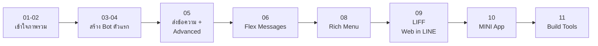

# LINE Developer Tools Builder — Workshop คอร์สสร้าง LINE Bot และเว็บแอปจริง

> **โดย Thepnatee Phojan — LINE API Expert**
> คอร์ส workshop ภาษาไทยสำหรับนักพัฒนาที่อยากสร้างจริงบน LINE Platform — ตั้งแต่เปิด Official Account ครั้งแรก ไปจนถึง LINE MINI App และ Dev Tools Builder ของตัวเอง

47 บทสอน เน้นเข้าใจ "ทำไม" ก่อน "ทำอะไร" — ทุกบทมีตัวอย่างใช้จริง, ภาพ Mermaid, ข้อผิดพลาดที่คนไทยมักเจอ และ Checklist ก่อนไปต่อ

---

## เริ่มต้นยังไง?



**แนะนำลำดับ**
- **มือใหม่** — อ่านตามลำดับ Chapter 01 → 11
- **ทำ Bot อยู่แล้ว อยากต่อยอด** — ข้ามไป Chapter 05 (advanced messaging) → 09 (LIFF)
- **Reference จุดเดียว** — ใช้ [`line-api-skill/`](line-api-skill/) เป็น cookbook สำหรับให้ Claude/AI generate code ที่ production-ready

---

## โครงสร้าง Repository

```
developer-tools-builder-document/
├── workshop/         ← 47 บทสอน (.md) — เอกสารหลัก
├── line-api-skill/   ← Cookbook ของขวัญนักเรียน — เอาไปใช้กับ Claude/AI ได้เลย
├── docs/             ← Reference docs จาก LINE Developers (ทางการ)
├── slides/marp/      ← Slide สำเร็จรูปจาก workshop (PDF/PPTX)
├── assets/           ← รูปภาพประกอบ
└── slides/           ← Slide deck เก่าที่สร้างจาก pptxgenjs (legacy)
```

---

## สารบัญ

### Chapter 01 — Introduction & Overview
รู้จัก LINE OA, บริการสำหรับนักพัฒนา, URL Scheme, การเช็ค status, และ Certified Provider

| | บท | หัวข้อ |
|---|---|--------|
| 01-01 | [LINE Official Account Overview](workshop/01-01.introduction-overview-official-account.md) | LINE OA แต่ละแบบ + ราคา + ฟีเจอร์ |
| 01-02 | [LINE Developer Services](workshop/01-02.introduction-overview-developer.md) | เลือกบริการให้ถูกงาน — Messaging API / LIFF / Login / Pay |
| 01-03 | [LINE URL Scheme](workshop/01-03.line-url-scheme.md) | เปิดฟีเจอร์ใน LINE จากเว็บภายนอก |
| 01-04 | [LINE API Status](workshop/01-04.line-status.md) | เช็ค LINE ล่มหรือเปล่าก่อน debug |
| 01-05 | [Certified Provider](workshop/01-05.certified-provider.md) | ขอ Special API + Certified Badge |

### Chapter 02 — Account & API Setup
| | บท | หัวข้อ |
|---|---|--------|
| 02-01 | [เปิด LINE Official Account](workshop/02-01.open-line-official-account.md) | สร้าง OA + Provider + Channel |
| 02-02 | [LINE Messaging API](workshop/02-02.line-messaging-api.md) | ภาพรวม Messaging API + Webhook |

### Chapter 03 — Webhook
| | บท | หัวข้อ |
|---|---|--------|
| 03-01 | [LINE Webhook Events](workshop/03-01.line-webhook.md) | event types ครบ + payload + redelivery |

### Chapter 04 — Chatbot Development Setup
| | บท | หัวข้อ |
|---|---|--------|
| 04-01 | [Create Chatbot ด้วย Firebase](workshop/04-01.create-chatbot-firebase.md) | Firebase Functions + LINE handshake |
| 04-02 | [ngrok](workshop/04-02.ngrok.md) | สร้าง HTTPS tunnel สำหรับ dev |
| 04-03 | [Setup Webhook](workshop/04-03.setup-webhook.md) | ผูก URL กับ LINE Console |
| 04-04 | [Setup Webhook ผ่าน API](workshop/04-04.setup-webhook-by-api.md) | สำหรับ CI/CD pipeline |
| 04-05 | [Webhook SSL/TLS](workshop/04-05.webhook-ssl-tls.md) | TLS 1.2/1.3 cert validation |

### Chapter 05 — Messages & Advanced Features
| | บท | หัวข้อ |
|---|---|--------|
| 05-01 | [Message Types](workshop/05-01.messages.md) | text/image/video/sticker/location ฯลฯ |
| 05-02 | [Postman Collection](workshop/05-02.message-postman.md) | ยิง LINE API ได้ใน 1 นาที |
| 05-03 | [Quick Reply](workshop/05-03.messages-quick-replies.md) | ปุ่มตอบแบบแตะแทนพิมพ์ |
| 05-04 | [Quote Tokens](workshop/05-04.messages-quote-tokens.md) | ตอบแบบ "อ้างอิง" ข้อความเก่า |
| 05-05 | [Channel Access Token](workshop/05-05.channel-access-token.md) | Token ทั้ง 4 ประเภท + การ rotate |
| 05-06 | [Loading Animation](workshop/05-06.loading-animation.md) | บอกผู้ใช้ว่า "บอทกำลังคิด" |
| 05-07 | [Message Mention (Text v2)](workshop/05-07.message-mention.md) | แท็ก @user ในกรุ๊ป |
| 05-08 | [Validate Message Object](workshop/05-08.validate-message-object-api.md) | ตรวจโครงสร้างก่อนส่ง |
| 05-09 | [X-Line-Signature](workshop/05-09.x-line-signature.md) | ตรวจลายเซ็น webhook |
| 05-10 | [Sending Message](workshop/05-10.sending-message.md) | Reply / Push / Multicast / Broadcast |
| 05-11 | [Narrowcast](workshop/05-11.message-narrowcast.md) | ส่งเจาะกลุ่มแบบแม่นยำ |
| 05-12 | [Message Statistics](workshop/05-12.get-statistics-of-sent-messages.md) | วัดผลทุกข้อความที่ส่งออก |
| 05-13 | [Cron Job](workshop/05-13.cronjob.md) | ให้บอทส่งเองตามเวลา |
| 05-14 | [LINE Beacon](workshop/05-14.line-beacon.md) | ส่งข้อความเมื่อผู้ใช้เดินผ่าน |

### Chapter 06 — Flex Messages
| | บท | หัวข้อ |
|---|---|--------|
| 06-01 | [Flex Message Overview](workshop/06-01.flex-message-overview.md) | layout/components/sizing |
| 06-02 | [Flex Simulator + Templates](workshop/06-02.flex-message-simulator.md) | 12 template สำเร็จรูปพร้อมใช้ |
| 06-03 | [Flex Message + ChatGPT](workshop/06-03.workshop-flex-message-chat-gpt.md) | Workshop ใบเสร็จ 7-Eleven |

### Chapter 07 — Firebase Storage
| | บท | หัวข้อ |
|---|---|--------|
| 07-01 | [Firebase Storage](workshop/07-01.firebase-storage.md) | upload รูปภาพ/วิดีโอจาก LINE |

### Chapter 08 — Rich Menu
| | บท | หัวข้อ |
|---|---|--------|
| 08-01 | [Rich Menu Overview](workshop/08-01.rich-menu-overview.md) | spec, areas, manager vs API |
| 08-02 | [Workshop: Switch Action](workshop/08-02.workshop-rich-menu-switch-action.md) | สลับแท็บเมนูใน 1 คลิก |

### Chapter 09 — LIFF (LINE Front-end Framework)
| | บท | หัวข้อ |
|---|---|--------|
| 09-01 | [LIFF Overview](workshop/09-01.liff-overview.md) | เปลี่ยนแชทให้กลายเป็นเว็บแอป |
| 09-02 | [LIFF Starter (Vue.js)](workshop/09-02.liff-starter-vue.md) | จาก 0 ถึงเปิดบนมือถือ |
| 09-03 | [Get Profile](workshop/09-03.liff-get-profile.md) | ดึงข้อมูลผู้ใช้โดยไม่ต้อง login เอง |
| 09-04 | [LIFF Environment](workshop/09-04.liff-environment.md) | ตรวจ OS / browser / API availability |
| 09-05 | [Get Friendship](workshop/09-05.liff-get-profile-friendship.md) | เช็คว่าเป็นเพื่อน LINE OA หรือยัง |
| 09-06 | [Sending Message](workshop/09-06.liff-sending-message.md) | sendMessages vs shareTargetPicker |
| 09-07 | [Scan QR Code](workshop/09-07.liff-scan-qrcode.md) | เปิดกล้องสแกน QR/Barcode |
| 09-08 | [LIFF CLI](workshop/09-08.liff-cli.md) | จัดการ LIFF จาก Terminal + CI/CD |

### Chapter 10 — LINE MINI App
| | บท | หัวข้อ |
|---|---|--------|
| 10-01 | [MINI App Overview](workshop/10-01.line-mini-app-overview.md) | LIFF vs MINI App |
| 10-02 | [MINI App Development](workshop/10-02.intro-line-mini-app-dev.md) | 3-environment model |
| 10-03 | [Service Message](workshop/10-03.try-service-message.md) | ส่ง notification จาก MINI App |
| 10-04 | [Home Screen Shortcut](workshop/10-04.mini-app-home-screen-shortcut.md) | ให้ผู้ใช้ปักหมุดที่หน้าโฮม |

### Chapter 11 — LINE Developer Tools Builder
| | บท | หัวข้อ |
|---|---|--------|
| 11-01 | [Overview](workshop/11-01.line-dev-tools-builder-overview.md) | สร้างเครื่องมือเพื่อ developer ด้วยกัน |
| 11-02 | [Guide](workshop/11-02.line-dev-tools-builder-guide.md) | ขั้นตอนสร้าง dev tool |

---

## ใช้ AI ช่วย Generate Code

[`line-api-skill/`](line-api-skill/) เป็น **Claude Skill / Cookbook** สำหรับให้ AI generate code LINE API ได้แบบ production-ready:

| ไฟล์ | ใช้ทำอะไร |
|------|----------|
| [`SKILL.md`](line-api-skill/SKILL.md) | Index + Decision Guide เลือก sub-skill |
| [`line-api-common.md`](line-api-skill/line-api-common.md) | Token rotation, 429 backoff, error handler patterns |
| [`line-webhook.md`](line-api-skill/line-webhook.md) | Production webhook + Firestore idempotency + signature debug |
| [`line-messaging.md`](line-api-skill/line-messaging.md) | Decision tree + multicast chunker + quota-aware sending |
| [`line-flex-message.md`](line-api-skill/line-flex-message.md) | 6 recipes + modify-a-recipe playbook + debug checklist |
| [`line-rich-menu.md`](line-api-skill/line-rich-menu.md) | Tab switching state machine + staged rollout + rollback |
| [`line-liff.md`](line-api-skill/line-liff.md) | LIFF init pipeline + Firebase auth + 5 production recipes |

**วิธีใช้** copy โฟลเดอร์ `line-api-skill/` ไปไว้ที่ `~/.claude/skills/` แล้วใช้ Claude Code ในโปรเจ็กต์ — Claude จะรู้ pattern ครบ และ generate code ที่มี error handling เลย

---

## สร้าง Slides จากเนื้อหา

```bash
cd slides/marp
node generate.js          # สร้าง slide .md จาก workshop ทุกบท
./build.sh pdf            # render PDF ทั้งหมด
./build.sh pptx           # หรือ PowerPoint
./build.sh watch 05-13    # live preview ใน browser
```

ดูคู่มือเต็มที่ [slides/marp/README.md](slides/marp/README.md)

---

## Tech Stack ที่ครอบคลุม

| Stack | ใช้ในบทไหน |
|-------|-----------|
| **LINE Messaging API** | Ch 03, 05, 08 — webhook, messages, rich menu |
| **LINE Front-end Framework (LIFF)** | Ch 09 — Web app ภายใน LINE |
| **LINE MINI App** | Ch 10 — Native-like app ภายใน LINE |
| **Firebase Functions / Storage** | Ch 04, 07 — backend hosting + media |
| **Node.js / TypeScript** | ทุกบท — backend runtime |
| **Vue.js 3** | Ch 09 — LIFF frontend |
| **Marp** | slides/marp — slide generation |
| **Mermaid** | ทั้งคอร์ส — diagrams ในเอกสาร & slides |

---

## โครงสร้างมาตรฐานของทุกบท

ทุกไฟล์ใน [`workshop/`](workshop/) ใช้โครงเดียวกัน อ่านง่ายและ map เข้า slide อัตโนมัติ:

1. **Hook** — ตัวอย่าง use case จริงที่จะได้ใช้
2. **ทำไมต้องรู้เรื่องนี้?** — analogy + แรงจูงใจ
3. **ภาพรวม** — Mermaid diagram (ส่วนใหญ่)
4. **เนื้อหาหลัก** — pattern, code, ตาราง spec
5. **ข้อผิดพลาดที่มักเจอ** — กับดักที่นักพัฒนาไทยเจอบ่อย
6. **Checklist ก่อนไปต่อ** — verify ตัวเองก่อนข้ามบท
7. **อ้างอิง** — link เอกสาร LINE ทางการ

---

## References

- [LINE Developers Documentation](https://developers.line.biz/)
- [LINE Developers Console](https://developers.line.biz/console/)
- [Flex Message Simulator](https://developers.line.biz/flex-simulator/)
- [LIFF Playground](https://liff-playground.netlify.app/)
- [LINE API Status](https://api.line-status.info/)
- [LINE Developers Thailand (Medium)](https://medium.com/linedevth)

---

## License & Credits

เอกสารนี้รวบรวมและเรียบเรียงโดย **Thepnatee Phojan** (LINE API Expert) — ใช้สอนใน workshop ของ Cloudea LINE Developer Workshop ผู้สนใจสามารถนำไปใช้ศึกษาส่วนตัวหรืออ้างอิงใน workshop ของตัวเองได้ ขอเครดิตผู้เขียนต้นฉบับ
