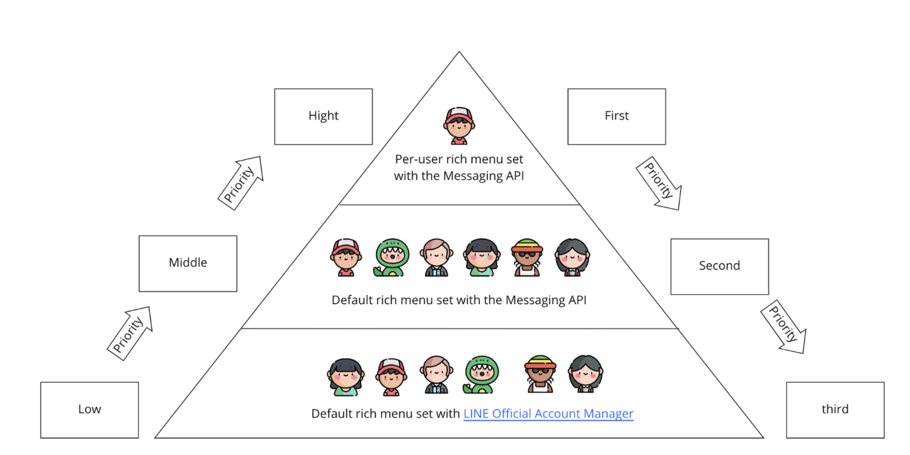
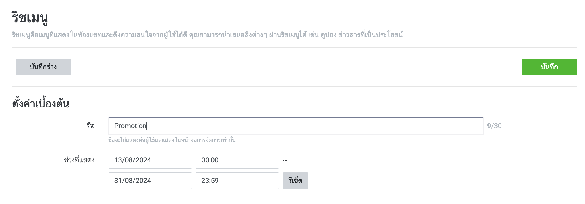
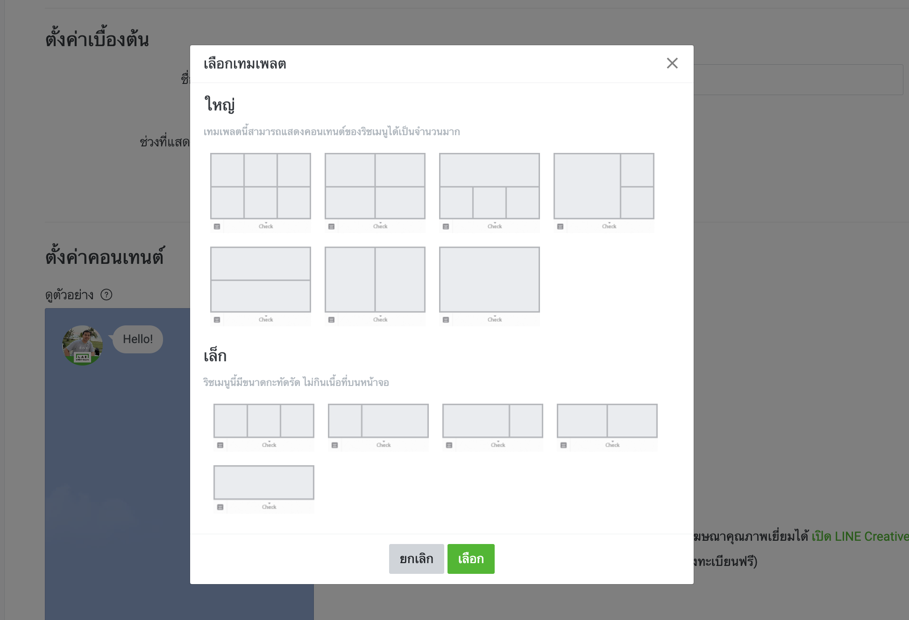
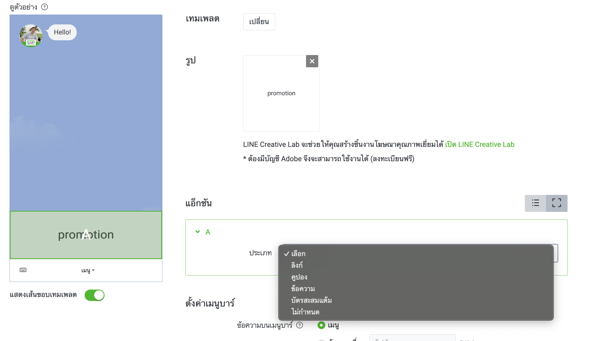

# Rich Menu


<p align="center" width="100%">
     
</p>


LINE Rich Menu เป็นฟีเจอร์ที่ทรงพลังสำหรับ LINE Official Account ที่ช่วยให้ธุรกิจสามารถปรับแต่งการนำเสนอเนื้อหาและประสบการณ์การใช้งานได้อย่างมีประสิทธิภาพ ผ่านเมนูที่ออกแบบมาเฉพาะในรูปแบบของภาพ เมนูนี้ปรากฏอยู่ที่ด้านล่างของหน้าจอแชท ทำให้ผู้ใช้สามารถเข้าถึงฟังก์ชันและข้อมูลที่ธุรกิจต้องการนำเสนอได้ง่าย

> **หมายเหตุ: Rich Menu ไม่รองรับ LINE for PC**
>
> Rich Menu จะไม่แสดงผลบน LINE for PC (macOS, Windows) รองรับเฉพาะบนอุปกรณ์มือถือเท่านั้น

### โครงสร้างของ Rich Menu

Rich Menu ประกอบด้วย 3 องค์ประกอบหลัก:

1. **Rich Menu Image (ภาพเมนู)**: ไฟล์ภาพ JPEG หรือ PNG เพียงไฟล์เดียวที่แสดงรายการเมนู สำหรับข้อกำหนดของภาพ ดูที่ [Requirements for rich menu image](https://developers.line.biz/en/reference/messaging-api/#upload-rich-menu-image-requirements)
2. **Tappable Areas (พื้นที่กดได้)**: พื้นที่ที่แบ่งเป็นรายการเมนู แต่ละพื้นที่สามารถกำหนด [action](https://developers.line.biz/en/reference/messaging-api/#action-objects) ได้ เช่น postback event, เปิด URL เป็นต้น
3. **Chat Bar (แถบแชท)**: แถบเมนูที่ใช้เปิดและปิด Rich Menu สามารถปรับแต่งข้อความบนแถบนี้ได้

### Feature LINE Rich Menu

1. **Layout flexible**
   - สามารถออกแบบ Rich Menu ได้ตามความต้องการ กำหนดขนาดเมนู จำนวนปุ่ม และตำแหน่งได้อย่างอิสระ

2. **Switch Action**
   - Rich Menu สามารถมีหลายหน้าเพื่อแสดงเนื้อหามากขึ้นในพื้นที่จำกัด ผู้ใช้สามารถสไลด์ไปมาระหว่างหน้าได้

3. **Action**
   - ปุ่มแต่ละปุ่มสามารถกำหนดให้เปิด URL, ส่งข้อความ, เปิดแชทกับบอท หรือเปลี่ยนหน้าเมนูได้
   - **Messaging API รองรับ action เพิ่มเติม**: สามารถตั้งค่า [Postback action](https://developers.line.biz/en/reference/messaging-api/#postback-action) และ [Datetime picker action](https://developers.line.biz/en/reference/messaging-api/#datetime-picker-action) บน Rich Menu ได้ (ใช้ได้เฉพาะ Messaging API เท่านั้น ไม่สามารถตั้งค่าผ่าน LINE OA Manager)

4. **Segment**
   - สามารถตั้งค่าให้ Rich Menu แสดงผลตามกลุ่มเป้าหมายที่กำหนด เช่น อายุ, เพศ, หรือพื้นที่

### ประโยชน์ของการใช้งาน

- เพิ่มความสะดวกสบายในการเข้าถึงข้อมูลหรือบริการ
- เพิ่มประสิทธิภาพการสื่อสารระหว่างธุรกิจและลูกค้า
- สร้างประสบการณ์ผู้ใช้งานที่ดีและน่าสนใจ


### เครื่องมือในการสร้าง Rich Menu

> **หมายเหตุสำคัญ: ใช้เครื่องมือเดียวต่อหนึ่ง Rich Menu**
>
> ไม่สามารถใช้ทั้งสองเครื่องมือในการดึงข้อมูลหรือแก้ไข Rich Menu เดียวกันได้ Rich Menu ที่สร้างด้วย LINE Official Account Manager จะสามารถดึงข้อมูลและแก้ไขได้ผ่าน LINE Official Account Manager เท่านั้น ในทำนองเดียวกัน Rich Menu ที่สร้างด้วย Messaging API จะไม่สามารถจัดการผ่าน LINE Official Account Manager ได้

| เครื่องมือ | ข้อดี |
| --- | --- |
| [LINE Official Account Manager](https://manager.line.biz/) | <ul><li>พัฒนาได้รวดเร็ว</li><li>มี GUI ใช้งานง่าย</li><li>ตั้งค่าช่วงเวลาแสดงผลได้</li><li>ดูสถิติการแสดงผลและอัตราการคลิกได้</li></ul> |
| Messaging API | <ul><li>ปรับแต่งขั้นสูงได้</li><li>ตั้งค่า [Postback action](https://developers.line.biz/en/reference/messaging-api/#postback-action) และ [Datetime picker action](https://developers.line.biz/en/reference/messaging-api/#datetime-picker-action) ได้</li><li>[สลับแท็บบน Rich Menu](https://developers.line.biz/en/docs/messaging-api/switch-rich-menus/) ได้</li></ul> |

> **หมายเหตุ**: Rich Menu ที่สร้างด้วย Messaging API จะไม่สามารถดูสถิติ เช่น จำนวนการแสดงผลและอัตราการคลิกได้

### วิธีการสร้าง LINE Rich Menu

<p align="center" width="100%">
     
</p>

### ขอบเขตของการใช้ Rich Menus

Rich Menus สามารถตั้งค่าในสองขอบเขต (Scope) ซึ่งสามารถเลือกใช้งานได้ผ่านเครื่องมือต่าง ๆ ดังนี้:

| ขอบเขต | เครื่องมือ |
| ------- | ---------- |
| ผู้ใช้ทุกคนที่ได้เพิ่ม LINE Official Account ของคุณเป็นเพื่อน (ค่าเริ่มต้น) | LINE Official Account Manager <br> Messaging API |
| ตามผู้ใช้แต่ละคน (Per-user rich menu) | Messaging API |


### ลำดับความสำคัญในการแสดงผล

Rich Menu มี 3 ประเภท ซึ่งแตกต่างกันตามวิธีการตั้งค่าและกลุ่มเป้าหมายที่ตั้งค่าให้ แต่ละประเภทมีลำดับความสำคัญในการแสดงผลตามลำดับจากสูงสุดไปต่ำสุด ดังนี้:

1. **Rich Menu ตามผู้ใช้แต่ละคน (Per-user rich menu)** ที่ตั้งค่าด้วย Messaging API
2. **Rich Menu ค่าเริ่มต้น (Default rich menu)** ที่ตั้งค่าด้วย Messaging API
3. **Rich Menu ค่าเริ่มต้น (Default rich menu)** ที่ตั้งค่าด้วย LINE Official Account Manager

## เมื่อใดที่การเปลี่ยนแปลงการตั้งค่า Rich Menu มีผล

เมื่อคุณเปลี่ยนการตั้งค่า Rich Menu การเปลี่ยนแปลงจะมีผลในช่วงเวลาที่แตกต่างกัน ขึ้นอยู่กับขอบเขต (Scope) และเครื่องมือที่ใช้ตั้งค่า Rich Menu ดังนี้:

| ขอบเขตและเครื่องมือตั้งค่า | เมื่อการเปลี่ยนแปลงมีผล |
| ---------------------------- | ----------------------- |
| **Per-user rich menu ที่ตั้งค่าด้วย Messaging API** | ทันที แต่ถ้าคุณลบ Rich Menu โดยไม่ยกเลิกการเชื่อมต่อกับผู้ใช้ การลบจะมีผลเมื่อผู้ใช้เปิดแชทใหม่ |
| **Default rich menu ที่ตั้งค่าด้วย Messaging API** | เมื่อผู้ใช้เปิดแชทใหม่ อาจใช้เวลาสูงสุดถึงหนึ่งนาทีกว่าที่การเปลี่ยนแปลงจะมีผล |
| **Default rich menu ที่ตั้งค่าด้วย LINE Official Account Manager** | เมื่อผู้ใช้เปิดแชทใหม่ |

### เงื่อนไขของ Per-user Rich Menu

- **ผู้ใช้ต้องเป็นเพื่อนกับ LINE Official Account**: ไม่สามารถเชื่อมต่อ (link) Rich Menu กับผู้ใช้ที่ยังไม่ได้เพิ่ม LINE Official Account เป็นเพื่อนได้ ดูรายละเอียดเพิ่มเติมที่ [Conditions for linking rich menu](https://developers.line.biz/en/reference/messaging-api/#link-rich-menu-to-user-conditions)
- **ผู้ใช้ที่ยังไม่เป็นเพื่อน**: เมื่อผู้ใช้ที่ยังไม่เป็นเพื่อนกับ LINE Official Account เปิดหน้าจอแชท จะเห็นเฉพาะ Default Rich Menu ที่ตั้งค่าไว้ผ่าน LINE Official Account Manager หรือ Messaging API เท่านั้น

### การตั้งค่า Per-user Rich Menu

ขั้นตอนพื้นฐานในการตั้งค่า Per-user Rich Menu มีดังนี้:

1. **สร้าง Rich Menu และแนบภาพ**: สร้าง Rich Menu ผ่าน [Create rich menu](https://developers.line.biz/en/reference/messaging-api/#create-rich-menu) endpoint และอัปโหลดภาพผ่าน [Upload rich menu image](https://developers.line.biz/en/reference/messaging-api/#upload-rich-menu-image) endpoint
2. **เตรียม User ID**: เตรียม User ID ของผู้ใช้ที่ต้องการแสดง Rich Menu ดูวิธีการได้ที่ [Get user IDs](https://developers.line.biz/en/docs/messaging-api/getting-user-ids/)
3. **เชื่อมต่อ Rich Menu กับผู้ใช้**: ใช้ [Link rich menu to user](https://developers.line.biz/en/reference/messaging-api/#link-rich-menu-to-user) endpoint
4. **ยกเลิกการเชื่อมต่อ (ถ้าต้องการ)**: ใช้ [Unlink rich menu from user](https://developers.line.biz/en/reference/messaging-api/#unlink-rich-menu-from-user) endpoint เพื่อหยุดแสดง Per-user Rich Menu

> **การสลับแท็บบน Rich Menu**: สามารถสร้าง Rich Menu แบบมีแท็บสลับไปมาได้โดยใช้ [Rich menu alias](https://developers.line.biz/en/glossary/#rich-menu-alias) และ [Rich menu switch action](https://developers.line.biz/en/reference/messaging-api/#richmenu-switch-action) ดูรายละเอียดที่ [Switch between tabs on rich menus](https://developers.line.biz/en/docs/messaging-api/switch-rich-menus/)

---
<p align="center">
     
</p>

## สร้าง Rich Menu ผ่าน LINE OA Manager (ไม่ต้องเขียนโค้ด)


1. **เข้าสู่ระบบเว็บไซต์**: ไปที่ [LINE Official Account Manager](https://manager.line.biz/) และลงชื่อเข้าใช้ด้วยบัญชี LINE 

2. **ไปที่ 'Rich Menu'**: หลังจากเข้าสู่ระบบแล้ว คลิกที่ "Rich Menu" ในแถบเมนูด้านซ้าย
3. **สร้าง Rich Menu ใหม่**: คลิกที่ปุ่ม "Create New Rich Menu" หรือ "สร้าง Rich Menu ใหม่" ที่อยู่ด้านบนขวาหรือกลางหน้าจอ
<p align="center" width="100%">
     
</p>
4. **ตั้งชื่อ Rich Menu**: ใส่ชื่อที่สามารถระบุได้ง่ายสำหรับ Rich Menu ของคุณ เช่น "Main Menu" หรือ "Promotions"
5. **ตั้งค่าแสดงผล**: คุณสามารถตั้งค่าให้ Rich Menu นี้ปรากฏในช่วงเวลา 
5. **เลือกTemplate Rich Menu**: เลือกว่าต้องการให้เมนูนี้แสดงในรูปแบบเต็มหน้าจอหรือครึ่งหน้าจอ (Full หรือ Half)

<p align="center" width="100%">
     
</p>

6. **อัปโหลดภาพพื้นหลัง**: คลิก "Upload Image" เพื่ออัปโหลดภาพพื้นหลังสำหรับเมนู ขนาดภาพที่แนะนำคือ 2500x1686 พิกเซลสำหรับเมนูแบบเต็มหน้าจอ และ 2500x843 พิกเซลสำหรับเมนูแบบครึ่งหน้าจอ

Note : 
```
Requirements for rich menu image
You can use rich menu images with the following specifications:

Image format: JPEG or PNG
Image width: 800 to 2500 pixels
Image height: 250 pixels or more
Image aspect ratio (width / height): 1.45 or more
Max file size: 1 MB
```


7. **ตั้งค่า Action**: หลังจากกำหนดพื้นที่แล้ว ให้ตั้งค่า action ที่คุณต้องการ เช่น กดแล้วให้เปิด URL ไปที่หน้าเว็บไซต์, ส่งข้อความ, หรือเปิดหน้าเพจอื่นใน LINE
<p align="center" width="100%">
     
</p>


8. **ตรวจสอบการตั้งค่า**: ตรวจสอบทุกอย่างให้เรียบร้อย ทั้งชื่อเมนู ภาพพื้นหลัง พื้นที่ปุ่ม และ action
9. **บันทึก Rich Menu**: คลิก "Save" เพื่อบันทึกการตั้งค่า Rich Menu ของคุณ
10. **ทดสอบเมนู**: ใช้สมาร์ทโฟนของคุณเพื่อเปิดบัญชี LINE แล้วทดสอบ Rich Menu ที่คุณสร้างขึ้น เพื่อให้แน่ใจว่าทุกปุ่มทำงานถูกต้องตามที่ตั้งค่าไว้

## การตั้งค่า Rich Menu ด้วย Messaging API

ในการตั้งค่า Rich Menu ผ่าน Messaging API จำเป็นต้องเรียกใช้ Endpoint ตามลำดับขั้นตอนที่กำหนดไว้ ขั้นตอนพื้นฐานในการตั้งค่า Rich Menu มีดังนี้:

1. **เตรียมภาพ Rich Menu**: เตรียมภาพที่ต้องการใช้เป็นพื้นหลังของ Rich Menu


    - Download Template Rich Menu : [Link](https://static.line-scdn.net/biz-app/16bd9ea9e03/manager/static/LINE_rich_menu_design_template.zip
    )
    - ท่าสามารถใช้ [Canva](https://www.canva.com/) ในการออกแบบ Rich Menu ได้


2. **ใช้ Endpoint สร้าง Rich Menu**: เรียกใช้ Endpoint [Create rich menu](https://developers.line.biz/en/reference/messaging-api/#create-rich-menu) เพื่อสร้าง Rich Menu ขึ้นมา
    - เตรียม JSON สำหรับการสร้าง Rich Menu ผ่าน API ด้วย [LINE Bot Designer](https://developers.line.biz/en/docs/messaging-api/download-bot-designer/)

    ##### ข้อจำกัด
    - Rate limit 100 requests per hour
    - Create Max: 1000 rich menus
    - 1 Rich Menu areas max 20 areas object
    -  size object which contains the width and height of the rich menu displayed in the chat. The width of the rich menu image must be between 800px and 2500px. The height must be at least 250px. However, the aspect ratio (width / height) must be at least 1.45.
    
3. **ใช้ Endpoint อัปโหลดภาพ Rich Menu**: เรียกใช้ Endpoint [Upload rich menu image](https://developers.line.biz/en/reference/messaging-api/#upload-rich-menu-image) เพื่ออัปโหลดภาพที่เตรียมไว้ไปยัง Rich Menu ที่สร้าง
4. **ใช้ Endpoint ตั้งค่า Rich Menu เป็นค่าเริ่มต้น**: เรียกใช้ Endpoint [Set default rich menu](https://developers.line.biz/en/reference/messaging-api/#set-default-rich-menu) เพื่อกำหนดให้ Rich Menu ที่สร้างเป็นค่าเริ่มต้นสำหรับผู้ใช้ทุกคน

ดูรายละเอียดเพิ่มเติมเกี่ยวกับการตั้งค่า Rich Menu ด้วย Messaging API ได้ที่ [Use rich menus](https://developers.line.biz/en/docs/messaging-api/using-rich-menus/)

## Troubleshooting (แก้ไขปัญหาที่พบบ่อย)

| ปัญหา | สาเหตุและวิธีแก้ไข |
| --- | --- |
| Rich Menu ไม่แสดงผลบน PC | Rich Menu ไม่รองรับ LINE for PC (macOS, Windows) ใช้ได้เฉพาะบนมือถือเท่านั้น |
| Rich Menu ไม่เปลี่ยนแปลงทันทีหลังตั้งค่า Default | Default Rich Menu ที่ตั้งค่าด้วย Messaging API อาจใช้เวลาสูงสุดถึง 1 นาที และต้องให้ผู้ใช้เปิดแชทใหม่ ส่วน Default ที่ตั้งค่าด้วย LINE OA Manager จะมีผลเมื่อเปิดแชทใหม่ |
| ลบ Rich Menu แล้วแต่ผู้ใช้ยังเห็นอยู่ | หากลบ Per-user Rich Menu โดยไม่ได้ [unlink จากผู้ใช้](https://developers.line.biz/en/reference/messaging-api/#unlink-rich-menu-from-user) ก่อน การลบจะมีผลเมื่อผู้ใช้เปิดแชทใหม่ ควร unlink ก่อนลบเสมอ |
| ไม่สามารถ link Rich Menu กับผู้ใช้ได้ | ผู้ใช้ต้องเป็นเพื่อนกับ LINE Official Account ก่อนจึงจะ link Per-user Rich Menu ได้ |
| ไม่สามารถแก้ไข Rich Menu ที่สร้างจากอีกเครื่องมือ | Rich Menu ที่สร้างจาก LINE OA Manager ไม่สามารถแก้ไขผ่าน Messaging API ได้ และในทางกลับกัน ต้องใช้เครื่องมือเดียวกับที่สร้าง |
| ดูสถิติการคลิกไม่ได้ | Rich Menu ที่สร้างด้วย Messaging API ไม่รองรับสถิติ เช่น จำนวนการแสดงผลและอัตราการคลิก ต้องใช้ LINE OA Manager หากต้องการดูสถิติ |

## Rich Menu API Reference

- [Rich menu](https://developers.line.biz/en/reference/messaging-api/#rich-menu)
- [Per-user rich menu](https://developers.line.biz/en/reference/messaging-api/#per-user-rich-menu)
- [Rich menu alias](https://developers.line.biz/en/reference/messaging-api/#rich-menu-alias)

