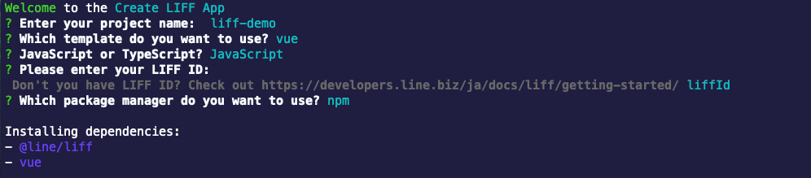
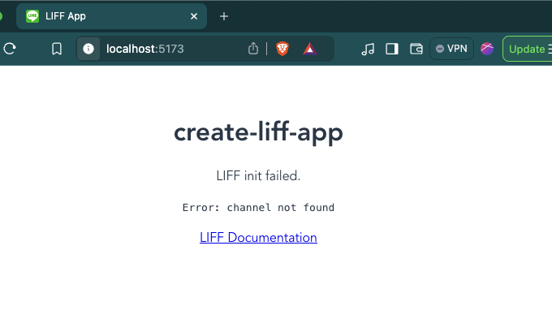
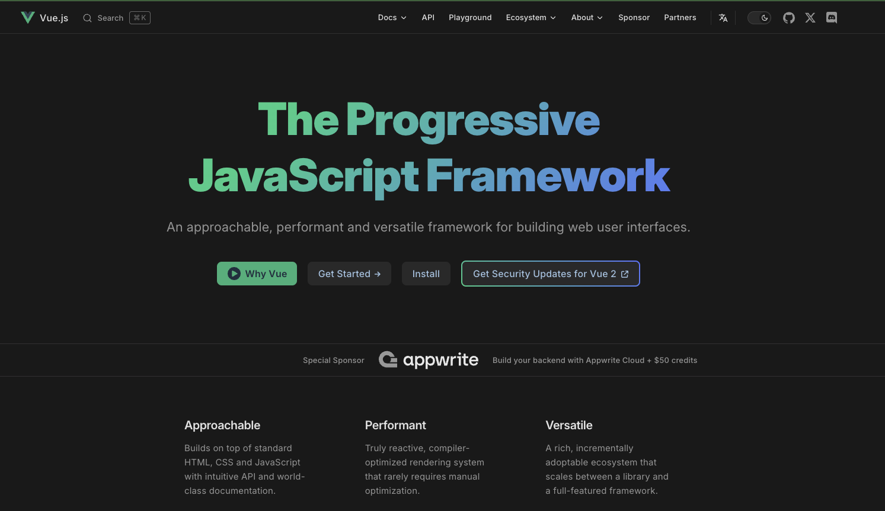

# เริ่มต้นสร้าง LINE Front-end Framework (LIFF) ด้วย Vue.js



## Create LIFF App คืออะไร?

Create LIFF App เป็นเครื่องมือ CLI ที่ช่วยให้สามารถสร้างสภาพแวดล้อมสำหรับพัฒนา LIFF App ได้ด้วยคำสั่งเดียว คล้ายกับ [Create React App](https://github.com/facebook/create-react-app) ของ React หรือ [Create Next App](https://nextjs.org/docs/pages/api-reference/cli/create-next-app) ของ Next.js เพียงตอบคำถามจาก Create LIFF App ก็จะสร้างสภาพแวดล้อมพร้อม Template สำหรับ LIFF App ให้เริ่มพัฒนาได้ทันที

- [GitHub](https://github.com/line/create-liff-app)
- [npm](https://www.npmjs.com/package/@line/create-liff-app)

## เฟรมเวิร์กและภาษาที่รองรับ

Create LIFF App รองรับเฟรมเวิร์กและไลบรารีดังนี้

| เฟรมเวิร์ก / ไลบรารี | รายละเอียด |
| --- | --- |
| vanilla | JavaScript ล้วน ไม่ใช้เฟรมเวิร์ก |
| [React](https://react.dev/) | ไลบรารียอดนิยมจาก Meta |
| [Vue.js](https://vuejs.org/) | Progressive JavaScript Framework |
| [Svelte](https://svelte.dev/) | เฟรมเวิร์กที่คอมไพล์เป็น Vanilla JS |
| [Next.js](https://nextjs.org/) | React Framework สำหรับ Full-stack |
| [Nuxt](https://nuxt.com/) | Vue Framework สำหรับ Full-stack |

**ภาษาที่รองรับ:** JavaScript และ TypeScript

**ตัวจัดการแพ็กเกจ (Package Manager):** yarn และ npm

## สิ่งที่ต้องเตรียมก่อนเริ่มต้น

- ติดตั้ง [Node.js](https://nodejs.org/en) (แนะนำเวอร์ชัน 18 ขึ้นไป)
- ต้องมี LIFF ID ซึ่งได้จากการสร้างแชนเนล LINE Login และเพิ่ม LIFF App ใน [LINE Developers Console](https://developers.line.biz/console)
- หากยังไม่มี LIFF ID สามารถใส่ Endpoint URL ชั่วคราว (เช่น `https://example.com/`) ไปก่อนได้ แล้วค่อยแก้ไขภายหลัง

---

### ขั้นตอนที่ 1: สร้างเว็บไซต์พัฒนาร่วมกับ LIFF

1. สร้างโปรเจกต์ใหม่ ใช้คำสั่งด้านล่างนี้เพื่อสร้าง LIFF

```bash
npx @line/create-liff-app
```

> **หมายเหตุ:** สามารถระบุ [ตัวเลือก (Options)](#create-liff-app-options) เพิ่มเติมตอนรันคำสั่งได้

ระบบจะถามคำถามทีละข้อ หากต้องการยกเลิกระหว่างทาง ให้กด `Ctrl+c` (Windows) หรือ `control+c` (macOS)

ในการสาธิตนี้ เราจะตั้งชื่อโปรเจกต์ว่า `liff-demo` ใช้ Vue.js (JavaScript) เป็นเฟรมเวิร์ก และ npm เป็นตัวจัดการแพ็กเกจ สามารถตอบคำถามตามข้อความด้านล่างนี้

```bash
# ตั้งชื่อ Project (ค่าเริ่มต้นคือ my-app)
Enter your project name: liff-demo

# เลือกเฟรมเวิร์ก (ตัวเลือก: vanilla, react, vue, svelte, nextjs, nuxtjs)
Which template do you want to use? vue

# เลือกภาษาในการพัฒนา (JavaScript หรือ TypeScript)
JavaScript or TypeScript? JavaScript

# กรอก LIFF ID ที่ได้จากแชนเนล LINE Login -> LIFF
# หากยังไม่มี สามารถข้ามไปก่อนได้ แล้วแก้ไขในไฟล์ .env ภายหลัง
Please enter your LIFF ID: xxx-xxx

# เลือก Package Manager (yarn หรือ npm)
Which package manager do you want to use? npm
```

#### Create LIFF App Options {#create-liff-app-options}

สามารถระบุตัวเลือกเพิ่มเติมตอนรันคำสั่งเพื่อข้ามคำถามบางข้อได้ เช่น หากต้องการสร้างโปรเจกต์ Next.js ด้วย TypeScript:

```bash
npx @line/create-liff-app -t nextjs --ts
```

| ตัวเลือกสั้น | ตัวเลือกยาว | อาร์กิวเมนต์ | การทำงาน |
| --- | --- | --- | --- |
| `-v` | `--version` | | แสดงหมายเลขเวอร์ชัน |
| `-t` | `--template` | `<template>` | ระบุเทมเพลต (`vanilla`, `react`, `vue`, `svelte`, `nextjs`, `nuxtjs`) |
| `-l` | `--liffid` | `<liff id>` | ระบุ LIFF ID |
| | `--js` / `--javascript` | | สร้างซอร์สโค้ดเป็น JavaScript |
| | `--ts` / `--typescript` | | สร้างซอร์สโค้ดเป็น TypeScript |
| | `--npm` / `--use-npm` | | ใช้ npm เป็นตัวจัดการแพ็กเกจ |
| | `--yarn` / `--use-yarn` | | ใช้ Yarn เป็นตัวจัดการแพ็กเกจ |
| `-h` | `--help` | | แสดงวิธีใช้งาน |

### ขั้นตอนที่ 2: ติดตั้งและเรียกใช้งาน

1. เข้าไปยังโฟลเดอร์ของโปรเจกต์ที่สร้าง

```bash
cd liff-demo
```

2. ติดตั้ง Dependencies ที่จำเป็น

```bash
npm install
```

3. เปิดเซิร์ฟเวอร์สำหรับพัฒนาเว็บไซต์

```bash
npm run dev
```

เซิร์ฟเวอร์เว็บไซต์ของคุณจะถูกเปิดใช้งานและสามารถเข้าถึงได้ผ่าน URL ที่แสดงอยู่บน Terminal ในที่นี้คือ `http://localhost:5173` (หาก Port ไม่ซ้ำกับที่ใช้งานอยู่บนเครื่อง หรือแก้ไข Config ใด ๆ)

```bash
  VITE v6.3.4  ready in 139 ms

  ➜  Local:   http://localhost:5173/
  ➜  Network: use --host to expose
  ➜  press h + enter to show help
```



- **หากขึ้น LIFF init Failed.** หมายถึง เราใส่ LIFF ID ไม่ถูกต้อง
- **หากขึ้น LIFF init succeeded.** หมายถึง เราใส่ LIFF ID ได้ถูกต้อง

### ขั้นตอนที่ 3: เปิดให้ภายนอกสามารถเข้าถึงเว็บไซต์ระหว่างการพัฒนา

ในการพัฒนา LIFF App หาต้องการเปิดบนสมาร์ตโฟนเพื่อทำการตรวจสอบ แน่นอนว่าไม่สามารถเข้าถึง `http://localhost:xxxx` ได้โดยตรง จะต้องเป็น `https` เท่านั้น เราจะต้องขุดอุโมงเพื่อให้ภายนอกสามารถเข้าถึง localhost ของเราได้ โดยมีหลายวิธีทั้ง Ngrok, Cloudflare Tunnel หรือบริการอื่น ๆ อีกหลายตัว

ใน Visual Studio Code ก็มีบริการขุดอุโมงหรือ Port Forwarding อยู่เช่นกัน สามารถทำได้ตามนี้

1. เปิด Panel **Ports** ขึ้นมา
2. กด **Forward a Port**
3. เข้าสู่ระบบด้วย GitHub หากยังไม่ได้เข้าสู่ระบบและอนุญาตบริการ
4. ใส่เลขพอร์ต `5173` หรือพอร์ตที่รันเว็บไซต์อยู่
5. คลิกขวา ไปที่ **Port Visibility** เลือก **Public**
6. คัดลอก URL ในช่อง **Forwarded Address** เพื่อนำไปใช้งานต่อไป

### ขั้นตอนที่ 4: ตั้งค่า LIFF App เพื่อทดสอบบนสมาร์ตโฟน

1. ไปที่ [LINE Developers Console](https://developers.line.biz/console) ในแชนเนล LINE Login และ LIFF App ที่สร้างไว้
2. นำ URL ที่คัดลอกมาจาก**ขั้นตอนที่ 3** มาแก้ไขในช่อง **Endpoint URL** กด **Update**
3. คัดลอก **LIFF URL** ไปใส่ในแชท LINE เพื่อทดสอบ

# Vue.js

<p align="center" width="100%">
    
</p>

## "The Progressive JavaScript Framework"

Vue.js อ่านว่า วิว ออกเสียงแบบ View ในภาษาอังกฤษ จุดเริ่มต้นของ Vue เลยคือมันทำหน้าที่เป็น View ใน MVC (Model View Controller) นั่นแหละ เป็น JavaScript Framework ที่พัฒนาโดย Evan You เอาไว้สำหรับพัฒนาพวก UI (User Interface) และในบาง Framework เช่น Laravel ก็ใช้ Vue เป็น Template สำหรับส่วน UI (Frontend) ซึ่ง Vue.js ไม่ได้มี back ใหญ่ๆแบบ Angular (Google) หรือ React (Facebook) แต่ก็มี community ชาวจีนที่ค่อนข้างใหญ่ รวมถึง Alibaba ด้วย

ในหน้าเว็บของ Vue ให้คำนิยามว่า "The Progressive JavaScript Framework"

แค่คุณเข้าใจ 3 สิ่งนี้ คุณก็เป็น Vue Developer ได้

- HTML & CSS
- JavaScript
- Modern JavaScript (JavaScript ES6)
