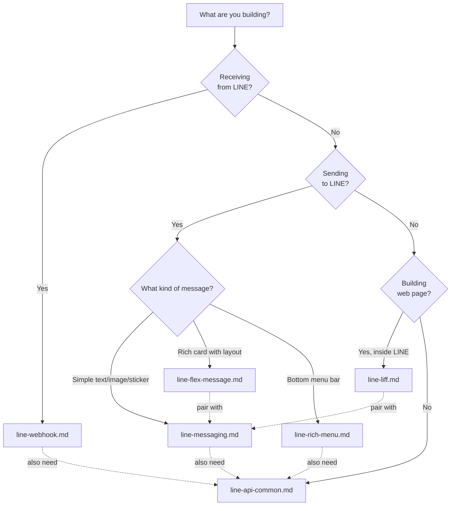

# LINE Messaging API — Skill Index (Student Cookbook)

This skill is a cookbook, not just a reference. Each sub-skill contains:
- **Reference tables** — endpoints, rate limits, specs
- **Decision trees** — "when to use X vs Y"
- **Production recipes** — full copy-paste-ready patterns with error handling
- **Mermaid flow diagrams** — visual state machines and sequences
- **Gotchas** — real pitfalls with fixes

## Sub-skill Files

| Skill File | Topics Covered |
|------------|---------------|
| `line-api-common.md` | API domains, rate limits, error codes, token rotation recipe, 429 backoff pattern, user profile, URL schemes, groups/rooms, audiences |
| `line-flex-message.md` | Flex structure, components, layouts, gradients, overlays, 6 recipes (product card, receipt, booking, carousel, overlay badge, menu), modify-a-recipe playbook |
| `line-rich-menu.md` | Rich Menu creation, image specs, area mapping, tab switching state machine, per-user menu rollout recipe |
| `line-messaging.md` | Reply/push/multicast/broadcast/narrowcast, decision tree (Reply vs Push vs Multicast), multicast chunking recipe, all message types, quick reply, template, emoji, stickers |
| `line-webhook.md` | Webhook events, signature verification, production-ready Express handler, idempotent Firestore handler, redelivery, content retrieval |
| `line-liff.md` | LIFF init pipeline, full auth flow with Firebase, LIFF ↔ bot communication patterns, scope error fallback |

## Decision Guide: Which Skill for Which Task?

## When to Activate

- Any LINE Messaging API integration
- Flex Message creation or modification
- Rich Menu building, alias setup, or tab switching
- Webhook event handling or signature verification
- LIFF app development
- Push/multicast/broadcast/narrowcast messaging
- Channel access token management
- Template messages, quick reply, or imagemap
- Auto-response rule design

## Usage Tips for Claude

When a student asks for help:
1. **Identify the task** using the Decision Guide above
2. **Load 1-2 skill files** most relevant — don't load everything
3. **Point to a recipe** first if one matches; only write custom code if no recipe fits
4. **Always include error handling** from the recipes — never give students happy-path-only code
5. **Warn about gotchas** proactively (reply token expiry, 500-user limit, 1MB image cap, etc.)
