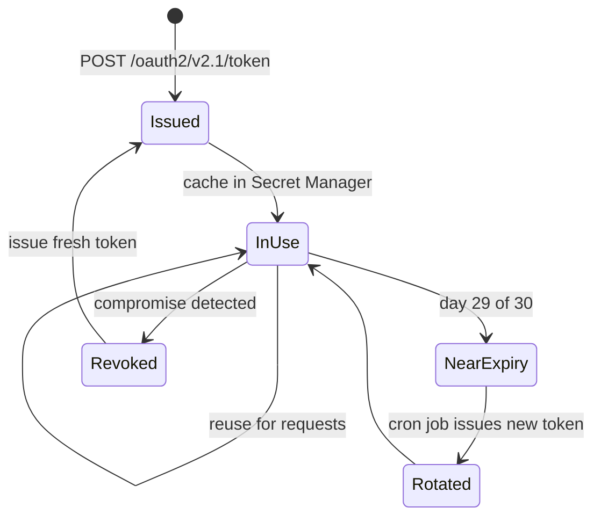

# LINE API Common Specifications

## When to Activate

- Setting up LINE Messaging API integration
- Managing channel access tokens
- Debugging API errors or rate limit issues
- Configuring API base URLs

---

## Domain Names

| Domain | Use Case |
|--------|----------|
| `api.line.me` | All endpoints except content/image |
| `api-data.line.me` | Get content, audiences, rich menu images |

---

## Rate Limits (Per Channel)

| Endpoint | Limit |
|----------|-------|
| Narrowcast/broadcast, statistics | 60 req/hour |
| Audience management | 60 req/min |
| Rich menu create/delete | 100 req/hour |
| Batch rich menu control | 3 req/hour |
| Multicast, membership, coupons | 200 req/sec |
| Loading animation | 100 req/sec |
| Short-lived token issuance | 370 req/sec |
| Webhook endpoint config | 1,000 req/min |
| Other endpoints | 2,000 req/sec |

---

## HTTP Status Codes

| Code | Meaning | Notes |
|------|---------|-------|
| 200 | Success | |
| 400 | Bad Request | Invalid parameters |
| 401 | Unauthorized | Missing/invalid channel access token |
| 403 | Forbidden | Not authorized to access resource |
| 404 | Not Found | User doesn't exist, no consent, not friends, or blocked |
| 409 | Conflict | Duplicate retry key |
| 413 | Payload Too Large | Exceeds 2MB |
| 429 | Too Many Requests | Rate limit or monthly limit exceeded |
| 500 | Internal Server Error | |

## Error Response Format

```json
{
  "message": "Error description",
  "details": [
    {
      "message": "Specific error detail",
      "property": "Field name or parameter"
    }
  ]
}
```

## Response Headers

- `X-Line-Request-Id`: Always included — use for debugging
- `X-Line-Accepted-Request-Id`: Previous request ID when using same retry key

---

## Channel Access Tokens

| Type | Validity | Max per Channel | Key Notes |
|------|----------|-----------------|-----------|
| v2.1 (JWT-based) | Up to 30 days | 30 | User-specified expiration |
| Stateless | 15 minutes | Unlimited | Cannot be revoked |
| Short-lived | 30 days | 30 | Oldest auto-revoked when limit reached |
| Long-lived | Indefinite | 1 | Messaging API only, reissue invalidates previous |

**Rules:**
- Expired tokens don't count toward limits
- Reuse within validity period — don't reissue per request
- Can be revoked by LINE if suspected compromise
- Large burst of issuances may trigger temporary restriction

### Token Endpoints

| Method | Endpoint | Description |
|--------|----------|-------------|
| POST | `/v2/oauth/accessToken` | Issue token v2.1 |
| GET | `/v2/oauth/verifyAccessToken` | Verify token v2.1 |
| GET | `/v2/oauth/accessToken` | Get valid token IDs |
| POST | `/v2/oauth/revoke` | Revoke token |
| POST | `/v2/oauth/accessToken/stateless` | Issue stateless token |
| POST | `/v2/oauth/accessToken/short-lived` | Issue short-lived token |

---

## Quota & Statistics Endpoints

| Method | Endpoint | Description |
|--------|----------|-------------|
| GET | `/v2/bot/message/quota` | Monthly sending limit |
| GET | `/v2/bot/message/quota/consumption` | Messages sent this month |
| GET | `/v2/bot/message/delivery` | Reply message delivery count |
| GET | `/v2/bot/insight/message/delivery?date=YYYYMMDD` | Delivery counts by platform |
| GET | `/v2/bot/insight/followers?date=YYYYMMDD` | Follower count |
| GET | `/v2/bot/insight/demographic` | Age, gender, OS, region |
| GET | `/v2/bot/insight/message/event?requestId=` | Click/impression stats |

---

## User Profile

### Get Profile

```
GET https://api.line.me/v2/bot/profile/{userId}
```

### Response

```json
{
  "displayName": "string",
  "userId": "U0123...",
  "pictureUrl": "https://profile.line-scdn.net/...",
  "statusMessage": "string"
}
```

### 404 Means

- User ID doesn't exist
- User hasn't consented to profile access
- User hasn't added account as friend
- User blocked account
- User removed account from group

**User consent:** Required via LINE iOS/Android onboarding. PC-only users cannot consent.

### Profile & Follower Endpoints

| Method | Endpoint | Description |
|--------|----------|-------------|
| GET | `/v2/bot/profile/{userId}` | Get user profile |
| GET | `/v2/bot/followers/ids?start=` | Get follower IDs (paginated) |
| GET | `/v2/bot/info` | Get bot info (userId, displayName, icon) |

---

## Group & Room Endpoints

| Method | Endpoint | Description |
|--------|----------|-------------|
| GET | `/v2/bot/group/{groupId}/summary` | Group summary |
| GET | `/v2/bot/group/{groupId}/members/count` | Member count |
| GET | `/v2/bot/group/{groupId}/members/ids?start=` | Member IDs (paginated) |
| GET | `/v2/bot/group/{groupId}/member/{userId}` | Member profile |
| POST | `/v2/bot/group/{groupId}/leave` | Leave group |
| GET | `/v2/bot/room/{roomId}/members/count` | Room member count |
| GET | `/v2/bot/room/{roomId}/members/ids?start=` | Room member IDs |
| GET | `/v2/bot/room/{roomId}/member/{userId}` | Room member profile |
| POST | `/v2/bot/room/{roomId}/leave` | Leave room |

---

## Audience Endpoints

| Method | Endpoint | Description |
|--------|----------|-------------|
| POST | `/v2/bot/audience` | Create upload audience (JSON) |
| POST | `/v2/bot/audience/upload` | Create upload audience (file) |
| PUT | `/v2/bot/audience/{audienceId}` | Update audience (JSON) |
| PUT | `/v2/bot/audience/{audienceId}/upload` | Update audience (file) |
| POST | `/v2/bot/audience/click` | Create click-based audience |
| POST | `/v2/bot/audience/impression` | Create impression-based audience |
| PUT | `/v2/bot/audience/{audienceId}/description` | Rename audience |
| DELETE | `/v2/bot/audience/{audienceId}` | Delete audience |
| GET | `/v2/bot/audience/{audienceId}` | Get audience data |
| GET | `/v2/bot/audiences?audienceIds=` | Get multiple audiences |

**Constraint:** Max 10 concurrent operations per audienceGroupId

---

## Other Endpoints

| Method | Endpoint | Description |
|--------|----------|-------------|
| POST | `/v2/bot/user/{userId}/linkToken` | Issue account link token |
| GET | `/v2/bot/user/{userId}/membership` | Get user subscription status |
| GET | `/v2/bot/membership/plans` | Get membership plans |
| GET | `/v2/bot/membership/users?planId=` | Get membership user IDs |
| POST | `/v2/bot/coupons` | Create coupon |
| GET | `/v2/bot/coupons` | List coupons |
| GET | `/v2/bot/coupons/{couponId}` | Get coupon details |
| PUT | `/v2/bot/coupons/{couponId}` | Discontinue coupon |

---

## LINE URL Schemes

| URL Scheme | Description |
|------------|-------------|
| `https://line.me/R/ti/p/{botBasicId}` | Add friend (e.g. `@abc1234`) |
| `https://line.me/R/ti/p/~{botBasicId}` | Add friend (alternative) |
| `https://liff.line.me/{liffId}` | Open LIFF app |
| `line://app/{liffId}` | Open LIFF app (in-app only) |
| `https://line.me/R/oaMessage/{botBasicId}/?{text}` | Open chat with pre-filled text |
| `https://line.me/R/nv/camera/` | Open camera |
| `https://line.me/R/nv/location` | Open location picker |
| `https://line.me/R/share?text={text}` | Share text to friends |
| `https://line.me/R/msg/text/?{text}` | Send text message |
| `line://msg/text/{text}` | Send text message (in-app) |

---

## Webhook SSL/TLS Requirements

| Protocol | Supported |
|----------|-----------|
| TLS 1.3 | Yes |
| TLS 1.2 | Yes |
| TLS 1.1 or lower | No |
| HTTP/2, HTTP/1.1, HTTP/1.0 | All supported |

---

## Gotchas & Common Mistakes

1. **Signature verification**: Must use raw body string BEFORE parsing. Most bugs come from verifying after `JSON.parse()`
2. **Reply token**: Single use, 1-minute expiry. Don't try to reuse or store it
3. **404 on profile**: Usually means user blocked you, not that the API is broken
4. **Rich Menu on PC**: Not supported — always handle gracefully
5. **Flex altText**: Required field, often forgotten — users see this in notifications
6. **Multicast max 500**: Chunk larger arrays, or use broadcast/narrowcast
7. **Token reuse**: Don't issue new channel access tokens per request — reuse within validity
8. **Webhook 200**: Always return 200 quickly, process events async. LINE retries if you're slow
9. **api-data.line.me**: Use this domain for content/image endpoints, not api.line.me
10. **Audience concurrent limit**: Max 10 concurrent operations per audienceGroupId

---

## Production Recipes

### Recipe 1: Exponential Backoff for 429 Rate Limit

```typescript
import axios, { AxiosError } from 'axios'

async function callLineAPI<T>(
  fn: () => Promise<T>,
  maxRetries = 5
): Promise<T> {
  for (let attempt = 0; attempt < maxRetries; attempt++) {
    try {
      return await fn()
    } catch (err) {
      const e = err as AxiosError
      if (e.response?.status !== 429) throw err  // only retry on 429
      if (attempt === maxRetries - 1) throw err

      // Exponential backoff: 1s, 2s, 4s, 8s, 16s — with jitter
      const delay = Math.min(1000 * 2 ** attempt, 16000) + Math.random() * 1000
      console.warn(`429 hit, retrying in ${delay}ms (attempt ${attempt + 1})`)
      await new Promise(r => setTimeout(r, delay))
    }
  }
  throw new Error('unreachable')
}

// Usage
const result = await callLineAPI(() =>
  axios.post('https://api.line.me/v2/bot/message/push', payload, { headers })
)
```

### Recipe 2: Channel Access Token v2.1 Rotation (JWT)

For tokens with up to 30-day expiration. Issue a new one every 29 days.

```typescript
import jwt from 'jsonwebtoken'
import axios from 'axios'

async function issueChannelAccessToken(
  channelId: string,
  privateKeyJwk: object,  // JWK with use: "sig"
  kid: string             // assertion key ID
): Promise<{ access_token: string; expires_in: number; key_id: string }> {
  const now = Math.floor(Date.now() / 1000)

  // Sign JWT assertion
  const assertion = jwt.sign(
    {
      iss: channelId,
      sub: channelId,
      aud: 'https://api.line.me/',
      exp: now + 30 * 60,  // 30 min max
      token_exp: 60 * 60 * 24 * 30  // 30 days validity
    },
    privateKeyJwk,
    { algorithm: 'RS256', keyid: kid, header: { alg: 'RS256', typ: 'JWT', kid } }
  )

  const { data } = await axios.post(
    'https://api.line.me/oauth2/v2.1/token',
    new URLSearchParams({
      grant_type: 'client_credentials',
      client_assertion_type: 'urn:ietf:params:oauth:client-assertion-type:jwt-bearer',
      client_assertion: assertion
    }),
    { headers: { 'Content-Type': 'application/x-www-form-urlencoded' } }
  )

  return data  // { access_token, token_type, expires_in, key_id }
}
```

Pair with cron-job.org: schedule a cron to call this every 29 days and store token in Secret Manager / Firestore.

### Recipe 3: Universal LINE Error Handler

Maps status codes to actionable outcomes.

```typescript
type LineErrorAction = 'retry' | 'ignore' | 'alert' | 'invalidate-token'

function classifyLineError(status: number): LineErrorAction {
  if (status === 429) return 'retry'          // rate limited — backoff
  if (status === 401) return 'invalidate-token' // token expired/revoked
  if (status === 404) return 'ignore'         // user blocked / not found
  if (status >= 500) return 'retry'           // server error — backoff
  if (status === 409) return 'ignore'         // duplicate retry key
  return 'alert'                              // 400/403/413 — bug in your code
}

async function safePushMessage(userId: string, messages: unknown[]) {
  try {
    await callLineAPI(() =>
      axios.post(
        'https://api.line.me/v2/bot/message/push',
        { to: userId, messages },
        { headers: { Authorization: `Bearer ${token}` } }
      )
    )
  } catch (err: any) {
    const action = classifyLineError(err.response?.status ?? 500)
    const requestId = err.response?.headers['x-line-request-id']
    console.error(`LINE API error [${action}] requestId=${requestId}`, err.response?.data)

    if (action === 'invalidate-token') await rotateToken()
    if (action === 'alert') await notifyDev(err)
    // 'ignore' and 'retry' are handled by callLineAPI / fire-and-forget
  }
}
```

### Recipe 4: 404 Profile — Graceful Degradation

```typescript
async function getUserProfileSafe(userId: string) {
  try {
    const { data } = await axios.get(
      `https://api.line.me/v2/bot/profile/${userId}`,
      { headers: { Authorization: `Bearer ${token}` } }
    )
    return data
  } catch (err: any) {
    if (err.response?.status === 404) {
      // User blocked, not a friend, or never consented
      return { userId, displayName: 'ผู้ใช้', pictureUrl: null, statusMessage: null }
    }
    throw err
  }
}
```

---

## Flow Diagrams

### Token Lifecycle



### 429 Retry Flow

```mermaid
flowchart TD
    Call[Call LINE API] --> Resp{Status?}
    Resp -->|200| Done[Success]
    Resp -->|429| Wait[Wait backoff + jitter]
    Wait --> Attempt{Attempt<br/>≥ 5?}
    Attempt -->|No| Call
    Attempt -->|Yes| Fail[Give up + alert]
    Resp -->|4xx| Classify[classifyLineError]
    Classify --> Action[retry / ignore / alert / invalidate-token]

