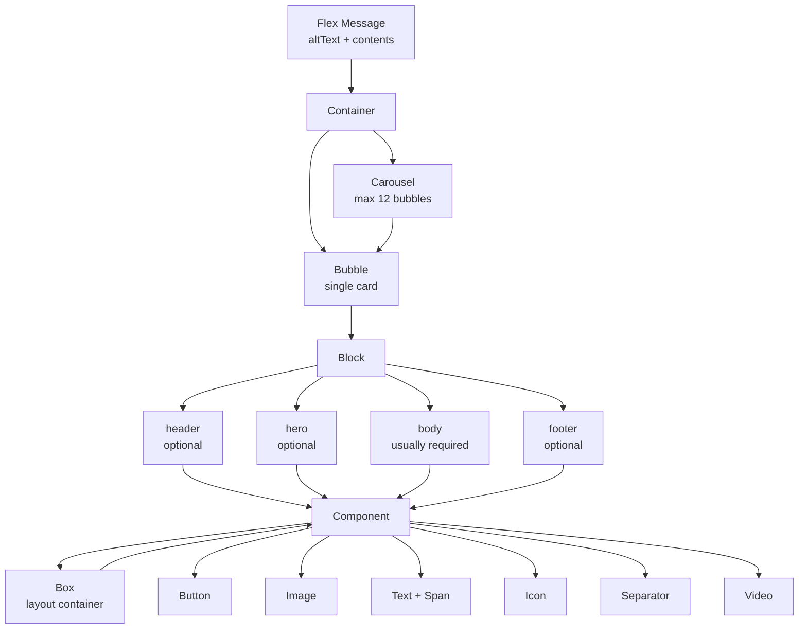
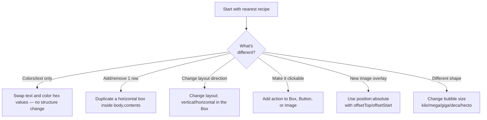

# LINE Flex Messages

## When to Activate

- Creating or editing Flex Message JSON
- Code contains `type: "flex"`, `type: "bubble"`, or `type: "carousel"`
- Building product cards, receipts, booking confirmations, or rich UI in LINE
- Troubleshooting Flex Message rendering issues

---

## Architecture (3 Levels)

```
Container (Bubble | Carousel)
  └── Block (Header | Hero | Body | Footer)
       └── Component (Box | Button | Image | Video | Icon | Text | Span | Separator)
```

---

## Containers

**Bubble** — Single message card
- Blocks appear in order: header → hero → body → footer (each used once)
- Sizes: `kilo`, `mega` (default), `giga`, `deca`, `hecto`

> **Requires LINE 13.6.0+ / PC 7.17.0+**: `deca` and `hecto` bubble sizes

**Carousel** — Horizontally scrollable bubbles
- Max **12 bubbles** per carousel

---

## Components Reference

| Component | Purpose | Key Properties |
|-----------|---------|---------------|
| Box | Layout container | `layout` (vertical/horizontal/baseline), `spacing`, `padding`, `backgroundColor`, `cornerRadius`, `borderWidth`, `position` (relative/absolute), `offsetTop/Bottom/Start/End` |
| Button | Tappable button | `style` (primary/secondary/link), `action`, `color`, `height` |
| Image | Display image | `url` (HTTPS only), `size`, `aspectRatio`, `aspectMode` (cover/fit), `cornerRadius` |
| Video | Display video | `url`, `previewUrl`, `altContent` (fallback), `aspectRatio` |
| Text | Display text | `text`, `size`, `color`, `weight` (bold/regular), `wrap` (true for wrapping), `maxLines`, `decoration` (line-through/underline), `lineSpacing` |
| Span | Styled text within Text | `text`, `size`, `color`, `weight`, `decoration` — set in Text's `contents` array |
| Icon | Small icon | `url`, `size` — baseline box only |
| Separator | Divider line | `margin` — horizontal in vertical box, vertical in horizontal box |

> **Requires LINE 11.22.0+**: `maxWidth`, `maxHeight`, `lineSpacing`, Video component

---

## Box Layout Properties

### Layout Types
- `horizontal` — children arranged left-to-right
- `vertical` — children arranged top-to-bottom
- `baseline` — children vertically aligned by text baseline (regardless of font size)

### justifyContent (requires all children `flex: 0`)
`flex-start` | `center` | `flex-end` | `space-between` | `space-around` | `space-evenly`

### alignItems (cross-axis)
`flex-start` | `center` | `flex-end`

### spacing (gap between children)
Keywords: `none` | `xs` | `sm` | `md` | `lg` | `xl` | `xxl` — or pixel values

### padding
`paddingAll`, `paddingTop`, `paddingBottom`, `paddingStart`, `paddingEnd`
Units: keywords, pixels, or percentages

### flex property
- `flex: 0` — component occupies content width only, no growth
- `flex: 1+` — components share remaining space proportionally
- Default horizontal: `flex: 1` / Default vertical: `flex: 0`

### position
`relative` | `absolute`

### offsets
`offsetTop`, `offsetBottom`, `offsetStart`, `offsetEnd` — keywords, pixels, or percentages

### width/height
`width`, `height`, `maxWidth`, `maxHeight` — pixels, percentages, or keywords

---

## Size Keywords Reference

**Image sizes:** `xxs` | `xs` | `sm` | `md` | `lg` | `xl` | `xxl` | `3xl` | `4xl` | `5xl` | `full` — or percentages/pixels

**Text/Icon sizes:** `xxs` | `xs` | `sm` | `md` | `lg` | `xl` | `xxl` | `3xl` | `4xl` | `5xl` — or pixels

**Component alignment:**
- `align` (text/image): `start` | `center` | `end`
- `gravity` (text/image/button): `top` | `center` | `bottom`
- `adjustMode`: `shrink-to-fit` — auto-shrink text to fit container

> **Requires LINE 13.6.0+**: `scaling` property for responsive sizing per user font settings

---

## Sending Flex Messages

```json
{
  "type": "flex",
  "altText": "Required — shown in notifications (max 400 chars)",
  "contents": {
    "type": "bubble",
    "hero": { ... },
    "body": { ... },
    "footer": { ... }
  }
}
```

---

## Linear Gradient

```json
{
  "type": "linearGradient",
  "angle": "180deg",
  "startColor": "#00000000",
  "centerColor": "#00000080",
  "endColor": "#000000CC",
  "centerPosition": "30%"
}
```
- `angle`: 0-360 degrees (0°=bottom-to-top, 90°=left-to-right, 180°=top-to-bottom)
- `centerColor` + `centerPosition`: optional middle color stop

---

## Advanced Patterns

### Absolute Positioning (Overlays)

```json
{
  "type": "box",
  "layout": "vertical",
  "position": "absolute",
  "offsetTop": "10px",
  "offsetStart": "10px",
  "backgroundColor": "#FF0000CC",
  "cornerRadius": "4px",
  "contents": [
    { "type": "text", "text": "SALE", "color": "#FFFFFF", "size": "xs" }
  ]
}
```

### Gradient Background

```json
{
  "type": "box",
  "layout": "vertical",
  "background": {
    "type": "linearGradient",
    "angle": "0deg",
    "startColor": "#00000000",
    "endColor": "#000000CC"
  }
}
```

### Price with Strikethrough

```json
{
  "type": "text",
  "text": "$200",
  "decoration": "line-through",
  "size": "sm",
  "color": "#999999"
}
```

---

## Common Recipes

### Product Card with Price & CTA

```json
{
  "type": "bubble",
  "hero": {
    "type": "image",
    "url": "https://example.com/product.jpg",
    "size": "full",
    "aspectRatio": "20:13",
    "aspectMode": "cover",
    "action": { "type": "uri", "label": "View", "uri": "https://example.com/product/1" }
  },
  "body": {
    "type": "box",
    "layout": "vertical",
    "contents": [
      {
        "type": "text",
        "text": "Product Name",
        "weight": "bold",
        "size": "xl"
      },
      {
        "type": "box",
        "layout": "baseline",
        "margin": "md",
        "contents": [
          { "type": "icon", "url": "https://example.com/star.png", "size": "sm" },
          { "type": "icon", "url": "https://example.com/star.png", "size": "sm" },
          { "type": "icon", "url": "https://example.com/star.png", "size": "sm" },
          { "type": "icon", "url": "https://example.com/star.png", "size": "sm" },
          { "type": "icon", "url": "https://example.com/star-half.png", "size": "sm" },
          { "type": "text", "text": "4.5", "size": "sm", "color": "#999999", "margin": "md", "flex": 0 }
        ]
      },
      {
        "type": "box",
        "layout": "horizontal",
        "margin": "lg",
        "contents": [
          { "type": "text", "text": "฿1,500", "decoration": "line-through", "size": "sm", "color": "#999999", "flex": 0 },
          { "type": "text", "text": "฿990", "weight": "bold", "size": "lg", "color": "#FF5551", "margin": "sm", "flex": 0 }
        ]
      },
      {
        "type": "text",
        "text": "Description text that wraps to multiple lines for detail.",
        "size": "sm",
        "color": "#666666",
        "wrap": true,
        "margin": "md"
      }
    ]
  },
  "footer": {
    "type": "box",
    "layout": "vertical",
    "spacing": "sm",
    "contents": [
      {
        "type": "button",
        "style": "primary",
        "color": "#06C755",
        "action": { "type": "postback", "label": "Add to Cart", "data": "action=addcart&productId=1" }
      },
      {
        "type": "button",
        "style": "secondary",
        "action": { "type": "uri", "label": "More Details", "uri": "https://example.com/product/1" }
      }
    ]
  }
}
```

### Receipt / Order Confirmation

```json
{
  "type": "bubble",
  "body": {
    "type": "box",
    "layout": "vertical",
    "contents": [
      { "type": "text", "text": "RECEIPT", "weight": "bold", "color": "#1DB446", "size": "sm" },
      { "type": "text", "text": "Shop Name", "weight": "bold", "size": "xxl", "margin": "md" },
      { "type": "text", "text": "Order #12345", "size": "xs", "color": "#aaaaaa", "wrap": true },
      { "type": "separator", "margin": "xxl" },
      {
        "type": "box",
        "layout": "vertical",
        "margin": "xxl",
        "spacing": "sm",
        "contents": [
          {
            "type": "box",
            "layout": "horizontal",
            "contents": [
              { "type": "text", "text": "Item A x2", "size": "sm", "color": "#555555", "flex": 0 },
              { "type": "text", "text": "฿500", "size": "sm", "color": "#111111", "align": "end" }
            ]
          },
          {
            "type": "box",
            "layout": "horizontal",
            "contents": [
              { "type": "text", "text": "Item B x1", "size": "sm", "color": "#555555", "flex": 0 },
              { "type": "text", "text": "฿300", "size": "sm", "color": "#111111", "align": "end" }
            ]
          }
        ]
      },
      { "type": "separator", "margin": "xxl" },
      {
        "type": "box",
        "layout": "horizontal",
        "margin": "xxl",
        "contents": [
          { "type": "text", "text": "TOTAL", "size": "sm", "color": "#555555" },
          { "type": "text", "text": "฿800", "size": "sm", "color": "#111111", "align": "end", "weight": "bold" }
        ]
      }
    ]
  },
  "styles": {
    "footer": { "separator": true }
  }
}
```

### Booking Confirmation with DateTime

```json
{
  "type": "bubble",
  "body": {
    "type": "box",
    "layout": "vertical",
    "contents": [
      { "type": "text", "text": "Booking Confirmed", "weight": "bold", "size": "xl", "color": "#1DB446" },
      { "type": "separator", "margin": "lg" },
      {
        "type": "box",
        "layout": "vertical",
        "margin": "lg",
        "spacing": "sm",
        "contents": [
          {
            "type": "box",
            "layout": "horizontal",
            "contents": [
              { "type": "text", "text": "Date", "size": "sm", "color": "#999999", "flex": 2 },
              { "type": "text", "text": "2025-03-15", "size": "sm", "color": "#333333", "flex": 3 }
            ]
          },
          {
            "type": "box",
            "layout": "horizontal",
            "contents": [
              { "type": "text", "text": "Time", "size": "sm", "color": "#999999", "flex": 2 },
              { "type": "text", "text": "14:00 - 15:00", "size": "sm", "color": "#333333", "flex": 3 }
            ]
          },
          {
            "type": "box",
            "layout": "horizontal",
            "contents": [
              { "type": "text", "text": "Location", "size": "sm", "color": "#999999", "flex": 2 },
              { "type": "text", "text": "Meeting Room A", "size": "sm", "color": "#333333", "flex": 3, "wrap": true }
            ]
          }
        ]
      }
    ]
  },
  "footer": {
    "type": "box",
    "layout": "vertical",
    "spacing": "sm",
    "contents": [
      {
        "type": "button",
        "style": "primary",
        "action": { "type": "uri", "label": "View Details", "uri": "https://example.com/booking/123" }
      },
      {
        "type": "button",
        "style": "link",
        "color": "#FF5551",
        "action": { "type": "postback", "label": "Cancel Booking", "data": "action=cancel&bookingId=123", "displayText": "Cancel my booking" }
      }
    ]
  }
}
```

### Image Card with Overlay Badge

```json
{
  "type": "bubble",
  "hero": {
    "type": "box",
    "layout": "vertical",
    "contents": [
      {
        "type": "image",
        "url": "https://example.com/hero.jpg",
        "size": "full",
        "aspectRatio": "20:13",
        "aspectMode": "cover"
      },
      {
        "type": "box",
        "layout": "vertical",
        "position": "absolute",
        "offsetTop": "10px",
        "offsetEnd": "10px",
        "backgroundColor": "#FF0000CC",
        "cornerRadius": "4px",
        "paddingAll": "4px",
        "contents": [
          { "type": "text", "text": "NEW", "color": "#FFFFFF", "size": "xxs", "weight": "bold" }
        ]
      },
      {
        "type": "box",
        "layout": "vertical",
        "position": "absolute",
        "offsetBottom": "0px",
        "offsetStart": "0px",
        "offsetEnd": "0px",
        "paddingAll": "10px",
        "background": {
          "type": "linearGradient",
          "angle": "0deg",
          "startColor": "#00000000",
          "endColor": "#000000CC"
        },
        "contents": [
          { "type": "text", "text": "Title over image", "color": "#FFFFFF", "weight": "bold", "size": "lg" }
        ]
      }
    ],
    "paddingAll": "0px"
  }
}
```

### Product Carousel (Multiple Items)

```json
{
  "type": "carousel",
  "contents": [
    {
      "type": "bubble",
      "size": "micro",
      "hero": {
        "type": "image",
        "url": "https://example.com/item1.jpg",
        "size": "full",
        "aspectRatio": "1:1",
        "aspectMode": "cover"
      },
      "body": {
        "type": "box",
        "layout": "vertical",
        "contents": [
          { "type": "text", "text": "Item 1", "weight": "bold", "size": "sm" },
          { "type": "text", "text": "฿990", "size": "xs", "color": "#FF5551" }
        ]
      }
    },
    {
      "type": "bubble",
      "size": "micro",
      "hero": {
        "type": "image",
        "url": "https://example.com/item2.jpg",
        "size": "full",
        "aspectRatio": "1:1",
        "aspectMode": "cover"
      },
      "body": {
        "type": "box",
        "layout": "vertical",
        "contents": [
          { "type": "text", "text": "Item 2", "weight": "bold", "size": "sm" },
          { "type": "text", "text": "฿1,290", "size": "xs", "color": "#FF5551" }
        ]
      }
    }
  ]
}
```

---

## Constraints

- Single Flex Message: max **50KB**
- Carousel: max **12 bubbles**
- Image URLs: must be **HTTPS**
- `altText`: required, max 400 chars
- `flex` property: integer 0-3, controls proportional width in horizontal boxes
- Rendering varies by device OS, LINE version, screen resolution, language, font
- Filler component is **deprecated** — use component properties instead

---

## Architecture Diagram



---

## Modify-A-Recipe Playbook

Students often want to tweak an existing recipe. Follow this order:



**Golden rules when modifying:**
1. Always keep `altText` — it's required
2. Image URLs must be HTTPS (no HTTP, no local)
3. If `flex: 0` on all horizontal children → justifyContent works
4. If text overflows → add `wrap: true` and `maxLines`
5. Validate with `/v2/bot/message/{type}/validate` before sending

---

## Layout Debug Checklist

When Flex renders wrong:

| Symptom | Likely Fix |
|---------|-----------|
| Text cut off | Add `wrap: true`, increase `maxLines` or remove it |
| Elements overlap unexpectedly | Check if `position: "absolute"` was set and offset values |
| Columns uneven widths | Set `flex: 1, 2, 3...` on children to control ratio |
| Buttons look tiny | Set `height: "sm"` or `"md"` on Button |
| Image stretched | Change `aspectMode: "fit"` instead of `"cover"` |
| Icons not inline with text | Place them in a `baseline` layout Box |
| Whole card looks cramped | Add `spacing: "md"` on parent Box or `margin` on child |
| Footer buttons too close | Add `spacing: "sm"` on footer Box |
| Gradient not showing | Check that `background` is inside a Box, not on Image |
| Rendering differs Android vs iOS | Check LINE version; some properties need 11.22.0+ |

---

## Responsive Design Pattern

Use `scaling: true` (LINE 13.6.0+) so text respects user's font size setting:

```json
{
  "type": "text",
  "text": "Accessible text",
  "size": "md",
  "scaling": true
}
```

For truly responsive bubbles, combine:
- `size: "giga"` (wider on big screens, max width device-dependent)
- `maxWidth: "100%"` on hero images
- `aspectMode: "cover"` with a conservative `aspectRatio` like `"20:13"`
- Use percentages instead of pixels for offsets when possible

---

## Validation Before Sending

```typescript
async function validateFlexMessage(flexMessage: any) {
  const { data } = await axios.post(
    'https://api.line.me/v2/bot/message/validate/flex',
    flexMessage,
    { headers: { Authorization: `Bearer ${token}` } }
  )
  return data  // { } on success, or { message, details } on error
}
```

Gotcha: the validate endpoint catches structural bugs but **not** runtime issues like bad image URLs or 50KB overflow after emoji expansion. Always test in real device after validation passes.
