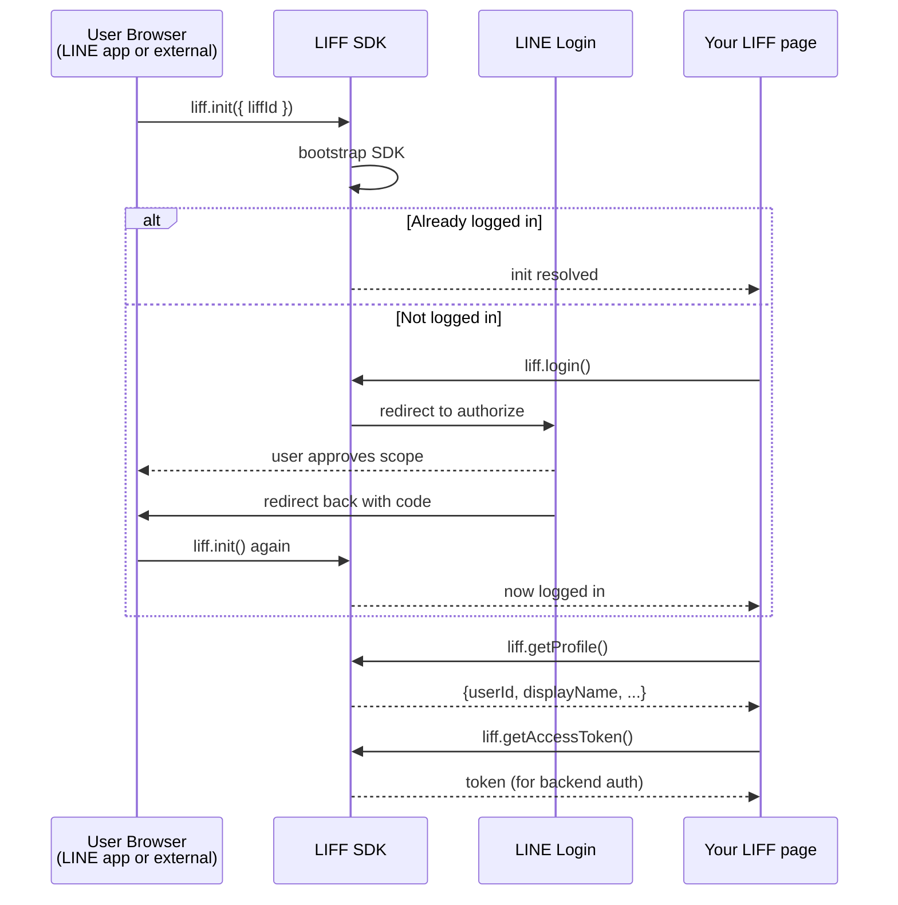
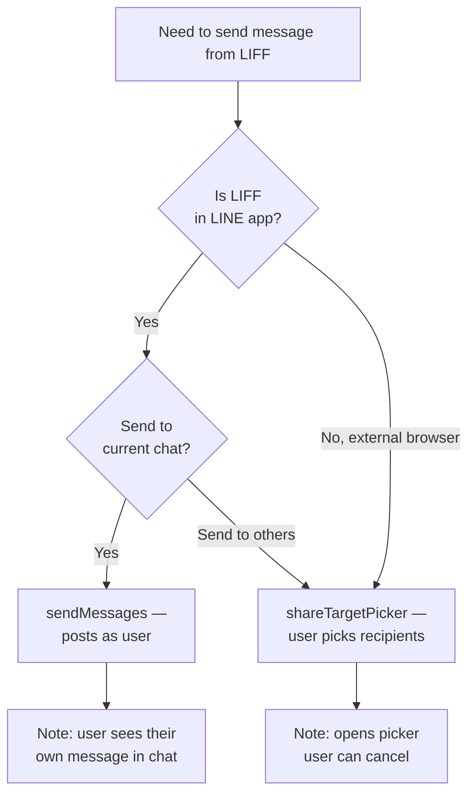

# LINE LIFF (LINE Front-end Framework)

## When to Activate

- Building or modifying LIFF web apps
- Code imports `@line/liff`
- Implementing LINE login in web apps
- Integrating LIFF with Firebase Authentication
- Using shareTargetPicker or scanCode
- Communicating between LIFF and LINE bot

---

## Initialization

```typescript
import liff from '@line/liff'

async function initLiff(liffId: string) {
  await liff.init({ liffId })

  if (!liff.isLoggedIn()) {
    liff.login({ redirectUri: window.location.href })
    return null
  }

  return {
    profile: await liff.getProfile(),
    accessToken: liff.getAccessToken(),  // Use this for API auth
    isInClient: liff.isInClient(),       // true = inside LINE app
  }
}
```

---

## Key APIs

| API | Returns | Notes |
|-----|---------|-------|
| `liff.init({ liffId })` | `Promise<void>` | Must call before any LIFF API |
| `liff.isLoggedIn()` | `boolean` | Check before accessing profile |
| `liff.login({ redirectUri? })` | `void` | Redirects to LINE login page |
| `liff.logout()` | `void` | Logs out and clears token |
| `liff.getProfile()` | `Promise<Profile>` | Returns displayName, userId, pictureUrl, statusMessage |
| `liff.getAccessToken()` | `string | null` | Use for backend API auth — NOT `getIDToken()` |
| `liff.getIDToken()` | `string | null` | JWT ID token — verify server-side with channel secret |
| `liff.getDecodedIDToken()` | `object | null` | Decoded ID token claims |
| `liff.isInClient()` | `boolean` | `true` inside LINE app, `false` in external browser |
| `liff.getOS()` | `string` | `'ios'`, `'android'`, `'web'` |
| `liff.getLanguage()` | `string` | User's language setting (e.g. `'th'`, `'en'`) |
| `liff.getVersion()` | `string` | LIFF SDK version |
| `liff.isApiAvailable(apiName)` | `boolean` | Check if API is available in current context |
| `liff.closeWindow()` | `void` | Only works inside LINE app |
| `liff.openWindow({ url, external })` | `void` | Open URL in LINE browser or external browser |
| `liff.shareTargetPicker(messages)` | `Promise` | Send message to selected friends/groups |
| `liff.scanCodeV2()` | `Promise<{ value }>` | Scan QR/barcode (LINE app only) |
| `liff.sendMessages(messages)` | `Promise<void>` | Send messages to current chat (in-client only) |
| `liff.permanentLink.createUrlBy(url)` | `string` | Create permanent link with custom path |

---

## Profile Object

```typescript
interface Profile {
  userId: string          // LINE user ID (U-prefixed)
  displayName: string     // User's display name
  pictureUrl?: string     // Profile image URL (HTTPS)
  statusMessage?: string  // User's status message
}
```

---

## LIFF Sizes

| Size | Behavior |
|------|----------|
| `compact` | Bottom sheet (30% screen height) |
| `tall` | Bottom sheet (75% screen height) |
| `full` | Full screen |

Configure in LINE Developers Console when registering LIFF app.

---

## Share Target Picker

Send Flex/Text messages to user-selected friends or groups:

```typescript
if (liff.isApiAvailable('shareTargetPicker')) {
  const result = await liff.shareTargetPicker([
    {
      type: 'flex',
      altText: 'Check this out!',
      contents: {
        type: 'bubble',
        body: {
          type: 'box',
          layout: 'vertical',
          contents: [
            { type: 'text', text: 'Shared from LIFF', weight: 'bold', size: 'xl' },
            { type: 'text', text: 'Tap to open', size: 'sm', color: '#999999' }
          ]
        },
        footer: {
          type: 'box',
          layout: 'vertical',
          contents: [
            {
              type: 'button',
              style: 'primary',
              action: { type: 'uri', label: 'Open', uri: `https://liff.line.me/${LIFF_ID}` }
            }
          ]
        }
      }
    }
  ])

  if (result) {
    console.log('Message sent successfully')
  }
}
```

**Rules:**
- User must be logged in
- Opens a picker dialog — user chooses recipients
- Supports all message types: text, image, video, audio, flex, template
- Max 5 messages per call
- Returns `undefined` if user cancels

---

## Send Messages (In-Client Only)

Send messages directly to the chat where LIFF was opened:

```typescript
if (liff.isInClient()) {
  await liff.sendMessages([
    { type: 'text', text: 'Hello from LIFF!' }
  ])
}
```

- Only works inside LINE app (not external browser)
- Sends as the user's message to the current chat
- Max 5 messages per call

---

## Scan QR/Barcode

```typescript
if (liff.isApiAvailable('scanCodeV2')) {
  const result = await liff.scanCodeV2()
  console.log(result.value)  // Scanned content
}
```

- Only works inside LINE app
- Returns `{ value: string }` with scanned content

---

## LIFF → Firebase Auth Flow

### Frontend (LIFF App)

```typescript
import liff from '@line/liff'
import { getAuth, signInWithCustomToken } from 'firebase/auth'
import { httpsCallable } from 'firebase/functions'

async function loginWithLIFF() {
  await liff.init({ liffId: 'YOUR_LIFF_ID' })

  if (!liff.isLoggedIn()) {
    liff.login()
    return
  }

  const liffToken = liff.getAccessToken()
  const functions = getFunctions()
  const verifyLiffToken = httpsCallable(functions, 'verifyLiffToken')

  const result = await verifyLiffToken({ liffToken })
  const auth = getAuth()
  await signInWithCustomToken(auth, result.data.token)

  // User is now authenticated with Firebase
}
```

### Backend (Cloud Function)

```typescript
import { onCall } from 'firebase-functions/v2/https'
import { getAuth } from 'firebase-admin/auth'
import { getFirestore, FieldValue } from 'firebase-admin/firestore'

export const verifyLiffToken = onCall(async (request) => {
  const { liffToken } = request.data

  // Verify token with LINE API
  const profile = await fetch('https://api.line.me/v2/profile', {
    headers: { 'Authorization': `Bearer ${liffToken}` },
  }).then(r => {
    if (!r.ok) throw new Error('Invalid LIFF token')
    return r.json()
  })

  // Upsert user in Firestore
  const db = getFirestore()
  await db.collection('users').doc(profile.userId).set({
    displayName: profile.displayName,
    pictureUrl: profile.pictureUrl || null,
    liffUserId: profile.userId,
    updatedAt: FieldValue.serverTimestamp(),
  }, { merge: true })

  // Issue Firebase custom token
  const auth = getAuth()
  const firebaseToken = await auth.createCustomToken(profile.userId)
  return { success: true, data: { token: firebaseToken } }
})
```

---

## LIFF → Bot Communication

### Pattern 1: LIFF sends message to chat, bot handles it

```typescript
// In LIFF (must be opened in LINE app)
await liff.sendMessages([
  { type: 'text', text: '/order 123' }
])
liff.closeWindow()
```

Bot webhook receives the text message and processes it.

### Pattern 2: LIFF calls backend API, backend pushes via bot

```typescript
// In LIFF
const accessToken = liff.getAccessToken()
const profile = await liff.getProfile()

await fetch('/api/submit-order', {
  method: 'POST',
  headers: {
    'Authorization': `Bearer ${accessToken}`,
    'Content-Type': 'application/json'
  },
  body: JSON.stringify({ userId: profile.userId, orderId: '123' })
})

liff.closeWindow()
```

```typescript
// Backend — after processing
await pushMessage(userId, [
  { type: 'text', text: 'Your order #123 has been confirmed!' }
])
```

### Pattern 3: Use postback data from Rich Menu / Flex to open LIFF

```json
{
  "type": "uri",
  "label": "Open Form",
  "uri": "https://liff.line.me/{liffId}?orderId=123"
}
```

LIFF reads query params:
```typescript
const params = new URLSearchParams(window.location.search)
const orderId = params.get('orderId')  // "123"
```

---

## Permanent Links

```typescript
// Create a permanent link with path
const url = liff.permanentLink.createUrlBy('https://liff.line.me/1234-abcdef/path?key=value')
// Result: https://liff.line.me/1234-abcdef/path?key=value
```

Use permanent links instead of constructing LIFF URLs manually — they handle encoding and routing correctly.

---

## Common Pitfalls

1. **Don't call LIFF APIs before `liff.init()`** — all APIs throw if called before initialization
2. **`getAccessToken()` vs `getIDToken()`** — use `getAccessToken()` for backend API calls; `getIDToken()` is for server-side verification with channel secret
3. **`closeWindow()` only works in LINE app** — check `isInClient()` first
4. **`sendMessages()` only works in LINE app** — use `shareTargetPicker()` for external browser
5. **LIFF URL must be HTTPS** — no HTTP allowed
6. **LIFF in external browser**: login redirects user to LINE login page, then back to LIFF
7. **Access token expires** — don't store long-term; re-init LIFF to get fresh token

---

## LIFF Init Pipeline Diagram



---

## Decision Tree: Which LIFF Send Method?



---

## Production Recipes

### Recipe 1: Full Init Pipeline with Error Fallbacks

```typescript
import liff from '@line/liff'

type LiffState =
  | { status: 'ready'; profile: Profile; accessToken: string; isInClient: boolean }
  | { status: 'needs-login' }
  | { status: 'unsupported'; reason: string }
  | { status: 'error'; error: Error }

export async function bootstrapLiff(liffId: string): Promise<LiffState> {
  try {
    await liff.init({ liffId })
  } catch (err: any) {
    if (err.code === 'INIT_FAILED') return { status: 'unsupported', reason: err.message }
    return { status: 'error', error: err }
  }

  if (!liff.isLoggedIn()) return { status: 'needs-login' }

  try {
    const profile = await liff.getProfile()
    const accessToken = liff.getAccessToken()
    if (!accessToken) return { status: 'error', error: new Error('No access token') }
    return {
      status: 'ready',
      profile,
      accessToken,
      isInClient: liff.isInClient()
    }
  } catch (err: any) {
    // Scope missing or user revoked
    if (err.code === 'FORBIDDEN') {
      liff.logout()
      return { status: 'needs-login' }
    }
    return { status: 'error', error: err }
  }
}
```

### Recipe 2: Complete LIFF → Firebase Auth Flow (Production)

See existing "LIFF → Firebase Auth Flow" section above — add this server-side verification hardening:

```typescript
// Backend — production hardening
export const verifyLiffToken = onCall(async (request) => {
  const { liffToken } = request.data
  if (!liffToken) throw new HttpsError('invalid-argument', 'missing liffToken')

  // 1) Verify token validity AND scope with LINE
  const verify = await fetch(
    `https://api.line.me/oauth2/v2.1/verify?access_token=${liffToken}`
  ).then(r => r.json())

  if (verify.error) throw new HttpsError('unauthenticated', verify.error_description)
  // verify = { scope, client_id, expires_in }
  const requiredChannelId = process.env.LINE_LOGIN_CHANNEL_ID
  if (verify.client_id !== requiredChannelId) {
    throw new HttpsError('permission-denied', 'wrong channel')
  }
  if (verify.expires_in <= 0) {
    throw new HttpsError('unauthenticated', 'token expired')
  }

  // 2) Fetch profile with verified token
  const profileRes = await fetch('https://api.line.me/v2/profile', {
    headers: { Authorization: `Bearer ${liffToken}` }
  })
  if (!profileRes.ok) throw new HttpsError('unauthenticated', 'profile fetch failed')
  const profile = await profileRes.json()

  // 3) Upsert in Firestore + issue Firebase custom token
  // ...see main recipe above
})
```

### Recipe 3: LIFF ↔ Bot Communication via Signed Payload

When LIFF triggers server work and the bot should push result, use a signed payload to prevent replay:

```typescript
// LIFF frontend
const accessToken = liff.getAccessToken()
await fetch('/api/submit-form', {
  method: 'POST',
  headers: {
    'Authorization': `Bearer ${accessToken}`,
    'Content-Type': 'application/json'
  },
  body: JSON.stringify({ formData })
})
liff.closeWindow()
```

```typescript
// Backend
app.post('/api/submit-form', async (req, res) => {
  // Verify LIFF token
  const token = req.headers.authorization?.slice(7)
  const verify = await fetch(`https://api.line.me/oauth2/v2.1/verify?access_token=${token}`)
    .then(r => r.json())
  if (verify.error) return res.status(401).send('invalid token')

  const profile = await fetch('https://api.line.me/v2/profile', {
    headers: { Authorization: `Bearer ${token}` }
  }).then(r => r.json())

  // Process form, then push result via bot
  await processForm(req.body.formData)
  await pushMessage(profile.userId, [
    { type: 'text', text: `ส่งฟอร์มสำเร็จ ขอบคุณ ${profile.displayName}` }
  ])

  res.json({ ok: true })
})
```

### Recipe 4: Query Param Router (LIFF as Multi-screen App)

Use query params to pass context from Flex/Rich Menu to LIFF.

```typescript
// Flex/Rich Menu URI action
{ type: 'uri', uri: `https://liff.line.me/${LIFF_ID}?view=order&id=123` }

// In LIFF
const params = new URLSearchParams(window.location.search)
const view = params.get('view')  // 'order'
const id = params.get('id')      // '123'

switch (view) {
  case 'order':   showOrderDetails(id); break
  case 'profile': showProfile(); break
  case 'form':    showForm(id); break
  default:        showHome()
}
```

### Recipe 5: Scope Error Fallback UI

When user declines scope, show friendly retry.

```tsx
// React example
function LiffGate({ children }: { children: React.ReactNode }) {
  const [state, setState] = useState<LiffState | null>(null)

  useEffect(() => { bootstrapLiff(LIFF_ID).then(setState) }, [])

  if (!state) return <Loading />
  if (state.status === 'needs-login')
    return <button onClick={() => liff.login()}>เข้าสู่ระบบด้วย LINE</button>
  if (state.status === 'unsupported')
    return <p>กรุณาเปิดหน้านี้ในแอป LINE — {state.reason}</p>
  if (state.status === 'error')
    return <p>เกิดข้อผิดพลาด ลองใหม่อีกครั้ง</p>

  return <LiffContext.Provider value={state}>{children}</LiffContext.Provider>
}
```

---

## LIFF API Availability Matrix

| API | In-Client (iOS/Android) | External Browser | LINE PC |
|-----|------------------------|------------------|---------|
| `liff.init()` | Yes | Yes | Yes |
| `liff.login()` | N/A (auto) | Yes | Yes |
| `liff.getProfile()` | Yes | Yes | Yes |
| `liff.sendMessages()` | Yes | **No** | No |
| `liff.shareTargetPicker()` | Yes | Yes | No |
| `liff.scanCodeV2()` | Yes | No | No |
| `liff.closeWindow()` | Yes | No | No |
| `liff.openWindow()` | Yes | Yes | Yes |

Always check `liff.isApiAvailable()` before calling platform-specific APIs.
