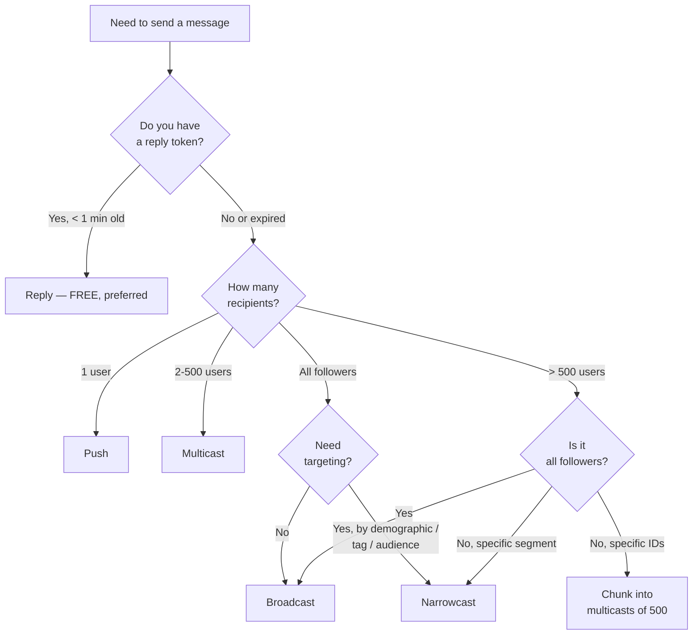
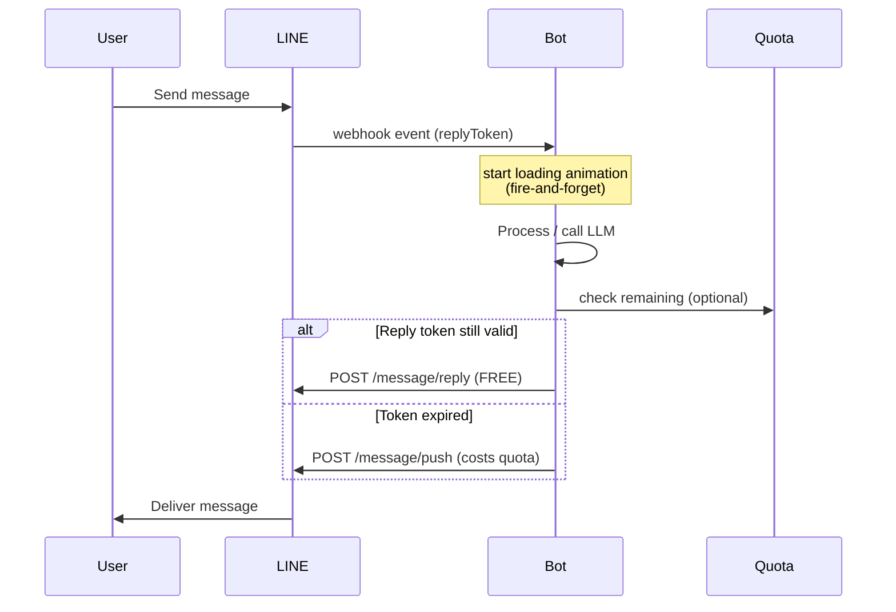

# LINE Messaging Methods & Message Types

## When to Activate

- Sending messages via LINE Messaging API
- Choosing between push/multicast/broadcast/narrowcast/reply
- Building message payloads (text, image, template, etc.)
- Adding quick reply buttons to messages
- Using template messages (buttons, confirm, carousel, image carousel)
- Using LINE emoji or stickers

---

## Messaging Methods

### Reply Message (Free, No Quota Cost)

```
POST https://api.line.me/v2/bot/message/reply
```

```json
{
  "replyToken": "from webhook event",
  "messages": [{ ... }]
}
```

**Always prefer Reply over Push when a reply token is available — it's free.**

### Push Message (1-to-1)

```
POST https://api.line.me/v2/bot/message/push
```

```json
{
  "to": "userId",
  "messages": [{ ... }]
}
```

### Multicast (Multiple Users)

```
POST https://api.line.me/v2/bot/message/multicast
```

```json
{
  "to": ["userId1", "userId2"],
  "messages": [{ ... }]
}
```

Max **500 user IDs** per request. Chunk larger arrays.

### Broadcast (All Followers)

```
POST https://api.line.me/v2/bot/message/broadcast
```

```json
{
  "messages": [{ ... }]
}
```

### Narrowcast (Audience Targeting)

```
POST https://api.line.me/v2/bot/message/narrowcast
```

```json
{
  "messages": [{ ... }],
  "recipient": {
    "type": "audience",
    "audienceGroupId": 12345
  }
}
```

### Rate Limits

| Method | Limit | Quota Cost |
|--------|-------|------------|
| Reply | 2,000 req/sec | **Free** |
| Push | 2,000 req/sec | Yes |
| Multicast | 200 req/sec | Yes |
| Broadcast | 60 req/hour | Yes |
| Narrowcast | 60 req/hour | Yes |

### Message Endpoints

| Method | Endpoint | Description |
|--------|----------|-------------|
| POST | `/v2/bot/message/reply` | Reply using reply token (**free**) |
| POST | `/v2/bot/message/push` | Push to single user |
| POST | `/v2/bot/message/multicast` | Send to multiple users (max 500) |
| POST | `/v2/bot/message/broadcast` | Send to all followers |
| POST | `/v2/bot/message/narrowcast` | Send to audience segment |
| GET | `/v2/bot/message/progress/narrowcast?requestId=` | Check narrowcast progress |
| POST | `/v2/bot/message/{type}/validate` | Validate message structure before sending |
| POST | `/v2/bot/chat/markAsRead` | Mark messages as read |
| POST | `/v2/bot/chat/loading/start` | Display loading/typing animation |

### Common Rules
- Max **5 messages** per API call (all methods)
- All messages must include `type` field
- Reply token: **single use**, expires in **1 minute**

---

## Message Types

### Text Message

```json
{
  "type": "text",
  "text": "Hello, World!",
  "quoteToken": "optional — quote a previous message"
}
```

### Image Message

```json
{
  "type": "image",
  "originalContentUrl": "https://example.com/image.jpg",
  "previewImageUrl": "https://example.com/image-preview.jpg"
}
```

- Both URLs must be **HTTPS**
- `originalContentUrl`: max 10MB, JPEG/PNG
- `previewImageUrl`: max 1MB, JPEG/PNG

### Video Message

```json
{
  "type": "video",
  "originalContentUrl": "https://example.com/video.mp4",
  "previewImageUrl": "https://example.com/video-preview.jpg",
  "trackingId": "optional — for videoPlayComplete event"
}
```

- Video: max 200MB, MP4
- Preview: max 1MB, JPEG/PNG

### Audio Message

```json
{
  "type": "audio",
  "originalContentUrl": "https://example.com/audio.m4a",
  "duration": 60000
}
```

- Max 200MB, M4A format
- `duration`: milliseconds

### Location Message

```json
{
  "type": "location",
  "title": "My Location",
  "address": "123 Example St, Bangkok",
  "latitude": 13.7563,
  "longitude": 100.5018
}
```

### Sticker Message

```json
{
  "type": "sticker",
  "packageId": "446",
  "stickerId": "1988"
}
```

### Imagemap Message

```json
{
  "type": "imagemap",
  "baseUrl": "https://example.com/imagemap",
  "altText": "Image map example",
  "baseSize": {
    "width": 1040,
    "height": 1040
  },
  "actions": [
    {
      "type": "uri",
      "linkUri": "https://example.com/page1",
      "area": { "x": 0, "y": 0, "width": 520, "height": 520 }
    },
    {
      "type": "message",
      "text": "Tapped right side",
      "area": { "x": 520, "y": 0, "width": 520, "height": 520 }
    },
    {
      "type": "uri",
      "linkUri": "https://example.com/page2",
      "area": { "x": 0, "y": 520, "width": 1040, "height": 520 }
    }
  ]
}
```

**Imagemap rules:**
- `baseUrl`: LINE appends `/{size}` (e.g. `/1040`, `/700`, `/460`, `/300`, `/240`) to fetch resolution-appropriate images. Prepare images at each size.
- `baseSize.width`: always **1040**
- `baseSize.height`: varies by aspect ratio
- Action types: `uri` and `message` only
- `area`: coordinates relative to `baseSize`

### Imagemap with Video

```json
{
  "type": "imagemap",
  "baseUrl": "https://example.com/imagemap",
  "altText": "Video imagemap",
  "baseSize": { "width": 1040, "height": 1040 },
  "video": {
    "originalContentUrl": "https://example.com/video.mp4",
    "previewImageUrl": "https://example.com/video-preview.jpg",
    "area": { "x": 0, "y": 0, "width": 1040, "height": 585 },
    "externalLink": {
      "linkUri": "https://example.com",
      "label": "See more"
    }
  },
  "actions": []
}
```

---

## Template Messages

> Template messages display a predefined layout that users can interact with. Use when you need structured choices without full Flex Message complexity.

### Buttons Template

```json
{
  "type": "template",
  "altText": "Menu",
  "template": {
    "type": "buttons",
    "thumbnailImageUrl": "https://example.com/image.jpg",
    "imageAspectRatio": "rectangle",
    "imageSize": "cover",
    "imageBackgroundColor": "#FFFFFF",
    "title": "Menu Title",
    "text": "Please select an option",
    "defaultAction": { "type": "uri", "label": "View", "uri": "https://example.com" },
    "actions": [
      { "type": "postback", "label": "Option A", "data": "action=a" },
      { "type": "postback", "label": "Option B", "data": "action=b" },
      { "type": "uri", "label": "Website", "uri": "https://example.com" }
    ]
  }
}
```

- Max **4 actions**
- `title`: max 40 chars (optional)
- `text`: max 160 chars (120 if title/image set)
- `imageAspectRatio`: `rectangle` (1.51:1) or `square` (1:1)

### Confirm Template

```json
{
  "type": "template",
  "altText": "Confirm?",
  "template": {
    "type": "confirm",
    "text": "Are you sure you want to proceed?",
    "actions": [
      { "type": "postback", "label": "Yes", "data": "action=confirm" },
      { "type": "postback", "label": "No", "data": "action=cancel" }
    ]
  }
}
```

- Exactly **2 actions**
- `text`: max 240 chars

### Carousel Template

```json
{
  "type": "template",
  "altText": "Product list",
  "template": {
    "type": "carousel",
    "columns": [
      {
        "thumbnailImageUrl": "https://example.com/item1.jpg",
        "imageBackgroundColor": "#FFFFFF",
        "title": "Item 1",
        "text": "Description",
        "defaultAction": { "type": "uri", "label": "View", "uri": "https://example.com/1" },
        "actions": [
          { "type": "postback", "label": "Buy", "data": "action=buy&id=1" },
          { "type": "uri", "label": "Details", "uri": "https://example.com/1" }
        ]
      },
      {
        "thumbnailImageUrl": "https://example.com/item2.jpg",
        "title": "Item 2",
        "text": "Description",
        "actions": [
          { "type": "postback", "label": "Buy", "data": "action=buy&id=2" },
          { "type": "uri", "label": "Details", "uri": "https://example.com/2" }
        ]
      }
    ],
    "imageAspectRatio": "rectangle",
    "imageSize": "cover"
  }
}
```

- Max **10 columns**
- Max **3 actions** per column
- All columns must have same number of actions

### Image Carousel Template

```json
{
  "type": "template",
  "altText": "Image carousel",
  "template": {
    "type": "image_carousel",
    "columns": [
      {
        "imageUrl": "https://example.com/image1.jpg",
        "action": { "type": "uri", "label": "Image 1", "uri": "https://example.com/1" }
      },
      {
        "imageUrl": "https://example.com/image2.jpg",
        "action": { "type": "postback", "label": "Image 2", "data": "action=select&id=2" }
      }
    ]
  }
}
```

- Max **10 columns**
- One action per column

---

## Quick Reply

> Quick reply buttons appear at the bottom of the chat. They disappear after user taps one or sends a new message.

```json
{
  "type": "text",
  "text": "What would you like to do?",
  "quickReply": {
    "items": [
      {
        "type": "action",
        "imageUrl": "https://example.com/icon1.png",
        "action": { "type": "message", "label": "Order", "text": "I want to order" }
      },
      {
        "type": "action",
        "imageUrl": "https://example.com/icon2.png",
        "action": { "type": "message", "label": "Track", "text": "Track my order" }
      },
      {
        "type": "action",
        "action": { "type": "camera", "label": "Camera" }
      },
      {
        "type": "action",
        "action": { "type": "cameraRoll", "label": "Gallery" }
      },
      {
        "type": "action",
        "action": { "type": "location", "label": "Location" }
      },
      {
        "type": "action",
        "action": { "type": "datetimepicker", "label": "Pick Date", "data": "action=date", "mode": "date" }
      },
      {
        "type": "action",
        "action": { "type": "postback", "label": "Help", "data": "action=help", "displayText": "Help me" }
      }
    ]
  }
}
```

**Quick Reply rules:**
- Max **13 items**
- Can be attached to **any message type** (text, image, flex, template, etc.)
- `imageUrl`: optional, HTTPS, max 1MB, PNG recommended, 24x24dp (shows as circle)
- Camera, Camera Roll, Location actions: **quick reply only** (not usable in buttons/flex)
- All action types are supported: `message`, `postback`, `uri`, `datetimepicker`, `camera`, `cameraRoll`, `location`, `clipboard`

---

## Actions Reference

All tappable elements (buttons, Rich Menu areas, Flex components, quick reply) use these action types:

| Action | Type | Description | Notes |
|--------|------|-------------|-------|
| Postback | `postback` | Sends data to bot server | Can display text, control keyboard/rich menu display |
| Message | `message` | Sends text as user's message | Simple text echo |
| URI | `uri` | Opens URL in in-app browser | Supports `tel:`, LINE URL schemes |
| Datetime Picker | `datetimepicker` | Date/time selection | Returns in postback event |
| Camera | `camera` | Opens camera | Quick reply buttons only |
| Camera Roll | `cameraRoll` | Opens camera roll | Quick reply buttons only |
| Location | `location` | Opens location picker | Quick reply buttons only |
| Rich Menu Switch | `richmenuswitch` | Switches rich menus | Requires alias setup |
| Clipboard | `clipboard` | Copies text to clipboard | Parameter: `clipboardText` |

### Postback Display Options

> **Requires LINE 12.6.0+**

```json
{
  "type": "postback",
  "label": "Action",
  "data": "action=clicked",
  "displayText": "Clicked!",
  "inputOption": "closeRichMenu"
}
```

`inputOption` values: `closeRichMenu`, `openRichMenu`, `openKeyboard`, `openVoice`

### Datetime Picker Action

```json
{
  "type": "datetimepicker",
  "label": "Select Date",
  "data": "action=selectDate",
  "mode": "date",
  "initial": "2025-01-15",
  "min": "2025-01-01",
  "max": "2025-12-31"
}
```

`mode` values:
- `date` — date only (YYYY-MM-DD)
- `time` — time only (HH:mm)
- `datetime` — date and time (YYYY-MM-DDtHH:mm)

---

## LINE Emoji in Messages

```json
{
  "type": "text",
  "text": "$ LINE emoji $",
  "emojis": [
    { "index": 0, "productId": "5ac1bfd5040ab15980c9b435", "emojiId": "001" },
    { "index": 13, "productId": "5ac1bfd5040ab15980c9b435", "emojiId": "002" }
  ]
}
```

- `index`: position in text string where emoji appears ($ placeholder)
- `productId`: emoji set identifier
- `emojiId`: specific emoji within the set (e.g., '001', '002')
- Unicode emoji can be used directly in text without the emojis property

---

## Sendable Sticker Packages

| Package ID | Title |
|-----------|-------|
| 446 | Moon: Special Edition |
| 789 | Sally: Special Edition |
| 1070 | Moon: Special Edition |
| 6136 | LINE Characters: Making Amends |
| 6325 | Brown and Cony Fun Size Pack |
| 6359 | Brown and Cony Fun Size Pack |
| 6362 | Brown and Cony Fun Size Pack |
| 6370 | Brown and Cony Fun Size Pack |
| 6632 | LINE Characters: Making Amends |
| 8515 | LINE Characters: Pretty Phrases |
| 8522 | LINE Characters: Pretty Phrases |
| 8525 | LINE Characters: Pretty Phrases |
| 11537 | Brown & Cony & Sally: Animated Special |
| 11538 | CHOCO & Friends: Animated Special |
| 11539 | UNIVERSTAR BT21: Animated Special |

---

## Loading Animation

Show typing indicator while processing:

```
POST https://api.line.me/v2/bot/chat/loading/start
```

```json
{
  "chatId": "userId",
  "loadingSeconds": 10
}
```

- `loadingSeconds`: 5, 10, 15, 20, 25, 30, 35, 40, 45, 50, 55, or 60 (default 20)
- Rate limit: 100 req/sec
- Only works in 1-on-1 chats

---

## Auto-Response Pattern

### Rule Structure

```typescript
interface WebhookResponse {
  id: string
  channelId: string
  name: string
  enabled: boolean
  priority: number  // Lower = higher priority
  trigger: {
    type: 'keyword' | 'regex' | 'contains' | 'exact'
    value: string
    eventType: 'message' | 'follow' | 'postback'
  }
  action: {
    type: 'reply' | 'push' | 'create_audience'
    messages?: Message[]
    audienceGroupId?: string
  }
}
```

### Evaluation Order
1. Sort rules by `priority` (ascending)
2. Match first rule that fits the incoming event
3. Execute action (use reply token if available — it's free)
4. If no match → use default response (if configured)
5. If no default → return 200 OK with no reply

---

## Decision Tree: Which Sending Method?



**Quick rule of thumb:**
- Reply is FREE — always use it if you have a valid reply token
- Multicast is cheaper in API calls than N pushes (1 call instead of N)
- Broadcast/Narrowcast has low rate limit (60 req/hour) — queue and retry

---

## Production Recipes

### Recipe 1: Multicast Chunker (Handle >500 Users)

```typescript
async function multicastChunked(userIds: string[], messages: any[]) {
  const CHUNK_SIZE = 500
  const chunks: string[][] = []
  for (let i = 0; i < userIds.length; i += CHUNK_SIZE) {
    chunks.push(userIds.slice(i, i + CHUNK_SIZE))
  }

  const results = await Promise.allSettled(
    chunks.map(chunk =>
      axios.post(
        'https://api.line.me/v2/bot/message/multicast',
        { to: chunk, messages },
        { headers: { Authorization: `Bearer ${token}` } }
      )
    )
  )

  const failed = results
    .map((r, i) => r.status === 'rejected' ? { chunk: i, reason: r.reason } : null)
    .filter(Boolean)
  if (failed.length) console.error('Failed chunks:', failed)
  return { total: userIds.length, chunks: chunks.length, failed: failed.length }
}
```

### Recipe 2: Reply-with-Push-Fallback Pattern

When reply token may have expired (e.g., after long processing).

```typescript
async function sendReplyOrPush(
  replyToken: string | null,
  userId: string,
  messages: any[],
  receivedAt?: number
) {
  // Use reply if token is fresh (< 55s old)
  if (replyToken && receivedAt && Date.now() - receivedAt < 55_000) {
    try {
      await axios.post(
        'https://api.line.me/v2/bot/message/reply',
        { replyToken, messages },
        { headers: { Authorization: `Bearer ${token}` } }
      )
      return { method: 'reply', cost: 0 }
    } catch (err: any) {
      if (err.response?.data?.message !== 'Invalid reply token') throw err
      // fall through to push
    }
  }

  // Fallback to push (costs quota)
  await axios.post(
    'https://api.line.me/v2/bot/message/push',
    { to: userId, messages },
    { headers: { Authorization: `Bearer ${token}` } }
  )
  return { method: 'push', cost: 1 }
}
```

### Recipe 3: Quota-Aware Broadcast Scheduler

Check remaining quota before sending large broadcasts.

```typescript
async function checkQuotaBeforeSend() {
  const [quotaRes, consumedRes] = await Promise.all([
    axios.get('https://api.line.me/v2/bot/message/quota', {
      headers: { Authorization: `Bearer ${token}` }
    }),
    axios.get('https://api.line.me/v2/bot/message/quota/consumption', {
      headers: { Authorization: `Bearer ${token}` }
    })
  ])

  const limit = quotaRes.data.value   // 0 = unlimited (Premium), else monthly cap
  const used  = consumedRes.data.totalUsage
  const remaining = limit === 0 ? Infinity : limit - used

  console.log(`Quota: ${used}/${limit === 0 ? 'unlimited' : limit}`)
  return { limit, used, remaining }
}

async function safeBroadcast(messages: any[], estimatedRecipients: number) {
  const { remaining } = await checkQuotaBeforeSend()
  if (remaining < estimatedRecipients) {
    throw new Error(`Insufficient quota: need ${estimatedRecipients}, have ${remaining}`)
  }
  await axios.post(
    'https://api.line.me/v2/bot/message/broadcast',
    { messages },
    { headers: { Authorization: `Bearer ${token}` } }
  )
}
```

### Recipe 4: Loading Animation Wrapper for Long Processing

Show typing indicator while your bot thinks/calls external API.

```typescript
async function withLoadingAnimation<T>(
  userId: string,
  seconds: 5 | 10 | 15 | 20 | 25 | 30 | 35 | 40 | 45 | 50 | 55 | 60,
  work: () => Promise<T>
): Promise<T> {
  // Fire-and-forget the animation (don't block work)
  axios.post(
    'https://api.line.me/v2/bot/chat/loading/start',
    { chatId: userId, loadingSeconds: seconds },
    { headers: { Authorization: `Bearer ${token}` } }
  ).catch(err => console.warn('Loading animation failed:', err.message))

  return work()  // Animation stops when you actually send a reply/push
}

// Usage
const answer = await withLoadingAnimation(userId, 15, async () => {
  return await callOpenAI(userQuestion)
})
await pushMessage(userId, [{ type: 'text', text: answer }])
```

---

## Sending Flow Diagram


