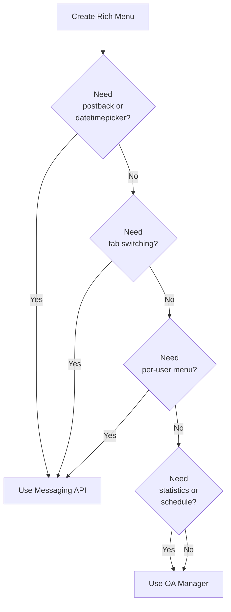
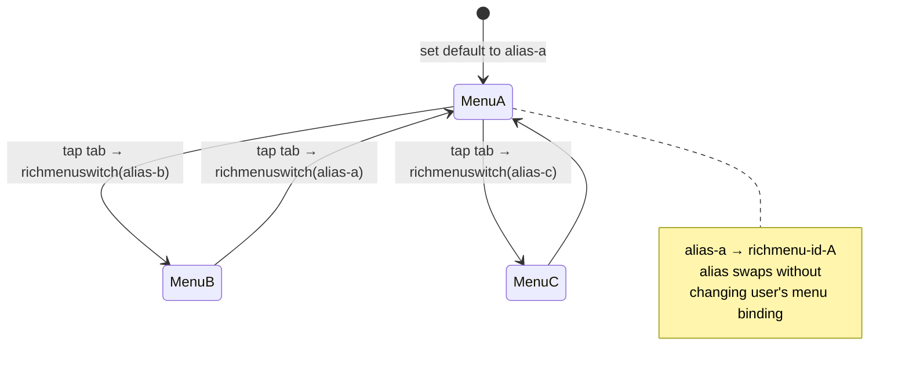

# LINE Rich Menus

## When to Activate

- Creating or managing Rich Menus
- Setting up Rich Menu tab switching
- Linking Rich Menu to specific users
- Rich Menu image preparation
- Code contains `richmenu`, `richMenuId`, or `richmenuswitch`

---

## Image Requirements

| Layout | Dimensions | Use Case |
|--------|-----------|----------|
| Full | 2500 x 1686 px | Standard 6-area (2x3 grid) |
| Half | 2500 x 843 px | Compact 3-area (1x3 grid) |
| Format | JPEG or PNG | Max 1MB |

---

## Creation Methods

| Method | Features | Limitations |
|--------|----------|-------------|
| LINE Official Account Manager | Display period, statistics, GUI | No postback/datetime picker, no tab switching |
| Messaging API | Postback, datetime picker, tab switching, per-user | No statistics, no display period |

---

## Display Priority (Highest → Lowest)

1. Per-user rich menu (Messaging API)
2. Default rich menu (Messaging API)
3. Default rich menu (LINE Official Account Manager)

## Timing of Changes

| Type | When Effective |
|------|---------------|
| Per-user (API) | Immediately |
| Default (API) | On user chat reopen (up to 1 min) |
| Default (Manager) | On user chat reopen |

---

## API Workflow (Step-by-Step)

### Step 1: Create Rich Menu

```
POST https://api.line.me/v2/bot/richmenu
```

```json
{
  "size": { "width": 2500, "height": 1686 },
  "selected": false,
  "name": "My Rich Menu",
  "chatBarText": "Menu",
  "areas": [
    {
      "bounds": { "x": 0, "y": 0, "width": 833, "height": 843 },
      "action": { "type": "uri", "uri": "https://example.com" }
    },
    {
      "bounds": { "x": 833, "y": 0, "width": 834, "height": 843 },
      "action": { "type": "postback", "label": "Menu B", "data": "tab=b" }
    },
    {
      "bounds": { "x": 1667, "y": 0, "width": 833, "height": 843 },
      "action": { "type": "message", "text": "Hello" }
    },
    {
      "bounds": { "x": 0, "y": 843, "width": 833, "height": 843 },
      "action": { "type": "uri", "uri": "https://example.com/page2" }
    },
    {
      "bounds": { "x": 833, "y": 843, "width": 834, "height": 843 },
      "action": { "type": "postback", "label": "Action", "data": "action=clicked" }
    },
    {
      "bounds": { "x": 1667, "y": 843, "width": 833, "height": 843 },
      "action": { "type": "uri", "uri": "tel:+66123456789" }
    }
  ]
}
```

Response: `{ "richMenuId": "richmenu-xxxxxxx" }`

### Step 2: Upload Image

```
POST https://api-data.line.me/v2/bot/richmenu/{richMenuId}/content
Content-Type: image/jpeg (or image/png)
```

Body: raw image binary

### Step 3: Set as Default

```
POST https://api.line.me/v2/bot/user/all/richmenu/{richMenuId}
```

### Step 4: Validate (Optional)

```
POST https://api.line.me/v2/bot/richmenu/validate
```

---

## Action Area Mapping

### Full Size (2500 x 1686) — 6 Equal Areas (2x3 Grid)

```
┌──────────┬──────────┬──────────┐
│  Area 1  │  Area 2  │  Area 3  │  y: 0-843
│  0,0     │  833,0   │  1667,0  │
│  833x843 │  834x843 │  833x843 │
├──────────┼──────────┼──────────┤
│  Area 4  │  Area 5  │  Area 6  │  y: 843-1686
│  0,843   │  833,843 │  1667,843│
│  833x843 │  834x843 │  833x843 │
└──────────┴──────────┴──────────┘
```

```json
[
  { "bounds": { "x": 0, "y": 0, "width": 833, "height": 843 } },
  { "bounds": { "x": 833, "y": 0, "width": 834, "height": 843 } },
  { "bounds": { "x": 1667, "y": 0, "width": 833, "height": 843 } },
  { "bounds": { "x": 0, "y": 843, "width": 833, "height": 843 } },
  { "bounds": { "x": 833, "y": 843, "width": 834, "height": 843 } },
  { "bounds": { "x": 1667, "y": 843, "width": 833, "height": 843 } }
]
```

### Half Size (2500 x 843) — 3 Equal Areas (1x3 Grid)

```
┌──────────┬──────────┬──────────┐
│  Area 1  │  Area 2  │  Area 3  │  y: 0-843
│  0,0     │  833,0   │  1667,0  │
│  833x843 │  834x843 │  833x843 │
└──────────┴──────────┴──────────┘
```

```json
[
  { "bounds": { "x": 0, "y": 0, "width": 833, "height": 843 } },
  { "bounds": { "x": 833, "y": 0, "width": 834, "height": 843 } },
  { "bounds": { "x": 1667, "y": 0, "width": 833, "height": 843 } }
]
```

---

## Tab Switching with Aliases (Step-by-Step)

### Step 1: Create Two Rich Menus

Create Menu A and Menu B with `createRichMenu` (see API Workflow above).

In each menu, include a `richmenuswitch` action in the tab area that switches to the other menu.

**Menu A — Tab area switches to Menu B:**
```json
{
  "bounds": { "x": 1667, "y": 0, "width": 833, "height": 843 },
  "action": {
    "type": "richmenuswitch",
    "richMenuAliasId": "richmenu-alias-b",
    "data": "tab=b"
  }
}
```

**Menu B — Tab area switches to Menu A:**
```json
{
  "bounds": { "x": 0, "y": 0, "width": 833, "height": 843 },
  "action": {
    "type": "richmenuswitch",
    "richMenuAliasId": "richmenu-alias-a",
    "data": "tab=a"
  }
}
```

### Step 2: Upload Images for Both Menus

Upload appropriate images to each rich menu (see Step 2 in API Workflow).

### Step 3: Create Aliases

```
POST https://api.line.me/v2/bot/richmenu/alias
```

```json
{ "richMenuAliasId": "richmenu-alias-a", "richMenuId": "richmenu-xxxxx-a" }
```

```json
{ "richMenuAliasId": "richmenu-alias-b", "richMenuId": "richmenu-xxxxx-b" }
```

### Step 4: Set Menu A as Default

```
POST https://api.line.me/v2/bot/user/all/richmenu/{richMenuId-A}
```

Now tapping the tab area in Menu A switches to Menu B and vice versa.

---

## Per-User Rich Menu

### Link Menu to Specific User (Immediate Effect)

```
POST https://api.line.me/v2/bot/user/{userId}/richmenu/{richMenuId}
```

### Unlink from User (Reverts to Default)

```
DELETE https://api.line.me/v2/bot/user/{userId}/richmenu
```

### Batch Operations

```
POST https://api.line.me/v2/bot/richmenu/bulk/link
```

```json
{
  "richMenuId": "richmenu-xxxxx",
  "userIds": ["U001", "U002", "U003"]
}
```

**Constraints:**
- Not available on LINE PC
- Can't link to users who only use LINE PC
- User must be friend of the LINE Official Account

---

## Rich Menu Endpoints

| Method | Endpoint | Description |
|--------|----------|-------------|
| POST | `/v2/bot/richmenu` | Create rich menu |
| POST | `/v2/bot/richmenu/validate` | Validate rich menu structure |
| GET | `/v2/bot/richmenu/list` | List all rich menus |
| GET | `/v2/bot/richmenu/{richMenuId}` | Get specific menu |
| DELETE | `/v2/bot/richmenu/{richMenuId}` | Delete menu |
| POST | `/v2/bot/richmenu/{richMenuId}/content` | Upload image (api-data.line.me) |
| GET | `/v2/bot/richmenu/{richMenuId}/content` | Download image (api-data.line.me) |
| POST | `/v2/bot/user/all/richmenu/{richMenuId}` | Set as default |
| GET | `/v2/bot/user/all/richmenu` | Get default menu ID |
| DELETE | `/v2/bot/user/all/richmenu` | Clear default menu |

### Per-User Rich Menu Endpoints

| Method | Endpoint | Description |
|--------|----------|-------------|
| POST | `/v2/bot/user/{userId}/richmenu/{richMenuId}` | Link to user |
| POST | `/v2/bot/richmenu/bulk/link` | Link to multiple users |
| GET | `/v2/bot/user/{userId}/richmenu` | Get user's menu ID |
| DELETE | `/v2/bot/user/{userId}/richmenu` | Unlink from user |
| POST | `/v2/bot/richmenu/bulk/unlink` | Unlink from multiple users |
| POST | `/v2/bot/richmenu/batch` | Batch link/unlink |
| GET | `/v2/bot/richmenu/batch/progress?requestId=` | Batch status |
| POST | `/v2/bot/richmenu/batch/validate` | Validate batch request |

### Rich Menu Alias Endpoints

| Method | Endpoint | Description |
|--------|----------|-------------|
| POST | `/v2/bot/richmenu/alias` | Create alias |
| PUT | `/v2/bot/richmenu/alias/{richMenuAliasId}` | Update alias |
| GET | `/v2/bot/richmenu/alias/{richMenuAliasId}` | Get alias info |
| DELETE | `/v2/bot/richmenu/alias/{richMenuAliasId}` | Delete alias |
| GET | `/v2/bot/richmenu/alias/list` | List all aliases |

---

## Decision Tree: Manager or API?



**Rule of thumb:** If your menu is static and you don't need dynamic actions → use OA Manager (faster, includes stats). Otherwise → API.

---

## Tab Switching State Machine



Why aliases matter: if you set user's menu to a raw `richMenuId`, switching requires calling the API for every user. With aliases, you just update the alias → richMenuId mapping, and all users instantly see the new menu.

---

## Production Recipes

### Recipe 1: Full Rich Menu Setup Script (with tab switching)

```typescript
import axios from 'axios'
import fs from 'fs/promises'

const LINE = axios.create({
  baseURL: 'https://api.line.me',
  headers: { Authorization: `Bearer ${process.env.LINE_CHANNEL_ACCESS_TOKEN}` }
})
const LINE_DATA = axios.create({
  baseURL: 'https://api-data.line.me',
  headers: { Authorization: `Bearer ${process.env.LINE_CHANNEL_ACCESS_TOKEN}` }
})

async function createMenuWithImage(menuSpec: any, imagePath: string) {
  const { data } = await LINE.post('/v2/bot/richmenu', menuSpec)
  const richMenuId = data.richMenuId

  const image = await fs.readFile(imagePath)
  const mime = imagePath.endsWith('.png') ? 'image/png' : 'image/jpeg'
  await LINE_DATA.post(
    `/v2/bot/richmenu/${richMenuId}/content`,
    image,
    { headers: { 'Content-Type': mime } }
  )

  return richMenuId
}

async function upsertAlias(aliasId: string, richMenuId: string) {
  try {
    await LINE.post('/v2/bot/richmenu/alias', { richMenuAliasId: aliasId, richMenuId })
  } catch (err: any) {
    if (err.response?.status === 400) {
      // alias already exists — update it
      await LINE.post(`/v2/bot/richmenu/alias/${aliasId}`, { richMenuId })
    } else {
      throw err
    }
  }
}

async function setupTabSwitchingMenus() {
  const menuAId = await createMenuWithImage(menuASpec, './menu-a.png')
  const menuBId = await createMenuWithImage(menuBSpec, './menu-b.png')

  await upsertAlias('richmenu-alias-a', menuAId)
  await upsertAlias('richmenu-alias-b', menuBId)

  // Set Menu A as default
  await LINE.post(`/v2/bot/user/all/richmenu/${menuAId}`)
  console.log('Done. Menu A is default, tab switches to Menu B.')
}
```

### Recipe 2: Area Overlap Validator

Rich Menu areas MUST NOT overlap. LINE validates on create, but catches it early:

```typescript
interface Area { bounds: { x: number; y: number; width: number; height: number } }

function detectOverlaps(areas: Area[]): string[] {
  const issues: string[] = []
  for (let i = 0; i < areas.length; i++) {
    for (let j = i + 1; j < areas.length; j++) {
      const a = areas[i].bounds, b = areas[j].bounds
      const overlaps =
        a.x < b.x + b.width &&
        a.x + a.width > b.x &&
        a.y < b.y + b.height &&
        a.y + a.height > b.y
      if (overlaps) issues.push(`Area ${i} overlaps Area ${j}`)
    }
  }
  return issues
}
```

### Recipe 3: Staged Per-User Rollout

Roll out a new menu to 10% of users first, then 100%.

```typescript
async function stagedRollout(newRichMenuId: string, userIds: string[], percent: number) {
  const sampleSize = Math.ceil(userIds.length * percent / 100)
  const sample = userIds.slice().sort(() => Math.random() - 0.5).slice(0, sampleSize)

  // Batch link supports up to 500 userIds per call
  const CHUNK = 500
  for (let i = 0; i < sample.length; i += CHUNK) {
    await LINE.post('/v2/bot/richmenu/bulk/link', {
      richMenuId: newRichMenuId,
      userIds: sample.slice(i, i + CHUNK)
    })
  }
  console.log(`Rolled out to ${sample.length}/${userIds.length} users (${percent}%)`)
}
```

### Recipe 4: Rollback — Replace All Per-User Menus

If a deployed menu has a bug, fast rollback:

```typescript
async function rollbackAllPerUserMenus(safeRichMenuId: string) {
  // Step 1: reset default menu
  await LINE.post(`/v2/bot/user/all/richmenu/${safeRichMenuId}`)

  // Step 2: clear all per-user links by overwriting the alias
  await upsertAlias('richmenu-alias-a', safeRichMenuId)

  // Step 3: delete broken menu so no one can get relinked accidentally
  // await LINE.delete(`/v2/bot/richmenu/${brokenId}`)
}
```

---

## Gotchas

- **Areas can't overlap** — use `detectOverlaps()` before POST
- **Image must be ≤ 1MB** — compress with mozjpeg or pngquant if bigger
- **PC/Web users don't see rich menu** — always have text fallback
- **Default menu takes up to 1 minute** to show after change (user must reopen chat)
- **Per-user menu is immediate** but requires user to be a friend
- **Max 1000 rich menus per channel** — delete unused ones
- **Alias name collision**: API returns 400 if alias exists; use `upsertAlias()` pattern above
