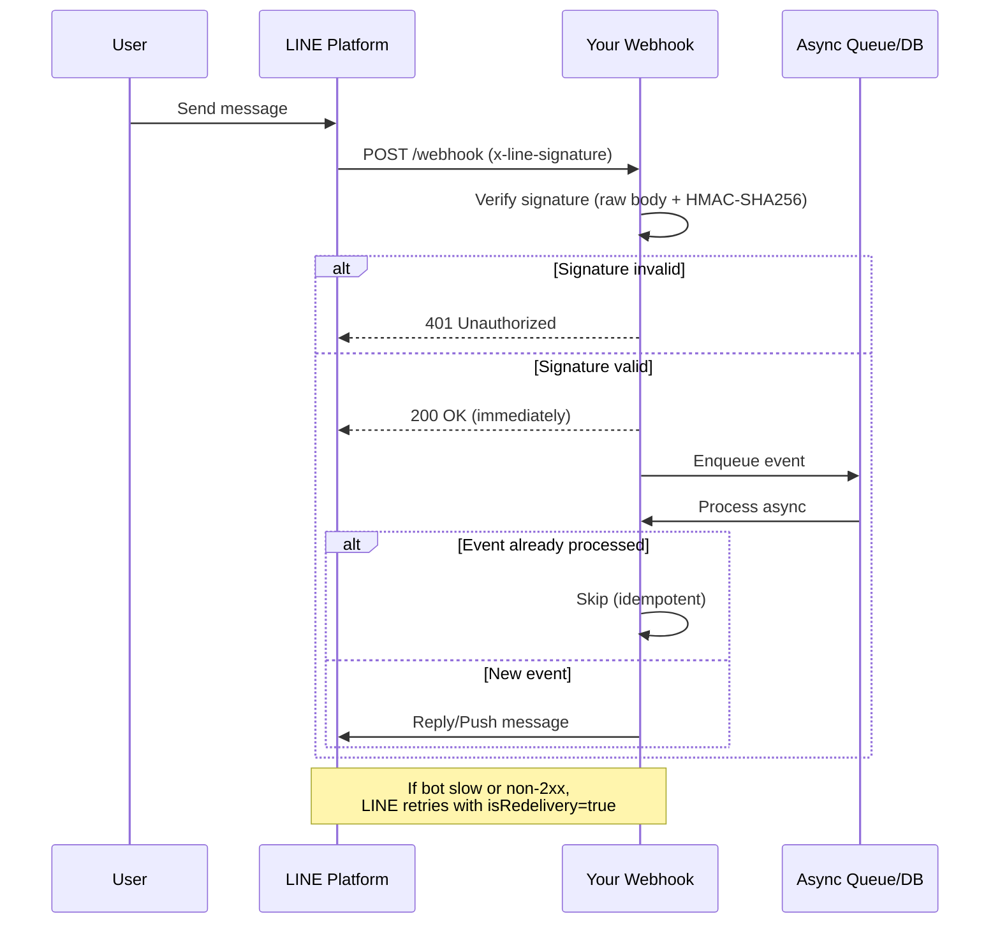
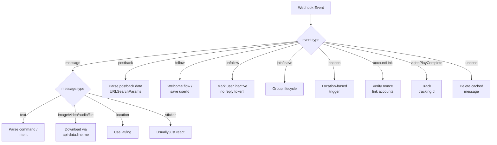

# LINE Webhook System

## When to Activate

- Handling LINE webhook events
- Implementing signature verification
- Processing message/follow/postback events
- Setting up webhook endpoint
- Handling redelivery and idempotency
- Retrieving message content (images, videos, files)

---

## Request Structure

```json
{
  "destination": "U0123456789abcdef0123456789abcdef",
  "events": [
    {
      "type": "message",
      "timestamp": 1625000000000,
      "source": {
        "type": "user",
        "userId": "U0123..."
      },
      "replyToken": "abc123...",
      "message": {
        "type": "text",
        "id": "12345",
        "text": "Hello"
      },
      "webhookEventId": "unique-event-id",
      "deliveryContext": {
        "isRedelivery": false
      }
    }
  ]
}
```

### Source Types

| Type | Fields | Context |
|------|--------|---------|
| `user` | `userId` | 1-on-1 chat |
| `group` | `userId`, `groupId` | Group chat |
| `room` | `userId`, `roomId` | Multi-person chat |

---

## Event Types

| Event | Reply Token | Description |
|-------|-------------|-------------|
| `message` | Yes | User sends text, image, video, audio, file, location, sticker |
| `follow` | Yes | User adds account or unblocks (1-on-1 only) |
| `unfollow` | No | User blocks account (1-on-1 only) |
| `join` | Yes | Account joins group/multi-person chat |
| `leave` | No | Account removed from group/chat |
| `memberJoin` | Yes | User joins group where account is member |
| `memberLeave` | No | User leaves group where account is member |
| `postback` | Yes | User triggers postback action |
| `videoPlayComplete` | Yes | User finishes video with trackingId (1-on-1 only) |
| `beacon` | Yes | User enters beacon range |
| `accountLink` | Yes | User links account |
| `unsend` | No | User unsends a message |

---

## Message Event Types

### Text Message

```json
{
  "type": "message",
  "message": {
    "type": "text",
    "id": "12345",
    "text": "Hello!",
    "quoteToken": "quote-token-xxx",
    "quotedMessageId": "11111",
    "mention": {
      "mentionees": [
        { "index": 0, "length": 5, "userId": "U001", "type": "user", "isSelf": false }
      ]
    }
  }
}
```

### Image Message

```json
{
  "type": "message",
  "message": {
    "type": "image",
    "id": "12345",
    "contentProvider": {
      "type": "line"
    },
    "imageSet": {
      "id": "set-id",
      "index": 1,
      "total": 3
    }
  }
}
```

### Video / Audio Message

```json
{
  "type": "message",
  "message": {
    "type": "video",
    "id": "12345",
    "duration": 60000,
    "contentProvider": { "type": "line" }
  }
}
```

### File Message

```json
{
  "type": "message",
  "message": {
    "type": "file",
    "id": "12345",
    "fileName": "document.pdf",
    "fileSize": 1024000
  }
}
```

### Location Message

```json
{
  "type": "message",
  "message": {
    "type": "location",
    "id": "12345",
    "title": "My Location",
    "address": "Bangkok, Thailand",
    "latitude": 13.7563,
    "longitude": 100.5018
  }
}
```

### Sticker Message

```json
{
  "type": "message",
  "message": {
    "type": "sticker",
    "id": "12345",
    "packageId": "446",
    "stickerId": "1988",
    "stickerResourceType": "STATIC",
    "keywords": ["happy", "smile"]
  }
}
```

---

## Postback Event

```json
{
  "type": "postback",
  "replyToken": "abc123...",
  "postback": {
    "data": "action=buy&itemId=123",
    "params": {
      "date": "2025-03-15",
      "time": "14:00",
      "datetime": "2025-03-15T14:00"
    }
  }
}
```

- `params` is included when using `datetimepicker` action
- `data` field: your custom string (max 300 chars)

---

## Follow / Unfollow Events

```json
{
  "type": "follow",
  "replyToken": "abc123...",
  "source": { "type": "user", "userId": "U001" }
}
```

```json
{
  "type": "unfollow",
  "source": { "type": "user", "userId": "U001" }
}
```

- `follow` fires when user adds friend OR unblocks
- `unfollow` fires when user blocks — no reply token

---

## Group Events

### Join Event
```json
{
  "type": "join",
  "replyToken": "abc123...",
  "source": { "type": "group", "groupId": "C001" }
}
```

### Member Join Event
```json
{
  "type": "memberJoin",
  "replyToken": "abc123...",
  "source": { "type": "group", "groupId": "C001" },
  "joined": {
    "members": [
      { "type": "user", "userId": "U001" },
      { "type": "user", "userId": "U002" }
    ]
  }
}
```

---

## Beacon Event

```json
{
  "type": "beacon",
  "replyToken": "abc123...",
  "beacon": {
    "hwid": "d41d8cd98f",
    "type": "enter",
    "dm": "optional-device-message"
  }
}
```

`beacon.type`: `enter` | `leave` | `banner`

---

## Account Link Event

```json
{
  "type": "accountLink",
  "replyToken": "abc123...",
  "link": {
    "result": "ok",
    "nonce": "nonce-from-link-token"
  }
}
```

`link.result`: `ok` | `failed`

---

## Signature Verification

```typescript
import crypto from 'crypto'

function verifySignature(rawBody: string, signature: string, channelSecret: string): boolean {
  // MUST use raw request body string — not parsed/formatted
  // MUST use UTF-8 encoding
  const hash = crypto
    .createHmac('SHA256', channelSecret)
    .update(rawBody, 'utf8')
    .digest('base64')
  return hash === signature
}
```

**Critical rules:**
- Use raw body string BEFORE any parsing/deserialization
- UTF-8 encoding is required
- Don't interpret escape characters before verification
- Header name `x-line-signature` is case-insensitive

### Express.js Example

```typescript
import express from 'express'

const app = express()

// IMPORTANT: Must capture raw body before JSON parsing
app.use(express.json({
  verify: (req, _res, buf) => {
    (req as any).rawBody = buf.toString('utf8')
  }
}))

app.post('/webhook', (req, res) => {
  const signature = req.headers['x-line-signature'] as string
  const rawBody = (req as any).rawBody

  if (!verifySignature(rawBody, signature, CHANNEL_SECRET)) {
    return res.status(401).send('Invalid signature')
  }

  // Return 200 immediately
  res.status(200).send('OK')

  // Process events asynchronously
  const events = req.body.events
  processEvents(events).catch(console.error)
})
```

---

## Webhook Redelivery

- Disabled by default — enable in LINE Developers Console
- Redelivered when server didn't return 2xx status
- Same `webhookEventId` and `replyToken` as original
- `deliveryContext.isRedelivery` = `true`
- Event order may differ — check `timestamp` field

### Idempotency Pattern

```typescript
const processedEvents = new Set<string>()  // Use Redis/DB in production

async function handleEvent(event: WebhookEvent) {
  // Skip already-processed events
  if (processedEvents.has(event.webhookEventId)) {
    console.log(`Skipping duplicate event: ${event.webhookEventId}`)
    return
  }

  processedEvents.add(event.webhookEventId)

  // Process event...
}
```

---

## Content Retrieval

### Get Message Content (Images, Video, Audio, Files)

```
GET https://api-data.line.me/v2/bot/message/{messageId}/content
```

### Get Preview / Thumbnail

```
GET https://api-data.line.me/v2/bot/message/{messageId}/content/preview
```

### Check Transcoding Status (Video/Audio)

```
GET https://api-data.line.me/v2/bot/message/{messageId}/content/transcoding
```

Response:
```json
{ "status": "processing" }
```
or
```json
{ "status": "succeeded" }
```

Wait for `succeeded` before retrieving content.

---

## Webhook Endpoints

| Method | Endpoint | Description |
|--------|----------|-------------|
| PUT | `/v2/bot/channel/webhook/endpoint` | Set webhook URL |
| GET | `/v2/bot/channel/webhook/endpoint` | Get current webhook URL |
| POST | `/v2/bot/channel/webhook/test` | Test webhook connectivity |

### Webhook URL Verification

```
POST https://api.line.me/v2/bot/channel/webhook/test
```
- Rate limit: 60 req/hour
- Bot server must return 200 for empty events array

---

## Best Practices

1. **Return 200 immediately** — process events asynchronously. LINE retries if response is slow.
2. **Use webhookEventId for idempotency** — don't process the same event twice.
3. **Check isRedelivery** — log but don't skip blindly (original processing may have failed).
4. **Reply token expires in 1 minute** — reply fast or use push message instead.
5. **Reply token is single-use** — can't reply twice to the same event.
6. **Always verify signatures** — never trust unverified webhook requests.
7. **Handle all event types** — return 200 even for events you don't process.

---

## Webhook Lifecycle Flow



---

## Production Recipes

### Recipe 1: Full Production-Ready Webhook (Firebase Cloud Function)

Copy-paste baseline with signature verify, immediate 200, async processing, and Firestore idempotency.

```typescript
import { onRequest } from 'firebase-functions/v2/https'
import { defineSecret } from 'firebase-functions/params'
import { getFirestore } from 'firebase-admin/firestore'
import { initializeApp } from 'firebase-admin/app'
import crypto from 'crypto'

initializeApp()
const channelSecret = defineSecret('LINE_CHANNEL_SECRET')
const channelAccessToken = defineSecret('LINE_CHANNEL_ACCESS_TOKEN')

export const webhook = onRequest(
  { secrets: [channelSecret, channelAccessToken] },
  async (req, res) => {
    // 1) Verify signature
    const signature = req.header('x-line-signature') ?? ''
    const rawBody = req.rawBody.toString('utf8')  // Firebase provides rawBody
    const expected = crypto
      .createHmac('SHA256', channelSecret.value())
      .update(rawBody, 'utf8')
      .digest('base64')

    if (expected !== signature) {
      console.error('Invalid signature')
      res.status(401).send('Invalid signature')
      return
    }

    // 2) Return 200 immediately
    res.status(200).send('OK')

    // 3) Process events async
    const events = req.body.events ?? []
    await Promise.allSettled(events.map(handleEvent))
  }
)

async function handleEvent(event: any) {
  const db = getFirestore()

  // Idempotency guard via Firestore transaction
  const ref = db.collection('processed_events').doc(event.webhookEventId)
  const shouldProcess = await db.runTransaction(async (tx) => {
    const snap = await tx.get(ref)
    if (snap.exists) return false  // already processed
    tx.set(ref, { processedAt: Date.now(), type: event.type })
    return true
  })

  if (!shouldProcess) {
    console.log(`Skipping duplicate: ${event.webhookEventId}`)
    return
  }

  try {
    switch (event.type) {
      case 'message': return await handleMessage(event)
      case 'follow':  return await handleFollow(event)
      case 'postback': return await handlePostback(event)
      default:        return  // ignore others — still returned 200
    }
  } catch (err) {
    // Roll back idempotency marker so redelivery can retry
    await ref.delete()
    throw err
  }
}
```

### Recipe 2: Signature Verification Debug Checklist

When signature fails, run through this in order:

```typescript
function debugSignature(rawBody: string, header: string, secret: string) {
  console.log('--- Signature Debug ---')
  console.log('Secret length:', secret.length, '(should be 32 chars)')
  console.log('Header value:', header)
  console.log('Raw body length:', rawBody.length)
  console.log('Raw body first 100:', rawBody.slice(0, 100))
  console.log('Raw body is string?', typeof rawBody === 'string')

  const expected = crypto
    .createHmac('SHA256', secret)
    .update(rawBody, 'utf8')
    .digest('base64')
  console.log('Expected:', expected)
  console.log('Match?', expected === header)

  // Common fixes:
  // - Using req.body (parsed) instead of rawBody
  // - Framework silently re-serialized the body
  // - Body has BOM or trimmed whitespace
  // - Wrong channel (dev vs prod secret mismatch)
}
```

### Recipe 3: Reply Token Safety Wrapper

Reply tokens expire in 1 minute and single-use. Don't let slow code waste them.

```typescript
async function safeReply(
  replyToken: string,
  messages: any[],
  receivedAt: number
) {
  const age = Date.now() - receivedAt
  if (age > 55_000) {
    console.warn(`Reply token too old (${age}ms), falling back to push`)
    return pushMessageFallback(messages)
  }

  try {
    await axios.post(
      'https://api.line.me/v2/bot/message/reply',
      { replyToken, messages },
      { headers: { Authorization: `Bearer ${token}` }, timeout: 5000 }
    )
  } catch (err: any) {
    if (err.response?.data?.message === 'Invalid reply token') {
      return pushMessageFallback(messages)
    }
    throw err
  }
}
```

### Recipe 4: Content Download (Images/Video from User)

```typescript
async function downloadMessageContent(messageId: string): Promise<Buffer> {
  // First, check transcoding status for video/audio
  const statusRes = await axios.get(
    `https://api-data.line.me/v2/bot/message/${messageId}/content/transcoding`,
    { headers: { Authorization: `Bearer ${token}` } }
  ).catch(() => ({ data: { status: 'succeeded' } }))  // images don't need transcoding

  if (statusRes.data.status !== 'succeeded') {
    throw new Error('Content still transcoding — retry later')
  }

  // Fetch the actual content
  const { data } = await axios.get(
    `https://api-data.line.me/v2/bot/message/${messageId}/content`,
    {
      headers: { Authorization: `Bearer ${token}` },
      responseType: 'arraybuffer'
    }
  )
  return Buffer.from(data)
}
```

---

## Event Type Decision Tree


