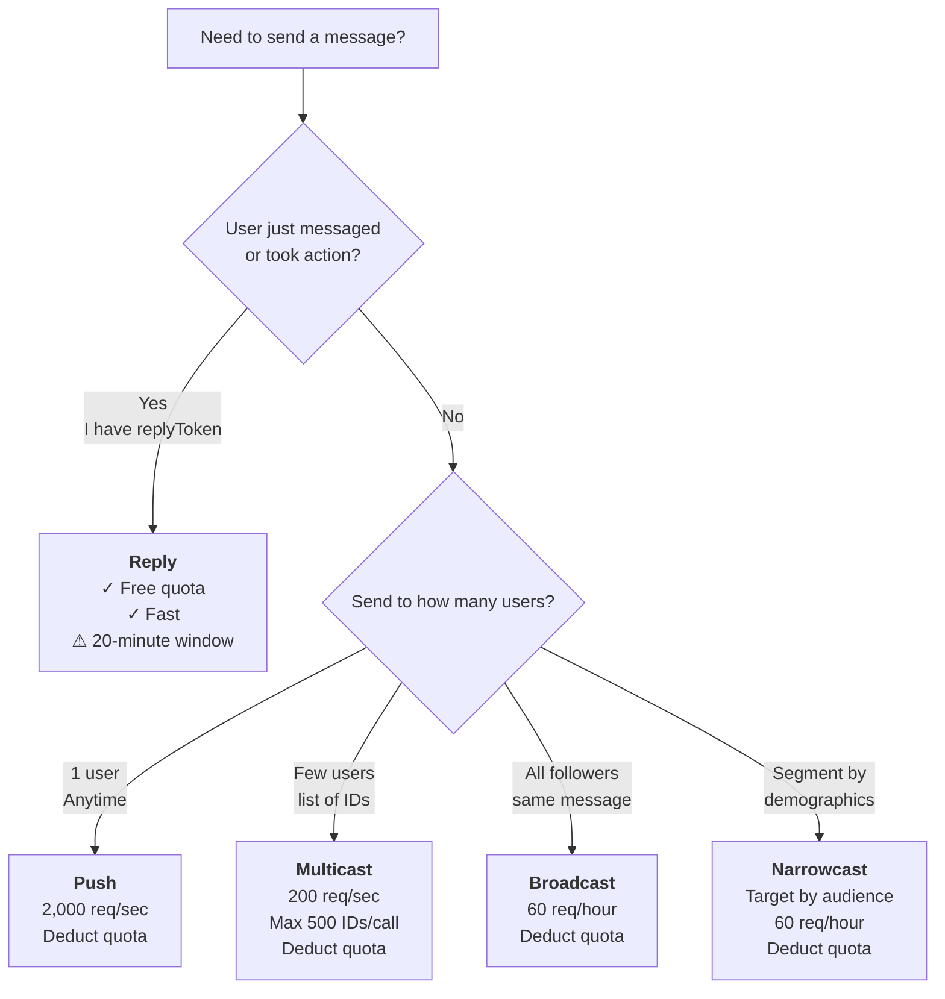

# LINE Messaging — Methods, Message Types & Production Patterns

## When to Activate

- Sending messages to users via LINE Messaging API
- Choosing between reply/push/multicast/broadcast/narrowcast
- Building and validating message payloads
- Managing quota and delivery statistics
- Implementing production patterns (Firebase Cloud Functions, batching, retry logic)
- Handling quick reply, templates, and rich content

---

## Quick Decision: Which Messaging Method?



**Rule of thumb:** Always prefer **Reply** when you have `replyToken` (free + instant). Otherwise check user count and audience segmentation needs.

---

## Messaging Methods — Reference

### Reply Message (FREE — Use First!)

```
POST https://api.line.me/v2/bot/message/reply
```

```json
{
  "replyToken": "nHuyWiB7yP5Zw52FIkcQT",
  "messages": [
    {
      "type": "text",
      "text": "Hello, this is a reply!"
    }
  ]
}
```

**Key Points:**
- ✅ **Zero quota cost** — never deduct from daily limit
- ⚠️ Only works within **20 minutes** of receiving the event
- 🔐 `replyToken` — single-use, from webhook event
- 📊 Rate limit: 2,000 req/sec per channel
- 📝 Max 5 messages per call

**Production Pattern (Node.js):**
```typescript
import * as line from '@line/bot-sdk';

const lineClient = new line.Client({
  channelAccessToken: process.env.LINE_CHANNEL_ACCESS_TOKEN!
});

async function replyMessage(replyToken: string, text: string) {
  try {
    await lineClient.replyMessage(replyToken, { type: 'text', text });
  } catch (error) {
    console.error('Reply failed:', error);
    throw error;
  }
}
```

**When to Use:**
- User sends a message → reply immediately
- User taps a button → acknowledge with reply
- User provides input → confirm with reply

---

### Push Message (Send to 1 User Anytime)

```
POST https://api.line.me/v2/bot/message/push
```

```json
{
  "to": "U206d25c2ea6bd87c17655609a1c37cb8",
  "messages": [
    {
      "type": "text",
      "text": "This is a push message"
    }
  ],
  "notificationDisabled": false
}
```

**Key Points:**
- 💰 **Deducts quota** (1 message = 1 quota point)
- 🕐 Works anytime (no time window)
- 👤 One user per request
- 📊 Rate limit: 2,000 req/sec per channel
- 🔔 `notificationDisabled: true` → silent push (no phone notification)
- 📝 Max 5 messages per call
- 🔑 Requires `userId` (from webhook event or stored)

**Production Pattern (Node.js — push to stored user IDs):**
```typescript
async function sendDailyReminder(subscribedUserIds: string[]) {
  const promises = subscribedUserIds.map(userId =>
    lineClient.pushMessage(userId, {
      type: 'text',
      text: 'Good morning! Reminder for today...'
    }).catch(err => console.error(`Push to ${userId} failed:`, err))
  );
  await Promise.allSettled(promises);
}
```

**When to Use:**
- Send notification at scheduled time
- Customer received order confirmation (send tracking update later)
- Personalized message to single user

---

### Multicast (Multiple Users, Same Message)

```
POST https://api.line.me/v2/bot/message/multicast
```

```json
{
  "to": [
    "U206d25c2ea6bd87c17655609a1c37cb8",
    "U4af4980629..."
  ],
  "messages": [
    {
      "type": "text",
      "text": "Hello everyone!"
    }
  ]
}
```

**Key Points:**
- 💰 **Deducts quota per recipient** (2 users = 2 quota points)
- 🔢 Max **500 user IDs** per call
- 📊 Rate limit: 200 req/sec per channel
- ✅ Batch multiple users efficiently
- 📝 Max 5 messages per call

**Production Pattern (Batching for Large User Sets):**
```typescript
async function sendToUserList(userIds: string[], message: line.Message) {
  const batchSize = 500;
  let sent = 0;
  for (let i = 0; i < userIds.length; i += batchSize) {
    const batch = userIds.slice(i, i + batchSize);
    await lineClient.multicastMessage(batch, message);
    sent += batch.length;
    await new Promise(resolve => setTimeout(resolve, 1000)); // avoid rate limit
  }
  return sent;
}
```

**When to Use:**
- VIP promotion to segment of users
- Event notification to group (not all followers)
- A/B test message to two groups

---

### Broadcast (All Followers, Same Message)

```
POST https://api.line.me/v2/bot/message/broadcast
```

```json
{
  "messages": [
    {
      "type": "text",
      "text": "Black Friday Sale — 50% off everything!"
    }
  ]
}
```

**Key Points:**
- 💰 **Deducts quota per recipient** (broadcast to 10K = 10K quota)
- ⚠️ **Extremely low rate limit: 60 requests/hour**
- 📝 No 'to' field — goes to all followers
- 📝 Max 5 messages per call
- ⏱️ Execution is async — use progress endpoint to check status

**Gotcha: Don't Loop Broadcast Calls!**
```typescript
// ❌ WRONG — This will hit 429 in milliseconds
for (let i = 0; i < 10; i++) {
  await lineClient.broadcastMessage({ type: 'text', text: 'Message ' + i });
}

// ✅ RIGHT — Batch all messages into ONE call
await lineClient.broadcastMessage([
  { type: 'text', text: 'Message 1' },
  { type: 'text', text: 'Message 2' },
  { type: 'text', text: 'Message 3' }
]);
```

**Production Pattern:**
```typescript
async function launchCampaign(messages: line.Message[]) {
  try {
    const result = await lineClient.broadcastMessage(messages);
    return { success: true };
  } catch (error: any) {
    if (error.statusCode === 429) {
      throw new Error('Broadcast rate limit exceeded. Try again after 1 minute.');
    }
    throw error;
  }
}
```

**When to Use:**
- Company-wide announcement (store opening, outage)
- Marketing campaign "Black Friday Sale" (all users)
- Emergency alert to all followers

---

### Narrowcast (Audience Targeting)

```
POST https://api.line.me/v2/bot/message/narrowcast
```

```json
{
  "messages": [
    {
      "type": "text",
      "text": "This is a narrowcast to a specific audience"
    }
  ],
  "recipient": {
    "type": "audience",
    "audienceGroupId": 12345
  }
}
```

**Key Points:**
- 💰 **Deducts quota per recipient in audience**
- 📊 Rate limit: 60 requests/hour
- 🎯 Target by: audience ID, demographic, or user list
- ⏱️ Async execution — returns `requestId`

**Recipient Types:**
```json
// Type 1: Audience Group
{ "type": "audience", "audienceGroupId": 12345 }

// Type 2: Demographic
{
  "type": "demographic",
  "demographic": {
    "gender": "male",
    "ageGte": 20,
    "ageLte": 30,
    "appType": "ios",
    "areaCode": "TH"
  }
}

// Type 3: List of User IDs (max 1000)
{
  "type": "list",
  "userIds": ["U001", "U002", "U003"]
}
```

**When to Use:**
- Send discount to users in Bangkok only
- Promotion to female users age 25–35
- Reactivation campaign to inactive users (via audience)

**See also:** Workshop 05-11 for complete narrowcast + audience management patterns.

---

## Message Types

### Text Message

```json
{
  "type": "text",
  "text": "Hello, World!",
  "quoteToken": "optional",
  "mention": { }
}
```

**Text Message v2 (with Mention):**
```json
{
  "type": "text",
  "text": "Hi {name}, check this out!",
  "textV2": {
    "type": "text",
    "text": "Hi ",
    "emojis": [
      {
        "index": 0,
        "length": 2,
        "productId": "5ac1bfd5040ab15980c9b435",
        "emoticonId": "001"
      }
    ]
  }
}
```

### Sticker Message

```json
{
  "type": "sticker",
  "packageId": "1",
  "stickerId": "1"
}
```

Find sticker IDs at [LINE Sticker Shop](https://store.line.me/stickershop/home)

### Image Message

```json
{
  "type": "image",
  "originalContentUrl": "https://example.com/image.jpg",
  "previewImageUrl": "https://example.com/image-240.jpg"
}
```

**Requirements:**
- Both URLs must be **HTTPS TLS 1.2+**
- `originalContentUrl`: max 10MB, JPEG/PNG
- `previewImageUrl`: max 1MB, JPEG/PNG
- Recommended preview size: 240×240px

### Video Message

```json
{
  "type": "video",
  "originalContentUrl": "https://example.com/video.mp4",
  "previewImageUrl": "https://example.com/thumbnail.jpg"
}
```

### Audio Message

```json
{
  "type": "audio",
  "originalContentUrl": "https://example.com/audio.m4a",
  "duration": 60000
}
```

- `duration` in **milliseconds**
- Format: M4A recommended (MP3 supported but larger file size)

### Location Message

```json
{
  "type": "location",
  "title": "My favorite restaurant",
  "address": "Shibuya, Tokyo",
  "latitude": 35.6595,
  "longitude": 139.7004
}
```

### Quick Reply

```json
{
  "type": "text",
  "text": "Which size?",
  "quickReply": {
    "items": [
      {
        "type": "action",
        "action": {
          "type": "postback",
          "label": "Small",
          "data": "action=buy&itemid=123&size=S",
          "inputOption": "closeRichMenu"
        }
      },
      {
        "type": "action",
        "action": {
          "type": "message",
          "label": "Large",
          "text": "I want large"
        }
      }
    ]
  }
}
```

**Key Points:**
- Max **13 buttons** per message
- iOS/Android only (not PC)
- Buttons disappear when tapped OR new message arrives
- `inputOption`: `openRichMenu` / `closeRichMenu` / `openKeyboard` / `closeKeyboard` / `openVoice` / `closeVoice`

### Template Message (4 Types)

**Button Template:**
```json
{
  "type": "template",
  "altText": "Choose action",
  "template": {
    "type": "buttons",
    "title": "What would you like?",
    "text": "Tap a button",
    "actions": [
      { "type": "message", "label": "Say hello", "text": "Hello!" },
      { "type": "uri", "label": "Visit site", "uri": "https://example.com" }
    ]
  }
}
```

**Confirm Template:**
```json
{
  "type": "template",
  "template": {
    "type": "confirm",
    "text": "Delete this item?",
    "actions": [
      { "type": "message", "label": "Yes", "text": "yes" },
      { "type": "message", "label": "No", "text": "no" }
    ]
  }
}
```

**Carousel Template:**
```json
{
  "type": "template",
  "template": {
    "type": "carousel",
    "columns": [
      {
        "title": "Product A",
        "text": "$10",
        "actions": [
          { "type": "uri", "label": "Buy", "uri": "https://example.com/productA" }
        ]
      },
      {
        "title": "Product B",
        "text": "$15",
        "actions": [
          { "type": "uri", "label": "Buy", "uri": "https://example.com/productB" }
        ]
      }
    ]
  }
}
```

### Flex Message

See `line-flex-message.md` for complete Flex Message patterns (Bubble, Carousel, layouts, components).

---

## Message Validation (Before Sending)

Validate message structure without sending:

```
POST https://api.line.me/v2/bot/message/validate/{method}
```

Replace `{method}` with: `push`, `reply`, `multicast`, `broadcast`, `narrowcast`

```bash
curl -X POST https://api.line.me/v2/bot/message/validate/push \
  -H 'Content-Type: application/json' \
  -H 'Authorization: Bearer {channel_access_token}' \
  -d '{
    "to": "U206d25c2ea6bd87c17655609a1c37cb8",
    "messages": [{ "type": "text", "text": "Hello" }]
  }'
```

Response: `200` if valid, `400` with details if invalid.

---

## Quota & Delivery Statistics

### Check Quota

```
GET https://api.line.me/v2/bot/message/quota
Authorization: Bearer {channel_access_token}
```

Response:
```json
{
  "value": 10000,
  "estimatedLimit": 1000000
}
```

### Check Quota Consumption

```
GET https://api.line.me/v2/bot/message/quota/consumption
Authorization: Bearer {channel_access_token}
```

Response:
```json
{
  "totalUsage": 5000
}
```

### Check Delivery Status

```
GET https://api.line.me/v2/bot/message/delivery/{type}?date={YYYYMMDD}
```

Types: `reply`, `push`, `multicast`, `broadcast`

```json
{
  "overview": {
    "requestId": "request-001",
    "timestamp": 1625000000000,
    "success": 100
  }
}
```

---

## Production Checklist

- [ ] Use **Reply** when you have `replyToken` (free!)
- [ ] Batch users into **Multicast** (max 500 per call, not 500 separate Push calls)
- [ ] **Never loop Broadcast** — all messages in one call
- [ ] Check **quota** before sending to avoid failed requests
- [ ] Add **retry logic** with exponential backoff for 500+ errors
- [ ] Log `X-Line-Request-Id` header for debugging failed requests
- [ ] Store `userId` in Firestore after first webhook event (for Push later)
- [ ] Use **Firebase scheduled tasks** for daily/recurring messages
- [ ] Implement **idempotency** — store sent message ID to avoid duplicates
- [ ] Monitor **delivery statistics** to track success rate

---

## Common Errors

| Error | Cause | Fix |
|-------|-------|-----|
| **400 Bad Request** | Invalid message format | Validate with `/v2/bot/message/validate/{method}` first |
| **401 Unauthorized** | Missing/expired token | Check `LINE_CHANNEL_ACCESS_TOKEN` env var |
| **404 Not Found** | User blocked or not friend | Handle gracefully, mark user as blocked |
| **429 Too Many Requests** | Rate limit exceeded | Implement exponential backoff, check rate limits table |
| **500 Internal Server Error** | LINE server error | Retry with exponential backoff; log `X-Line-Request-Id` |

---

## See Also

- `line-webhook.md` — Handle webhook events
- `line-flex-message.md` — Build rich card messages
- `line-rich-menu.md` — Create persistent menu
- `line-api-common.md` — Token management, rate limits, error codes
- Workshop 05-10 (Thai) — Decision flowcharts & Firebase examples
- [LINE Messaging API Official Docs](https://developers.line.biz/en/reference/messaging-api/)
