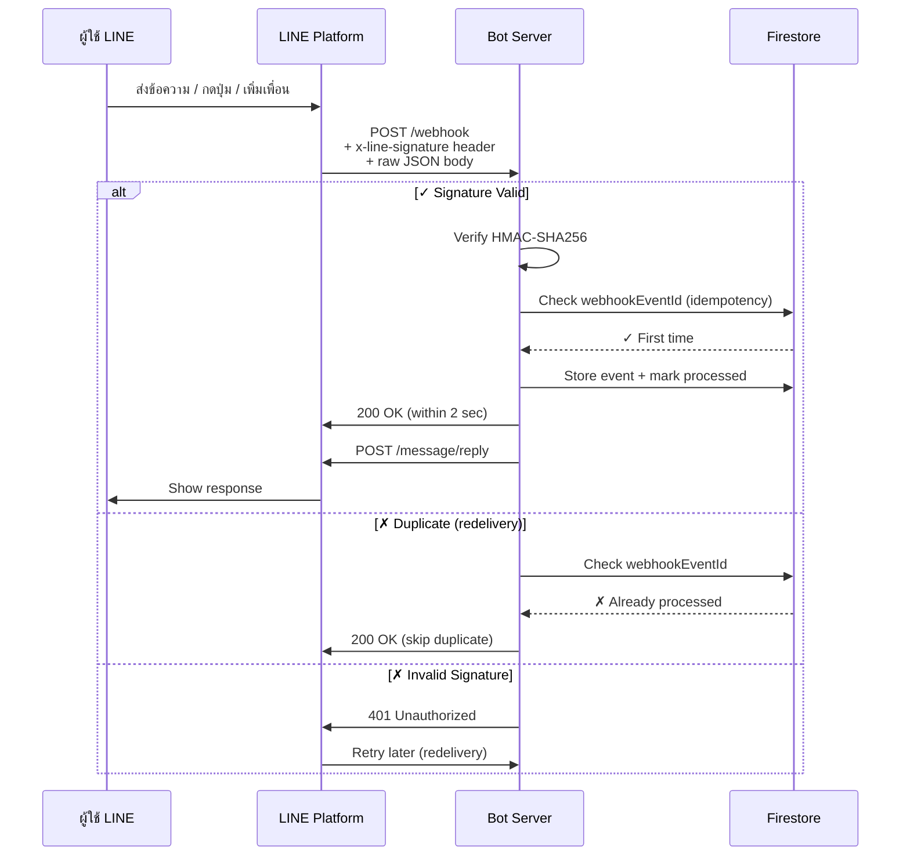

# LINE Webhook — Receiving & Processing Events

## When to Activate

- Setting up LINE webhook endpoint
- Implementing HMAC-SHA256 signature verification
- Processing webhook events (message, follow, postback, join, etc.)
- Handling redelivery and idempotency
- Retrieving message content (images, videos, files)
- Building Firebase webhook handler with Firestore deduplication

---

## Webhook Lifecycle



---

## Critical: Signature Verification (HMAC-SHA256)

### Why It Matters

Without signature verification, attackers can:
- Fake webhook requests (pretend to be LINE Platform)
- Trigger fake promotions, send messages to wrong users
- Manipulate order data, steal user info

**Only you and LINE Platform have the Channel Secret.** Only you two can create valid signatures.

### Verification Flow

```
1. LINE calculates: HMAC-SHA256(raw_body, channelSecret) → sign in Base64
2. LINE sends: POST /webhook with header x-line-signature
3. Your bot receives: raw body + x-line-signature
4. Your bot calculates: HMAC-SHA256(raw_body, channelSecret) → expectedSign
5. Your bot compares: expectedSign == x-line-signature?
   → ✓ Valid (process event)
   → ✗ Invalid (reject 401)
```

### Implementation (Node.js)

```typescript
import * as crypto from 'crypto';

function verifySignature(body: string, signature: string): boolean {
  const channelSecret = process.env.LINE_CHANNEL_SECRET!;
  
  // ⚠️ CRITICAL: Use raw body string, NOT parsed JSON
  const hash = crypto
    .createHmac('sha256', channelSecret)
    .update(body)
    .digest('base64');
  
  // Constant-time comparison to prevent timing attacks
  return crypto.timingSafeEqual(
    Buffer.from(hash),
    Buffer.from(signature)
  );
}

// Express middleware
import { Request, Response, NextFunction } from 'express';

export const lineWebhookMiddleware = (req: Request, res: Response, next: NextFunction) => {
  const signature = req.header('x-line-signature');
  
  if (!signature) {
    return res.status(401).send('No signature');
  }

  // ⚠️ Raw body must be string (not parsed)
  const rawBody = req.rawBody || JSON.stringify(req.body);
  
  if (!verifySignature(rawBody, signature)) {
    return res.status(401).send('Invalid signature');
  }

  next();
};
```

**Express App Setup:**
```typescript
import express from 'express';
import bodyParser from 'body-parser';

const app = express();

// Preserve raw body for signature verification
app.use(bodyParser.json({
  verify: (req: any, res, buf) => {
    req.rawBody = buf.toString();
  }
}));

// Verify signature before processing
app.post('/webhook', lineWebhookMiddleware, async (req, res) => {
  // Now safe to process
  const events = req.body.events;
  // ...
});
```

---

## Request Structure

### Webhook POST Body

```json
{
  "destination": "U0123456789abcdef0123456789abcdef",
  "events": [
    {
      "type": "message",
      "timestamp": 1625000000000,
      "source": {
        "type": "user",
        "userId": "U4af4980629..."
      },
      "replyToken": "nHuyWiB7yP5Zw52FIkcQobQuGDXCTA",
      "webhookEventId": "01FZ74A0TDDPYRVKNK77XKC3ZR",
      "deliveryContext": {
        "isRedelivery": false
      },
      "message": {
        "type": "text",
        "id": "444573844083572737",
        "text": "Hello, bot!"
      }
    }
  ]
}
```

### Source Types

| Type | Fields | Context |
|------|--------|---------|
| `user` | `userId` | 1-on-1 chat |
| `group` | `userId`, `groupId` | Group chat |
| `room` | `userId`, `roomId` | Multi-person chat |

---

## Event Types

| Event | Reply Token | 1-on-1 | Group/Room | Notes |
|-------|-------------|--------|------------|-------|
| `message` | Yes | ✓ | ✓ | Text, image, video, file, location, sticker |
| `unsend` | No | ✓ | ✓ | User deleted message — delete from DB |
| `follow` | Yes | ✓ | ✗ | User added bot or unblocked |
| `unfollow` | No | ✓ | ✗ | User blocked bot — mark inactive |
| `join` | Yes | ✗ | ✓ | Bot joined group/room |
| `leave` | No | ✗ | ✓ | Bot left or was removed |
| `memberJoin` | Yes | ✗ | ✓ | User joined group where bot is member |
| `memberLeave` | No | ✗ | ✓ | User left group where bot is member |
| `postback` | Yes | ✓ | ✓ | User clicked button (postback action) |
| `videoPlayComplete` | Yes | ✓ | ✗ | User finished video with trackingId |
| `beacon` | Yes | ✓ | ✗ | User entered beacon range |
| `accountLink` | Yes | ✓ | ✗ | User linked account |

---

## Message Event Types

### Text Message

```json
{
  "type": "message",
  "message": {
    "type": "text",
    "id": "12345",
    "text": "Hello!",
    "quoteToken": "quote-xxx",
    "quotedMessageId": "11111",
    "mention": {
      "mentionees": [
        { "index": 0, "length": 5, "userId": "U001", "type": "user" }
      ]
    }
  }
}
```

### Image/Video/Audio

```json
{
  "message": {
    "type": "image",
    "id": "12345",
    "contentProvider": { "type": "line" }
  }
}
```

Retrieve content via: `GET /v2/bot/message/{messageId}/content`

### Postback Event (Button Tap)

```json
{
  "type": "postback",
  "postback": {
    "data": "action=buy&itemid=123&size=S",
    "label": "Buy Small",
    "timestamp": 1625000000000
  }
}
```

The `data` field contains form data you set in the button's postback action.

---

## Idempotency & Redelivery

### Problem: Duplicate Processing

LINE may redeliver webhook if your bot doesn't respond within 2 seconds:
- First delivery: webhook sent
- Bot timeout or 5xx error
- LINE retries: same webhook sent again (isRedelivery: true)

Without deduplication: order created twice, points added twice, etc.

### Solution: webhookEventId Deduplication

Every webhook has unique `webhookEventId`. Store processed events in Firestore:

```typescript
import * as admin from 'firebase-admin';

const db = admin.firestore();

async function handleWebhookEvent(event: any): Promise<void> {
  const eventId = event.webhookEventId;
  const eventRef = db.collection('webhook_events').doc(eventId);

  try {
    // Atomic check + insert
    await db.runTransaction(async (transaction) => {
      const doc = await transaction.get(eventRef);

      if (doc.exists) {
        console.log(`Event ${eventId} already processed, skipping`);
        return; // Duplicate
      }

      // Mark as processed immediately
      transaction.set(eventRef, {
        eventId,
        type: event.type,
        source: event.source?.userId,
        timestamp: new Date(event.timestamp),
        processed: true
      });

      // Process the event
      await processEvent(event, transaction);
    });
  } catch (error) {
    console.error('Transaction failed:', error);
    throw error;
  }
}

async function processEvent(event: any, transaction: any): Promise<void> {
  // Your business logic here
  // Only runs if webhookEventId is new
  if (event.type === 'follow') {
    // Add to user database
  } else if (event.type === 'message') {
    // Store user message, prepare reply
  }
}
```

### Cleanup Old Events

Events older than 30 days can be deleted:

```typescript
export const cleanupOldWebhookEvents = onSchedule(
  { schedule: '0 2 * * *' },
  async () => {
    const thirtyDaysAgo = new Date();
    thirtyDaysAgo.setDate(thirtyDaysAgo.getDate() - 30);

    const snapshot = await db
      .collection('webhook_events')
      .where('timestamp', '<', thirtyDaysAgo)
      .limit(1000)
      .get();

    const batch = db.batch();
    snapshot.docs.forEach(doc => batch.delete(doc.ref));
    await batch.commit();

    console.log(`Deleted ${snapshot.size} old webhook events`);
  }
);
```

---

## Complete Express Webhook Example

```typescript
import express from 'express';
import * as crypto from 'crypto';
import { Client, WebhookEvent } from '@line/bot-sdk';

const app = express();

const lineClient = new Client({
  channelAccessToken: process.env.LINE_CHANNEL_ACCESS_TOKEN!
});

// Preserve raw body for signature verification
app.use(express.json({
  verify: (req: any, _res, buf) => { req.rawBody = buf.toString(); }
}));

function verifySignature(body: string, signature: string): boolean {
  const hash = crypto
    .createHmac('sha256', process.env.LINE_CHANNEL_SECRET!)
    .update(body)
    .digest('base64');
  return crypto.timingSafeEqual(Buffer.from(hash), Buffer.from(signature));
}

app.post('/webhook', async (req: any, res) => {
  const signature = req.header('x-line-signature');
  if (!signature || !verifySignature(req.rawBody, signature)) {
    return res.status(401).send('Unauthorized');
  }

  const events: WebhookEvent[] = req.body.events;
  const promises = events.map(event =>
    handleWebhookEvent(event).catch(err =>
      console.error(`Event ${event.webhookEventId} failed:`, err)
    )
  );
  await Promise.all(promises);
  res.status(200).send('OK');
});

// In-memory processed event set (replace with DB for multi-instance)
const processedEvents = new Set<string>();

async function handleWebhookEvent(event: WebhookEvent): Promise<void> {
  const eventId = event.webhookEventId;
  if (processedEvents.has(eventId)) return; // dedup
  processedEvents.add(eventId);

  if (event.type === 'message' && event.source?.type === 'user') {
    const msg = event as any;
    if (msg.message?.type === 'text') {
      await lineClient.replyMessage(event.replyToken, {
        type: 'text',
        text: `You said: ${msg.message.text}`
      });
    }
  } else if (event.type === 'follow') {
    await lineClient.replyMessage(event.replyToken, {
      type: 'text',
      text: 'Thanks for following! Type "help" to see commands.'
    });
  } else if (event.type === 'postback') {
    const pb = event as any;
    const params = new URLSearchParams(pb.postback.data);
    const action = params.get('action');
    if (action === 'buy') {
      await lineClient.replyMessage(event.replyToken, {
        type: 'text',
        text: `Added item ${params.get('itemid')} to cart`
      });
    }
  }
}

app.listen(3000, () => console.log('Webhook server running on port 3000'));
```

---

## Content Retrieval

### Get Message Content

User sends image/video/audio → retrieve via:

```
GET https://api-data.line.me/v2/bot/message/{messageId}/content
Authorization: Bearer {channel_access_token}
```

Returns binary file (image/video/audio).

### Example: Retrieve User Image as Buffer

```typescript
async function handleImageMessage(event: any): Promise<void> {
  const messageId = event.message.id;

  try {
    const stream = await lineClient.getMessageContent(messageId);
    const chunks: Buffer[] = [];
    for await (const chunk of stream) {
      chunks.push(chunk as Buffer);
    }
    const imageBuffer = Buffer.concat(chunks);
    // Save imageBuffer to your storage of choice (S3, GCS, disk, etc.)
    console.log(`Image received: ${imageBuffer.length} bytes`);
  } catch (error) {
    console.error('Failed to retrieve image:', error);
  }
}
```

---

## Production Checklist

- [ ] Verify X-Line-Signature on **every** request (use raw body, not parsed)
- [ ] Return 200 within **2 seconds** (process async)
- [ ] Store `webhookEventId` in Firestore for idempotency
- [ ] Handle redelivery gracefully (check `isRedelivery` flag)
- [ ] Log `x-line-request-id` from response header for debugging
- [ ] Cleanup old webhook events (older than 30 days)
- [ ] Never expose `LINE_CHANNEL_SECRET` in logs
- [ ] Store secrets in env vars or a secrets manager (not hardcoded)
- [ ] Test with LINE Bot Designer webhook simulator first
- [ ] Monitor Cloud Function execution time and errors

---

## Common Gotchas

1. **"signature doesn't match"** — You parsed JSON before verifying. Use raw body string only.
2. **"processed twice"** — No deduplication. Store `webhookEventId` in Firestore.
3. **"replyToken expired"** — More than 1 minute passed. Use async processing + Push message instead.
4. **"timeout"** — Webhook handler took >2 seconds. Move to async task.
5. **"404 Not Found"** — User not a friend, blocked you, or doesn't exist. Handle gracefully.

---

## See Also

- `line-messaging.md` — Reply, push, and other message methods
- `line-api-common.md` — Rate limits, error codes, domains
- Workshop 03-01 (Thai) — Webhook architecture & Firebase setup
- Workshop 05-09 (Thai) — Signature verification deep dive
- [LINE Webhook Docs](https://developers.line.biz/en/docs/messaging-api/using-webhooks/)
