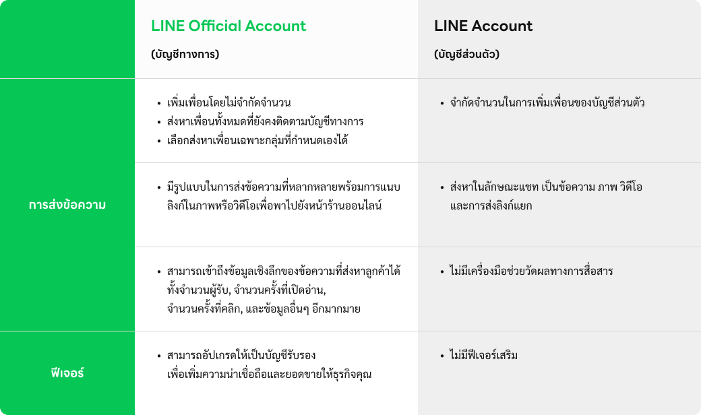
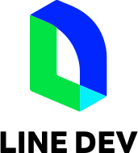
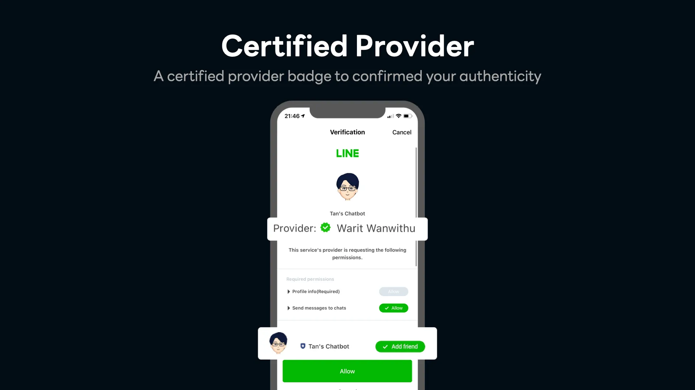

<!-- _class: cover -->
<!-- _paginate: false -->
<!-- _footer: '' -->

# LINE Developer Tools

## Chapter 1 · Introduction & Overview


---

# LINE Official Account



LINE Official Account เป็นแพลตฟอร์มที่ช่วยให้ธุรกิจหรือบุคคลสามารถ**สื่อสารและสร้างความสัมพันธ์**กับลูกค้าได้อย่างมีประสิทธิภาพผ่านแอปพลิเคชัน LINE

---

# Feature ของ LINE Official Account

| Feature | คำอธิบาย | API |
|---|---|:---:|
| **Broadcast Message** | ส่งข้อความไปยังผู้ติดตามทั้งหมดได้ในครั้งเดียว | Yes |
| **Auto Reply & Greeting** | ตอบกลับอัตโนมัติ และข้อความทักทาย | Yes |
| **Rich Menu** | เมนูด้านล่างหน้าจอแชท | Yes |
| **Rich Message & Video** | ข้อความผสมรูปภาพ / วิดีโอ | Yes |
| **Coupons & Loyalty** | คูปองและสะสมแต้ม | No |
| **Surveys & Polls** | แบบสอบถาม | No |
| **Analytics** | วิเคราะห์ข้อมูลเชิงสถิติ | Yes |

---

# Package ของ LINE Official Account

| | **Free** | **Basic** | **Pro** |
|---|:---:|:---:|:---:|
| ค่าบริการ / เดือน | **ฟรี** | **1,280** บาท | **1,780** บาท |
| ข้อความฟรี / เดือน | 300 | 15,000 | 35,000 |
| ข้อความเพิ่ม | ไม่ได้ | 0.10 บาท | 0.06 บาท |
| MyCustomer CRM | - | 369 บาท/เดือน | **ฟรี** |

> **หมายเหตุ:** ราคายังไม่รวม VAT 7% · อัปเดตตั้งแต่ 1 ส.ค. 2024

---

# ชนิดของบัญชี LINE Official Account

| โล่ | ประเภท | รายละเอียด | ค่าใช้จ่าย |
|:---:|---|---|---|
| สีเทา | **บัญชีทั่วไป** (Unverified) | ได้รับเมื่อเริ่มต้นใช้งาน | ฟรี |
| สีน้ำเงิน | **บัญชีรับรอง** (Verified) | ค้นหาได้ง่ายบน LINE & Search Engine | 888 บาท (ครั้งเดียว) |
| สีเขียว | **บัญชีพรีเมียม** (Premium) | สำหรับธุรกิจขนาดใหญ่ ใช้ Sponsor Sticker | มีค่าใช้จ่ายขั้นต่ำ |

**Premium ID** — เปลี่ยน Basic ID เป็นชื่อแบรนด์ **444 บาท/ปี** (iOS: 459 บาท)

---

<!-- _class: divider -->

# LINE Developers Services

## เครื่องมือสำหรับนักพัฒนา

---

# LINE Developers Services



| บริการ | คำอธิบาย |
|---|---|
| **Messaging API** | สร้าง Chatbot ส่งและรับข้อความ |
| **LIFF** | สร้าง Web App ภายในแอป LINE |
| **LINE Login** | ระบบเข้าสู่ระบบผ่าน LINE |
| **LINE Pay** | ชำระเงินออนไลน์ |
| **LINE Beacon** | ส่งแจ้งเตือนเชิงพื้นที่ |
| **LINE Mini App** | Web App บน LINE (ใช้ LIFF) |
| **LON** | ส่งข้อความแจ้งเตือนด้วยเบอร์มือถือ |

---

# LINE URL Scheme

URL scheme สำหรับเปิดฟีเจอร์ต่างๆ ของ LINE

| URL Scheme | คำอธิบาย |
|---|---|
| `https://line.me/R/...` | เปิดฟีเจอร์ LINE app |
| `https://liff.line.me/...` | เปิด LIFF app |
| `https://miniapp.line.me/...` | เปิด LINE MINI App |

> **`line://` ถูก Deprecated แล้ว** — ใช้ `https://line.me/R/` แทนเสมอ

---

# LINE URL Scheme — ตัวอย่าง

```
# เปิดโปรไฟล์ OA
https://line.me/R/ti/p/@linedevelopers

# เปิดแชทพร้อมข้อความ
https://line.me/R/oaMessage/%40linedevelopers/?Hello

# แชร์ข้อความ
https://line.me/R/share?text=สวัสดี

# เปิด LIFF App
https://liff.line.me/{liffId}

# เปิดในเบราว์เซอร์ภายนอก
https://example.com/?openExternalBrowser=1
```

---

# LINE URL Scheme — หน้าจอทั่วไป

| URL Scheme | คำอธิบาย |
|---|---|
| `https://line.me/R/nv/chat` | เปิดแท็บแชท |
| `https://line.me/R/nv/camera/` | เปิดกล้อง |
| `https://line.me/R/nv/location/` | เปิดหน้าตำแหน่ง |
| `https://line.me/R/nv/settings` | เปิดหน้าตั้งค่า |
| `https://line.me/R/nv/stickerShop` | เปิด Sticker Shop |
| `https://line.me/R/nv/wallet` | เปิดแท็บ Wallet |
| `https://line.me/R/nv/addFriends` | เปิดหน้าเพิ่มเพื่อน |

---

# LINE API Status


ตรวจสอบสถานะ API ได้ที่ [api.line-status.info](https://api.line-status.info/)

**บริการที่ครอบคลุม:**
- Messaging API (API & Webhook)
- LINE Developers (Website & Console)
- LIFF
- LINE Login

> ยังไม่ครอบคลุม LINE MINI App และ LINE Pay

---

<!-- _class: divider -->

# Certified Provider

## Provider ที่ได้รับการรับรองจาก LINE

---

# Certified Provider



Provider ที่ได้รับการรับรองจาก LINE — ได้รับสิทธิ์พิเศษ

| สิทธิพิเศษ | รายละเอียด |
|---|---|
| **Certified Badge** | แสดงในหน้า Consent สร้างความน่าเชื่อถือ |
| **Auto Check Add Bot** | ปุ่ม "Add friend" ถูกเลือกอัตโนมัติ |
| **Special API** | ใช้ `stay`, `profile+`, `mark-as-read` |

**วิธีสมัคร:** ส่งเอกสารบริษัท + Privacy Policy URL
ไปที่ `dl_api_th@linecorp.com` · ระยะเวลาพิจารณา ~10 วันทำการ

---

# Certified Provider vs Verified OA

| | **Certified Provider** | **Verified OA** |
|---|---|---|
| ระดับ | Provider | Channel (บัญชี) |
| สิทธิ์ | Special API, Badge | โล่สีน้ำเงิน, ค้นหาได้ |
| ต้องเป็น Verified OA? | ไม่จำเป็น | — |

> **FAQ:**
> Certified Provider สามารถใช้กับ OA ทุกแบบ (เทา / น้ำเงิน / เขียว)
> Certified = ระดับ **Provider** · Verified = ระดับ **Channel**
