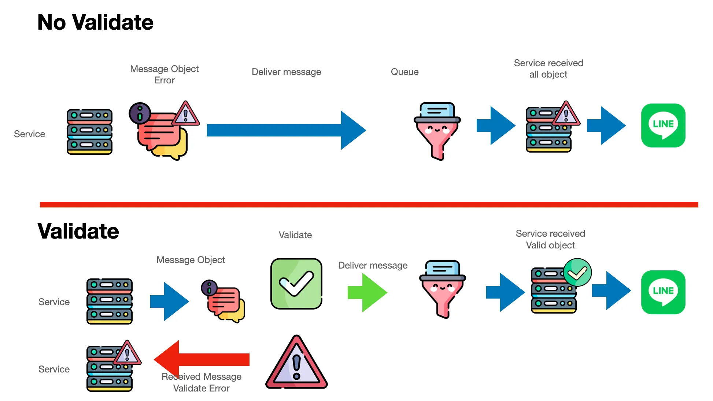
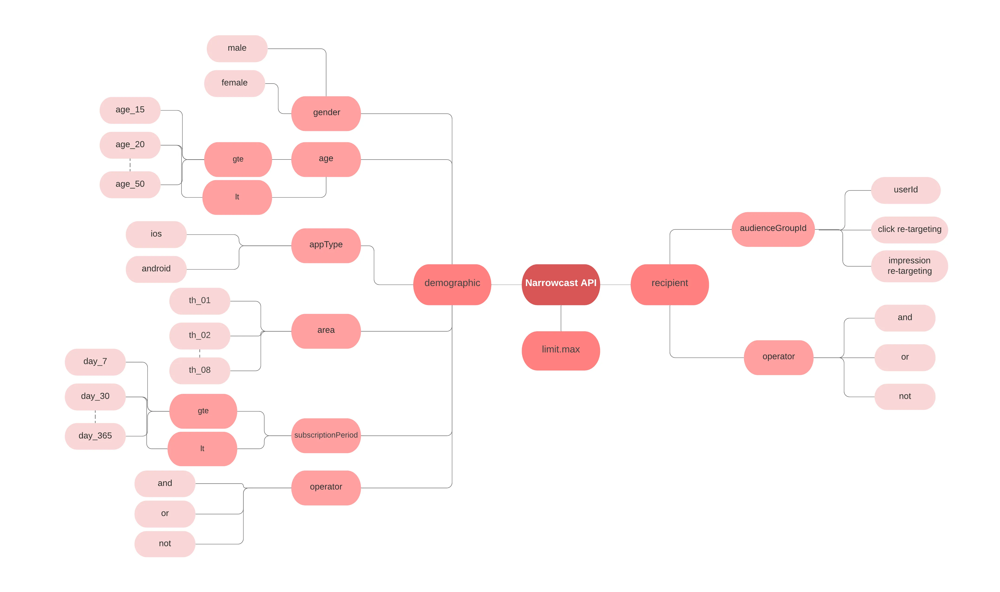
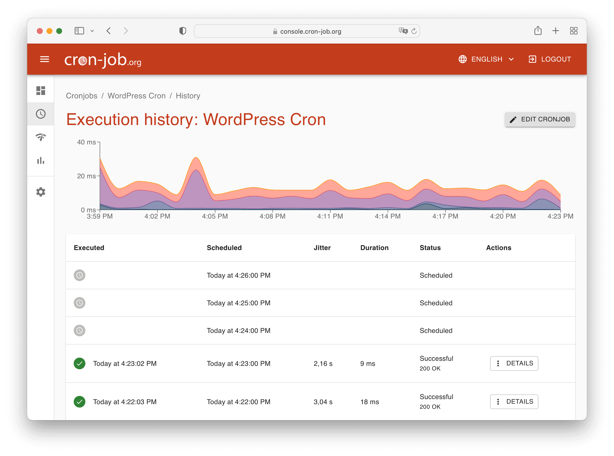

<!-- _class: cover -->
<!-- _paginate: false -->
<!-- _footer: '' -->

# LINE Developer Tools

## Chapter 5 · Messages & API

---

# API Domain

| Domain | ใช้สำหรับ |
|---|---|
| `api.line.me` | ส่งข้อความ, จัดการ Rich Menu, อื่นๆ |
| `api-data.line.me` | Get content, Upload rich menu image |

```
POST https://api.line.me/v2/bot/message/reply
POST https://api.line.me/v2/bot/message/push
POST https://api.line.me/v2/bot/message/multicast
POST https://api.line.me/v2/bot/message/broadcast

GET  https://api-data.line.me/v2/bot/message/{messageId}/content
```

---

# Rate Limits

| Endpoint | Rate Limit |
|---|---|
| **Send reply message** | 2,000 req/sec |
| **Send push message** | 2,000 req/sec |
| **Send multicast message** | 200 req/sec |
| **Send broadcast message** | 60 req/hour |
| **Send narrowcast message** | 60 req/hour |
| **Display loading animation** | 100 req/sec |
| **Create rich menu** | 100 req/hour |
| **Other API endpoints** | 2,000 req/sec |

> เกินขีดจำกัด = ได้รับ `429 Too Many Requests`

---

# Message Types — Text & Sticker

```json
// Text message
{
  "type": "text",
  "text": "Hello, world"
}

// Text with LINE emoji
{
  "type": "text",
  "text": "$ LINE emoji $",
  "emojis": [
    { "index": 0, "productId": "5ac1bfd5...", "emojiId": "001" }
  ]
}

// Sticker message
{
  "type": "sticker",
  "packageId": "446",
  "stickerId": "1988"
}
```

---

# Message Types — Image, Video, Audio, Location

```json
// Image
{ "type": "image",
  "originalContentUrl": "https://example.com/original.jpg",
  "previewImageUrl": "https://example.com/preview.jpg" }

// Video
{ "type": "video",
  "originalContentUrl": "https://example.com/original.mp4",
  "previewImageUrl": "https://example.com/preview.jpg" }

// Audio
{ "type": "audio",
  "originalContentUrl": "https://example.com/original.m4a",
  "duration": 60000 }

// Location
{ "type": "location", "title": "my location",
  "address": "Tokyo, Japan",
  "latitude": 35.67966, "longitude": 139.73669 }
```

---

# Text Message v2 — Mention & Emoji

```json
{
  "type": "textV2",
  "text": "Hello {user}! Welcome to {shop}",
  "substitution": {
    "user": {
      "type": "mention",
      "mentionee": {
        "type": "user",
        "userId": "U1234567890abcdef..."
      }
    },
    "shop": {
      "type": "emoji",
      "productId": "5ac1bfd5040ab15980c9b435",
      "emojiId": "001"
    }
  }
}
```

> Text v2 แทนที่ `{key}` ด้วย mention / emoji ได้โดยตรง

---

# Template Messages

| Template | คำอธิบาย |
|---|---|
| **Buttons** | รูปภาพ + หัวข้อ + ข้อความ + ปุ่ม action |
| **Confirm** | ข้อความ + ปุ่ม 2 ปุ่ม (Yes / No) |
| **Carousel** | หลายคอลัมน์เลื่อนดูได้ |
| **Image Carousel** | หลายรูปภาพเลื่อนดูได้ |

> ต้องการ layout ยืดหยุ่นมากขึ้น? ใช้ **Flex Message** แทน

---

# Buttons Template — ตัวอย่าง

```json
{
  "type": "template",
  "altText": "This is a buttons template",
  "template": {
    "type": "buttons",
    "thumbnailImageUrl": "https://example.com/image.jpg",
    "title": "Menu",
    "text": "Please select",
    "actions": [
      { "type": "postback", "label": "Buy",
        "data": "action=buy&itemid=123" },
      { "type": "uri", "label": "View detail",
        "uri": "http://example.com/page/123" }
    ]
  }
}
```

---

<!-- _class: divider -->

# Sending Messages

## วิธีการส่งข้อความผ่าน API

---

# Sending Messages

### Reply (ฟรี)
```bash
POST https://api.line.me/v2/bot/message/reply
# ใช้ replyToken จาก webhook, สูงสุด 5 bubbles
```

### Push (หักโควต้า)
```bash
POST https://api.line.me/v2/bot/message/push
# ส่งหาผู้ใช้คนเดียว
```

### Multicast (หักโควต้า)
```bash
POST https://api.line.me/v2/bot/message/multicast
# ส่งหาหลายคนพร้อมกัน (สูงสุด 500 คน)
```

### Broadcast (หักโควต้า)
```bash
POST https://api.line.me/v2/bot/message/broadcast
# ส่งหาผู้ติดตามทั้งหมด
```

---

# Quick Reply

ปุ่มแสดงด้านล่างแชทให้ผู้ใช้แตะตอบกลับทันที (สูงสุด **13** ปุ่ม)

**Actions ที่ใช้ได้:** Camera · Camera Roll · Location · Postback · Message · URI · Datetime picker · Clipboard

```json
{
  "type": "text",
  "text": "เลือกหมวดอาหารที่ชอบ",
  "quickReply": {
    "items": [
      { "type": "action",
        "action": { "type": "message",
                    "label": "Sushi", "text": "Sushi" } },
      { "type": "action",
        "action": { "type": "location",
                    "label": "Send location" } }
    ]
  }
}
```

---

# Quote Token

ส่งข้อความแบบอ้างอิงข้อความที่ผ่านมา

- ใช้ได้กับ **Text** และ **Sticker** เท่านั้น
- `quoteToken` **ไม่มีวันหมดอายุ** และใช้ซ้ำได้

**ได้มาจาก:**
1. Webhook Event (Text, Sticker, Image, Video)
2. Response ของการส่งข้อความ (Reply / Push)

```json
{
  "type": "text",
  "text": "Yes, you can.",
  "quoteToken": "yHAz4Ua2wx7..."
}
```

---

# Channel Access Token — ประเภท

| ประเภท | อายุ | จำนวน / Channel | ข้อดี |
|---|---|---|---|
| **Long-lived** | ไม่หมดอายุ | 1 | ง่าย |
| **Short-lived** | 30 วัน | 30 | ปลอดภัยปานกลาง |
| **v2.1** | สูงสุด 30 วัน | 30 | ปลอดภัยสูงสุด (JWT) |
| **Stateless** | 15 นาที | ไม่จำกัด | Per-request |

> **แนะนำ:** ใช้ v2.1 หรือ Stateless
> **สำคัญ:** Revoke Token ที่สงสัยว่ารั่วไหลทันที!

---

# Loading Animation

แสดงสถานะการประมวลผลในแชท

```bash
POST https://api.line.me/v2/bot/chat/loading/start
Authorization: Bearer {channel access token}

{ "chatId": "U4af4980629...", "loadingSeconds": 5 }
```

**เงื่อนไข:**
- ใช้ได้เฉพาะแชท 1 ต่อ 1
- แสดงเฉพาะเมื่อผู้ใช้เปิดหน้าแชทอยู่
- หายไปเมื่อบอทส่งข้อความใหม่
- `loadingSeconds`: 5–60 วินาที (ค่าเริ่มต้น 20)
- **ฟรี** ไม่มีค่าใช้จ่าย

---

# Verify Signature (x-line-signature)


ตรวจสอบว่า webhook มาจาก LINE Platform จริง

**ขั้นตอน:**
1. รับ `x-line-signature` จาก request header
2. คำนวณ HMAC-SHA256 จาก request body ด้วย Channel Secret
3. เปรียบเทียบกับ signature ที่ได้รับ

```typescript
import crypto from "crypto";

function validateLineSignature(
  rawBody: Buffer | string, signature: string
): boolean {
  const hmac = crypto.createHmac("sha256",
    process.env.LINE_MESSAGING_CHANNEL_SECRET!);
  hmac.update(rawBody);
  return hmac.digest("base64") === signature;
}
```

---

# Validate Message Object API



ทดสอบความถูกต้องของ JSON ก่อนส่งจริง

```
POST /v2/bot/message/validate/reply
POST /v2/bot/message/validate/push
POST /v2/bot/message/validate/multicast
POST /v2/bot/message/validate/narrowcast
POST /v2/bot/message/validate/broadcast
```

> ลด Error จากโครงสร้าง JSON ผิดพลาด
> ลดปัญหาใน Queue System ขององค์กรใหญ่

---

# Narrowcast Message



ส่งข้อความแบบเจาะจงกลุ่มเป้าหมาย

**กรองผู้รับได้ด้วย:**
- เพศ, อายุ, OS, พื้นที่
- Audience group (กลุ่มผู้ใช้)
- จำนวนข้อความสูงสุดที่จะส่ง

```bash
POST https://api.line.me/v2/bot/message/narrowcast
# ตรวจสอบสถานะ:
GET https://api.line.me/v2/bot/message/progress/narrowcast
  ?requestId={requestId}
```

---

<!-- _class: divider -->

# Advanced Features

## Cron Job · LINE Beacon · Redis

---

# Cron Job — ส่งข้อความอัตโนมัติ



ใช้ [cron-job.org](https://cron-job.org) สำหรับตั้งเวลาเรียก API

**ขั้นตอน:**
1. สมัครสมาชิกที่ cron-job.org
2. สร้าง Cronjob ใหม่
3. กรอก URL ของ API endpoint
4. เลือก Schedule (ทุกชั่วโมง, ทุกวัน, ฯลฯ)
5. ตั้ง Time Zone
6. ทดสอบด้วย "Run Now"

---

# LINE Beacon

เทคโนโลยีส่งข้อความเมื่อผู้ใช้เข้าใกล้อุปกรณ์ Beacon

**Webhook Event Types:**

| Event | คำอธิบาย |
|---|---|
| `enter` | เข้าสู่พื้นที่ Beacon |
| `leave` | ออกจากพื้นที่ Beacon |
| `stay` | อยู่ในพื้นที่ Beacon (ต้องขอสิทธิ์พิเศษ) |
| `banner` | กดแบนเนอร์ |

> ต้องลงทะเบียน Beacon ใน LINE Official Account Manager

---

# Redis & Caching

ระบบ in-memory data store สำหรับ LINE Bot

**ใช้เพื่อ:**
- Cache ข้อมูลผู้ใช้ / Session
- ลด Latency ในการตอบกลับ
- จัดการ State ของ Conversation

```bash
SET user:123 "John" EX 3600    # หมดอายุ 1 ชม.

await redis.set("user:123", "John", { EX: 3600 });
await redis.del("user:123");
```

> รองรับ: strings, hashes, lists, sets, sorted sets, streams
