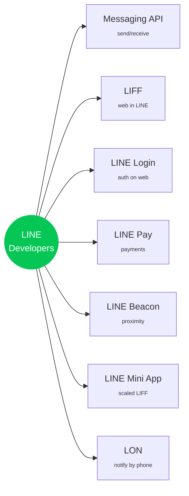
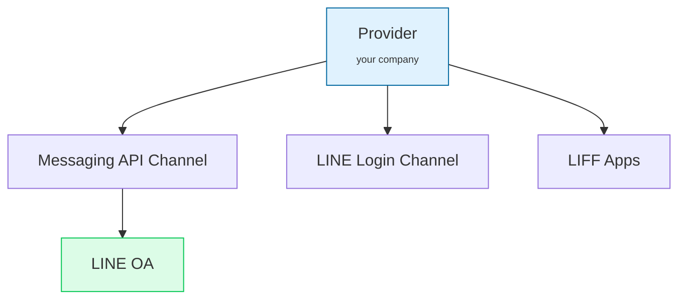
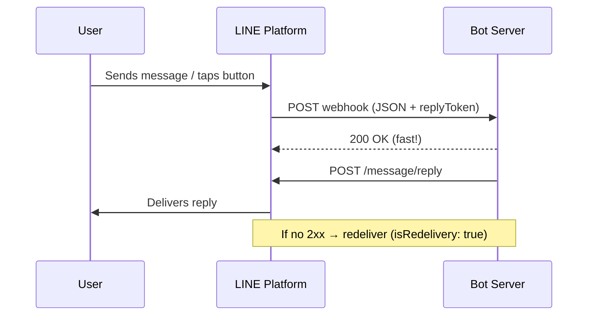
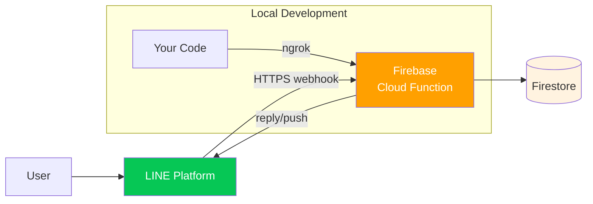
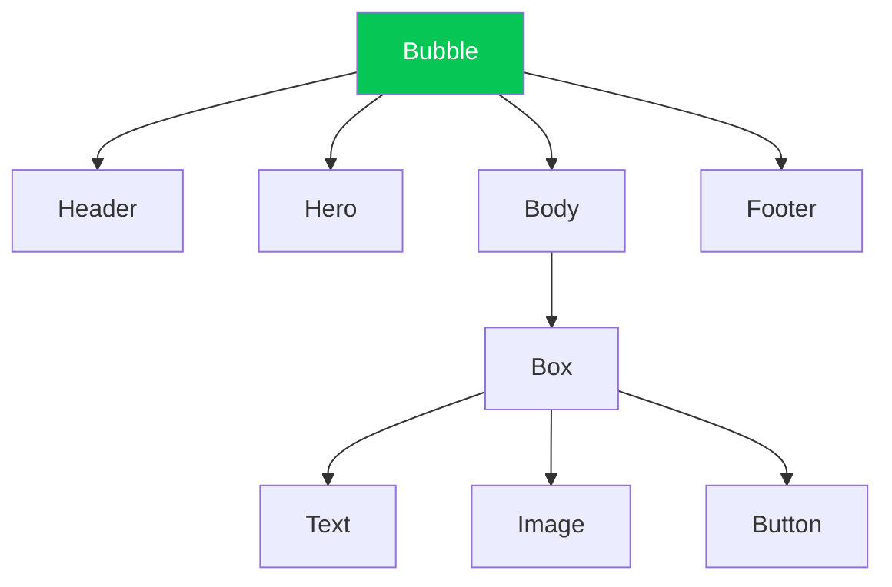

# LINE Developer Tools Builder

From LINE OA basics to shipping a full-featured LINE Bot

<div class="pt-12">
  <span class="px-2 py-1 rounded cursor-pointer bg-white/10 text-sm" hover="bg-white/20">
    Thepnatee Phojan · Cloudea
  </span>
</div>

<div class="abs-br m-6 text-xl opacity-60">
  🤖 devtoolsbuilder.cloudea.tech
</div>

---
layout: default
---

# Workshop Roadmap

<div class="grid grid-cols-6 gap-3 mt-8 text-center text-xs">

<div class="rounded-lg p-3 bg-green-50 dark:bg-green-900/20 border border-green-200 dark:border-green-800">
<div class="text-green-600 font-bold text-base">01</div>
Introduction
</div>

<div class="rounded-lg p-3 bg-green-50 dark:bg-green-900/20 border border-green-200 dark:border-green-800">
<div class="text-green-600 font-bold text-base">02</div>
OA Setup
</div>

<div class="rounded-lg p-3 bg-green-50 dark:bg-green-900/20 border border-green-200 dark:border-green-800">
<div class="text-green-600 font-bold text-base">03</div>
Webhook
</div>

<div class="rounded-lg p-3 bg-green-50 dark:bg-green-900/20 border border-green-200 dark:border-green-800">
<div class="text-green-600 font-bold text-base">04</div>
Chatbot
</div>

<div class="rounded-lg p-3 bg-green-50 dark:bg-green-900/20 border border-green-200 dark:border-green-800">
<div class="text-green-600 font-bold text-base">05</div>
Messages
</div>

<div class="rounded-lg p-3 bg-green-50 dark:bg-green-900/20 border border-green-200 dark:border-green-800">
<div class="text-green-600 font-bold text-base">06</div>
Flex
</div>

<div class="rounded-lg p-3 bg-green-50 dark:bg-green-900/20 border border-green-200 dark:border-green-800">
<div class="text-green-600 font-bold text-base">07</div>
Storage
</div>

<div class="rounded-lg p-3 bg-green-50 dark:bg-green-900/20 border border-green-200 dark:border-green-800">
<div class="text-green-600 font-bold text-base">08</div>
Rich Menu
</div>

<div class="rounded-lg p-3 bg-green-50 dark:bg-green-900/20 border border-green-200 dark:border-green-800">
<div class="text-green-600 font-bold text-base">09</div>
LIFF
</div>

<div class="rounded-lg p-3 bg-green-50 dark:bg-green-900/20 border border-green-200 dark:border-green-800">
<div class="text-green-600 font-bold text-base">10</div>
Mini App
</div>

<div class="rounded-lg p-3 bg-green-50 dark:bg-green-900/20 border border-green-200 dark:border-green-800 col-span-2">
<div class="text-green-600 font-bold text-base">11</div>
Dev Tools Builder
</div>

</div>

<div class="mt-10 text-center opacity-60 text-sm">
11 chapters · 47 sections · from zero to production
</div>

---
layout: section
class: text-center
---

# Chapter 01
## The LINE Ecosystem

<div class="opacity-60 mt-4">OA · Developers · URL Schemes · Status · Certified Provider</div>

---
layout: two-cols-header
---

# LINE Official Account

The "home" every developer feature lives in. Every bot, Rich Menu, LIFF app ties back to an OA.

::left::

### 👤 Personal Account

- 1:1 human chat
- Can initiate conversations
- No broadcast
- No API access
- No analytics

::right::

### 🏢 LINE OA

- Broadcast to thousands
- Auto reply & greeting
- Messaging API + Webhook
- Rich Menu, LIFF, Mini App
- **Cannot initiate chat** — user must add friend first

---
layout: default
---

# Account Shields

<div class="grid grid-cols-3 gap-6 mt-10">

<div class="rounded-xl p-6 border-2 border-gray-300 bg-gray-50 dark:bg-gray-900/30">
<div class="text-5xl mb-3">🛡️</div>
<div class="text-lg font-bold text-gray-600">Unverified</div>
<div class="text-sm mt-2 opacity-70">Grey Shield</div>
<hr class="my-3 opacity-30" />
<div class="text-2xl font-bold">Free</div>
<div class="text-xs mt-2 opacity-60">Default when you create an OA. All base features.</div>
</div>

<div class="rounded-xl p-6 border-2 border-blue-400 bg-blue-50 dark:bg-blue-900/20">
<div class="text-5xl mb-3">🛡️</div>
<div class="text-lg font-bold text-blue-600">Verified</div>
<div class="text-sm mt-2 opacity-70">Blue Shield</div>
<hr class="my-3 opacity-30" />
<div class="text-2xl font-bold">฿888 <span class="text-sm font-normal">once</span></div>
<div class="text-xs mt-2 opacity-60">Searchable in LINE & Google. Credibility boost for SMBs.</div>
</div>

<div class="rounded-xl p-6 border-2 border-green-400 bg-green-50 dark:bg-green-900/20">
<div class="text-5xl mb-3">🛡️</div>
<div class="text-lg font-bold text-green-600">Premium</div>
<div class="text-sm mt-2 opacity-70">Green Shield</div>
<hr class="my-3 opacity-30" />
<div class="text-2xl font-bold">Enterprise</div>
<div class="text-xs mt-2 opacity-60">For million-follower brands. Sponsored stickers.</div>
</div>

</div>

<div class="mt-8 text-sm opacity-60 text-center">
💡 Shield ≠ Certified Provider. They are different concepts.
</div>

---
layout: default
---

# LINE Developers — Services Map



<div class="text-xs opacity-60 mt-4 text-center">
Most services require a LINE OA. LIFF & Mini App are hosted inside LINE.
</div>

---
layout: default
---

# Pick the Right Service

<div class="mt-6">

| If you want to…                            | Use               |
| ------------------------------------------ | ----------------- |
| Auto-reply or broadcast to followers       | **Messaging API** |
| Show a form / cart inside a chat           | **LIFF**          |
| Let users log in to *your* website         | **LINE Login**    |
| Send OTP by phone number (no friend add)   | **LON**           |
| Run a full web app discoverable in LINE    | **LINE Mini App** |
| Trigger a message when entering a location | **LINE Beacon**   |

</div>

---
layout: section
class: text-center
---

# Chapter 02
## Messaging API Setup

<div class="opacity-60 mt-4">Provider · Channel · Secret · Access Token</div>

---
layout: default
---

# Provider, Channel, and OA



<div class="grid grid-cols-3 gap-3 mt-8 text-center">

<div class="p-3 rounded bg-gray-50 dark:bg-gray-900/30 border">
<div class="text-xs opacity-60">Channel ID</div>
<div class="font-mono text-sm mt-1">public identifier</div>
</div>

<div class="p-3 rounded bg-gray-50 dark:bg-gray-900/30 border">
<div class="text-xs opacity-60">Channel Secret</div>
<div class="font-mono text-sm mt-1">signs webhooks</div>
</div>

<div class="p-3 rounded bg-gray-50 dark:bg-gray-900/30 border">
<div class="text-xs opacity-60">Access Token</div>
<div class="font-mono text-sm mt-1">calls the API</div>
</div>

</div>

---
layout: section
class: text-center
---

# Chapter 03
## Webhook Lifecycle

<div class="opacity-60 mt-4">Event → 200 OK → reply</div>

---
layout: default
---

# Webhook — How It Flows



<div class="grid grid-cols-3 gap-3 mt-4 text-xs">

<div class="p-2 rounded border-l-4 border-green-500 bg-green-50 dark:bg-green-900/20">
<b>Respond fast</b><br/>2xx within seconds
</div>

<div class="p-2 rounded border-l-4 border-amber-500 bg-amber-50 dark:bg-amber-900/20">
<b>De-dupe</b><br/>use webhookEventId
</div>

<div class="p-2 rounded border-l-4 border-blue-500 bg-blue-50 dark:bg-blue-900/20">
<b>Reply now</b><br/>replyToken is short-lived
</div>

</div>

---
layout: default
---

# Webhook Event Types

<div class="grid grid-cols-5 gap-3 mt-8 text-center text-sm">

<div class="p-3 rounded bg-gray-50 dark:bg-gray-900/30 border"><div class="text-3xl mb-1">💬</div>Message</div>
<div class="p-3 rounded bg-gray-50 dark:bg-gray-900/30 border"><div class="text-3xl mb-1">➕</div>Follow</div>
<div class="p-3 rounded bg-gray-50 dark:bg-gray-900/30 border"><div class="text-3xl mb-1">🚫</div>Unfollow</div>
<div class="p-3 rounded bg-gray-50 dark:bg-gray-900/30 border"><div class="text-3xl mb-1">👥</div>Join</div>
<div class="p-3 rounded bg-gray-50 dark:bg-gray-900/30 border"><div class="text-3xl mb-1">🚪</div>Leave</div>

<div class="p-3 rounded bg-gray-50 dark:bg-gray-900/30 border"><div class="text-3xl mb-1">👆</div>Postback</div>
<div class="p-3 rounded bg-gray-50 dark:bg-gray-900/30 border"><div class="text-3xl mb-1">📍</div>Beacon</div>
<div class="p-3 rounded bg-gray-50 dark:bg-gray-900/30 border"><div class="text-3xl mb-1">🔗</div>Account Link</div>
<div class="p-3 rounded bg-gray-50 dark:bg-gray-900/30 border"><div class="text-3xl mb-1">🎬</div>Video Done</div>
<div class="p-3 rounded bg-gray-50 dark:bg-gray-900/30 border"><div class="text-3xl mb-1">🗑️</div>Unsend</div>

</div>

---
layout: section
class: text-center
---

# Chapter 04
## Build Your First Chatbot

<div class="opacity-60 mt-4">Firebase Functions · ngrok · Webhook</div>

---
layout: default
---

# Chatbot Architecture



<div class="mt-6 text-sm opacity-70">
Dev phase uses ngrok to expose local endpoint as HTTPS. Production deploys to Firebase Functions with CA-signed HTTPS.
</div>

---
layout: section
class: text-center
---

# Chapter 05
## Messages

<div class="opacity-60 mt-4">Reply · Push · Multicast · Broadcast · Narrowcast</div>

---
layout: default
---

# Five Ways to Send a Message

<div class="mt-6 text-sm">

| Type           | Audience              | Quota  | When to use                           |
| -------------- | --------------------- | ------ | ------------------------------------- |
| **Reply**      | 1 user (replyToken)   | Free   | Respond to an incoming webhook        |
| **Push**       | 1 user                | Counts | Triggered outside a conversation      |
| **Multicast**  | Up to 500 user IDs    | Counts | Targeted blast without segmentation   |
| **Broadcast**  | All followers         | Counts | Announcements to the whole audience   |
| **Narrowcast** | Audience by attribute | Counts | Segmented campaigns (age, gender, …)  |

</div>

<div class="mt-6 text-xs opacity-60 text-center">
Reply is free and doesn't consume monthly quota — always prefer it when you have a replyToken.
</div>

---
layout: default
---

# Message Power-Ups

<div class="grid grid-cols-3 gap-4 mt-8">

<div class="p-4 rounded border bg-gray-50 dark:bg-gray-900/30">
<div class="text-3xl">↩️</div>
<div class="font-bold mt-2">Quick Reply</div>
<div class="text-xs opacity-70 mt-1">Tappable suggestion chips under the message</div>
</div>

<div class="p-4 rounded border bg-gray-50 dark:bg-gray-900/30">
<div class="text-3xl">💬</div>
<div class="font-bold mt-2">Quote Token</div>
<div class="text-xs opacity-70 mt-1">Reply to reference a prior message visually</div>
</div>

<div class="p-4 rounded border bg-gray-50 dark:bg-gray-900/30">
<div class="text-3xl">@️</div>
<div class="font-bold mt-2">Mention</div>
<div class="text-xs opacity-70 mt-1">Tag users or @All inside a group chat</div>
</div>

<div class="p-4 rounded border bg-gray-50 dark:bg-gray-900/30">
<div class="text-3xl">⏳</div>
<div class="font-bold mt-2">Loading Animation</div>
<div class="text-xs opacity-70 mt-1">Show typing dots while processing</div>
</div>

<div class="p-4 rounded border bg-gray-50 dark:bg-gray-900/30">
<div class="text-3xl">🔐</div>
<div class="font-bold mt-2">x-line-signature</div>
<div class="text-xs opacity-70 mt-1">HMAC verification — mandatory for webhooks</div>
</div>

<div class="p-4 rounded border bg-gray-50 dark:bg-gray-900/30">
<div class="text-3xl">📊</div>
<div class="font-bold mt-2">Statistics API</div>
<div class="text-xs opacity-70 mt-1">Delivery & read counts per campaign</div>
</div>

</div>

---
layout: default
---

# Chapter 06 · Flex Message

<div class="grid grid-cols-2 gap-8 mt-6">

<div>



</div>

<div class="self-center">

<div class="rounded-xl overflow-hidden border shadow-lg bg-white">
<div class="bg-green-600 text-white text-xs p-2">Header</div>
<div class="bg-gray-200 h-20 flex items-center justify-center text-gray-500 text-xs">Hero image</div>
<div class="p-3">
  <div class="font-bold text-sm">Lunch Combo</div>
  <div class="text-xs text-gray-500 mt-1">฿129 · 20% off today</div>
</div>
<div class="border-t p-2 flex gap-2">
  <button class="text-xs px-2 py-1 bg-green-600 text-white rounded flex-1">Order</button>
  <button class="text-xs px-2 py-1 border rounded flex-1">Details</button>
</div>
</div>

<div class="text-xs opacity-60 mt-3 text-center">Rendered preview of a Flex Bubble</div>

</div>

</div>

---
layout: default
---

# Chapter 08 · Rich Menu Anatomy

<div class="grid grid-cols-2 gap-6 mt-6">

<div>

<div class="border-2 border-green-600 rounded grid grid-cols-3 grid-rows-2 overflow-hidden" style="aspect-ratio: 2500/1686;">
<div class="bg-green-100 dark:bg-green-900/40 flex items-center justify-center text-xs">📋 Menu</div>
<div class="bg-blue-100 dark:bg-blue-900/40 flex items-center justify-center text-xs">🛒 Shop</div>
<div class="bg-amber-100 dark:bg-amber-900/40 flex items-center justify-center text-xs">🎁 Rewards</div>
<div class="bg-purple-100 dark:bg-purple-900/40 flex items-center justify-center text-xs">📍 Branch</div>
<div class="bg-rose-100 dark:bg-rose-900/40 flex items-center justify-center text-xs">💬 Contact</div>
<div class="bg-cyan-100 dark:bg-cyan-900/40 flex items-center justify-center text-xs">👤 Profile</div>
</div>

<div class="text-xs opacity-60 mt-2 text-center">2500 × 1686 px · 6 action areas</div>

</div>

<div class="self-center space-y-3 text-sm">

<div class="flex gap-2 items-start">
<div class="w-6 h-6 rounded-full bg-green-600 text-white text-xs flex items-center justify-center flex-shrink-0">1</div>
<div><b>Action Areas</b><br/><span class="text-xs opacity-70">Each cell maps to a message, URI, or postback.</span></div>
</div>

<div class="flex gap-2 items-start">
<div class="w-6 h-6 rounded-full bg-green-600 text-white text-xs flex items-center justify-center flex-shrink-0">2</div>
<div><b>Alias</b><br/><span class="text-xs opacity-70">Swap menus by alias name without rebuilding.</span></div>
</div>

<div class="flex gap-2 items-start">
<div class="w-6 h-6 rounded-full bg-green-600 text-white text-xs flex items-center justify-center flex-shrink-0">3</div>
<div><b>Per-user Assignment</b><br/><span class="text-xs opacity-70">Different menus for VIP vs guest.</span></div>
</div>

<div class="flex gap-2 items-start">
<div class="w-6 h-6 rounded-full bg-green-600 text-white text-xs flex items-center justify-center flex-shrink-0">4</div>
<div><b>Scheduled Switch</b><br/><span class="text-xs opacity-70">Auto-flip default menu by time.</span></div>
</div>

</div>

</div>

---
layout: default
---

# Chapter 09 · LIFF Overview

<div class="mt-6">

```mermaid {scale: 0.75}
flowchart LR
    Chat[LINE Chat] --> URL[liff.line.me/xxx]
    URL --> Init[liff.init()]
    Init --> API[liff.getProfile()<br/>liff.sendMessages()<br/>liff.scanCode()]
    API --> App[Your Web App]

    style Chat fill:#06C755,color:#fff
    style App fill:#FFA000,color:#fff
```

</div>

<div class="grid grid-cols-4 gap-3 mt-8 text-center text-sm">
<div class="p-3 rounded border"><b>Full</b><br/><span class="text-xs opacity-60">100% screen</span></div>
<div class="p-3 rounded border"><b>Tall</b><br/><span class="text-xs opacity-60">80% screen</span></div>
<div class="p-3 rounded border"><b>Compact</b><br/><span class="text-xs opacity-60">50% screen</span></div>
<div class="p-3 rounded border"><b>Side-by-side</b><br/><span class="text-xs opacity-60">split view</span></div>
</div>

---
layout: default
---

# Chapter 10 · LIFF vs Mini App

<div class="mt-8 text-sm">

|                | **LIFF**                        | **LINE Mini App**                  |
| -------------- | ------------------------------- | ---------------------------------- |
| Review process | None — ship anytime             | Required by LINE                   |
| Discoverability | Only via your own link          | Listed on LINE Mini App directory  |
| UX             | Opens as a webview in chat      | Premium placement, full-screen UX  |
| Scale          | Best for small/private use      | Built for scale, millions of users |

</div>

<div class="mt-6 text-xs opacity-60 text-center">
Mini App = LIFF + review + curation. Under the hood both use the same LIFF SDK.
</div>

---
layout: section
class: text-center
---

# Chapter 11
## LINE Developer Tools Builder

<div class="opacity-60 mt-4">One platform · every LINE tool you need</div>

---
layout: default
---

# Features at a Glance

<div class="grid grid-cols-4 gap-3 mt-6 text-center text-sm">

<div class="p-3 rounded bg-green-50 dark:bg-green-900/20 border border-green-200 dark:border-green-800"><div class="text-2xl">📱</div><div class="mt-1">Rich Menu</div></div>
<div class="p-3 rounded bg-green-50 dark:bg-green-900/20 border border-green-200 dark:border-green-800"><div class="text-2xl">🎨</div><div class="mt-1">Flex</div></div>
<div class="p-3 rounded bg-green-50 dark:bg-green-900/20 border border-green-200 dark:border-green-800"><div class="text-2xl">🖼️</div><div class="mt-1">Imagemap</div></div>
<div class="p-3 rounded bg-green-50 dark:bg-green-900/20 border border-green-200 dark:border-green-800"><div class="text-2xl">📤</div><div class="mt-1">Send</div></div>

<div class="p-3 rounded bg-green-50 dark:bg-green-900/20 border border-green-200 dark:border-green-800"><div class="text-2xl">👥</div><div class="mt-1">Members</div></div>
<div class="p-3 rounded bg-green-50 dark:bg-green-900/20 border border-green-200 dark:border-green-800"><div class="text-2xl">🎯</div><div class="mt-1">Audience</div></div>
<div class="p-3 rounded bg-green-50 dark:bg-green-900/20 border border-green-200 dark:border-green-800"><div class="text-2xl">💬</div><div class="mt-1">Chat Mode</div></div>
<div class="p-3 rounded bg-green-50 dark:bg-green-900/20 border border-green-200 dark:border-green-800"><div class="text-2xl">⚡</div><div class="mt-1">Auto Reply</div></div>

<div class="p-3 rounded bg-green-50 dark:bg-green-900/20 border border-green-200 dark:border-green-800"><div class="text-2xl">🤖</div><div class="mt-1">Templates</div></div>
<div class="p-3 rounded bg-green-50 dark:bg-green-900/20 border border-green-200 dark:border-green-800"><div class="text-2xl">📊</div><div class="mt-1">Polling</div></div>
<div class="p-3 rounded bg-green-50 dark:bg-green-900/20 border border-green-200 dark:border-green-800"><div class="text-2xl">🎮</div><div class="mt-1">Quiz</div></div>
<div class="p-3 rounded bg-green-50 dark:bg-green-900/20 border border-green-200 dark:border-green-800"><div class="text-2xl">🛒</div><div class="mt-1">Shop</div></div>

<div class="p-3 rounded bg-green-50 dark:bg-green-900/20 border border-green-200 dark:border-green-800"><div class="text-2xl">⭐</div><div class="mt-1">Loyalty</div></div>
<div class="p-3 rounded bg-green-50 dark:bg-green-900/20 border border-green-200 dark:border-green-800"><div class="text-2xl">📅</div><div class="mt-1">Booking</div></div>
<div class="p-3 rounded bg-green-50 dark:bg-green-900/20 border border-green-200 dark:border-green-800"><div class="text-2xl">🧰</div><div class="mt-1">Utilities</div></div>
<div class="p-3 rounded bg-green-50 dark:bg-green-900/20 border border-green-200 dark:border-green-800"><div class="text-2xl">⏰</div><div class="mt-1">Cronjob</div></div>

</div>

---
layout: two-cols-header
---

# Gotchas & Launch Checklist

::left::

### ⚠️ Common Gotchas

- **replyToken is short-lived** — use it now or switch to push
- **Webhook must 2xx fast** — offload work to a queue
- **Redelivery is real** — de-dupe with `webhookEventId`
- **Content auto-deletes** — fetch media immediately
- **Coupon/Survey have no API** — manage in OA Manager

::right::

### ✅ Pre-launch Checklist

- [ ] LINE OA created + Messaging API enabled
- [ ] Channel ID / Secret / Access Token stored safely
- [ ] Webhook URL = HTTPS with CA-signed cert
- [ ] Signature verification (`x-line-signature`) in place
- [ ] Idempotency using `webhookEventId`
- [ ] Monthly package matches expected message volume

---
layout: end
class: text-center
---

# Thank You

<div class="mt-8 text-2xl">
  🔗 <a href="https://devtoolsbuilder.cloudea.tech" class="text-green-400">devtoolsbuilder.cloudea.tech</a>
</div>

<div class="mt-6 text-sm opacity-70">
  <div>📖 developers.line.biz — LINE Developers</div>
  <div>🧰 manager.line.biz — LINE OA Manager</div>
</div>

<div class="abs-bl m-6 text-xs opacity-50">
  Thepnatee Phojan · Cloudea · 2026
</div>
