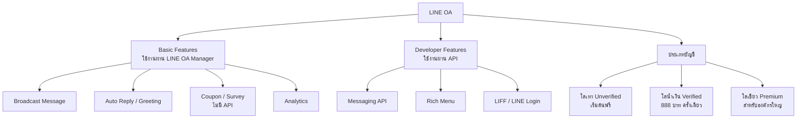
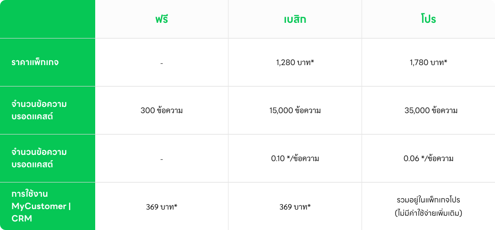
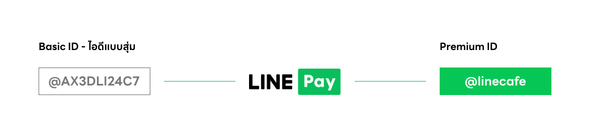

# LINE Official Account — ช่องทางคุยกับลูกค้าบน LINE

> เปิดร้านกาแฟแล้วอยากบอกลูกค้าว่า "พรุ่งนี้มีเมนูใหม่" ทีเดียวถึงหลักพันคน จะส่ง SMS ก็แพง จะโพสต์ Facebook ก็ไม่ชัวร์ว่าลูกค้าเห็น — LINE Official Account (LINE OA) คือคำตอบที่ธุรกิจไทยใช้เยอะที่สุด เพราะคนไทยแทบทุกคนมี LINE อยู่แล้ว

    

## ทำไมต้องรู้เรื่องนี้?

LINE OA ไม่ใช่แค่ "บัญชี LINE สำหรับธุรกิจ" แต่มันคือ **ช่องทางที่ลูกค้าคุ้นเคยอยู่แล้ว** ลูกค้าไม่ต้องโหลดแอปใหม่ ไม่ต้องสมัครสมาชิก แค่แอดเพื่อนก็คุยได้เลย เปรียบเทียบให้เห็นภาพ — ถ้าเว็บไซต์คือหน้าร้าน LINE OA ก็คือ "เบอร์โทรร้าน" ที่ลูกค้าทักมาหาเราได้ตลอด 24 ชั่วโมง

นักพัฒนาต้องรู้เรื่อง LINE OA เพราะเกือบทุกฟีเจอร์ที่เราจะสร้าง ไม่ว่าจะเป็น Chatbot, Rich Menu, Broadcast, หรือ LIFF ต้องผูกกับ LINE OA เสมอ LINE OA คือ "บ้าน" ที่ Channel ของเราอาศัยอยู่ — ถ้าไม่มี LINE OA ก็ไม่มี Messaging API ไม่มีบอท ไม่มีอะไรทั้งนั้น

นอกจากนี้ LINE OA ยังมีแพ็กเกจ/ระดับบัญชี/ราคา ที่ส่งผลโดยตรงต่อสิ่งที่ **โค้ดของเราทำได้หรือทำไม่ได้** เช่น ถ้าลูกค้าใช้แพ็กเกจฟรี การส่ง Broadcast จะมีลิมิตจำนวนข้อความต่อเดือน ถ้าไม่รู้เรื่องนี้ก่อน เขียนโค้ดไปอาจเจอ error ไม่รู้ต้นสายปลายเหตุ

## ภาพรวม

## LINE OA กับบัญชีส่วนตัว ต่างกันยังไง?

    

LINE OA ถูกออกแบบมาสำหรับ "ธุรกิจคุยกับลูกค้าจำนวนมาก" ต่างกับบัญชีส่วนตัวที่เป็น "คนคุยกับคน" ดังนี้ — LINE OA ส่ง Broadcast ถึงผู้ติดตามทีเดียวได้หลายพัน/ล้านคน, ตอบข้อความอัตโนมัติได้, ดูสถิติได้ แต่ **ไม่สามารถเริ่มแชทหาลูกค้าก่อน** ได้เหมือนบัญชีส่วนตัว ลูกค้าต้องเป็นฝ่ายแอดเพื่อนก่อนเสมอ

## ฟีเจอร์หลักของ LINE OA

1. **Broadcast Message (ข้อความกระจาย)**
   - ส่งข้อความพร้อมรูปภาพ วิดีโอ หรือไฟล์ ไปยังผู้ติดตามทั้งหมดได้ในครั้งเดียว
   - ตั้งเวลาส่งข้อความล่วงหน้าได้

2. **Auto Reply และ Greeting Message**
   - ตอบกลับอัตโนมัติเมื่อลูกค้าส่งข้อความมา
   - ตั้งข้อความทักทายสำหรับผู้ที่เพิ่งแอดบัญชีเป็นเพื่อนใหม่ได้

3. **Rich Menu**
   - เมนูด้านล่างหน้าจอแชท ให้ลูกค้าคลิกเข้าดูโปรโมชัน เว็บไซต์ หรือเมนูต่าง ๆ ได้ง่าย

4. **Rich Message และ Rich Video**
   - ข้อความที่ผสานรูปภาพ/วิดีโอกับลิงก์ เพื่อเพิ่มโอกาสในการคลิก

5. **Coupons & Loyalty Program (คูปองและสะสมแต้ม)**
   - สร้างคูปองส่วนลด โปรโมชันพิเศษ
   - ระบบสะสมแต้ม/สแตมป์ เพื่อกระตุ้นให้ลูกค้ากลับมาซื้อซ้ำ
   - `ไม่มี API` — ต้องทำผ่าน LINE OA Manager เท่านั้น

6. **Surveys & Polls (แบบสอบถาม/โพล)**
   - เก็บข้อมูลหรือความคิดเห็นจากลูกค้า
   - `ไม่มี API` — ต้องทำผ่าน LINE OA Manager เท่านั้น

7. **Analytics (วิเคราะห์ข้อมูล)**
   - ดูจำนวนข้อความที่ส่ง จำนวนเปิดอ่าน จำนวนคลิก เพื่อวัดประสิทธิภาพแคมเปญ

## แพ็กเกจ (Package) ของ LINE OA

LINE OA มีแพ็กเกจให้เลือกตามปริมาณการใช้งาน — ถ้าส่งข้อความเยอะต้องอัปเกรดแพ็กเกจ

    

ถ้าคุณเป็นนักพัฒนา ควรถามลูกค้า/เจ้าของธุรกิจก่อนเสมอว่าใช้แพ็กเกจอะไร เพราะมันจะกำหนดว่าบอทของคุณส่งได้กี่ข้อความต่อเดือนก่อนเจอลิมิต

## ประเภทบัญชี LINE OA (ดูจากสีโล่)

บัญชี LINE เพื่อธุรกิจมี 3 แบบ สังเกตได้จากสีโล่ที่แสดงข้างชื่อ OA

### โล่สีเทา — บัญชีทั่วไป (Unverified)

    

เป็นบัญชีที่ทุกคนจะได้รับเมื่อเริ่มสร้าง LINE OA ใช้งานได้ทุกฟีเจอร์พื้นฐาน สามารถอัปเกรดเป็น Verified หรือ Premium ได้ในภายหลัง

### โล่สีน้ำเงิน — บัญชีรับรอง (Verified)

    

ช่วยให้ลูกค้าค้นหาธุรกิจได้ง่ายขึ้นทั้งใน LINE และ Search engine ต่าง ๆ ค่าใช้จ่าย **888 บาท ครั้งเดียว** ใช้ได้ตลอดอายุการใช้งาน (เหมาะสำหรับธุรกิจขนาดกลางที่อยากเพิ่มความน่าเชื่อถือ)

### โล่สีเขียว — บัญชีพรีเมียม (Premium)

    

เหมาะสำหรับธุรกิจหรือองค์กรขนาดใหญ่ที่ต้องการฐานผู้ติดตามระดับล้าน ค้นหาเจอง่าย ใช้ Sponsored Sticker ได้ แต่ต้องมีค่าใช้จ่ายขั้นต่ำตามที่ LINE กำหนด

## Premium ID คืออะไร?

    

เวลาสร้าง LINE OA ใหม่ คุณจะได้ **Basic ID** เป็นตัวอักษรผสมตัวเลขสุ่ม ๆ เช่น `@432nnffa` จำยากมาก ถ้าอยากให้ ID สั้น สวย และตรงกับแบรนด์ ต้องซื้อ **Premium ID**

**ค่าบริการ Premium ID:**
- **444 บาท/ปี** ถ้าสมัครผ่าน Android หรือเว็บไซต์
- **459 บาท/ปี** ถ้าสมัครผ่าน iOS (แพงขึ้นเพราะมีค่าส่วนแบ่ง App Store)

### ข้อกำหนดสำหรับผู้ใช้ iOS

1. สมัครได้สูงสุด **1 Premium ID ต่อ 1 ID**
2. **เปลี่ยนชื่อ Premium ID ไม่ได้ภายใน 1 ปี** — ถ้ามีบัญชีมากกว่า 1 แนะนำให้สมัครผ่านเว็บ [manager.line.biz](https://manager.line.biz) แทน
3. ครบ 1 ปีระบบจะต่ออายุให้อัตโนมัติ ถ้าต้องการเปลี่ยนชื่อต้องยกเลิกก่อนวันหมดอายุอย่างน้อย 1 วัน

## Gotchas (ที่นักพัฒนาไทยมักเจอ)

- **Coupon/Survey ไม่มี API** — ถ้าลูกค้าอยากได้ระบบคูปองใน LIFF เอง ต้องเขียนเอง 100% (LINE ไม่มี endpoint ให้ดึง)
- **โล่น้ำเงิน vs Certified Provider เป็นคนละเรื่องกัน** — Verified OA (โล่) เป็นระดับบัญชี, Certified เป็นระดับ Provider (ดูบทถัดไป)
- **แพ็กเกจฟรีส่ง Broadcast ได้จำกัด** — ต้องเช็คก่อนเขียนสคริปต์ส่งข้อความจำนวนมาก
- **Premium ID ย้าย OA ไปบัญชีอื่นไม่ได้** — คิดชื่อให้ดีก่อนซื้อ

## ข้อผิดพลาดที่มักเจอ

- **พลาด:** รับงานทำบอทโดยไม่ถามลูกค้าว่าใช้ LINE OA แพ็กเกจอะไร
  **ถูก:** ถามก่อนเสมอ — แพ็กเกจมีผลต่อจำนวน Broadcast, Push Message, และฟีเจอร์ที่ใช้ได้

- **พลาด:** สัญญากับลูกค้าว่าบอทจะ "เริ่มทักลูกค้าก่อน" ได้
  **ถูก:** LINE OA ไม่สามารถทัก user ก่อนได้ user ต้องแอดเพื่อนก่อน (หรือใช้ LINE Official Notification — LON ซึ่งเป็นบริการพิเศษ)

- **พลาด:** แนะนำให้ลูกค้าซื้อ Premium ID ก่อนคิดชื่อให้ตก
  **ถูก:** ทดลอง Basic ID ให้มั่นใจก่อน แล้วค่อยซื้อ Premium ID เพราะเปลี่ยนไม่ได้ง่าย ๆ

- **พลาด:** คิดว่า Coupon/Survey สามารถดึงข้อมูลออกมาผ่าน API ได้
  **ถูก:** ทั้ง Coupon และ Survey **ไม่มี API** ต้องจัดการผ่าน LINE OA Manager เท่านั้น ถ้าต้องการระบบคูปองที่ดึงข้อมูลได้ต้องสร้างเองผ่าน LIFF + Database

## Checklist ก่อนไปต่อ

- [ ] เข้าใจความต่างระหว่าง LINE OA กับบัญชี LINE ส่วนตัว
- [ ] รู้ว่าโล่เทา/น้ำเงิน/เขียว ต่างกันอย่างไร และค่าใช้จ่ายเท่าไหร่
- [ ] รู้ว่าฟีเจอร์ไหนมี API ฟีเจอร์ไหนไม่มี (Coupon, Survey ไม่มี)
- [ ] รู้ว่าแพ็กเกจของ LINE OA มีผลต่อจำนวน Broadcast ที่ส่งได้
- [ ] เข้าใจข้อจำกัดของ Premium ID โดยเฉพาะผู้ใช้ iOS

## อ้างอิง

- [LINE Official Account — เว็บไซต์ทางการ](https://lineforbusiness.com/th/service/line-oa)
- [LINE OA Manager](https://manager.line.biz)
- [LINE Developers](https://developers.line.biz)
