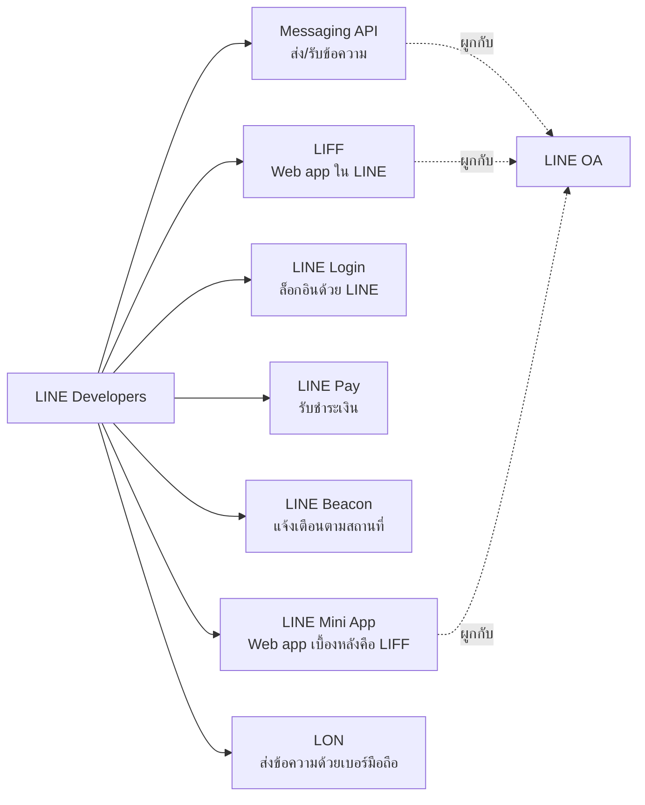

# LINE Developers — เครื่องมือทั้งหมดที่นักพัฒนาต้องรู้จัก

> อยากทำบอท LINE ใช้ Messaging API, อยากทำ Mini App ใช้ LIFF, อยากให้ผู้ใช้ล็อกอินด้วย LINE ใช้ LINE Login — งงไหมว่าแต่ละบริการใช้ทำอะไร? บทนี้จะพาคุณทัวร์บริการของ LINE Developers ทั้งหมดในภาพเดียว เพื่อให้เลือกใช้เครื่องมือได้ถูกงาน

    

## ทำไมต้องรู้เรื่องนี้?

LINE Developers ไม่ใช่ "API ตัวเดียว" แต่เป็น **ชุดของบริการหลายตัว** ที่ใช้แก้ปัญหาต่างกัน ถ้าเปรียบเทียบให้เห็นภาพ — LINE Developers คือ "กล่องเครื่องมือช่าง" ที่มีทั้งไขควง ค้อน ประแจ คุณต้องรู้ว่าอันไหนใช้ขันน็อต อันไหนใช้ตอกตะปู ไม่งั้นอาจหยิบไขควงมาตอกตะปูก็ได้

นักพัฒนามือใหม่หลายคนสับสนว่า "LIFF กับ Mini App ต่างกันยังไง?" หรือ "จะส่งข้อความหาลูกค้าใช้ Messaging API หรือ LON?" — คำตอบอยู่ในบทนี้ เพราะเมื่อเลือกบริการถูกตั้งแต่ต้น ทั้งโปรเจกต์จะไหลลื่น แต่ถ้าเลือกผิดอาจต้องเขียนใหม่ทั้งหมด

## ภาพรวม

บริการเกือบทั้งหมดผูกกับ **LINE OA** ดังนั้นต้องมี LINE OA ก่อนเสมอ

## บริการหลักของ LINE Developers

LINE Developers มีบริการและเครื่องมือที่หลากหลายเพื่อช่วยนักพัฒนาในการสร้างและปรับปรุงแอปพลิเคชันหรือบริการต่าง ๆ บนแพลตฟอร์ม LINE อย่างมีประสิทธิภาพ โดยบริการหลัก ๆ มีดังนี้

### 1. Messaging API

ใช้สร้าง **LINE Chatbot** ที่สามารถส่งและรับข้อความ สติกเกอร์ รูปภาพ วิดีโอ หรือ Flex Message กับผู้ใช้ได้ผ่าน LINE OA

**เหมาะกับ:** บอทตอบแชท บอทแจ้งเตือน สรุปยอดขายอัตโนมัติ ระบบ CS (Customer Service)

https://developers.line.biz/en/services/messaging-api/

### 2. LIFF (LINE Front-end Framework)

เครื่องมือสำหรับสร้าง **Web Application ที่เปิดใช้ภายในแอป LINE ได้โดยตรง** โดยจะได้ข้อมูลผู้ใช้ (userId, display name) แบบไม่ต้องให้ login ใหม่

**เหมาะกับ:** หน้าฟอร์มจองโต๊ะ หน้ากรอกข้อมูลลูกค้า หน้าตะกร้าสินค้า ระบบ E-commerce ใน LINE

https://developers.line.biz/en/services/liff/

### 3. LINE Login

ฟีเจอร์สำหรับให้ผู้ใช้ **ล็อกอินเข้าเว็บไซต์/แอปด้วยบัญชี LINE** ช่วยให้ผู้ใช้เข้าสู่ระบบได้ง่ายและปลอดภัย (ไม่ต้องสมัครใหม่ ไม่ต้องจำรหัสผ่าน)

**เหมาะกับ:** เว็บไซต์ E-commerce ที่อยากให้ลูกค้าล็อกอินเร็ว ระบบสมาชิก ร้านอาหาร-คาเฟ่ที่อยากได้ LINE User ID ของลูกค้า

https://developers.line.biz/en/services/line-login/

### 4. LINE Pay

บริการ **ชำระเงินออนไลน์ผ่าน LINE** ให้ผู้ใช้จ่ายเงินในแอปหรือเว็บไซต์ของคุณได้

**เหมาะกับ:** ร้านค้าออนไลน์ที่อยากรับเงินผ่าน LINE Pay, ระบบ Subscription

https://pay.line.me/portal/global/main

### 5. LINE Beacon

เทคโนโลยีสำหรับส่ง **แจ้งเตือนตามสถานที่** — เมื่อผู้ใช้เข้ามาใกล้อุปกรณ์ Beacon ที่ตั้งไว้ (เช่น ในร้าน) บอทจะทักไปหาโดยอัตโนมัติ

**เหมาะกับ:** ร้านค้าที่อยากทักลูกค้าตอนเข้าร้าน พิพิธภัณฑ์ที่อยากส่งข้อมูลตามห้องนิทรรศการ

https://linedevth.line.me/th/line-beacon

### 6. LINE Mini App

แพลตฟอร์มสร้าง **เว็บแอปที่อยู่บน LINE** ผู้ใช้ไม่ต้องโหลดแอปเพิ่ม เข้าใช้งานได้เลยผ่าน LINE — เบื้องหลัง Mini App คือ LIFF นั่นเอง แต่มี Review Process ที่เข้มงวดกว่าและได้พื้นที่ใน LINE มากกว่า

**เหมาะกับ:** บริการที่ต้องการ scale ใหญ่ มีโอกาสถูก list ใน LINE, แอปที่ต้องการ UX แบบเต็มจอ

https://developers.line.biz/en/services/line-mini-app/

### 7. LON (LINE Official Notification)

บริการส่งข้อความ **ด้วยเบอร์มือถือ** ผ่าน LINE OA โดยมีวัตถุประสงค์ไว้สำหรับ **การอัปเดตสถานะหรือการแจ้งเตือนเท่านั้น** จุดเด่นคือสามารถส่งข้อความหาผู้ใช้ได้ **โดยที่ผู้ใช้ยังไม่จำเป็นต้องแอด LINE OA เป็นเพื่อน**

**เหมาะกับ:** แจ้งเตือน OTP ยืนยันการทำธุรกรรม แจ้งสถานะการจัดส่งสินค้า สำหรับธุรกิจที่มีเบอร์ลูกค้าอยู่แล้ว

https://lineforbusiness.com/th/service/line-official-notifications

## เลือกบริการให้ถูกงาน

| ถ้าต้องการ... | ใช้บริการ |
|--------------|----------|
| ตอบแชทอัตโนมัติ ส่ง Broadcast | Messaging API |
| หน้าเว็บในแชท (ฟอร์ม, ชำระเงิน, ดูสินค้า) | LIFF |
| ให้ลูกค้าล็อกอินเว็บของเราด้วย LINE | LINE Login |
| รับชำระเงิน | LINE Pay |
| ส่งแจ้งเตือน OTP โดยรู้แค่เบอร์ลูกค้า | LON |
| เว็บแอปใหญ่ ต้องการพื้นที่ใน LINE | LINE Mini App |
| แจ้งเตือนเมื่อลูกค้าเข้ามาใกล้ร้าน | LINE Beacon |

## Gotchas

- **LIFF กับ Mini App ใช้ได้แค่บน LINE** — เปิดในเบราว์เซอร์ปกติบางฟีเจอร์จะใช้ไม่ได้ (เช่น `liff.sendMessages()`)
- **LON ต่างจาก Messaging API** — LON ส่งได้แม้ไม่ได้แอดเพื่อน แต่ต้องสมัครผ่าน LINE for Business (ไม่ฟรี) และมีข้อจำกัดว่าต้องเป็นข้อความแจ้งเตือนเท่านั้น
- **LINE Login ≠ LIFF auth** — สองอันให้ userId แต่ flow ต่างกัน LIFF ใช้เมื่ออยู่ในแอป LINE, LINE Login ใช้เมื่ออยู่นอกแอป LINE
- **LINE Pay ในไทยใช้ไม่ได้** (ณ ปัจจุบัน LINE Pay Thailand ปิดบริการแล้ว) ถ้าอยากรับเงินต้องใช้ payment gateway ไทยอื่นผ่าน LIFF

## ข้อผิดพลาดที่มักเจอ

- **พลาด:** ใช้ Messaging API พยายามส่งข้อความหาคนที่ยังไม่ได้แอดเพื่อน
  **ถูก:** Messaging API ส่งได้เฉพาะ user ที่แอดเพื่อนแล้ว ถ้าอยากส่งหาคนที่มีแค่เบอร์มือถือ ใช้ LON

- **พลาด:** สร้างหน้าเว็บปกติแล้วยัดใส่ใน Rich Menu หวังว่าจะได้ userId ของลูกค้า
  **ถูก:** ต้องสร้างเป็น LIFF app เพื่อเรียก `liff.getProfile()` ได้

- **พลาด:** คิดว่า Mini App เป็นของใหม่ที่ต้องเขียนด้วยภาษาพิเศษ
  **ถูก:** Mini App = LIFF + Review Process ใช้ React / Vue / ภาษา Web ปกติได้หมด

## Checklist ก่อนไปต่อ

- [ ] รู้จักครบ 7 บริการหลัก (Messaging API, LIFF, Login, Pay, Beacon, Mini App, LON)
- [ ] เลือกบริการให้ตรงกับ use case ได้
- [ ] เข้าใจว่า LIFF และ Mini App มี LINE เป็น host
- [ ] รู้ว่า LON ต่างจาก Messaging API ตรงไหน

## อ้างอิง

- [LINE Developers Portal](https://developers.line.biz/)
- [Messaging API](https://developers.line.biz/en/services/messaging-api/)
- [LIFF](https://developers.line.biz/en/services/liff/)
- [LINE Login](https://developers.line.biz/en/services/line-login/)
- [LINE Pay](https://pay.line.me/portal/global/main)
- [LINE Beacon (TH)](https://linedevth.line.me/th/line-beacon)
- [LINE Mini App](https://developers.line.biz/en/services/line-mini-app/)
- [LON — LINE Official Notifications](https://lineforbusiness.com/th/service/line-official-notifications)
