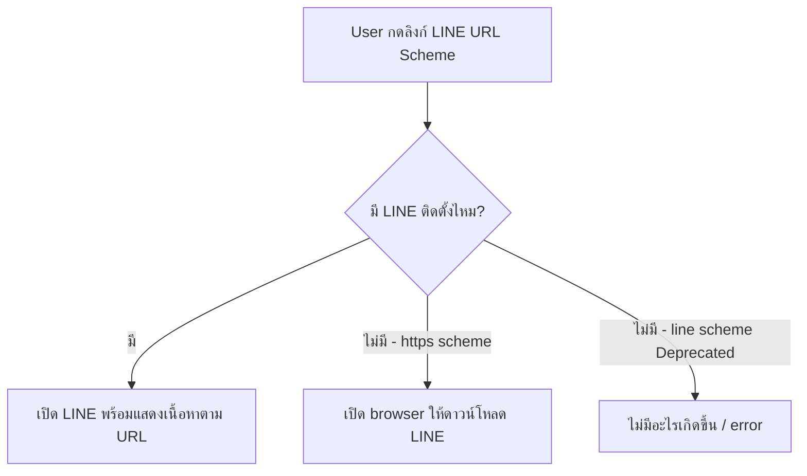

# LINE URL Scheme — ลิงก์วิเศษที่เปิดฟีเจอร์ใน LINE ได้ตรง ๆ

> กดลิงก์แล้วเด้งเข้า LINE เปิดกล้องพร้อมถ่ายรูป, กดลิงก์แล้วเปิดหน้าแชท LINE OA พร้อมพิมพ์ข้อความ "คิดถึงนะ" ไว้ให้เสร็จ — ไม่ใช่เวทมนตร์ แต่คือ **LINE URL Scheme** ชุด URL พิเศษที่ LINE กำหนดไว้สำหรับเปิดฟีเจอร์ต่าง ๆ ภายในแอป LINE

## ทำไมต้องรู้เรื่องนี้?

ลองนึกภาพ Rich Menu ที่มี 6 ช่อง — ช่องหนึ่งอยากให้กดแล้วเปิด **กล้องถ่ายรูป** อีกช่องอยากเปิด **สติกเกอร์ชอป** อีกช่องอยากเปิด **LIFF app** ของเรา ทั้งหมดนี้ไม่ต้องเขียนโค้ดเอง แค่ใส่ URL Scheme ให้ถูก LINE ก็ทำให้หมด

LINE URL Scheme เปรียบเสมือน "ทางลัด" ที่ LINE เตรียมไว้ให้ — เหมือน URL `tel:0812345678` ที่กดแล้วโทรออกบนมือถือ แต่ LINE Scheme ทำงานเฉพาะในแอป LINE เท่านั้น ความสำคัญคือคุณจะใช้มันใน **URI Action ของ Rich Menu, Flex Message, หรือ Quick Reply** ได้ — เป็นของที่ต้องใช้แทบทุกโปรเจกต์

## ภาพรวม

> You can open Sticker Shop, LIFF app or camera with the LINE URL scheme. The LINE URL scheme works with LINE Official Accounts too. You can let users see LINE contents from rich menus with the action to open the LINE URL scheme.
>
> https://developers.line.biz/en/docs/line-login/using-line-url-scheme/



## รูปแบบ LINE URL Scheme ที่รองรับ

| URL scheme | คำอธิบาย |
| --- | --- |
| URL schemes ที่ขึ้นต้นด้วย `https://line.me/R/` | URL scheme สำหรับใช้งานฟีเจอร์ต่าง ๆ ของ LINE app |
| URL schemes ที่ขึ้นต้นด้วย `https://liff.line.me/` | URL scheme สำหรับเปิด [LIFF app](https://developers.line.biz/en/docs/liff/overview/) |
| URL schemes ที่ขึ้นต้นด้วย `https://miniapp.line.me/` | URL scheme สำหรับเปิด [LINE MINI App](https://developers.line.biz/en/docs/line-mini-app/discover/introduction/) |

> **คำเตือน: `line://` ถูกยกเลิกการใช้งานแล้ว (Deprecated)**
>
> scheme `line://` ถูกยกเลิกการใช้งาน (deprecated) เพื่อป้องกันการโจมตีแบบ takeover ที่อาจเปิดแอปที่ไม่ใช่ LINE เมื่อผู้ใช้คลิก URL โดยขัดต่อความตั้งใจของ LY Corporation หรือผู้ใช้ การโจมตีนี้สามารถเกิดขึ้นได้ภายใต้เงื่อนไขบางอย่าง
>
> ยังไม่มีวันที่แน่นอนที่ URL scheme `line://` จะหยุดใช้งานอย่างสมบูรณ์
>
> **ควรใช้ `https://line.me/R/` แทน `line://` เสมอ**

> **หมายเหตุ:** LY Corporation ไม่มี URL scheme สำหรับเปิดแอปอื่นนอกจาก LINE อย่างไรก็ตาม หากแอปของบริษัทอื่นมี URL scheme สำหรับเปิดแอปนั้น สามารถใช้ URL scheme ใน URI action object สำหรับ rich menus หรือ Flex Messages ได้

## สิ่งที่เกิดขึ้นเมื่อคลิก LINE URL Scheme

เมื่อผู้ใช้คลิก URL ที่ใช้ LINE URL scheme บนอุปกรณ์ที่ติดตั้ง LINE แล้ว LINE จะเปิดขึ้นมาโดยอัตโนมัติพร้อมแสดงเนื้อหาที่กำหนดใน URL หากไม่ได้ติดตั้ง LINE จะเกิดสิ่งต่อไปนี้

| LINE URL scheme | สิ่งที่เกิดขึ้นเมื่อไม่ได้ติดตั้ง LINE |
| --- | --- |
| `https://line.me/R/` | เปิดเว็บเบราว์เซอร์และแจ้งให้ผู้ใช้ดาวน์โหลด LINE |
| `line://` (Deprecated) | ไม่มีอะไรเกิดขึ้น หรือผู้ใช้ถูก redirect ไปหน้า error |

## แพลตฟอร์มที่รองรับ

LINE URL scheme รองรับเฉพาะ **LINE สำหรับ iOS** และ **LINE สำหรับ Android** เท่านั้น

> **หมายเหตุ:** LINE URL scheme ไม่รองรับ LINE สำหรับ PC (macOS, Windows)

## ข้อกำหนดเรื่อง Percent-encoding

ค่าพารามิเตอร์ใน LINE URL scheme ต้องทำ [Percent-encoding](https://developer.mozilla.org/en-US/docs/Glossary/Percent-encoding) ในรูปแบบ UTF-8 เสมอ ตัวอย่างเช่น

- LINE ID `@linedevelopers` ต้อง encode เป็น `%40linedevelopers`
- ข้อความ "Hi there!" ต้อง encode เป็น `Hi%20there%21`

หากไม่ทำ percent-encoding สำหรับ LINE ID อาจยังใช้งานได้ แต่ถือว่า deprecated

---

## กล้อง (Camera)

เปิดกล้องหรือม้วนฟิล์ม (Camera Roll) เพื่อให้ผู้ใช้เลือกรูปภาพแชร์ในแชท

> **ข้อจำกัด:** สามารถเปิดกล้องหรือ Camera Roll ด้วย URL scheme ได้เฉพาะจากแชท LINE (รวมถึง LINE OpenChat) เท่านั้น ไม่รองรับในฟีเจอร์อื่นของ LINE, LIFF app หรือแอปอื่นนอกจาก LINE

| LINE URL scheme | คำอธิบาย |
| --- | --- |
| `https://line.me/R/nv/camera/` | เปิดกล้อง (ไม่สามารถระบุกล้องหน้าหรือหลังได้) |
| `https://line.me/R/nv/cameraRoll/single` | เปิด Camera Roll เลือกรูปได้ 1 รูป |
| `https://line.me/R/nv/cameraRoll/multi` | เปิด Camera Roll เลือกรูปได้หลายรูป |

## Location

เปิดหน้าจอข้อมูลตำแหน่งที่ตั้งเพื่อให้ผู้ใช้ส่งตำแหน่งไปยัง LINE Official Account

> **ข้อจำกัด:** ใช้ URL scheme นี้ได้เฉพาะในแชทแบบ 1 ต่อ 1 ระหว่างผู้ใช้กับ LINE Official Account เท่านั้น ไม่รองรับในแชทประเภทอื่น, LIFF app หรือแอปอื่นนอกจาก LINE

| LINE URL scheme | คำอธิบาย |
| --- | --- |
| `https://line.me/R/nv/location/` | เปิดหน้าจอตำแหน่ง ผู้ใช้สามารถปักหมุดบนแผนที่เพื่อเลือกตำแหน่ง |

## Share Official Account

แนะนำและกระตุ้นให้ผู้ใช้และเพื่อนเพิ่ม LINE Official Account

| LINE URL scheme | คำอธิบาย |
| --- | --- |
| https://line.me/R/ti/p/`{Percent-encoded LINE ID}` | เปิดหน้าโปรไฟล์ LINE Official Account (หากเป็นเพื่อนแล้วจะแสดงแชท 1 ต่อ 1) |
| https://line.me/R/nv/recommendOA/`{Percent-encoded LINE ID}` | เปิดหน้าจอ "แชร์ให้" ผู้ใช้เลือกเพื่อน กลุ่มแชท หรือแชทหลายคนเพื่อแชร์ Official Account |

> **หมายเหตุ:** `{Percent-encoded LINE ID}` ต้องทำ percent-encoding ในรูปแบบ UTF-8 เช่น LINE ID `@linedevelopers` ใช้ `%40linedevelopers` สามารถระบุเป็น Basic ID หรือ Premium ID ก็ได้
>
> อย่างไรก็ตาม หาก percent-encode LINE ID ใน URL scheme `https://line.me/R/nv/recommendOA/` จะไม่ทำงานบน LINE เวอร์ชันก่อน 13.8.0 สำหรับ Android

ตัวอย่าง:
```
https://line.me/R/ti/p/@432nnff
https://line.me/R/nv/recommendOA/@432nnffa
```

## เปิดแชทกับ LINE Official Account

| LINE URL scheme | คำอธิบาย |
| --- | --- |
| https://line.me/R/oaMessage/`{Percent-encoded LINE ID}` | เปิดหน้าจอแชทกับ LINE Official Account |
| https://line.me/R/oaMessage/`{Percent-encoded LINE ID}`/?`{text_message}` | เปิดหน้าจอแชทกับ LINE Official Account พร้อมใส่ข้อความที่กำหนดในช่องพิมพ์ข้อความ |

> **หมายเหตุ:** ทั้ง `{Percent-encoded LINE ID}` และ `{text_message}` ต้องทำ percent-encoding ในรูปแบบ UTF-8 เช่น ส่งข้อความ "Hi there!" ไปยัง `@linedevelopers` ใช้ `https://line.me/R/oaMessage/%40linedevelopers/?Hi%20there%21`

## LINE VOOM

```
https://line.me/R/home/public/main?id=@432nnffa
https://line.me/R/home/public/profile?id=@432nnffa
https://line.me/R/home/public/post?id=@432nnffa&postId=1162493740906051690
```

> **หมายเหตุ:** ใน URL scheme ให้ใช้ LINE ID **โดยไม่ต้องใส่ @ นำหน้า** เช่น LINE ID `@linedevelopers` ใช้ `id=linedevelopers`

## Profile

```
https://line.me/R/nv/profile
https://line.me/R/nv/profileSetId
```

## หน้าจอทั่วไปของ LINE

| LINE URL scheme | คำอธิบาย |
| --- | --- |
| `https://line.me/R/nv/chat` | เปิดแท็บแชท |
| `https://line.me/R/nv/commerce` | เปิดแท็บ Shopping |
| `https://line.me/R/nv/timeline` | เปิดหน้าจอ LINE VOOM "Following" |
| `https://line.me/R/nv/wallet` | เปิดแท็บ Wallet |
| `https://line.me/R/nv/addFriends` | เปิดหน้าจอ "เพิ่มเพื่อน" |
| `https://line.me/R/nv/officialAccounts` | เปิดหน้าจอ "LINE Official Accounts" |

## Send Text

เปิดหน้าจอ "แชร์ให้" เพื่อส่งข้อความไปยังเพื่อน กลุ่มแชท หรือ LINE Official Account

> **หมายเหตุ:** `{text_message}` ต้องทำ percent-encoding ในรูปแบบ UTF-8 เช่น "Hi there!" ใช้ `Hi%20there%21`

```
https://line.me/R/share?text=คิดถึงนะ
https://line.me/R/oaMessage/%40432nnffa/?คิดถึงนะ
https://line.me/R/oaMessage/@432nnffa/?%E0%B8%84%E0%B8%B4%E0%B8%94%E0%B8%96%E0%B8%B6%E0%B8%87%E0%B8%99%E0%B8%B0~%20%E0%B8%AA%E0%B8%A7%E0%B8%B1%E0%B8%AA%E0%B8%94%E0%B8%B5%E0%B8%9B%E0%B8%B5%E0%B9%83%E0%B8%AB%E0%B8%A1%E0%B9%88%E2%80%A6.%20%E0%B8%A1%E0%B8%B2%E0%B8%A5%E0%B8%AD%E0%B8%87%E0%B9%83%E0%B8%8A%E0%B9%89%20EX10%E0%B8%81%E0%B8%B1%E0%B8%99
```

## Setting

| LINE URL scheme | คำอธิบาย |
| --- | --- |
| `https://line.me/R/nv/settings` | เปิดหน้าตั้งค่า |
| `https://line.me/R/nv/settings/account` | เปิดตั้งค่าบัญชี |
| `https://line.me/R/nv/connectedApps` | เปิดบัญชี > แอปที่ได้รับอนุญาต |
| `https://line.me/R/nv/connectedDevices` | เปิดบัญชี > อุปกรณ์ที่เชื่อมต่อ |
| `https://line.me/R/nv/settings/privacy` | เปิดตั้งค่าความเป็นส่วนตัว |
| `https://line.me/R/nv/things/deviceLink` | เปิด LINE Things device link |
| `https://line.me/R/nv/settings/sticker` | เปิดตั้งค่าสติกเกอร์ |
| `https://line.me/R/nv/stickerShop/mySticker` | เปิดสติกเกอร์ > สติกเกอร์ของฉัน |
| `https://line.me/R/nv/settings/themeSettingsMenu` (iOS) | เปิดตั้งค่าธีม (iOS) |
| `https://line.me/R/nv/settings/theme` (Android) | เปิดตั้งค่าธีม (Android) |
| `https://line.me/R/nv/themeSettings` | เปิดธีม > ธีมของฉัน |
| `https://line.me/R/nv/notificationServiceDetail` | เปิดการแจ้งเตือน > แอปที่ได้รับอนุญาต |
| `https://line.me/R/nv/settings/chatSettings` | เปิดตั้งค่าแชท |
| `https://line.me/R/nv/suggestSettings` | เปิดแชท > แสดงคำแนะนำ |
| `https://line.me/R/nv/settings/callSettings` | เปิดตั้งค่าการโทร |
| `https://line.me/R/nv/settings/addressBookSync` | เปิดตั้งค่าเพื่อน |
| `https://line.me/R/nv/settings/timelineSettings` | เปิดตั้งค่า LINE VOOM |

## Sticker

| LINE URL scheme | คำอธิบาย |
| --- | --- |
| https://line.me/R/shop/sticker/detail/`{package_id}` | เปิดหน้าข้อมูลชุดสติกเกอร์ |
| https://line.me/R/shop/category/`{category_id}` | เปิดอันดับความนิยมตามหมวดหมู่ |
| https://line.me/R/shop/sticker/author/`{author_id}` | เปิดรายการสติกเกอร์ของผู้สร้าง |
| `https://line.me/R/nv/stickerShop` | เปิด Sticker Shop > HOME |
| `https://line.me/R/shop/sticker/hot` | เปิด Sticker Shop > RANK |
| `https://line.me/R/shop/sticker/new` | เปิด Sticker Shop > NEW |
| `https://line.me/R/shop/sticker/event` | เปิด Sticker Shop > FREE |
| `https://line.me/R/shop/sticker/category` | เปิด Sticker Shop > CATEGORIES |

ตัวอย่าง:
```
https://line.me/R/shop/sticker/detail/14935
https://line.me/R/shop/category/1000082
https://line.me/R/shop/sticker/author/92843
```

## Theme Shop

| LINE URL scheme | คำอธิบาย |
| --- | --- |
| https://line.me/R/shop/theme/detail?id=`{product_id}` | เปิดหน้าข้อมูลธีม ระบุ `{product_id}` จาก URL ของธีมใน [LINE STORE](https://store.line.me/) |

ตัวอย่าง:
```
https://line.me/R/shop/theme/detail?id=91adcead-a898-4d24-927e-88d2156316b9
```

## Call

```
https://line.me/R/calls
https://line.me/R/call/dialpad
https://line.me/R/call/settings
https://line.me/R/call/contacts
https://line.me/R/call/redeem
```

## LIFF

เปิด LIFF app (Web app ที่สร้างด้วย LINE Front-end Framework)

| LINE URL scheme | คำอธิบาย |
| --- | --- |
| https://liff.line.me/`{liffId}` | เปิด LIFF app ด้วย LIFF ID ที่กำหนด |
| https://liff.line.me/`{liffId}`/path_A/path_B/?key1=value1&key2=value2 | เปิด LIFF app พร้อมส่งข้อมูลเพิ่มเติม |

ตัวอย่าง:
```
https://liff.line.me/1656765873-mEbYOaAw
```

> **หมายเหตุ: รูปแบบ LIFF URL เก่าถูกยกเลิกแล้ว (Deprecated)**
>
> รูปแบบ LIFF URL ต่อไปนี้ที่ใช้ใน LIFF v1 ถูกยกเลิกการใช้งานแล้ว:
> - `https://line.me/R/app/{liffId}`
> - `line://app/{liffId}`

## LINE MINI App

เปิด LINE MINI App ด้วย URL scheme

| LINE URL scheme | คำอธิบาย |
| --- | --- |
| https://miniapp.line.me/`{miniAppId}` | เปิด LINE MINI App ด้วย ID ที่กำหนด |

## Browser

เปิด URL ในเบราว์เซอร์ภายนอกแทน LINE In-App Browser

> **หมายเหตุ:** query parameters เหล่านี้ใช้ได้กับทุก URL ที่เข้าถึงจาก LINE app ยกเว้น LIFF app แม้จะเพิ่ม query parameters เหล่านี้ใน LIFF URL ก็จะไม่เปิดในเบราว์เซอร์ภายนอก

| URL พร้อม query parameter | คำอธิบาย |
| --- | --- |
| https://example.com/?`openExternalBrowser=1` | เปิด URL ในเบราว์เซอร์ภายนอก |
| https://example.com/?`openInAppBrowser=0` | เปิด URL ใน Chrome custom tab (เฉพาะ LINE สำหรับ Android) |

ตัวอย่าง:
```
https://ex10.tech?openExternalBrowser=1
https://example.com/?openInAppBrowser=0
```

## Gotchas

- **`line://` ยังใช้งานได้ในบาง ๆ กรณี แต่ต้องเลิกใช้** — ถ้าใส่ `line://` ใน Rich Menu ในอนาคตมันจะพังเงียบ ๆ ไม่มี warning
- **ลืมทำ Percent-encoding สำหรับข้อความภาษาไทย** — เช่น `?text=คิดถึงนะ` อาจใช้งานได้บางเวอร์ชันแต่ไม่ควรพึ่งพา ควร encode ให้เป็น `%E0%B8%84...` เสมอ
- **`openExternalBrowser=1` ไม่ทำงานใน LIFF** — ถ้าอยากให้ผู้ใช้เปิดลิงก์นอกแอป LINE ต้อง redirect ออกจาก LIFF ก่อน แล้วค่อยพ่วง query นี้
- **`/nv/camera/` ต้องมี `/` ปิดท้าย** — ขาด slash อาจทำให้ไม่ทำงานในบางเวอร์ชัน
- **Desktop LINE ใช้ Scheme ไม่ได้** — ถ้า user กดจาก LINE PC จะเปิดเบราว์เซอร์แทน

## ข้อผิดพลาดที่มักเจอ

- **พลาด:** ใส่ `line://` ใน URI Action ของ Flex Message เพราะติดจากตัวอย่างเก่า
  **ถูก:** เปลี่ยนเป็น `https://line.me/R/` เสมอ เพื่อไม่ให้พังในอนาคต

- **พลาด:** ใส่ข้อความภาษาไทยแบบไม่ encode ใน `oaMessage/...?/ข้อความ`
  **ถูก:** encode เป็น UTF-8 percent-encoded ก่อน (ใช้ `encodeURIComponent()` ใน JavaScript)

- **พลาด:** คาดว่า Rich Menu บน LINE PC จะเปิดกล้องได้
  **ถูก:** Camera / Location / cameraRoll **ใช้ได้แค่ iOS และ Android** — PC ใช้ไม่ได้

- **พลาด:** ใส่ `@` หน้า LINE ID ใน VOOM URL เช่น `?id=@linedevelopers`
  **ถูก:** VOOM URL ต้องตัด `@` ออก → `?id=linedevelopers`

## Checklist ก่อนไปต่อ

- [ ] เข้าใจว่า Scheme แต่ละกลุ่ม (`line.me/R`, `liff.line.me`, `miniapp.line.me`) ใช้ต่างกัน
- [ ] ไม่ใช้ `line://` อีกต่อไป
- [ ] Percent-encode ภาษาไทย/อักขระพิเศษทุกครั้ง
- [ ] รู้ว่า Scheme ใดใช้บน Desktop ไม่ได้
- [ ] ทดสอบ URL scheme บนมือถือจริงก่อน deploy Rich Menu

## อ้างอิง

- [Using LINE features with the LINE URL scheme](https://developers.line.biz/en/docs/line-login/using-line-url-scheme/)
- [Percent-encoding — MDN](https://developer.mozilla.org/en-US/docs/Glossary/Percent-encoding)
- [LIFF Overview](https://developers.line.biz/en/docs/liff/overview/)
- [LINE MINI App Introduction](https://developers.line.biz/en/docs/line-mini-app/discover/introduction/)
- [LINE STORE](https://store.line.me/)
