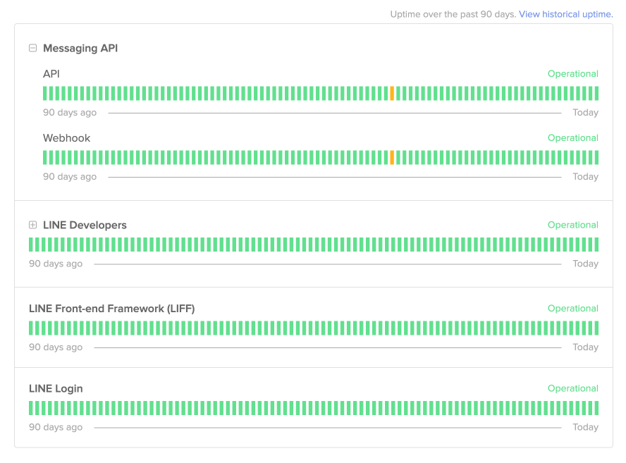
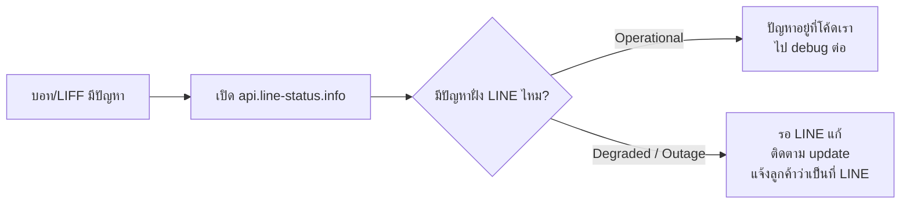
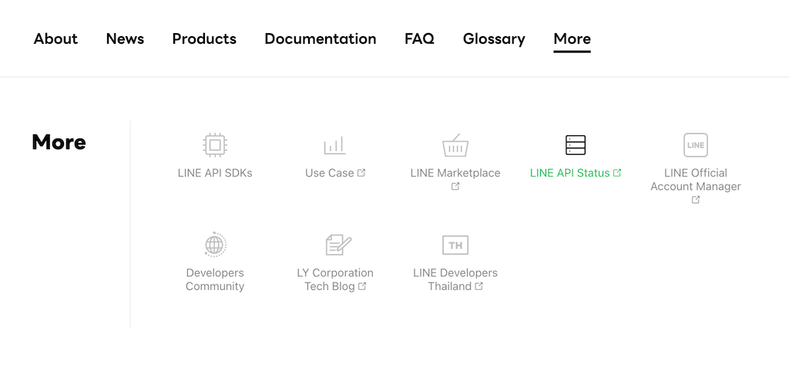

# LINE API Status — เช็คก่อนโทษตัวเอง

> บอทส่งข้อความไม่ออก Webhook ไม่เด้ง LIFF เปิดไม่ขึ้น — ก่อนจะนั่งไล่โค้ดทั้งคืนหรือโทรด่าทีม DevOps ให้เปิดหน้า **LINE API Status** ก่อน บางทีปัญหาไม่ได้อยู่ที่โค้ดคุณ แต่เป็นฝั่ง LINE เองที่ล่ม

    

## ทำไมต้องรู้เรื่องนี้?

ลองนึกภาพ — คุณเพิ่ง deploy บอทตัวใหม่ขึ้น production แล้วลูกค้าโทรมาบอกว่า "บอทพี่ใช้ไม่ได้เลยค่ะ" คุณจะทำยังไง? ถ้ากระโจนเข้าไปแก้โค้ดทันทีโดยไม่เช็คอะไรเลย อาจเสียเวลา 2-3 ชั่วโมงเพื่อแล้วพบว่า **ฝั่ง LINE ล่มเอง** ไม่ได้เกี่ยวกับโค้ดคุณเลย

[LINE API Status](https://api.line-status.info/) คือ "หน้าเช็คอุณหภูมิ" ของระบบ LINE เปรียบเทียบให้เห็นภาพ — มันเหมือน status page ของ AWS หรือ Google Cloud ที่บอกว่าตอนนี้ระบบไหนใช้ได้ ระบบไหนมีปัญหาอยู่ เปิดเช็คใช้เวลาแค่ 5 วินาที แต่ช่วยคุณประหยัดเวลา debug ได้เยอะมาก

นอกจากใช้ตอน **production มีปัญหา** แล้ว ยังเหมาะจะใช้ตอน **Dev กำลังเทสต์แล้วเจอ error แปลก ๆ** เช่น push message ได้บ้างไม่ได้บ้าง หรือ webhook ดีเลย์ 5 นาที บางทีไม่ใช่โค้ดพัง แต่ระบบ LINE กำลัง degraded อยู่

## ภาพรวม

## การเข้าถึงหน้า LINE API Status

เปิดได้ 2 ทาง

### 1. เข้าตรง ๆ ที่ URL

[https://api.line-status.info/](https://api.line-status.info/)

แนะนำให้ **บุ๊กมาร์กไว้ใน browser** หรือ pin tab เอาไว้ ใช้บ่อยแน่นอน

### 2. เข้าผ่านเมนู More ของ LINE Developers

อยู่ทั้งบริเวณส่วนหัว (header) และส่วนท้าย (footer) ของเว็บไซต์ [LINE Developers](https://developers.line.biz/)

    

## บริการที่ครอบคลุมโดย LINE API Status

LINE API Status แสดงสถานะของบริการต่อไปนี้

- **Messaging API**
    - API
    - Webhook
- **LINE Developers**
    - เว็บไซต์ LINE Developers
    - LINE Developers Console
- **LIFF**
    - สถานะการโหลด LIFF app
- **LINE Login**
    - สถานะการ authenticate ผู้ใช้

## บริการที่ **ยังไม่ครอบคลุม**

- LINE app (แอปฝั่งผู้ใช้)
- LINE MINI App
- LINE Pay
- บริการอื่น ๆ นอกจากที่ระบุข้างบน

ดังนั้นถ้าเกิดปัญหากับบริการเหล่านี้ต้องไปเช็ค social หรือข่าวประกาศของ LINE แทน

## หมายเหตุสำคัญเรื่องความถูกต้อง

บริษัท LY จะแจ้งข้อมูลเกี่ยวกับปัญหาที่เกิดขึ้นผ่าน LINE API Status **แต่ไม่รับประกันว่าข้อมูลจะถูกต้อง ทันที หรือครอบคลุมทั้งหมด** รายละเอียดเพิ่มเติมเกี่ยวกับสาเหตุและขอบเขตของผลกระทบ จะถูกแจ้งผ่านข่าวสารในเว็บไซต์ [LINE Developers](https://developers.line.biz/)

แปลว่า — Status page อาจขึ้น "Operational" แต่จริง ๆ มีปัญหาก็ได้ ดังนั้นใช้เป็น **ข้อมูลประกอบการตัดสินใจ** ไม่ใช่คำตอบสุดท้าย

## Gotchas

- **Status page อัปเดตช้ากว่าความเป็นจริง** — บางครั้ง LINE ล่มไปแล้ว 10 นาที status page ยังขึ้น Operational อยู่
- **ครอบคลุมแค่บางบริการ** — LINE Pay / LINE MINI App ไม่อยู่ใน status page นี้
- **ไม่ครอบคลุมแอป LINE ฝั่ง user** — ถ้าแอป LINE ของลูกค้าพังเอง ดูที่นี่ไม่เจอ ต้องเช็คข่าวใน LINE Today หรือ social
- **Webhook delay ไม่นับเป็น outage** — ถ้า webhook ดีเลย์ 3-5 วินาที ถือว่าปกติ (LINE ไม่รับประกัน real-time)

## ข้อผิดพลาดที่มักเจอ

- **พลาด:** ลูกค้าแจ้งว่าบอทใช้ไม่ได้ แล้วกระโจนเข้าไปไล่โค้ด 3 ชั่วโมง สุดท้ายพบว่า LINE ล่มเอง
  **ถูก:** เปิด api.line-status.info เป็น step แรกเสมอ ใช้เวลาแค่ 5 วินาที

- **พลาด:** เห็น Status page ขึ้น "Operational" แล้วชัวร์ว่าไม่ใช่ปัญหาฝั่ง LINE
  **ถูก:** Status page อาจช้ากว่าความเป็นจริง — เช็ค social media และ [LINE Developers News](https://developers.line.biz/en/news/) ประกอบด้วย

- **พลาด:** คาดหวังว่า Status page จะบอกปัญหาของ LINE Pay หรือ Mini App
  **ถูก:** Status page ครอบคลุมแค่ Messaging API, LIFF, LINE Login, และ LINE Developers Console เท่านั้น

## Checklist ก่อนไปต่อ

- [ ] บุ๊กมาร์ก [api.line-status.info](https://api.line-status.info/) ไว้ใน browser
- [ ] ทำให้ **เช็ค status เป็น step แรก** เสมอเมื่อบอทมีปัญหา
- [ ] รู้ว่าบริการไหนอยู่ใน / ไม่อยู่ใน scope ของ status page
- [ ] ถ้าพบ outage จริง อย่าลืมแจ้งลูกค้าว่าเป็นปัญหาฝั่ง LINE (อย่าแบกไว้คนเดียว)

## อ้างอิง

- [LINE API Status](https://api.line-status.info/)
- [LINE Developers](https://developers.line.biz/)
- [LINE Developers News](https://developers.line.biz/en/news/)
