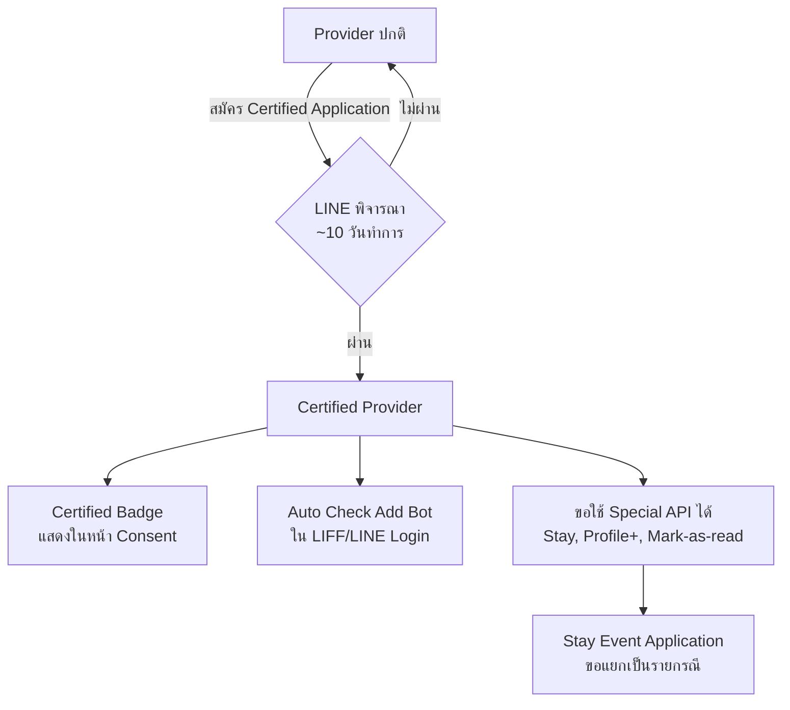

# Certified Provider — บัตรวีไอพีของ LINE Developers

> อยากให้ผู้ใช้กด LIFF ของเราแล้วเห็นตราน่าเชื่อถือ? อยากใช้ Stay Event ที่ตรวจจับ Beacon ได้แม่นขึ้น? อยากปุ่ม "Add friend" ถูกเลือกอัตโนมัติเวลาลูกค้าเข้า LIFF? ทั้งหมดนี้คือสิทธิพิเศษของ **Certified Provider** — สถานะพิเศษที่ LINE มอบให้กับ Provider ที่ได้รับการรับรอง

    

## ทำไมต้องรู้เรื่องนี้?

Certified Provider คือ "ตราวีไอพี" ที่ LINE มอบให้ **ผู้ให้บริการ (Provider)** ที่ผ่านการรับรอง ไม่ใช่ระดับ Channel หรือ LINE OA แต่เป็นระดับ **Provider** — Provider หนึ่งมี Channel (บอท, LIFF, Login) หลายตัวได้ และถ้า Provider ได้ Certified แล้ว Channel ทุกตัวที่อยู่ใต้ Provider นั้นจะได้สิทธิ์ไปด้วยทั้งหมด

เปรียบเทียบให้เห็นภาพ — ถ้า Channel คือ "พนักงาน" ที่ทำงานจริง Certified Provider ก็คือ "บริษัทที่จดทะเบียนแล้ว" พนักงานจะทำสัญญากับลูกค้าแบบเป็นทางการได้ ขอใบเสร็จในนามบริษัทได้ ได้รับความน่าเชื่อถือมากขึ้น นักพัฒนามือโปรและ Agency ใหญ่ในไทยเกือบทุกรายมี Certified Provider ของตัวเอง เพราะบางฟีเจอร์ (เช่น Stay Event) ใช้ไม่ได้เลยถ้าไม่มี Certified

นอกจากนี้ **Certified Provider ≠ Verified OA** — คนละเรื่องกัน ไม่ต้องมีอันใดอันหนึ่งถึงจะขออีกอันได้ ขอ Certified ก่อนก็ได้ ขอ Verified ก่อนก็ได้

Certified Provider คือผู้ให้บริการ (Provider) ที่ได้รับการรับรองจาก LINE โดยจะได้รับสิทธิ์พิเศษในการเข้าถึง API และฟีเจอร์ใหม่ ๆ บน LINE Platform ซึ่งทุก Channel ที่อยู่ภายใต้ Certified Provider นั้นจะได้รับสิทธิ์ตามไปด้วย

## ภาพรวม

---

## ประโยชน์ของการเป็น Certified Provider

| สิทธิพิเศษ | รายละเอียด |
|------------|------------|
| Certified Badge | แสดงในหน้า Consent/Home เพื่อสร้างความน่าเชื่อถือ |
| Auto Check Add Bot | ปุ่ม "Add friend" ถูกเลือกอัตโนมัติเมื่อผู้ใช้เข้าสู่ LIFF หรือ LINE Login |
| Access to Special API | ใช้ API พิเศษได้ เช่น `stay`, `profile+`, `mark-as-read` (ต้องขออนุมัติเป็นรายกรณี) |

---

## ตัวอย่าง API พิเศษ

- **Stay event**
  ส่งสัญญาณทุก 10 วินาทีเมื่อผู้ใช้ยังอยู่ในรัศมี Beacon
  (ใช้กับ DEVIO Beacon ได้)

- **Mark-as-read API**
  ควบคุมเวลา Read ข้อความแบบ manual (ใช้ได้เฉพาะ Premium OA)

---

## วิธีสมัคร Certified Provider

1. **ชื่อ Provider ต้องเป็นบริษัท/องค์กร** ที่จดทะเบียนถูกต้อง
2. ใส่ **Privacy Policy URL** ในทุก Channel ที่อยู่ใต้ Provider
3. กรอกแบบฟอร์ม Certified Provider Application
4. แนบเอกสาร:
   - หนังสือรับรองบริษัท
   - สำเนาบัตรประชาชนผู้มีอำนาจ (หรือใบมอบอำนาจ + บัตร)
5. ส่งเอกสารทั้งหมดไปที่
   **dl_api_th@linecorp.com**

ระยะเวลาพิจารณาประมาณ **10 วันทำการ**

---

## การขอใช้ Stay Event

Stay Event เป็น API พิเศษที่ต้องขอแยกต่างหากจาก Certified Provider ปกติ — มีแบบฟอร์มคนละตัวสำหรับ Certified Provider กับ Developer/นักวิจัย

### สำหรับ Certified Provider

- กรอก Stay event application form (Sheet: `For Certified Provider`)
- แนบ Proposal ระบุ:
  - วัตถุประสงค์การใช้งาน
  - สถานที่ติดตั้ง
  - ระยะเวลาใช้งาน
  - วิธีการเก็บข้อมูลผู้ใช้

### สำหรับ Developer / นักวิจัย

- กรอก Stay event application form (Sheet: `For Developers or Researchers`)
- แนบ Proposal เช่นเดียวกับด้านบน
- ใช้ Beacon ได้ไม่เกิน 5 ตัว
- ขอลองใช้งานฟรี (ระยะเวลา 3 เดือน/รอบ)

---

## หมายเหตุสำคัญ

- **เฉพาะ Official Account แบบ Verified หรือ Premium เท่านั้น** ที่ขอใช้งาน Banner และ Stay Event ได้
- **Certified Provider ไม่จำเป็นต้องเป็น Premium หรือ Verified OA** (แยกสิทธิ์กัน)

---

## คำถามที่พบบ่อย (FAQ)

- **Q: ได้ Certified แล้ว OA เป็นบัญชีแบบไหน?**
  → ได้ทั้งโล่เทา (Unverified), น้ำเงิน (Verified), หรือเขียว (Premium) — Certified Provider ไม่ได้บังคับประเภท OA

- **Q: Certified Provider กับ Verified OA ต่างกันอย่างไร?**
  → **Certified** เป็นระดับ "Provider"
     **Verified** เป็นระดับ "Channel" (บัญชี)
     เป็นสองเรื่องแยกกันคนละเรื่อง

- **Q: ระยะเวลาพิจารณานานไหม?**
  → ประมาณ 10 วันทำการ

---

## Gotchas

- **Certified Provider ≠ Verified OA** — สับสนกันบ่อยมาก นักพัฒนาไทยมักคิดว่าได้อันนึงก็ได้อีกอัน จริง ๆ ต้องขอแยก
- **Stay Event ต้องขอแยกอีกฟอร์ม** — มี Certified แล้วยังใช้ Stay Event ไม่ได้ทันที ต้องส่ง Proposal ขออนุมัติเป็น case-by-case
- **Privacy Policy URL เป็น required** — ถ้า Channel ยังไม่ใส่ใน LINE Developers Console จะโดน reject กลับมาให้แก้
- **Badge แสดงในหน้า Consent เท่านั้น** — ผู้ใช้จะเห็นก็ต่อเมื่อเข้า LIFF/LINE Login ครั้งแรก ไม่เห็นในหน้าแชทของ OA

## ข้อผิดพลาดที่มักเจอ

- **พลาด:** คิดว่าบุคคลธรรมดาก็ขอ Certified Provider ได้
  **ถูก:** ต้องเป็น **บริษัทหรือองค์กรที่จดทะเบียน** เท่านั้น ถ้ายังเป็นฟรีแลนซ์ให้สมัครเป็น Developer/นักวิจัย แทน (เฉพาะการขอ Stay Event)

- **พลาด:** ลืมใส่ Privacy Policy URL ใน Channel ทุกตัว ส่ง Application ไปแล้วโดน reject
  **ถูก:** เช็คทุก Channel ใต้ Provider ว่าใส่ URL ของนโยบายความเป็นส่วนตัวเรียบร้อย ก่อนส่งเอกสาร

- **พลาด:** คิดว่าพอได้ Certified Provider แล้วทุก API พิเศษเปิดให้ใช้ทันที
  **ถูก:** API พิเศษแต่ละตัวต้องขออนุญาตแยก เช่น Stay Event, Mark-as-read — ต้องส่ง Proposal อธิบาย use case

- **พลาด:** สับสนระหว่าง Certified Provider กับ Verified OA
  **ถูก:** Certified = ระดับ Provider, Verified = ระดับ Channel/บัญชี — ไม่เกี่ยวกัน ขอแยกกันได้

## Checklist ก่อนไปต่อ

- [ ] มีบริษัท/องค์กรที่จดทะเบียนถูกต้อง
- [ ] เตรียมหนังสือรับรองบริษัท + สำเนาบัตรประชาชนผู้มีอำนาจ
- [ ] ใส่ Privacy Policy URL ครบทุก Channel ใน Provider
- [ ] เข้าใจว่า Certified ≠ Verified OA
- [ ] ถ้าอยากใช้ Stay Event เตรียม Proposal ให้พร้อม (วัตถุประสงค์/สถานที่/เวลา/การเก็บข้อมูล)
- [ ] ส่งเอกสารไปที่ `dl_api_th@linecorp.com` แล้วรอประมาณ 10 วันทำการ

## อ้างอิง

- [LINE Developers Thailand — Medium](https://medium.com/linedevth)
- [LINE Developers Console](https://developers.line.biz/console/)
- [LINE Developers](https://developers.line.biz/)

---

## ผู้เขียนบทความต้นฉบับ

- Tan Warit
  เผยแพร่ผ่าน [LINE Developers Thailand Medium](https://medium.com/linedevth)
