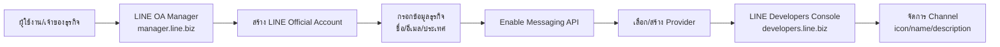
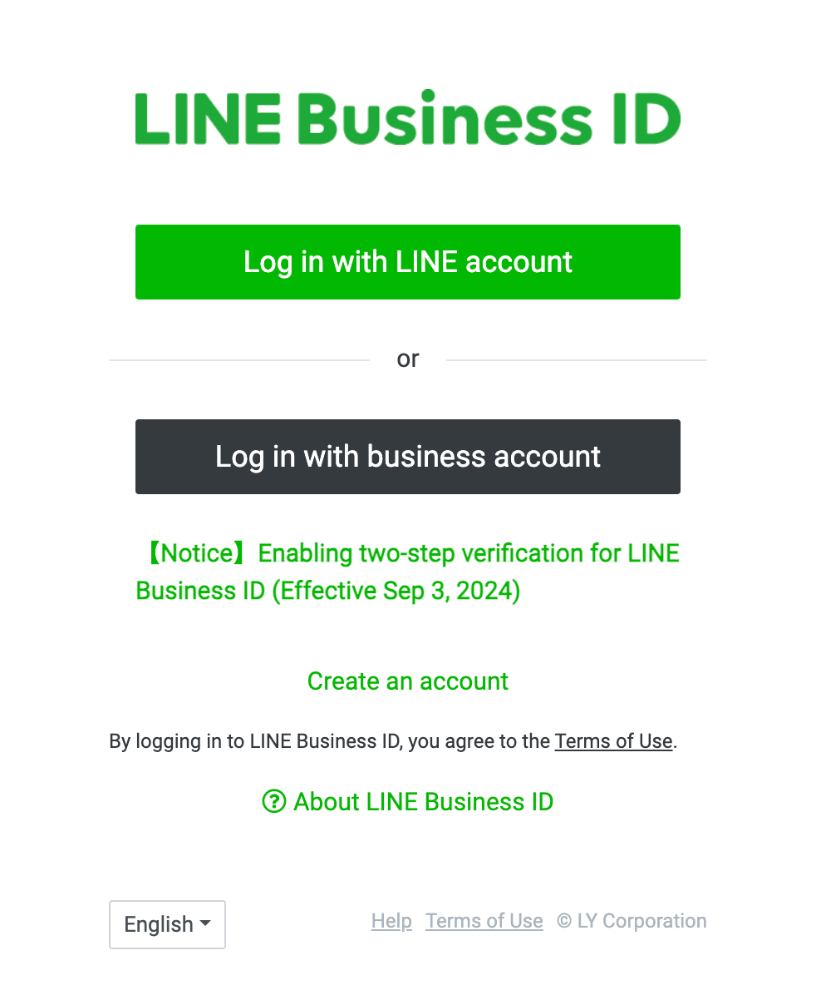
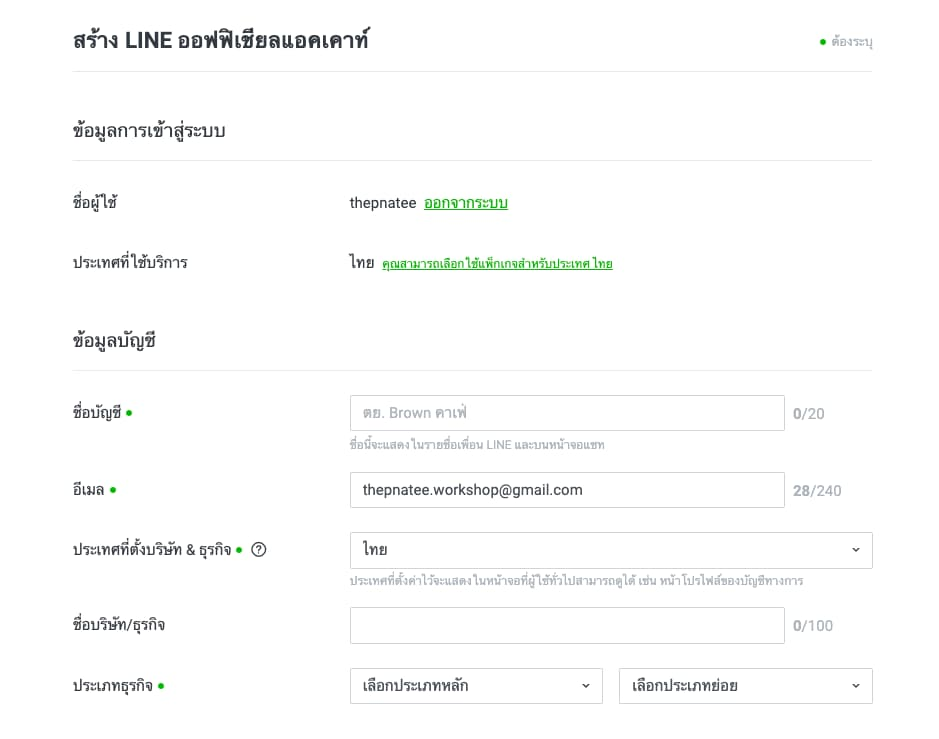
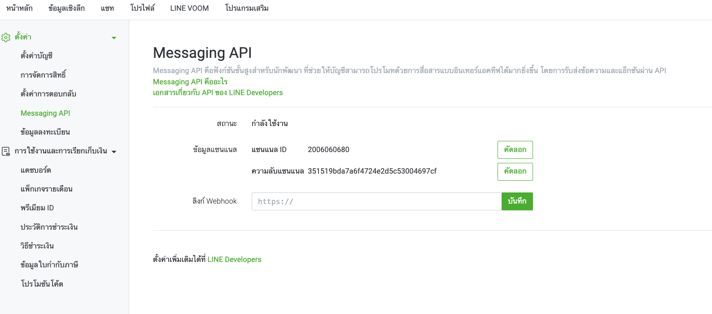
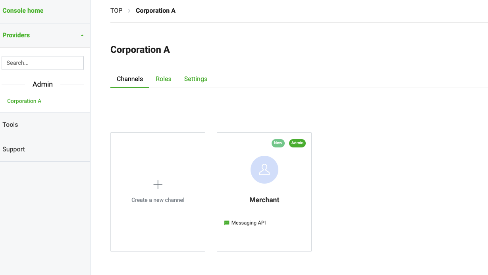

# Workshop: เปิด LINE Official Account — เริ่มต้นบัญชีธุรกิจของคุณ

> อยากทำแชทบอทรับออเดอร์ร้านอาหาร ส่งคูปองให้ลูกค้า หรือทำระบบจองคิวผ่าน LINE? ทุกอย่างเริ่มต้นจากจุดเดียวกัน — **LINE Official Account (LINE OA)** ซึ่งก็เหมือนกับ "หน้าร้าน" บน LINE ที่ลูกค้ากดเพิ่มเพื่อนแล้วคุยกับคุณได้ ขั้นตอนนี้คือประตูบานแรกก่อนจะไปเชื่อมต่อ Messaging API, LIFF, หรือ MINI App ใด ๆ

## ทำไมต้องรู้เรื่องนี้?

ลองนึกภาพว่า LINE OA คือ "หน้าร้าน" ของธุรกิจบน LINE ส่วน **Provider** คือชื่อ "เจ้าของร้าน" และ **Channel** คือ "พนักงานแต่ละคนในร้าน" ที่ดูแลงานคนละหน้าที่ (บางคนส่งข้อความ บางคนดูแล LIFF บางคนดูแล Login)

ถ้าคุณตั้งโครงสร้างพลาดตั้งแต่ตอนเปิดบัญชี — เช่น เอา Channel ไปผูกผิด Provider — ตอนหลังจะย้ายไม่ได้ ต้องสร้างใหม่หมดตั้งแต่ต้น ดังนั้นการเข้าใจ "ลำดับการสร้าง" ตั้งแต่แรกจึงสำคัญมาก

**ประโยชน์จริง:**
- มีหน้าร้านบน LINE ให้ลูกค้ากดเพิ่มเพื่อน
- เป็น foundation ก่อนเชื่อมต่อ Messaging API, LIFF, LINE Login
- จัดการข้อความ, คูปอง, rich menu, broadcast ได้จาก LINE OA Manager
- เชื่อม Provider เดียวกันจะได้ User ID เดียวกันข้าม Channel (สำคัญมากสำหรับ multi-channel app)

## ภาพรวม

## ขั้นตอนการเปิดบัญชี

### 1) เข้าสู่ LINE Official Account Manager

ไปที่ [LINE Official Account Manager (manager.line.biz)](https://manager.line.biz)

### 2) เข้าสู่ระบบด้วย LINE ของคุณ

คลิกปุ่ม **"Log in with LINE account"** (หากอยู่ในระบบแล้ว ข้ามไปขั้นตอนถัดไป)

    

### 3) สร้าง LINE Official Account (LINE OA)

- คลิกปุ่ม **"Create new"** ที่แถบเมนูด้านซ้ายมือ
- ยืนยันบัญชี LINE Business ID ผ่าน SMS (หากมี)
- กรอกข้อมูล LINE Official Account ที่ต้องการสร้าง ดังนี้:

| ช่อง | รายละเอียด | ตัวอย่าง |
|------|-----------|---------|
| **ชื่อบัญชี** | แสดงในรายชื่อเพื่อน LINE และหน้าแชท (สูงสุด 20 ตัวอักษร) | THEPNATEE Workshop |
| **อีเมล** | อีเมลของผู้ดูแลบัญชี | workshop@gmail.com |
| **ประเทศที่ตั้งบริษัท** | ประเทศของธุรกิจ | ไทย |
| **ชื่อบริษัท/ธุรกิจ** | ชื่อนิติบุคคล (สูงสุด 100 ตัวอักษร) | Cloudea Tech |
| **ประเภทธุรกิจ** | เลือกประเภทหลักและประเภทเสริม | Retail / Food & Beverage |

> **หมายเหตุสำคัญ:** หากต้องการสร้าง LINE OA เพื่อให้บริการในประเทศไทย "ประเทศที่ใช้บริการ" จะต้องเป็น **"ไทย"** เท่านั้น มิฉะนั้น LINE Thailand จะไม่สามารถให้การสนับสนุนได้ และไม่สามารถสมัครแพ็กเกจที่ให้บริการในประเทศไทยได้

     

### 4) เชื่อมต่อ LINE Official Account กับ LINE Messaging API

- คลิกที่ LINE Official Account ที่สร้างขึ้น
- คลิกที่ **"Settings"** ในแถบเมนูด้านบน
- คลิกที่ **"Messaging API"** ภายใต้ "Settings" ในแถบเมนูด้านซ้ายมือ
- คลิกปุ่ม **"Enable Messaging API"**
- กรอกชื่อ Provider ที่ต้องการสร้าง หรือเลือกจาก Provider ที่มีอยู่แล้ว
  - **Provider** คือบุคคลที่เป็นนักพัฒนา บริษัท องค์กร หรืออื่น ๆ ที่เป็นผู้ให้บริการดูแลข้อมูลส่วนบุคคลของลูกค้า
  - **ห้าม** มีคำว่า "LINE" อยู่ในชื่อ Provider
- คลิกปุ่ม **"Agree"** เพื่อยืนยันการเชื่อมต่อ

> **หมายเหตุสำคัญ:** หลังจากการเชื่อม Provider แล้ว คุณจะ **ไม่สามารถย้าย Channel ไปยัง Provider อื่น** ได้ในภายหลัง ต้องวางแผนให้รอบคอบก่อนกด Agree

     

### 5) จัดการ Channel ผ่าน LINE Developers Console

- ไปที่ [LINE Developers](https://developers.line.biz/en/)

     

- เลือก Channel ที่ได้ทำการสร้างไว้

     

- สิ่งที่สามารถแก้ไขได้ในหน้า Channel มีดังต่อไปนี้:

| Items                   | Screen where information is displayed                        |
| ----------------------- | ------------------------------------------------------------ |
| Channel icon (optional) | LINE chat screen, icon (only if you have a LIFF app)         |
| Channel name            | LINE chat screen                                             |
| Channel description     | LIFF permission consent screen (only if you have a LIFF app) |
| Privacy (optional)      | LIFF permission consent screen (only if you have a LIFF app) |
| Terms of use (optional) | LIFF permission consent screen (only if you have a LIFF app) |

## ข้อควรระวังในการเชื่อมโยง Channel และ Provider

เมื่อคุณสร้าง Channel แล้ว **คุณไม่สามารถย้ายช่องทางนั้นไปยัง Provider อื่นได้ในภายหลัง**

เมื่อพัฒนาบริการที่เชื่อมโยง **Messaging API channel** และ **LINE Login channel** ควรสร้างทั้งสองช่องทางภายใต้ `Provider` **เดียวกัน**

ผู้ใช้ LINE ที่ใช้บริการจากนักพัฒนาจะได้รับ User ID ผู้ใช้ที่ **แตกต่างกัน** สำหรับแต่ละ `Provider` โดย User ID ผู้ใช้ไม่สามารถใช้ในการระบุผู้ใช้คนเดียวกันข้ามช่องทางที่อยู่ภายใต้ `Provider` ที่แตกต่างกัน

     

### ตัวอย่างเช่น กรณีดังต่อไปนี้ต้องให้ความสนใจเป็นพิเศษ:

- Channel และ Provider ถูกจัดการโดยบุคคลหรือบริษัท
- สร้าง Channel ของบริการหรือบริษัทที่ไม่เกี่ยวข้องภายใต้ Provider เดียวกัน
- Channel ถูกสร้างภายใต้ Provider ที่จัดการโดยบริษัท

กรณีเช่นนี้ อาจเกิดปัญหาในอนาคตจากการที่ไม่สามารถย้าย Channel ระหว่าง Providers ได้ในภายหลัง และข้อเท็จจริงที่ว่า User จะได้รับ ID ที่แตกต่างกันสำหรับ Providers ต่าง ๆ หลังจากพิจารณาความเสี่ยงที่เกี่ยวข้องแล้ว ควรสร้าง Channel ภายใต้ Provider ที่เหมาะสม

## ข้อผิดพลาดที่มักเจอ

- **พลาด:** ตั้งชื่อ Provider มีคำว่า "LINE" แล้วระบบปฏิเสธไม่ให้สร้าง
  **ถูก:** ใช้ชื่อบริษัท/ทีมตัวเอง เช่น "Cloudea Tech" หรือ "THEPNATEE Dev"

- **พลาด:** สร้าง Messaging API channel และ LINE Login channel คนละ Provider ผลคือ userId ของคนเดียวกันได้ค่าต่างกัน
  **ถูก:** วางแผนให้ทุก Channel ของบริการเดียวกันอยู่ภายใต้ **Provider เดียวกัน** ตั้งแต่แรก

- **พลาด:** เลือกประเทศที่ใช้บริการผิด ทำให้สมัครแพ็กเกจไทยไม่ได้และ LINE Thailand support ไม่ได้
  **ถูก:** ถ้าให้บริการในไทย ตั้ง "ประเทศที่ใช้บริการ" เป็น **ไทย** เท่านั้น

- **พลาด:** กด Agree เชื่อม Provider ทันทีโดยไม่คิด พอรู้ว่าย้ายไม่ได้ก็สายไปแล้ว
  **ถูก:** อ่านคำเตือนให้ครบ ตั้งชื่อ Provider ให้สื่อถึงธุรกิจจริง ๆ ก่อนกด

- **พลาด:** ใช้ Provider เดียวไปสร้างบัญชีให้ลูกค้าหลายบริษัท ทำให้ข้อมูลปนกันและดูแลยาก
  **ถูก:** ลูกค้าแต่ละรายควรมี Provider ของตัวเอง แยกการดูแลข้อมูลส่วนบุคคล

## Checklist ก่อนไปต่อ

- [ ] มีบัญชี LINE ส่วนตัวที่ใช้ Login เข้า LINE Business ID ได้
- [ ] สร้าง LINE Official Account สำเร็จ และเห็นในหน้า Manager
- [ ] ตั้ง "ประเทศที่ใช้บริการ" เป็นไทย (ถ้าทำตลาดไทย)
- [ ] กด **Enable Messaging API** และผูก Provider เรียบร้อย
- [ ] ชื่อ Provider สื่อถึงองค์กรของตัวเอง ไม่มีคำว่า "LINE"
- [ ] ตรวจสอบว่า Channel ปรากฏใน [LINE Developers Console](https://developers.line.biz/console/) แล้ว
- [ ] เข้าใจว่า Channel + Provider ย้ายไม่ได้ภายหลัง

## อ้างอิง

- [LINE Official Account Manager](https://manager.line.biz)
- [LINE Developers Console](https://developers.line.biz/console/)
- [Create a LINE Official Account](https://developers.line.biz/en/docs/messaging-api/getting-started/)
- [LINE Contact Center (ติดต่อฝ่ายสนับสนุน)](https://contact-cc.line.me)
