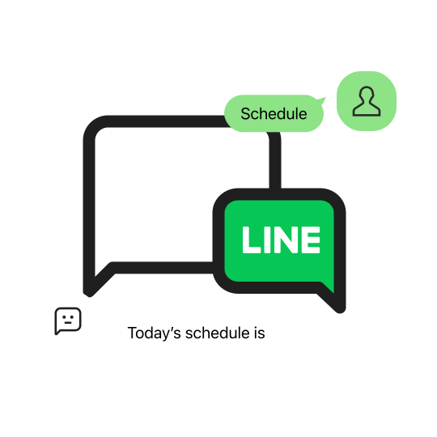
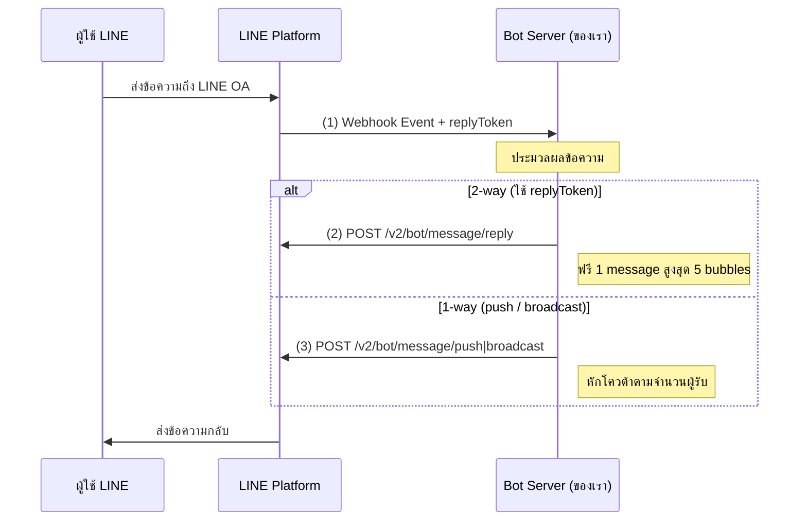
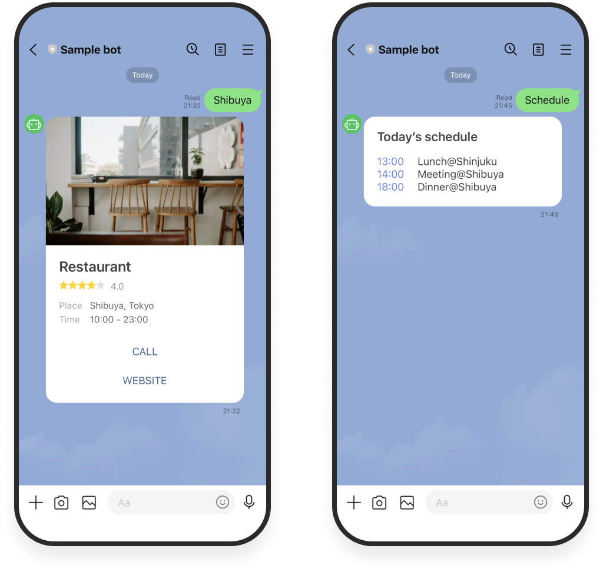
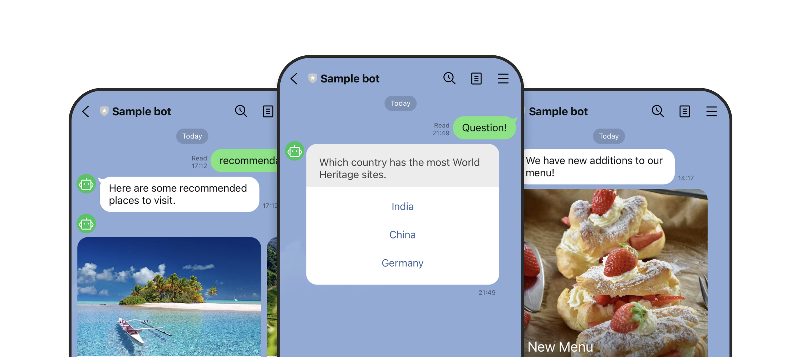

# Workshop: LINE Messaging API — เชื่อมบอทเข้ากับ LINE OA

> อยากให้ LINE Official Account "ตอบกลับลูกค้าเอง" 24 ชั่วโมง? อยาก "ส่งโปรโมชันทุกเช้าวันจันทร์" โดยไม่ต้องนั่งกดส่งเอง? หรืออยากทำระบบให้ลูกค้า "ส่งรูปสลิปมาตรวจอัตโนมัติ"? ทุกอย่างคือ **LINE Messaging API** — ตัวกลางที่ทำให้เซิร์ฟเวอร์ของคุณคุยกับ LINE OA ได้โดยตรง

     

## ทำไมต้องรู้เรื่องนี้?

**LINE Messaging API** คือ API ที่ทำหน้าที่เป็นตัวกลางที่จะเชื่อมต่อ Server ของเราเข้ากับ LINE Official Account ทำให้เราสามารถเขียนโปรแกรมเพื่อสร้างบริการที่เราต้องการ ผ่านการส่งข้อความและโต้ตอบกับผู้ใช้ในลักษณะ Chatbot ได้นั่นเอง

ลองนึกภาพว่า LINE OA คือ "ร้านสะดวกซื้อ" ของคุณ — Messaging API ก็เหมือน "พนักงานหลังเคาน์เตอร์" ที่คอยรับออเดอร์ลูกค้าเข้ามา แล้วส่งข้อความตอบกลับออกไป ทั้งแบบ "ตอบเฉพาะคนที่ถาม" และ "ประกาศเสียงตามสายให้ทุกคนในร้าน"

**ประโยชน์จริง:**
- ให้บอทตอบคำถามลูกค้าแทนแอดมิน 24 ชั่วโมง
- ส่งข้อความทักทายเมื่อลูกค้าเพิ่มเพื่อนใหม่
- รับรูปสลิป/วิดีโอ/เสียง จากลูกค้าแล้วนำไปประมวลผลต่อ
- ส่ง Flex Message ใบเสร็จ, คูปอง, การแจ้งเตือน ได้อย่างสวยงาม
- ทำงานในแชทกลุ่มได้ (เช่น บอทตอบในกลุ่มทีมงาน)

## ภาพรวม

## แนวคิดหลัก: Messaging API มี 2 ส่วน

### ส่วนที่ 1: Webhook (รับข้อมูลเข้า)

1. ผู้ใช้ส่งข้อความไปยัง LINE Official Account
2. เซิร์ฟเวอร์ LINE ส่ง **Webhook Event** ไปยังเซิร์ฟเวอร์ของเราที่ตั้งค่าไว้เป็น Webhook URL ใน [LINE Developers Console](https://developers.line.biz/console/)

### ส่วนที่ 2: API (ส่งข้อมูลออก)

การใช้ API ใน LINE Messaging API สามารถใช้ได้ในสองรูปแบบ:

| รูปแบบ | วิธีการ | ค่าใช้จ่าย |
|--------|---------|----------|
| **2-way (Reply)** | เซิร์ฟเวอร์ของเราเรียกใช้ LINE Messaging API เพื่อส่งข้อความตอบกลับหลังจากได้รับ Webhook Event โดยใช้ **Reply Token** ที่ได้รับจาก Webhook | **ฟรี** 1 ข้อความ สูงสุด 5 Bubbles ไม่หักโควต้า |
| **1-way (Push / Broadcast)** | เซิร์ฟเวอร์ของเราส่งข้อความไปยัง LINE Messaging API เพื่อส่งถึงผู้ใช้โดยตรง | **หักโควต้า** ตามจำนวนผู้ใช้ที่ได้รับข้อความ |

## ความสามารถของ Messaging API

### การส่งข้อความ

บอทของคุณสามารถส่งข้อความถึงผู้ใช้ได้ทุกเมื่อ นอกจากนี้ บอทยังสามารถตอบกลับข้อความของผู้ใช้ได้ด้วยข้อความตอบกลับ (reply message)

     

### แชทแบบ 1 ต่อ 1 และแชทกลุ่ม

คุณสามารถส่งข้อความได้ไม่เพียงแค่กับผู้ใช้ที่ได้เพิ่มบอทของคุณเป็นเพื่อนเท่านั้น แต่ยังสามารถส่งข้อความในห้องแชทกลุ่มที่บอทของคุณถูกเพิ่มเข้าไปด้วย

     

     

## ตัวอย่างการใช้งาน LINE Messaging API

- **ส่งข้อความตอบกลับ**: ส่งข้อความตอบกลับผู้ใช้ที่เพิ่ม LINE Official Account เป็นเพื่อน หรือสนทนากับ LINE Official Account
- **ส่งข้อความ**: ส่งข้อความถึงผู้ใช้ได้ทุกเมื่อ ด้วยหลายรูปแบบของข้อความ เช่น ข้อความ, สติกเกอร์, รูปภาพ, วิดีโอ, และอื่น ๆ
- **รับข้อมูลจากผู้ใช้**: รับรูปภาพ, วิดีโอ, เสียง, และไฟล์ที่ผู้ใช้ส่งมาในแชทกับ LINE Official Account
- **ดึงโปรไฟล์ผู้ใช้**: ดึงข้อมูลโปรไฟล์ของผู้ใช้ LINE ที่เป็นเพื่อนกับ LINE Official Account
- **เข้าร่วมแชทกลุ่ม**: ส่งข้อความและรับข้อมูลสมาชิกในแชทกลุ่ม
- **ใช้งานเมนูที่กำหนดเอง**: ตั้งค่าและปรับแต่งเมนูในแชท (Rich Menu)
- **ใช้งานบีคอน**: โต้ตอบกับผู้ใช้ที่เข้าสู่บริเวณสัญญาณจากอุปกรณ์บีคอน
- **เชื่อมโยงบัญชีผู้ใช้**: เชื่อมโยงบัญชีผู้ใช้กับบัญชี LINE อย่างปลอดภัย
- **ดูจำนวนข้อความที่ส่ง**: ดึงจำนวนข้อความที่ส่งจาก LINE Official Account ผ่าน Messaging API เช่น จำนวน reply / push / multicast / broadcast messages

## ราคาและแพ็กเกจ (Messaging API Pricing)

คุณสามารถเริ่มต้นใช้งาน Messaging API ได้ **ฟรี** โดยทุกคนสามารถใช้งาน Messaging API เพื่อส่งข้อความจาก LINE Official Account ได้

ในแต่ละเดือนคุณสามารถส่งข้อความจำนวนหนึ่งได้ฟรี โดยจำนวนข้อความฟรีจะขึ้นอยู่กับ **แพ็กเกจสมัครสมาชิก (Subscription Plan)** ของ LINE Official Account ซึ่งแพ็กเกจอาจแตกต่างกันไปตามประเทศหรือภูมิภาค สามารถตรวจสอบแพ็กเกจของภูมิภาคของคุณเพื่อดูรายละเอียดเพิ่มเติม

> สำหรับข้อมูลเพิ่มเติมเกี่ยวกับราคา ดูที่ [Messaging API pricing](https://developers.line.biz/en/docs/messaging-api/pricing/)

## ประเภทข้อความที่รองรับ (Message Types)

Messaging API รองรับการส่งข้อความหลายประเภท ดังนี้:

| ประเภท | รายละเอียด |
|---|---|
| Text message | ข้อความตัวอักษร |
| Sticker message | สติกเกอร์ |
| Image message | รูปภาพ |
| Video message | วิดีโอ |
| Audio message | เสียง |
| Location message | ตำแหน่งที่ตั้ง |
| Coupon message | คูปอง |
| Imagemap message | รูปภาพที่สามารถกดได้ |
| Template message | ข้อความแบบเทมเพลต (ปุ่มกด, ยืนยัน, แคโรเซล) |
| Flex Message | ข้อความแบบกำหนดเองที่ยืดหยุ่น |

> สำหรับรายละเอียดเพิ่มเติม ดูที่ [Message types](https://developers.line.biz/en/docs/messaging-api/message-types/)

## LINE Bot SDKs

LINE มี SDK อย่างเป็นทางการสำหรับพัฒนา LINE Bot ซึ่งช่วยให้การเชื่อมต่อกับ Messaging API ทำได้ง่ายขึ้น รองรับหลายภาษาโปรแกรม (Node.js, Python, Java, Go, PHP, Ruby และอื่น ๆ)

> สำหรับรายละเอียดเพิ่มเติม ดูที่ [LINE Messaging API SDKs](https://developers.line.biz/en/docs/messaging-api/line-bot-sdk/)

## Channel Access Token

Channel Access Token คือ Token ที่ใช้สำหรับเรียกใช้งาน Messaging API มีหลายประเภทให้เลือกใช้:

| ประเภท | รายละเอียด |
|---|---|
| Channel access token v2.1 | Token ที่กำหนดระยะเวลาหมดอายุเองได้ **(แนะนำ)** |
| Stateless channel access token | Token แบบไม่มีสถานะ |
| Short-lived channel access token | Token อายุสั้น |
| Long-lived channel access token | Token อายุยาว |

> แนะนำให้ใช้ **Channel access token v2.1** เนื่องจากสามารถกำหนดระยะเวลาหมดอายุได้เอง

## การตั้งค่า Webhook URL

Webhook URL คือ endpoint ของเซิร์ฟเวอร์บอทที่ LINE Platform จะส่ง webhook payload มาให้ โดยมีข้อกำหนดดังนี้:

- ต้องใช้ **HTTPS** เท่านั้น
- ต้องมี **SSL/TLS certificate** ที่ออกโดย Certificate Authority (CA) ที่เว็บเบราว์เซอร์ทั่วไปเชื่อถือ
- **ไม่อนุญาต** ให้ใช้ Self-signed certificate

### ขั้นตอนการตั้งค่า Webhook URL:

1. เข้าสู่ระบบ [LINE Developers Console](https://developers.line.biz/console/) แล้วเลือก Provider ที่ Messaging API channel อยู่
2. คลิกที่ Messaging API channel
3. คลิกแท็บ **Messaging API**
4. คลิก **Edit** ใต้ **Webhook URL** กรอก URL แล้วคลิก **Update**
5. คลิก **Verify** เพื่อทดสอบ ถ้าสำเร็จจะแสดง **Success**
6. เปิดใช้งาน **Use webhook**

## ข้อควรรู้: Greeting Messages และ Auto-reply Messages

> **สำคัญสำหรับบอทที่ใช้ Messaging API**

เมื่อสร้าง Messaging API channel ใหม่ ค่าเริ่มต้นของ **Greeting messages** (ข้อความทักทาย) และ **Auto-reply messages** (ข้อความตอบกลับอัตโนมัติ) จะถูกตั้งเป็น **Enabled** ซึ่งหมายความว่า LINE Official Account จะส่งข้อความอัตโนมัติเมื่อผู้ใช้เพิ่มเพื่อนหรือส่งข้อความมา

หากบอทของคุณจัดการการตอบกลับผ่าน Messaging API อยู่แล้ว **แนะนำให้ปิด (Disabled)** ทั้ง Greeting messages และ Auto-reply messages ใน [LINE Official Account Manager](https://manager.line.biz/) เพื่อหลีกเลี่ยงความสับสนจากข้อความที่ซ้ำซ้อน

คุณสามารถใช้ทั้งสองอย่างร่วมกันได้ เช่น ใช้ Greeting messages สำหรับทักทายเมื่อผู้ใช้เพิ่มเพื่อน แล้วใช้ Messaging API สำหรับการตอบกลับอื่น ๆ แต่หากเป็นการสร้าง LINE Bot ครั้งแรก **แนะนำให้ปิดทั้งสองอย่าง** เพื่อลดความซับซ้อน

## การปรับแต่งโปรไฟล์ธุรกิจ (Business Profile)

คุณสามารถปรับแต่งข้อมูลพื้นฐานของ LINE Official Account ที่แสดงให้ผู้ใช้เห็นได้ เช่น รูปโปรไฟล์, รูปปก, ปุ่ม และปลั๊กอิน โดยตั้งค่าผ่าน [LINE Official Account Manager](https://manager.line.biz/)

## ข้อผิดพลาดที่มักเจอ

- **พลาด:** เปิด Greeting / Auto-reply ใน LINE OA Manager พร้อมกับบอท Messaging API ทำให้ลูกค้าเห็นข้อความซ้ำ 2 ชุด
  **ถูก:** สำหรับบอทครั้งแรก **ปิดทั้งสองอย่าง** ใน LINE OA Manager แล้วให้ Messaging API จัดการทั้งหมด

- **พลาด:** ใช้ Push Message ตอบคนที่ทักมาทุกครั้ง แบบนี้โดนหักโควต้าเต็ม ๆ
  **ถูก:** ใช้ **Reply Token** จาก Webhook Event ตอบกลับ (ฟรี, สูงสุด 5 bubbles) — ใช้ Push เฉพาะตอนต้องส่งแบบ active เท่านั้น

- **พลาด:** ใช้ Webhook URL ที่เป็น HTTP ธรรมดา หรือ self-signed cert ทำให้ Verify ไม่ผ่าน
  **ถูก:** ต้องเป็น **HTTPS** พร้อม certificate จาก CA ที่เชื่อถือได้ (ใช้ Cloudflare, Let's Encrypt, Vercel, Firebase ได้)

- **พลาด:** ใช้ Long-lived token แบบเดิมที่ไม่มีวันหมดอายุ แล้วหลุดออกไป ผู้ใช้งานสามารถยิงเรียก API ของเราได้
  **ถูก:** ใช้ **Channel access token v2.1** กำหนดอายุเอง และ rotate เป็นระยะ

- **พลาด:** ลืมเปิด **Use webhook** ใน Console แม้จะตั้ง URL ถูก ก็ไม่มี event เข้ามา
  **ถูก:** ตั้ง URL → Verify → **เปิด Use webhook toggle** ทุกครั้ง

## Checklist ก่อนไปต่อ

- [ ] สร้าง LINE OA และเชื่อมกับ Messaging API แล้ว
- [ ] มี Channel Access Token (แนะนำ v2.1) เก็บไว้ใน env อย่างปลอดภัย
- [ ] ตั้งค่า Webhook URL เป็น HTTPS และ Verify ผ่าน
- [ ] เปิด toggle **Use webhook** ใน Console
- [ ] ปิด Greeting / Auto-reply ใน LINE OA Manager (ถ้าต้องการให้บอทจัดการเอง)
- [ ] เข้าใจความต่างระหว่าง Reply (ฟรี) กับ Push/Broadcast (หักโควต้า)
- [ ] เลือก SDK ของภาษาที่ใช้งาน หรือเตรียมเรียก REST API ตรง ๆ

## อ้างอิง

- [LINE Messaging API Overview](https://developers.line.biz/en/docs/messaging-api/overview/)
- [LINE Messaging API Reference](https://developers.line.biz/en/reference/messaging-api/)
- [Message types](https://developers.line.biz/en/docs/messaging-api/message-types/)
- [Messaging API pricing](https://developers.line.biz/en/docs/messaging-api/pricing/)
- [LINE Messaging API SDKs](https://developers.line.biz/en/docs/messaging-api/line-bot-sdk/)
- [Emoji list](https://developers.line.biz/en/docs/messaging-api/emoji-list)
