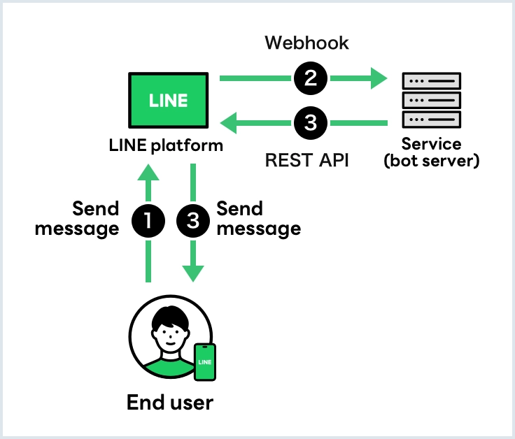

# Webhook Events คืออะไร?

Webhook events เป็นเหตุการณ์ที่เกิดขึ้นกับ Chatbot ของเรา (event trigger) โดยเมื่อ event เกิดขึ้น จะมีการส่งข้อมูลในรูปแบบ JSON ไปยัง Webhook API ที่เราตั้งค่าไว้ ซึ่งข้อมูลใน JSON จะมีรายละเอียดต่าง ๆ รวมถึง replyToken ที่ใช้ในการตอบกลับข้อความของผู้ใช้

<p align="center">
     
</p>


## Webhook Events for Chats

Webhook events ที่เซิร์ฟเวอร์บอทของคุณจะได้รับในแชทแบบตัวต่อตัว, แชทกลุ่ม, และแชทหลายคนมีดังนี้:

| รายการ               | คำอธิบาย                                                            | แชทแบบตัวต่อตัว | แชทกลุ่มและแชทหลายคน |
|----------------------|-------------------------------------------------------------------|------------------|------------------------|
| **Message event**    | เมื่อผู้ใช้ส่งข้อความ คุณสามารถตอบกลับเหตุการณ์นี้ได้              | ✅                | ✅                      |
| **Unsend event**     | เมื่อผู้ใช้ลบข้อความ สำหรับข้อมูลเพิ่มเติมเกี่ยวกับการจัดการเหตุการณ์นี้, ดูที่การประมวลผลเมื่อรับเหตุการณ์ลบข้อความ | ✅                | ✅                      |
| **Follow event**     | เมื่อผู้ใช้เพิ่มบัญชี LINE Official ของคุณเป็นเพื่อน หรือปลดบล็อกบัญชี LINE Official ของคุณ คุณสามารถตอบกลับเหตุการณ์นี้ได้ | ✅                | ❌                      |
| **Unfollow event**   | เมื่อผู้ใช้บล็อกบัญชี LINE Official ของคุณ                         | ✅                | ❌                      |
| **Join event**       | เมื่อบัญชี LINE Official ของคุณเข้าร่วมแชทกลุ่มหรือแชทหลายคน คุณสามารถตอบกลับเหตุการณ์นี้ได้ | ❌                | ✅                      |
| **Leave event**      | เมื่อผู้ใช้ลบบัญชี LINE Official ของคุณออกจากแชทกลุ่มหรือแชทหลายคน หรือบัญชี LINE Official ของคุณออกจากแชทกลุ่มหรือแชทหลายคน | ❌                | ✅                      |
| **Member join event**| เมื่อผู้ใช้เข้าร่วมแชทกลุ่มหรือแชทหลายคนที่บัญชี LINE Official ของคุณเป็นสมาชิก คุณสามารถตอบกลับเหตุการณ์นี้ได้ | ❌                | ✅                      |
| **Member leave event**| เมื่อผู้ใช้ออกจากแชทกลุ่มหรือแชทหลายคนที่บัญชี LINE Official ของคุณเป็นสมาชิก | ❌                | ✅                      |
| **Postback event**   | เมื่อผู้ใช้กระตุ้นการดำเนินการ postback คุณสามารถตอบกลับเหตุการณ์นี้ได้ | ✅                | ✅                      |
| **Video viewing complete event** | เมื่อผู้ใช้ดูวิดีโอที่มี trackingId ที่กำหนดซึ่งส่งมาจากบัญชี LINE Official ของคุณจนเสร็จสิ้น คุณสามารถตอบกลับเหตุการณ์นี้ได้ | ✅                | ❌                      |

✅ เซิร์ฟเวอร์บอทของคุณรับเหตุการณ์นี้  ❌ เซิร์ฟเวอร์บอทของคุณไม่รับเหตุการณ์นี้

### Webhook Events อื่น ๆ (Beacon และ Account Link)

นอกจาก webhook events สำหรับแชทแล้ว ยังมี webhook events สำหรับ Beacon และ Account Link ดังนี้:

| รายการ               | คำอธิบาย                                                            |
|----------------------|-------------------------------------------------------------------|
| **Beacon event**     | เมื่อผู้ใช้เข้าสู่พื้นที่รับสัญญาณของ Beacon คุณสามารถตอบกลับเหตุการณ์นี้ได้ สำหรับข้อมูลเพิ่มเติม ดูที่ [Use beacons with LINE](https://developers.line.biz/en/docs/messaging-api/using-beacons/) |
| **Account link event** | เมื่อผู้ใช้เชื่อมบัญชี LINE กับบัญชีของบริการของคุณ (ในฐานะ provider) คุณสามารถตอบกลับเหตุการณ์นี้ได้ สำหรับข้อมูลเพิ่มเติม ดูที่ [User account linking](https://developers.line.biz/en/docs/messaging-api/linking-accounts/) |

### Webhook เมื่อส่งข้อความผ่าน liff.sendMessages()

ผู้ใช้ไม่สามารถส่ง [template message](https://developers.line.biz/en/reference/messaging-api/#template-messages) หรือ [Flex Message](https://developers.line.biz/en/reference/messaging-api/#flex-message) จากแอป LINE ได้โดยตรง แต่นักพัฒนาสามารถใช้ `liff.sendMessages()` เพื่อส่งข้อความในนามของผู้ใช้ไปยังหน้าจอแชทที่ LINE MINI Apps หรือ LIFF apps เปิดอยู่

> **หมายเหตุ:** เมื่อส่ง template message หรือ Flex Message จากผู้ใช้ผ่าน `liff.sendMessages()` จะ **ไม่มี webhook** ถูกส่งจาก LINE Platform แต่สำหรับประเภทข้อความอื่น ๆ จะมี webhook ถูกส่งตามปกติ

### Message Events

Message events คือเหตุการณ์ที่เกี่ยวข้องกับข้อความที่ส่งจากผู้ใช้ ประเภทของข้อความที่สามารถได้รับได้แก่:

| ประเภทข้อความ       | คำอธิบาย                                                             |
|-----------------------|---------------------------------------------------------------------|
| **text**              | เมื่อผู้ใช้ส่งข้อความตัวอักษร                                      |
| **image**             | เมื่อผู้ใช้ส่งรูปภาพ                                                |
| **video**             | เมื่อผู้ใช้ส่งวิดีโอ                                                |
| **audio**             | เมื่อผู้ใช้ส่งเสียง                                                  |
| **file**              | เมื่อผู้ใช้ส่งไฟล์                                                    |
| **location**          | เมื่อผู้ใช้แชร์ตำแหน่ง                                              |
| **sticker**           | เมื่อผู้ใช้ส่งสติกเกอร์                                              |


Message Events เกิดขึ้นเมื่อผู้ใช้ส่งข้อความไปยังบอท ซึ่งจะมีหลายประเภท แต่ละประเภทจะมีองค์ประกอบและข้อมูลเฉพาะเจาะจงดังนี้:

##### Text Message Event
Message object which contains the text sen from the source.


[emojis](https://developers.line.biz/en/docs/messaging-api/emoji-list)

```json
// When a user sends a text message containing mention and an emoji in a group chat
{
  "destination": "xxxxxxxxxx",
  "events": [
    {
      "replyToken": "nHuyWiB7yP5Zw52FIkcQobQuGDXCTA",
      "type": "message",
      "mode": "active",
      "timestamp": 1462629479859,
      "source": {
        "type": "group",
        "groupId": "Ca56f94637c...",
        "userId": "U4af4980629..."
      },
      "webhookEventId": "01FZ74A0TDDPYRVKNK77XKC3ZR",
      "deliveryContext": {
        "isRedelivery": false
      },
      "message": {
        "id": "444573844083572737",
        "type": "text",
        "quoteToken": "q3Plxr4AgKd...",
        "text": "@All @example Good Morning!! (love)",
        "emojis": [
          {
            "index": 29,
            "length": 6,
            "productId": "5ac1bfd5040ab15980c9b435",
            "emojiId": "001"
          }
        ],
        "mention": {
          "mentionees": [
            {
              "index": 0,
              "length": 4,
              "type": "all"
            },
            {
              "index": 5,
              "length": 8,
              "userId": "U49585cd0d5...",
              "type": "user"
            }
          ]
        }
      }
    }
  ]
}
```

##### Image Message Event
````json
// When two images are sent simultaneously (First image)
{
    "destination": "xxxxxxxxxx",
    "events": [
        {
            "type": "message",
            "message": {
                "type": "image",
                "id": "354718705033693859",
                "quoteToken": "q3Plxr4AgKd...",
                "contentProvider": {
                    "type": "line"
                },
                "imageSet": {
                    "id": "E005D41A7288F41B65593ED38FF6E9834B046AB36A37921A56BC236F13A91855",
                    "index": 1,
                    "total": 2
                }
            },
            "timestamp": 1627356924513,
            "source": {
                "type": "user",
                "userId": "U4af4980629..."
            },
            "webhookEventId": "01FZ74A0TDDPYRVKNK77XKC3ZR",
            "deliveryContext": {
                "isRedelivery": false
            },
            "replyToken": "7840b71058e24a5d91f9b5726c7512c9",
            "mode": "active"
        }
    ]
}

// When two images are sent simultaneously (Second image)
{
    "destination": "xxxxxxxxxx",
    "events": [
        {
            "type": "message",
            "message": {
                "type": "image",
                "id": "354718705033693861",
                "quoteToken": "yHAz4Ua2wx7...",
                "contentProvider": {
                    "type": "line"
                },
                "imageSet": {
                    "id": "E005D41A7288F41B65593ED38FF6E9834B046AB36A37921A56BC236F13A91855",
                    "index": 2,
                    "total": 2
                }
            },
            "timestamp": 1627356924722,
            "source": {
                "type": "user",
                "userId": "U4af4980629..."
            },
            "webhookEventId": "01FZ74A0TDDPYRVKNK77XKC3ZR",
            "deliveryContext": {
                "isRedelivery": false
            },
            "replyToken": "fbf94e269485410da6b7e3a5e33283e8",
            "mode": "active"
        }
    ]
}
````
###### The order in which webhooks are delivered is undefined
If a user simultaneously sends multiple images, multiple webhook events are sent to the bot server from the LINE Platform. The webhooks are delivered in an undefined order, not in the order of the values in imageSet.index.

`imageSet.total` Number
Not always included
The total number of images sent simultaneously. If two images are sent simultaneously, the number is 2. Only included when multiple images are sent simultaneously. However, it won't be included if the sender is using LINE 11.15 or earlier for Android.


##### Video Message Event
Message object which contains the video content sent from the source. The preview image is displayed in the chat and the video is played when the image is tapped.
````json
{
  "destination": "xxxxxxxxxx",
  "events": [
    {
      "replyToken": "nHuyWiB7yP5Zw52FIkcQobQuGDXCTA",
      "type": "message",
      "mode": "active",
      "timestamp": 1462629479859,
      "source": {
        "type": "user",
        "userId": "U4af4980629..."
      },
      "webhookEventId": "01FZ74A0TDDPYRVKNK77XKC3ZR",
      "deliveryContext": {
        "isRedelivery": false
      },
      "message": {
        "id": "325708",
        "type": "video",
        "quoteToken": "q3Plxr4AgKd...",
        "duration": 60000,
        "contentProvider": {
          "type": "external",
          "originalContentUrl": "https://example.com/original.mp4",
          "previewImageUrl": "https://example.com/preview.jpg"
        }
      }
    }
  ]
}
````

##### Audio Message Event
Message object which contains the audio content sent from the source.

````json
{
  "destination": "xxxxxxxxxx",
  "events": [
    {
      "replyToken": "nHuyWiB7yP5Zw52FIkcQobQuGDXCTA",
      "type": "message",
      "mode": "active",
      "timestamp": 1462629479859,
      "source": {
        "type": "user",
        "userId": "U4af4980629..."
      },
      "webhookEventId": "01FZ74A0TDDPYRVKNK77XKC3ZR",
      "deliveryContext": {
        "isRedelivery": false
      },
      "message": {
        "id": "325708",
        "type": "audio",
        "duration": 60000,
        "contentProvider": {
          "type": "line"
        }
      }
    }
  ]
}
````

##### Location Message Event
Message object which contains the location data sent from the source.

````json
{
  "destination": "xxxxxxxxxx",
  "events": [
    {
      "replyToken": "nHuyWiB7yP5Zw52FIkcQobQuGDXCTA",
      "type": "message",
      "mode": "active",
      "timestamp": 1462629479859,
      "source": {
        "type": "user",
        "userId": "U4af4980629..."
      },
      "webhookEventId": "01FZ74A0TDDPYRVKNK77XKC3ZR",
      "deliveryContext": {
        "isRedelivery": false
      },
      "message": {
        "id": "325708",
        "type": "location",
        "title": "my location",
        "address": "1-3 Kioicho, Chiyoda-ku, Tokyo, 102-8282 Japan",
        "latitude": 35.67966,
        "longitude": 139.73669
      }
    }
  ]
}
````

##### Sticker Message Event
Message object which contains the sticker data sent from the source. For a list of basic LINE stickers and sticker IDs, see Stickers.
[Sticker List](https://developers.line.biz/en/docs/messaging-api/sticker-list/)

````json
// Example of animated sticker
{
    "destination": "xxxxxxxxxx",
    "events": [
        {
            "replyToken": "nHuyWiB7yP5Zw52FIkcQobQuGDXCTA",
            "type": "message",
            "mode": "active",
            "timestamp": 1462629479859,
            "source": {
                "type": "user",
                "userId": "U4af4980629..."
            },
            "webhookEventId": "01FZ74A0TDDPYRVKNK77XKC3ZR",
            "deliveryContext": {
                "isRedelivery": false
            },
            "message": {
                "type": "sticker",
                "id": "1501597916",
                "quoteToken": "q3Plxr4AgKd...",
                "stickerId": "52002738",
                "packageId": "11537",
                "stickerResourceType": "ANIMATION",
                "keywords": [
                    "cony",
                    "sally",
                    "Staring",
                    "hi",
                    "whatsup",
                    "line",
                    "howdy",
                    "HEY",
                    "Peeking",
                    "wave",
                    "peek",
                    "Hello",
                    "yo",
                    "greetings"
                ]
            }
        }
    ]
}

// Example of message sticker
{
    "destination": "xxxxxxxxxx",
    "events": [
        {
            "type": "message",
            "message": {
                "type": "sticker",
                "id": "123456789012345678",
                "quoteToken": "q3Plxr4AgKd...",
                "stickerId": "738839",
                "packageId": "12287",
                "stickerResourceType": "MESSAGE",
                "keywords": [
                    "Anticipation",
                    "Sparkle",
                    "Straight face",
                    "Staring",
                    "Thinking"
                ],
                "text": "Let's\nhang out\nthis weekend!"
            },
            "timestamp": 1635756190879,
            "source": {
                "type": "group",
                "groupId": "C99ae82bcd...",
                "userId": "Ub82c8fd9b..."
            },
            "webhookEventId": "01FZ74A0TDDPYRVKNK77XKC3ZR",
            "deliveryContext": {
                "isRedelivery": false
            },
            "replyToken": "ce8c57ec18374a4b94f40abab97145f8",
            "mode": "active"
        }
    ]
}
````

### Quote Token (quoteToken) ใน Webhook Events

ทุก message event จะมี property `quoteToken` ซึ่งเป็นโทเค็นที่ใช้สำหรับการอ้างอิงข้อความ (quote) เมื่อต้องการตอบกลับข้อความ โดย `quoteToken` จะปรากฏอยู่ใน message object ของทุกประเภทข้อความ (text, image, video, audio, location, sticker)

### การรับข้อความที่ผู้ใช้ quote (Quoted Messages)

เมื่อผู้ใช้ส่งข้อความโดยอ้างอิง (quote) ข้อความก่อนหน้า จะสามารถตรวจสอบ ID ของข้อความที่ถูกอ้างอิงได้จาก property `quotedMessageId` ใน `message` ของ webhook event ในกรณีนี้สามารถตรวจสอบ ID ของข้อความที่ถูกอ้างอิงได้ แต่ไม่สามารถดึงเนื้อหาของข้อความนั้น (เช่น ข้อความหรือสติกเกอร์) ได้

```json
{
  "destination": "xxxxxxxxxx",
  "events": [
    {
      "type": "message",
      "message": {
        "type": "text",
        "id": "468789577898262530",
        "quotedMessageId": "468789532432007169",
        "quoteToken": "q3Plxr4AgKd...",
        "text": "Chicken, please."
      },
      "webhookEventId": "01H810YECXQQZ37VAXPF6H9E6T",
      "deliveryContext": {
        "isRedelivery": false
      },
      "timestamp": 1692251666727,
      "source": {
        "type": "group",
        "groupId": "Ca56f94637c...",
        "userId": "U4af4980629..."
      },
      "replyToken": "38ef843bde154d9b91c21320ffd17a0f",
      "mode": "active"
    }
  ]
}
```

สำหรับข้อมูลเพิ่มเติมเกี่ยวกับ `quotedMessageId` ดูที่ [text](https://developers.line.biz/en/reference/messaging-api/#wh-text) และ [sticker](https://developers.line.biz/en/reference/messaging-api/#wh-sticker) ของ [Message event](https://developers.line.biz/en/reference/messaging-api/#message-event)

### การจัดการ Mention (mention.mentionees) ใน Webhook Events

เมื่อผู้ใช้ส่งข้อความที่มีการ mention (กล่าวถึง) ผู้ใช้คนอื่นหรือบอท ข้อมูล mention จะถูกส่งมาใน `mention.mentionees` array ของ text message object โดยมีรายละเอียดดังนี้:

| Property | คำอธิบาย |
|----------|---------|
| `mention.mentionees[].index` | ตำแหน่งเริ่มต้นของ mention ในข้อความ |
| `mention.mentionees[].length` | ความยาวของ mention ในข้อความ |
| `mention.mentionees[].type` | ประเภทของ mention: `user` (ผู้ใช้คนเดียว) หรือ `all` (mention ทุกคน @All) |
| `mention.mentionees[].userId` | user ID ของผู้ที่ถูก mention (มีเฉพาะเมื่อ type เป็น `user`) |
| `mention.mentionees[].isSelf` | เป็น `true` เมื่อผู้ที่ถูก mention คือบอทตัวเอง |

#### Webhook เมื่อข้อความ mention บอท

หากข้อความที่ผู้ใช้ส่งมี mention ถึงบอทของคุณ ค่าใน text message object จะถูกตั้งค่าดังนี้:

- `mention.mentionees[].type` จะเป็น `user`
- `mention.mentionees[].userId` จะเป็น user ID ของบอท
- `mention.mentionees[].isSelf` จะเป็น `true`

```json
"message": {
  "id": "444573844083572737",
  "type": "text",
  "quoteToken": "q3Plxr4AgKd...",
  "text": "@example_bot Good Morning!!",
  "mention": {
    "mentionees": [
      {
        "index": 0,
        "length": 12,
        "userId": "{user ID of the bot}",
        "type": "user",
        "isSelf": true
      }
    ]
  }
}
```

> **หมายเหตุ:** สามารถตรวจสอบ user ID ของบอทได้จาก property `destination` ใน request body ของ webhook หรือจาก property `userId` ที่ได้จากการเรียก [Get bot info](https://developers.line.biz/en/reference/messaging-api/#get-bot-info) endpoint

### การประมวลผลเมื่อรับ Unsend Event

ผู้ใช้สามารถยกเลิกการส่งข้อความ (unsend) ได้ภายในระยะเวลาที่กำหนดหลังจากส่งข้อความ เมื่อผู้ใช้ยกเลิกการส่งข้อความ [unsend event](https://developers.line.biz/en/reference/messaging-api/#unsend-event) จะถูกส่งไปยังเซิร์ฟเวอร์บอท

เมื่อได้รับ unsend event แนะนำให้เคารพเจตนาของผู้ใช้ในการยกเลิกการส่งข้อความ และจัดการข้อความอย่างเหมาะสม เช่น:
- ยกเลิกการแสดงข้อความเป้าหมายบนหน้าจอจัดการของคุณ
- ลบข้อความเป้าหมายที่จัดเก็บไว้ในฐานข้อมูลหรืออุปกรณ์จัดเก็บข้อมูลอื่น ๆ

### การส่ง Webhook ซ้ำ (Webhook Redelivery)

Messaging API มีฟีเจอร์ส่ง webhook ซ้ำเมื่อเซิร์ฟเวอร์บอทไม่สามารถรับ webhook ได้ หากเซิร์ฟเวอร์บอทไม่สามารถตอบกลับ webhook ได้ตามปกติ เนื่องจากการเข้าถึงมากเกินไปชั่วคราวหรือเหตุผลอื่น ๆ webhook จะถูกส่งซ้ำจาก LINE Platform ในช่วงระยะเวลาหนึ่ง

#### วิธีเปิดใช้งาน Webhook Redelivery:
1. เปิดหน้าจอตั้งค่าช่องทางจาก [LINE Developers Console](https://developers.line.biz/console/)
2. คลิกแท็บ **Messaging API**
3. เปิดใช้งาน **Use webhook**
4. เปิดใช้งาน **Webhook redelivery**

#### ข้อควรทราบ:
- webhook event เดียวกันอาจถูกส่งไปยังเซิร์ฟเวอร์บอทมากกว่าหนึ่งครั้ง ใช้ `webhookEventId` เพื่อตรวจจับรายการที่ซ้ำ
- ลำดับของ webhook events ที่ได้รับอาจแตกต่างจากลำดับที่เหตุการณ์เกิดขึ้น ให้ตรวจสอบ `timestamp` เพื่อยืนยันบริบท
- เนื้อหาของ webhook event ที่ถูกส่งซ้ำจะเหมือนกับต้นฉบับ ยกเว้นค่า `deliveryContext.isRedelivery` จะเป็น `true`
- reply token ที่รวมอยู่ใน webhook event ที่ถูกส่งซ้ำยังสามารถใช้ได้ ยกเว้นบางกรณี

#### เงื่อนไขการส่ง Webhook ซ้ำ:
- Webhook redelivery ถูกเปิดใช้งาน
- เซิร์ฟเวอร์บอทไม่ได้ส่งคืน status code `2xx` สำหรับ webhook นั้น

### เครื่องมือตรวจสอบข้อผิดพลาดของ Webhook (Webhook Error Investigation)

Messaging API มีฟีเจอร์ตรวจสอบสาเหตุข้อผิดพลาดและสถิติเมื่อส่ง webhook ซึ่งเป็นประโยชน์สำหรับการทำความเข้าใจสถานะการส่ง webhook เมื่อ webhook ไม่ได้รับเนื่องจากปัญหาบนเซิร์ฟเวอร์บอท เป็นต้น

สำหรับข้อมูลเพิ่มเติม ดูที่ [Check webhook error causes and statistics](https://developers.line.biz/en/docs/messaging-api/check-webhook-error-statistics/)

### Get content


Endpoint: `GET `
```curl
https://api-data.line.me/v2/bot/message/{messageId}/content
```
#### ฟังก์ชันหลัก:

- ใช้เพื่อดึงข้อมูลเนื้อหาหรือไฟล์ที่ส่งผ่านทาง LINE Messaging API โดยเฉพาะไฟล์ที่เป็นภาพ, วิดีโอ, เสียง, หรือไฟล์อื่น ๆ ที่ถูกส่งมาผ่านทาง LINE Bot
- เมื่อคุณได้รับ messageId ของข้อความที่มีการส่งไฟล์มา (เช่น รูปภาพหรือเสียง) คุณสามารถใช้ API นี้ในการดาวน์โหลดไฟล์ดังกล่าว

#### Parameter:
- {messageId}: เป็น ID ของข้อความที่คุณต้องการดึงเนื้อหามา

#### Response:

- API นี้จะส่งกลับข้อมูลเป็นไฟล์เนื้อหาที่ถูกส่งมาผ่าน LINE ซึ่งจะอยู่ในรูปแบบของ binary data (เช่น ไฟล์ภาพ, ไฟล์เสียง)

- **เนื้อหาจะถูกลบโดยอัตโนมัติหลังจากผ่านไปช่วงระยะเวลาหนึ่งนับจากเวลาที่ข้อความถูกส่ง ไม่มีการรับประกันว่าเนื้อหาจะถูกเก็บไว้นานแค่ไหน**

### Get preview image (ดึงรูปภาพตัวอย่าง)

Endpoint: `GET`
```curl
https://api-data.line.me/v2/bot/message/{messageId}/content/preview
```

#### ฟังก์ชันหลัก:
- ใช้เพื่อดึงรูปภาพตัวอย่าง (preview) ของรูปภาพหรือวิดีโอที่ผู้ใช้ส่งมา
- รูปภาพตัวอย่างคือข้อมูลรูปภาพที่ถูกแปลงให้มีขนาดข้อมูลเล็กกว่าเนื้อหาต้นฉบับ
- สามารถใช้เป็น thumbnail เช่น เมื่อสร้างระบบ CRM สามารถแสดง thumbnail ขณะดาวน์โหลดรูปภาพหรือวิดีโอขนาดใหญ่ ช่วยให้ผู้ใช้ประเมินเนื้อหาได้อย่างรวดเร็ว

### Get user profile (ดึงข้อมูลโปรไฟล์ผู้ใช้)

สามารถดึงข้อมูลโปรไฟล์ LINE ของผู้ใช้ (ชื่อที่แสดง, user ID, URL รูปโปรไฟล์, ข้อความสถานะ ฯลฯ) โดยใช้ user ID ที่ได้จาก webhook

Endpoint: `GET`
```curl
https://api.line.me/v2/bot/profile/{userId}
```

#### ตัวอย่าง Response:
```json
{
  "displayName": "LINE Botto",
  "userId": "U4af4980629...",
  "pictureUrl": "https://profile.line-scdn.net/ch/v2/p/uf9da5ee2b...",
  "statusMessage": "Hello world!"
}
```