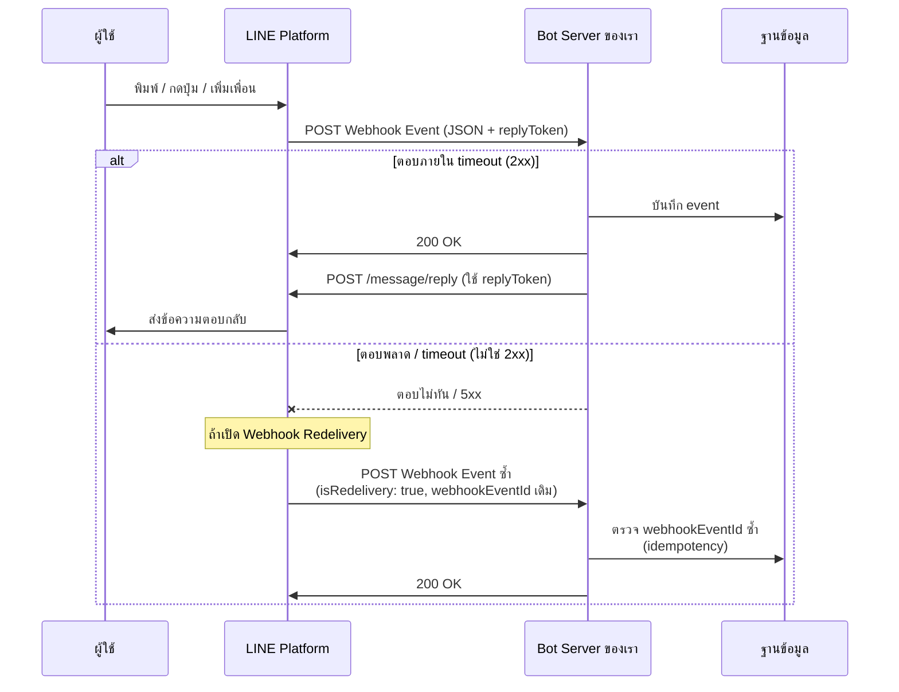

# Workshop: Webhook Events — หูตาของบอทในโลก LINE

> เมื่อลูกค้า "พิมพ์ข้อความ", "ส่งสติกเกอร์", "เพิ่มเพื่อน", "บล็อกบอท" หรือแม้แต่ "ลบข้อความ" — บอทของคุณรู้ได้ยังไง? ทั้งหมดนี้คือ **Webhook Events** กลไกที่ LINE Platform ยิง request มาบอกเซิร์ฟเวอร์ของคุณทุกครั้งที่มีอะไรเกิดขึ้น ถ้าไม่มี webhook บอทก็จะ "หูหนวกตาบอด" ไม่รู้เลยว่าต้องตอบอะไร

<p align="center">
     
</p>

## ทำไมต้องรู้เรื่องนี้?

Webhook events เป็นเหตุการณ์ที่เกิดขึ้นกับ Chatbot ของเรา (event trigger) โดยเมื่อ event เกิดขึ้น จะมีการส่งข้อมูลในรูปแบบ JSON ไปยัง Webhook API ที่เราตั้งค่าไว้ ซึ่งข้อมูลใน JSON จะมีรายละเอียดต่าง ๆ รวมถึง **replyToken** ที่ใช้ในการตอบกลับข้อความของผู้ใช้

ลองนึกภาพว่าบอทคือ "พนักงานต้อนรับ" ส่วน LINE Platform คือ "กริ่งหน้าประตู" — ทุกครั้งที่ลูกค้ามา กริ่งจะดัง แล้วบอกว่า "ใครมา, มาทำอะไร, ส่งอะไรมา" ซึ่งพนักงานต้อง **ตอบรับภายในไม่กี่วินาที** ไม่งั้น LINE จะคิดว่าประตูเสีย และอาจลองกดกริ่งซ้ำ (redelivery)

**ประโยชน์จริง:**
- รู้ว่าลูกค้าเพิ่ม/บล็อกเพื่อน → เก็บฐานลูกค้าอัตโนมัติ
- รู้ว่าลูกค้าส่งรูป/วิดีโอ → ประมวลผลและตอบกลับ
- รู้ว่าลูกค้ากดปุ่มใน Flex Message (postback) → ทำ workflow ต่อ
- รู้ว่าลูกค้าดูวิดีโอจบ → ยิง conversion event
- รู้ว่าลูกค้าเข้าพื้นที่ beacon → ส่งโปรโมชัน

## ภาพรวม: วงจรชีวิตของ Webhook



## Webhook Events for Chats

Webhook events ที่เซิร์ฟเวอร์บอทของคุณจะได้รับในแชทแบบตัวต่อตัว, แชทกลุ่ม, และแชทหลายคนมีดังนี้:

| รายการ               | คำอธิบาย                                                            | แชทแบบตัวต่อตัว | แชทกลุ่มและแชทหลายคน |
|----------------------|-------------------------------------------------------------------|------------------|------------------------|
| **Message event**    | เมื่อผู้ใช้ส่งข้อความ คุณสามารถตอบกลับเหตุการณ์นี้ได้              | ใช่                | ใช่                      |
| **Unsend event**     | เมื่อผู้ใช้ลบข้อความ สำหรับข้อมูลเพิ่มเติมเกี่ยวกับการจัดการเหตุการณ์นี้, ดูที่การประมวลผลเมื่อรับเหตุการณ์ลบข้อความ | ใช่                | ใช่                      |
| **Follow event**     | เมื่อผู้ใช้เพิ่มบัญชี LINE Official ของคุณเป็นเพื่อน หรือปลดบล็อกบัญชี LINE Official ของคุณ คุณสามารถตอบกลับเหตุการณ์นี้ได้ | ใช่                | ไม่ใช่                      |
| **Unfollow event**   | เมื่อผู้ใช้บล็อกบัญชี LINE Official ของคุณ                         | ใช่                | ไม่ใช่                      |
| **Join event**       | เมื่อบัญชี LINE Official ของคุณเข้าร่วมแชทกลุ่มหรือแชทหลายคน คุณสามารถตอบกลับเหตุการณ์นี้ได้ | ไม่ใช่                | ใช่                      |
| **Leave event**      | เมื่อผู้ใช้ลบบัญชี LINE Official ของคุณออกจากแชทกลุ่มหรือแชทหลายคน หรือบัญชี LINE Official ของคุณออกจากแชทกลุ่มหรือแชทหลายคน | ไม่ใช่                | ใช่                      |
| **Member join event**| เมื่อผู้ใช้เข้าร่วมแชทกลุ่มหรือแชทหลายคนที่บัญชี LINE Official ของคุณเป็นสมาชิก คุณสามารถตอบกลับเหตุการณ์นี้ได้ | ไม่ใช่                | ใช่                      |
| **Member leave event**| เมื่อผู้ใช้ออกจากแชทกลุ่มหรือแชทหลายคนที่บัญชี LINE Official ของคุณเป็นสมาชิก | ไม่ใช่                | ใช่                      |
| **Postback event**   | เมื่อผู้ใช้กระตุ้นการดำเนินการ postback คุณสามารถตอบกลับเหตุการณ์นี้ได้ | ใช่                | ใช่                      |
| **Video viewing complete event** | เมื่อผู้ใช้ดูวิดีโอที่มี trackingId ที่กำหนดซึ่งส่งมาจากบัญชี LINE Official ของคุณจนเสร็จสิ้น คุณสามารถตอบกลับเหตุการณ์นี้ได้ | ใช่                | ไม่ใช่                      |

> **หมายเหตุ:** "ใช่" = เซิร์ฟเวอร์บอทของคุณรับเหตุการณ์นี้, "ไม่ใช่" = ไม่รับเหตุการณ์นี้

### Webhook Events อื่น ๆ (Beacon และ Account Link)

นอกจาก webhook events สำหรับแชทแล้ว ยังมี webhook events สำหรับ Beacon และ Account Link ดังนี้:

| รายการ               | คำอธิบาย                                                            |
|----------------------|-------------------------------------------------------------------|
| **Beacon event**     | เมื่อผู้ใช้เข้าสู่พื้นที่รับสัญญาณของ Beacon คุณสามารถตอบกลับเหตุการณ์นี้ได้ สำหรับข้อมูลเพิ่มเติม ดูที่ [Use beacons with LINE](https://developers.line.biz/en/docs/messaging-api/using-beacons/) |
| **Account link event** | เมื่อผู้ใช้เชื่อมบัญชี LINE กับบัญชีของบริการของคุณ (ในฐานะ provider) คุณสามารถตอบกลับเหตุการณ์นี้ได้ สำหรับข้อมูลเพิ่มเติม ดูที่ [User account linking](https://developers.line.biz/en/docs/messaging-api/linking-accounts/) |

### Webhook เมื่อส่งข้อความผ่าน liff.sendMessages()

ผู้ใช้ไม่สามารถส่ง [template message](https://developers.line.biz/en/reference/messaging-api/#template-messages) หรือ [Flex Message](https://developers.line.biz/en/reference/messaging-api/#flex-message) จากแอป LINE ได้โดยตรง แต่นักพัฒนาสามารถใช้ `liff.sendMessages()` เพื่อส่งข้อความในนามของผู้ใช้ไปยังหน้าจอแชทที่ LINE MINI Apps หรือ LIFF apps เปิดอยู่

> **หมายเหตุ:** เมื่อส่ง template message หรือ Flex Message จากผู้ใช้ผ่าน `liff.sendMessages()` จะ **ไม่มี webhook** ถูกส่งจาก LINE Platform แต่สำหรับประเภทข้อความอื่น ๆ จะมี webhook ถูกส่งตามปกติ

## Message Events

Message events คือเหตุการณ์ที่เกี่ยวข้องกับข้อความที่ส่งจากผู้ใช้ ประเภทของข้อความที่สามารถได้รับได้แก่:

| ประเภทข้อความ       | คำอธิบาย                                                             |
|-----------------------|---------------------------------------------------------------------|
| **text**              | เมื่อผู้ใช้ส่งข้อความตัวอักษร                                      |
| **image**             | เมื่อผู้ใช้ส่งรูปภาพ                                                |
| **video**             | เมื่อผู้ใช้ส่งวิดีโอ                                                |
| **audio**             | เมื่อผู้ใช้ส่งเสียง                                                  |
| **file**              | เมื่อผู้ใช้ส่งไฟล์                                                    |
| **location**          | เมื่อผู้ใช้แชร์ตำแหน่ง                                              |
| **sticker**           | เมื่อผู้ใช้ส่งสติกเกอร์                                              |

Message Events เกิดขึ้นเมื่อผู้ใช้ส่งข้อความไปยังบอท ซึ่งจะมีหลายประเภท แต่ละประเภทจะมีองค์ประกอบและข้อมูลเฉพาะเจาะจงดังนี้

### Text Message Event

Message object ซึ่งประกอบด้วยข้อความที่ส่งจากต้นทาง รองรับการแนบ [emojis](https://developers.line.biz/en/docs/messaging-api/emoji-list) และการ mention

```json
// When a user sends a text message containing mention and an emoji in a group chat
{
  "destination": "xxxxxxxxxx",
  "events": [
    {
      "replyToken": "nHuyWiB7yP5Zw52FIkcQobQuGDXCTA",
      "type": "message",
      "mode": "active",
      "timestamp": 1462629479859,
      "source": {
        "type": "group",
        "groupId": "Ca56f94637c...",
        "userId": "U4af4980629..."
      },
      "webhookEventId": "01FZ74A0TDDPYRVKNK77XKC3ZR",
      "deliveryContext": {
        "isRedelivery": false
      },
      "message": {
        "id": "444573844083572737",
        "type": "text",
        "quoteToken": "q3Plxr4AgKd...",
        "text": "@All @example Good Morning!! (love)",
        "emojis": [
          {
            "index": 29,
            "length": 6,
            "productId": "5ac1bfd5040ab15980c9b435",
            "emojiId": "001"
          }
        ],
        "mention": {
          "mentionees": [
            {
              "index": 0,
              "length": 4,
              "type": "all"
            },
            {
              "index": 5,
              "length": 8,
              "userId": "U49585cd0d5...",
              "type": "user"
            }
          ]
        }
      }
    }
  ]
}
```

### Image Message Event

เมื่อผู้ใช้ส่งรูปหลายรูปพร้อมกัน (เช่น 2 รูป) LINE Platform จะส่ง webhook หลายชุดมา โดยรูปในชุดเดียวกันจะมี `imageSet.id` เดียวกัน

````json
// When two images are sent simultaneously (First image)
{
    "destination": "xxxxxxxxxx",
    "events": [
        {
            "type": "message",
            "message": {
                "type": "image",
                "id": "354718705033693859",
                "quoteToken": "q3Plxr4AgKd...",
                "contentProvider": {
                    "type": "line"
                },
                "imageSet": {
                    "id": "E005D41A7288F41B65593ED38FF6E9834B046AB36A37921A56BC236F13A91855",
                    "index": 1,
                    "total": 2
                }
            },
            "timestamp": 1627356924513,
            "source": {
                "type": "user",
                "userId": "U4af4980629..."
            },
            "webhookEventId": "01FZ74A0TDDPYRVKNK77XKC3ZR",
            "deliveryContext": {
                "isRedelivery": false
            },
            "replyToken": "7840b71058e24a5d91f9b5726c7512c9",
            "mode": "active"
        }
    ]
}

// When two images are sent simultaneously (Second image)
{
    "destination": "xxxxxxxxxx",
    "events": [
        {
            "type": "message",
            "message": {
                "type": "image",
                "id": "354718705033693861",
                "quoteToken": "yHAz4Ua2wx7...",
                "contentProvider": {
                    "type": "line"
                },
                "imageSet": {
                    "id": "E005D41A7288F41B65593ED38FF6E9834B046AB36A37921A56BC236F13A91855",
                    "index": 2,
                    "total": 2
                }
            },
            "timestamp": 1627356924722,
            "source": {
                "type": "user",
                "userId": "U4af4980629..."
            },
            "webhookEventId": "01FZ74A0TDDPYRVKNK77XKC3ZR",
            "deliveryContext": {
                "isRedelivery": false
            },
            "replyToken": "fbf94e269485410da6b7e3a5e33283e8",
            "mode": "active"
        }
    ]
}
````

#### ลำดับการส่ง webhook ของรูปหลายรูปไม่แน่นอน

ถ้าผู้ใช้ส่งหลายรูปพร้อมกัน LINE Platform จะส่ง webhook หลายชุดไปยัง bot server โดย **ลำดับการส่งไม่แน่นอน** ไม่ได้เรียงตาม `imageSet.index` ดังนั้นถ้าต้องประกอบชุดรูปภาพ ให้รอให้ครบ `imageSet.total` ก่อน

- `imageSet.total` (Number) — จำนวนรูปทั้งหมดที่ถูกส่งพร้อมกัน (ถ้าส่ง 2 รูปพร้อมกันก็จะเป็น 2)
- Not always included — จะมาเฉพาะกรณีที่ส่งหลายรูปพร้อมกัน และจะ**ไม่รวม** ถ้าผู้ส่งใช้ LINE 11.15 หรือเก่ากว่าบน Android

### Video Message Event

Message object ที่มีข้อมูลวิดีโอจากต้นทาง preview image จะแสดงในแชท และวิดีโอจะเล่นเมื่อแตะที่ preview

````json
{
  "destination": "xxxxxxxxxx",
  "events": [
    {
      "replyToken": "nHuyWiB7yP5Zw52FIkcQobQuGDXCTA",
      "type": "message",
      "mode": "active",
      "timestamp": 1462629479859,
      "source": {
        "type": "user",
        "userId": "U4af4980629..."
      },
      "webhookEventId": "01FZ74A0TDDPYRVKNK77XKC3ZR",
      "deliveryContext": {
        "isRedelivery": false
      },
      "message": {
        "id": "325708",
        "type": "video",
        "quoteToken": "q3Plxr4AgKd...",
        "duration": 60000,
        "contentProvider": {
          "type": "external",
          "originalContentUrl": "https://example.com/original.mp4",
          "previewImageUrl": "https://example.com/preview.jpg"
        }
      }
    }
  ]
}
````

### Audio Message Event

Message object ที่มีข้อมูลเสียงจากต้นทาง

````json
{
  "destination": "xxxxxxxxxx",
  "events": [
    {
      "replyToken": "nHuyWiB7yP5Zw52FIkcQobQuGDXCTA",
      "type": "message",
      "mode": "active",
      "timestamp": 1462629479859,
      "source": {
        "type": "user",
        "userId": "U4af4980629..."
      },
      "webhookEventId": "01FZ74A0TDDPYRVKNK77XKC3ZR",
      "deliveryContext": {
        "isRedelivery": false
      },
      "message": {
        "id": "325708",
        "type": "audio",
        "duration": 60000,
        "contentProvider": {
          "type": "line"
        }
      }
    }
  ]
}
````

### Location Message Event

Message object ที่มีข้อมูลตำแหน่งจากต้นทาง

````json
{
  "destination": "xxxxxxxxxx",
  "events": [
    {
      "replyToken": "nHuyWiB7yP5Zw52FIkcQobQuGDXCTA",
      "type": "message",
      "mode": "active",
      "timestamp": 1462629479859,
      "source": {
        "type": "user",
        "userId": "U4af4980629..."
      },
      "webhookEventId": "01FZ74A0TDDPYRVKNK77XKC3ZR",
      "deliveryContext": {
        "isRedelivery": false
      },
      "message": {
        "id": "325708",
        "type": "location",
        "title": "my location",
        "address": "1-3 Kioicho, Chiyoda-ku, Tokyo, 102-8282 Japan",
        "latitude": 35.67966,
        "longitude": 139.73669
      }
    }
  ]
}
````

### Sticker Message Event

Message object ที่มีข้อมูลสติกเกอร์จากต้นทาง สำหรับรายการ basic LINE stickers และ sticker IDs ดูได้ที่ [Sticker List](https://developers.line.biz/en/docs/messaging-api/sticker-list/)

````json
// Example of animated sticker
{
    "destination": "xxxxxxxxxx",
    "events": [
        {
            "replyToken": "nHuyWiB7yP5Zw52FIkcQobQuGDXCTA",
            "type": "message",
            "mode": "active",
            "timestamp": 1462629479859,
            "source": {
                "type": "user",
                "userId": "U4af4980629..."
            },
            "webhookEventId": "01FZ74A0TDDPYRVKNK77XKC3ZR",
            "deliveryContext": {
                "isRedelivery": false
            },
            "message": {
                "type": "sticker",
                "id": "1501597916",
                "quoteToken": "q3Plxr4AgKd...",
                "stickerId": "52002738",
                "packageId": "11537",
                "stickerResourceType": "ANIMATION",
                "keywords": [
                    "cony",
                    "sally",
                    "Staring",
                    "hi",
                    "whatsup",
                    "line",
                    "howdy",
                    "HEY",
                    "Peeking",
                    "wave",
                    "peek",
                    "Hello",
                    "yo",
                    "greetings"
                ]
            }
        }
    ]
}

// Example of message sticker
{
    "destination": "xxxxxxxxxx",
    "events": [
        {
            "type": "message",
            "message": {
                "type": "sticker",
                "id": "123456789012345678",
                "quoteToken": "q3Plxr4AgKd...",
                "stickerId": "738839",
                "packageId": "12287",
                "stickerResourceType": "MESSAGE",
                "keywords": [
                    "Anticipation",
                    "Sparkle",
                    "Straight face",
                    "Staring",
                    "Thinking"
                ],
                "text": "Let's\nhang out\nthis weekend!"
            },
            "timestamp": 1635756190879,
            "source": {
                "type": "group",
                "groupId": "C99ae82bcd...",
                "userId": "Ub82c8fd9b..."
            },
            "webhookEventId": "01FZ74A0TDDPYRVKNK77XKC3ZR",
            "deliveryContext": {
                "isRedelivery": false
            },
            "replyToken": "ce8c57ec18374a4b94f40abab97145f8",
            "mode": "active"
        }
    ]
}
````

## Quote Token (quoteToken) ใน Webhook Events

ทุก message event จะมี property `quoteToken` ซึ่งเป็นโทเค็นที่ใช้สำหรับการอ้างอิงข้อความ (quote) เมื่อต้องการตอบกลับข้อความ โดย `quoteToken` จะปรากฏอยู่ใน message object ของทุกประเภทข้อความ (text, image, video, audio, location, sticker)

## การรับข้อความที่ผู้ใช้ quote (Quoted Messages)

เมื่อผู้ใช้ส่งข้อความโดยอ้างอิง (quote) ข้อความก่อนหน้า จะสามารถตรวจสอบ ID ของข้อความที่ถูกอ้างอิงได้จาก property `quotedMessageId` ใน `message` ของ webhook event ในกรณีนี้สามารถตรวจสอบ ID ของข้อความที่ถูกอ้างอิงได้ แต่ **ไม่สามารถดึงเนื้อหา** ของข้อความนั้น (เช่น ข้อความหรือสติกเกอร์) ได้

```json
{
  "destination": "xxxxxxxxxx",
  "events": [
    {
      "type": "message",
      "message": {
        "type": "text",
        "id": "468789577898262530",
        "quotedMessageId": "468789532432007169",
        "quoteToken": "q3Plxr4AgKd...",
        "text": "Chicken, please."
      },
      "webhookEventId": "01H810YECXQQZ37VAXPF6H9E6T",
      "deliveryContext": {
        "isRedelivery": false
      },
      "timestamp": 1692251666727,
      "source": {
        "type": "group",
        "groupId": "Ca56f94637c...",
        "userId": "U4af4980629..."
      },
      "replyToken": "38ef843bde154d9b91c21320ffd17a0f",
      "mode": "active"
    }
  ]
}
```

สำหรับข้อมูลเพิ่มเติมเกี่ยวกับ `quotedMessageId` ดูที่ [text](https://developers.line.biz/en/reference/messaging-api/#wh-text) และ [sticker](https://developers.line.biz/en/reference/messaging-api/#wh-sticker) ของ [Message event](https://developers.line.biz/en/reference/messaging-api/#message-event)

## การจัดการ Mention (mention.mentionees) ใน Webhook Events

เมื่อผู้ใช้ส่งข้อความที่มีการ mention (กล่าวถึง) ผู้ใช้คนอื่นหรือบอท ข้อมูล mention จะถูกส่งมาใน `mention.mentionees` array ของ text message object โดยมีรายละเอียดดังนี้:

| Property | คำอธิบาย |
|----------|---------|
| `mention.mentionees[].index` | ตำแหน่งเริ่มต้นของ mention ในข้อความ |
| `mention.mentionees[].length` | ความยาวของ mention ในข้อความ |
| `mention.mentionees[].type` | ประเภทของ mention: `user` (ผู้ใช้คนเดียว) หรือ `all` (mention ทุกคน @All) |
| `mention.mentionees[].userId` | user ID ของผู้ที่ถูก mention (มีเฉพาะเมื่อ type เป็น `user`) |
| `mention.mentionees[].isSelf` | เป็น `true` เมื่อผู้ที่ถูก mention คือบอทตัวเอง |

### Webhook เมื่อข้อความ mention บอท

หากข้อความที่ผู้ใช้ส่งมี mention ถึงบอทของคุณ ค่าใน text message object จะถูกตั้งค่าดังนี้:

- `mention.mentionees[].type` จะเป็น `user`
- `mention.mentionees[].userId` จะเป็น user ID ของบอท
- `mention.mentionees[].isSelf` จะเป็น `true`

```json
"message": {
  "id": "444573844083572737",
  "type": "text",
  "quoteToken": "q3Plxr4AgKd...",
  "text": "@example_bot Good Morning!!",
  "mention": {
    "mentionees": [
      {
        "index": 0,
        "length": 12,
        "userId": "{user ID of the bot}",
        "type": "user",
        "isSelf": true
      }
    ]
  }
}
```

> **หมายเหตุ:** สามารถตรวจสอบ user ID ของบอทได้จาก property `destination` ใน request body ของ webhook หรือจาก property `userId` ที่ได้จากการเรียก [Get bot info](https://developers.line.biz/en/reference/messaging-api/#get-bot-info) endpoint

## การประมวลผลเมื่อรับ Unsend Event

ผู้ใช้สามารถยกเลิกการส่งข้อความ (unsend) ได้ภายในระยะเวลาที่กำหนดหลังจากส่งข้อความ เมื่อผู้ใช้ยกเลิกการส่งข้อความ [unsend event](https://developers.line.biz/en/reference/messaging-api/#unsend-event) จะถูกส่งไปยังเซิร์ฟเวอร์บอท

เมื่อได้รับ unsend event แนะนำให้ **เคารพเจตนาของผู้ใช้** ในการยกเลิกการส่งข้อความ และจัดการข้อความอย่างเหมาะสม เช่น:

- ยกเลิกการแสดงข้อความเป้าหมายบนหน้าจอจัดการของคุณ
- ลบข้อความเป้าหมายที่จัดเก็บไว้ในฐานข้อมูลหรืออุปกรณ์จัดเก็บข้อมูลอื่น ๆ

## การส่ง Webhook ซ้ำ (Webhook Redelivery)

Messaging API มีฟีเจอร์ส่ง webhook ซ้ำเมื่อเซิร์ฟเวอร์บอทไม่สามารถรับ webhook ได้ หากเซิร์ฟเวอร์บอทไม่สามารถตอบกลับ webhook ได้ตามปกติ เนื่องจากการเข้าถึงมากเกินไปชั่วคราวหรือเหตุผลอื่น ๆ webhook จะถูกส่งซ้ำจาก LINE Platform ในช่วงระยะเวลาหนึ่ง

### วิธีเปิดใช้งาน Webhook Redelivery:

1. เปิดหน้าจอตั้งค่าช่องทางจาก [LINE Developers Console](https://developers.line.biz/console/)
2. คลิกแท็บ **Messaging API**
3. เปิดใช้งาน **Use webhook**
4. เปิดใช้งาน **Webhook redelivery**

### ข้อควรทราบ:

- webhook event เดียวกันอาจถูกส่งไปยังเซิร์ฟเวอร์บอท **มากกว่าหนึ่งครั้ง** ใช้ `webhookEventId` เพื่อตรวจจับรายการที่ซ้ำ (idempotency)
- ลำดับของ webhook events ที่ได้รับอาจ **แตกต่างจากลำดับที่เหตุการณ์เกิดขึ้น** ให้ตรวจสอบ `timestamp` เพื่อยืนยันบริบท
- เนื้อหาของ webhook event ที่ถูกส่งซ้ำจะเหมือนกับต้นฉบับ ยกเว้นค่า `deliveryContext.isRedelivery` จะเป็น `true`
- reply token ที่รวมอยู่ใน webhook event ที่ถูกส่งซ้ำยังสามารถใช้ได้ ยกเว้นบางกรณี

### เงื่อนไขการส่ง Webhook ซ้ำ:

- Webhook redelivery ถูกเปิดใช้งาน
- เซิร์ฟเวอร์บอท **ไม่ได้ส่งคืน status code `2xx`** สำหรับ webhook นั้น

## เครื่องมือตรวจสอบข้อผิดพลาดของ Webhook (Webhook Error Investigation)

Messaging API มีฟีเจอร์ตรวจสอบสาเหตุข้อผิดพลาดและสถิติเมื่อส่ง webhook ซึ่งเป็นประโยชน์สำหรับการทำความเข้าใจสถานะการส่ง webhook เมื่อ webhook ไม่ได้รับเนื่องจากปัญหาบนเซิร์ฟเวอร์บอท เป็นต้น

สำหรับข้อมูลเพิ่มเติม ดูที่ [Check webhook error causes and statistics](https://developers.line.biz/en/docs/messaging-api/check-webhook-error-statistics/)

## API สำหรับจัดการ Content หลังได้รับ Webhook

### Get content

Endpoint: `GET`

```curl
https://api-data.line.me/v2/bot/message/{messageId}/content
```

#### ฟังก์ชันหลัก:

- ใช้เพื่อดึงข้อมูลเนื้อหาหรือไฟล์ที่ส่งผ่านทาง LINE Messaging API โดยเฉพาะไฟล์ที่เป็นภาพ, วิดีโอ, เสียง, หรือไฟล์อื่น ๆ ที่ถูกส่งมาผ่านทาง LINE Bot
- เมื่อคุณได้รับ `messageId` ของข้อความที่มีการส่งไฟล์มา (เช่น รูปภาพหรือเสียง) คุณสามารถใช้ API นี้ในการดาวน์โหลดไฟล์ดังกล่าว

#### Parameter:

- `{messageId}`: เป็น ID ของข้อความที่คุณต้องการดึงเนื้อหามา

#### Response:

- API นี้จะส่งกลับข้อมูลเป็นไฟล์เนื้อหาที่ถูกส่งมาผ่าน LINE ซึ่งจะอยู่ในรูปแบบของ binary data (เช่น ไฟล์ภาพ, ไฟล์เสียง)
- **เนื้อหาจะถูกลบโดยอัตโนมัติหลังจากผ่านไปช่วงระยะเวลาหนึ่งนับจากเวลาที่ข้อความถูกส่ง ไม่มีการรับประกันว่าเนื้อหาจะถูกเก็บไว้นานแค่ไหน**

### Get preview image (ดึงรูปภาพตัวอย่าง)

Endpoint: `GET`

```curl
https://api-data.line.me/v2/bot/message/{messageId}/content/preview
```

#### ฟังก์ชันหลัก:

- ใช้เพื่อดึงรูปภาพตัวอย่าง (preview) ของรูปภาพหรือวิดีโอที่ผู้ใช้ส่งมา
- รูปภาพตัวอย่างคือข้อมูลรูปภาพที่ถูกแปลงให้มีขนาดข้อมูลเล็กกว่าเนื้อหาต้นฉบับ
- สามารถใช้เป็น thumbnail เช่น เมื่อสร้างระบบ CRM สามารถแสดง thumbnail ขณะดาวน์โหลดรูปภาพหรือวิดีโอขนาดใหญ่ ช่วยให้ผู้ใช้ประเมินเนื้อหาได้อย่างรวดเร็ว

### Get user profile (ดึงข้อมูลโปรไฟล์ผู้ใช้)

สามารถดึงข้อมูลโปรไฟล์ LINE ของผู้ใช้ (ชื่อที่แสดง, user ID, URL รูปโปรไฟล์, ข้อความสถานะ ฯลฯ) โดยใช้ user ID ที่ได้จาก webhook

Endpoint: `GET`

```curl
https://api.line.me/v2/bot/profile/{userId}
```

#### ตัวอย่าง Response:

```json
{
  "displayName": "LINE Botto",
  "userId": "U4af4980629...",
  "pictureUrl": "https://profile.line-scdn.net/ch/v2/p/uf9da5ee2b...",
  "statusMessage": "Hello world!"
}
```

## ข้อผิดพลาดที่มักเจอ

- **พลาด:** ประมวลผลใน webhook handler นาน (เรียก DB, AI, external API) แล้วตอบ 200 OK ช้า ทำให้ timeout และ LINE redeliver ซ้ำ
  **ถูก:** ตอบ **200 OK ทันที** แล้วค่อยทำงานหนักใน background (queue / async / fire-and-forget)

- **พลาด:** ได้ webhook ซ้ำจาก redelivery แล้วบอทส่งข้อความซ้ำให้ลูกค้า 2 รอบ
  **ถูก:** เก็บ `webhookEventId` ลง cache/DB ก่อนประมวลผล ถ้าเห็น ID ซ้ำให้ข้ามทันที (idempotency)

- **พลาด:** ได้ image หลายรูปแล้วประมวลผลทีละรูปตาม `imageSet.index` โดยคาดว่ามาเรียง
  **ถูก:** ลำดับการส่ง webhook **ไม่แน่นอน** ให้รอจนครบ `imageSet.total` แล้วค่อย group ด้วย `imageSet.id`

- **พลาด:** เก็บเนื้อหารูป/วิดีโอไว้ภายหลังค่อยดึงจาก LINE ทำให้พลาดเพราะไฟล์ถูกลบไปแล้ว
  **ถูก:** เนื้อหา content บน LINE server **ถูกลบอัตโนมัติ** ให้ดึงมาเก็บทันทีเมื่อได้ webhook

- **พลาด:** ใช้ Self-signed cert หรือ HTTP ธรรมดาเป็น Webhook URL ทำให้ LINE ส่ง event ไม่ได้
  **ถูก:** ใช้ **HTTPS** พร้อม certificate จาก CA ที่เชื่อถือได้

- **พลาด:** ไม่จัดการ unsend event ทำให้ข้อความที่ลูกค้ากดลบไปแล้วยังค้างใน CRM
  **ถูก:** เมื่อได้ unsend event ให้ลบข้อความจาก DB / ซ่อนใน UI ตาม messageId

- **พลาด:** ใช้ reply token นานเกิน (reply token มีอายุจำกัด) ทำให้ตอบกลับไม่สำเร็จ
  **ถูก:** ใช้ reply token **ทันทีที่ได้รับ** ถ้าจะส่งช้ากว่านั้นให้ใช้ push message แทน

## Checklist ก่อนไปต่อ

- [ ] ตั้ง Webhook URL เป็น HTTPS + CA-signed cert และ Verify ผ่าน
- [ ] เปิด **Use webhook** และ (แนะนำ) **Webhook redelivery** ใน Console
- [ ] Webhook handler ตอบ **2xx ภายในไม่กี่วินาที** (ประมวลผลหนักใน background)
- [ ] มีระบบ deduplicate ด้วย `webhookEventId` (กัน redelivery ซ้ำ)
- [ ] จัดการ `imageSet.id` / `imageSet.total` สำหรับรูปหลายรูปพร้อมกัน
- [ ] ดึง content (รูป/วิดีโอ/เสียง) ทันทีที่ได้ webhook แล้วเก็บเอง
- [ ] รองรับ Unsend event — ลบข้อมูลที่บอทเก็บไว้
- [ ] แยกการใช้ `replyToken` (ฟรี, รีบใช้) กับ `push` (หักโควต้า)

## อ้างอิง

- [Webhook Event Objects (Messaging API Reference)](https://developers.line.biz/en/reference/messaging-api/#webhook-event-objects)
- [Receive messages (Webhook)](https://developers.line.biz/en/docs/messaging-api/receiving-messages/)
- [Check webhook error causes and statistics](https://developers.line.biz/en/docs/messaging-api/check-webhook-error-statistics/)
- [LINE emoji list](https://developers.line.biz/en/docs/messaging-api/emoji-list)
- [Sticker List](https://developers.line.biz/en/docs/messaging-api/sticker-list/)
- [Use beacons with LINE](https://developers.line.biz/en/docs/messaging-api/using-beacons/)
- [User account linking](https://developers.line.biz/en/docs/messaging-api/linking-accounts/)
- [Get bot info](https://developers.line.biz/en/reference/messaging-api/#get-bot-info)
