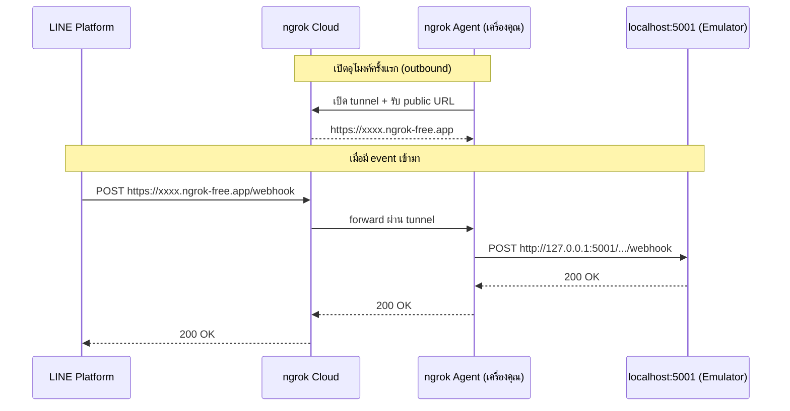

# ngrok — เปิด localhost ให้โลกภายนอกเรียกเข้ามาได้

> เขียน Cloud Function รันใน Emulator บน localhost ได้แล้ว แต่ LINE Platform อยู่บน internet มันจะยิง webhook มาที่ `127.0.0.1:5001` ของคุณได้ยังไง? คำตอบคือ **ngrok** — เครื่องมือสร้าง "อุโมงค์" (tunnel) เปิด public URL ชั่วคราวที่ชี้กลับมายังเครื่องคุณ ไม่ต้อง deploy จริง ไม่ต้องเปิด port บน router ไม่ต้องยุ่งกับ firewall

<p align="center" width="100%">
     
</p>

## ทำไมต้องรู้เรื่องนี้?

ngrok เป็นเครื่องมือที่ใช้สำหรับสร้างการเชื่อมต่อที่ปลอดภัยจากอินเทอร์เน็ตมายัง `localhost` ของคุณ โดยทำการสร้าง URL ชั่วคราวที่สามารถเข้าถึงได้จากภายนอก ทำให้คุณสามารถทดสอบและพัฒนาแอปพลิเคชันบนเครื่องของคุณเองโดยไม่ต้องปรับแต่งการตั้งค่าเครือข่ายหรือไฟร์วอลล์

**ประโยชน์จริงสำหรับงาน LINE Chatbot:**
- ทดสอบ webhook กับ LINE Messaging API ได้ทันที โดยไม่ต้อง deploy Cloud Function ทุกครั้งที่แก้โค้ด
- มี Web UI (`http://127.0.0.1:4040`) ให้ดู request/response ที่เข้ามา ช่วย debug payload ได้ง่ายมาก
- ได้ HTTPS URL ฟรี (LINE บังคับต้องใช้ HTTPS)
- Replay request เดิมได้ — แก้โค้ดแล้วยิง event ซ้ำโดยไม่ต้องไปทักบอทใหม่ทุกรอบ

## ภาพรวม



## ฟีเจอร์หลัก

1. **HTTP Tunneling**: สร้างท่อเชื่อมต่อสำหรับ HTTP และ HTTPS
2. **TCP Tunneling**: สร้างท่อเชื่อมต่อสำหรับโปรโตคอล TCP
3. **Custom Subdomains**: ใช้โดเมนย่อยที่กำหนดเอง
4. **Web Interface**: มีอินเตอร์เฟซเว็บสำหรับดูการร้องขอและการตอบสนองต่าง ๆ
5. **Access Control**: ควบคุมการเข้าถึงด้วยการใช้รหัสผ่าน

## การติดตั้ง

คุณสามารถติดตั้ง ngrok ได้โดยการดาวน์โหลดจาก [เว็บไซต์ ngrok](https://ngrok.com/download) และทำตามขั้นตอนดังนี้:

1. ดาวน์โหลด ngrok สำหรับระบบปฏิบัติการของคุณ (Windows, macOS, Linux)
2. แตกไฟล์ที่ดาวน์โหลดมาและย้ายไปยังตำแหน่งที่ต้องการ
3. เปิด terminal หรือ command prompt และเปลี่ยน directory ไปยังตำแหน่งที่เก็บไฟล์ ngrok
4. รันคำสั่งต่อไปนี้เพื่อติดตั้ง ngrok:

   ```sh
   ngrok authtoken YOUR_AUTH_TOKEN
   ```
   หมายเหตุ: คุณจะต้องสมัครสมาชิก ngrok และรับ AUTH_TOKEN ของคุณจากหน้า Dashboard

## การใช้งาน

หลังจากติดตั้ง ngrok แล้ว คุณสามารถเริ่มใช้งานได้โดยการรันคำสั่งดังนี้:

### HTTP Tunneling

```sh
ngrok http 5001
```

คำสั่งนี้จะสร้างท่อเชื่อมต่อสำหรับ HTTP บนพอร์ต 5001 (ตรงกับพอร์ตของ Firebase Functions Emulator)

### TCP Tunneling

```sh
ngrok tcp 22
```

คำสั่งนี้จะสร้างท่อเชื่อมต่อสำหรับโปรโตคอล TCP บนพอร์ต 22

### Custom Subdomains

```sh
./ngrok http -subdomain=example 80
```

### Custom Config

```sh
ngrok config edit
```

### HTTP Tunneling (เปิดทุก tunnel จาก config)

```sh
ngrok start --all
```

## ข้อผิดพลาดที่มักเจอ

- **พลาด:** ก๊อป URL ของ ngrok ไปใส่ LINE Webhook แล้วปิด terminal จนหลุด — LINE ยิงแล้วเจอ 502
  **ถูก:** ต้องเปิด ngrok ค้างไว้ตลอดช่วงทดสอบ ถ้าปิดต้องรันใหม่และอัปเดต URL ทุกครั้ง (ยกเว้นใช้ custom subdomain แบบเสียเงิน)

- **พลาด:** ใช้ free plan แล้ว URL เปลี่ยนทุกครั้งที่รันใหม่ ต้องไปแก้ Webhook URL ใน LINE Console ตลอด
  **ถูก:** อัปเป็น paid plan เพื่อได้ reserved domain หรือใช้ `ngrok config` ตั้งค่า static domain (มี free tier สำหรับ 1 domain)

- **พลาด:** ใช้ `ngrok http 5001` แต่ Firebase Emulator รันที่ port อื่น (เช่น 8627)
  **ถูก:** ดูพอร์ตจริงจาก log ของ `npm run serve` แล้วใส่ให้ตรง

- **พลาด:** รีบทดสอบแต่ลืมเอา URL ที่ได้ไป **ต่อท้าย path ของ function** เช่น `/line-chatbot-workshop/asia-northeast1/webhook`
  **ถูก:** URL ที่ LINE ต้องยิงเข้าต้องเป็น `https://xxx.ngrok-free.app/<project-id>/<region>/<function-name>`

- **พลาด:** ลืมดูหน้า Web Inspector ที่ `http://127.0.0.1:4040` ทำให้ debug payload ไม่ได้
  **ถูก:** เปิด inspector ไว้ตลอดช่วง dev จะเห็น request body จริงจาก LINE ใช้ replay ก็ได้

## Checklist ก่อนไปต่อ

- [ ] สมัครสมาชิก ngrok และได้ AUTH_TOKEN แล้ว
- [ ] รัน `ngrok authtoken <TOKEN>` สำเร็จ (ทำครั้งเดียวต่อเครื่อง)
- [ ] Firebase Emulator รันอยู่ที่พอร์ตที่ถูกต้อง
- [ ] รัน `ngrok http 5001` แล้วเห็น public URL (`https://...ngrok-free.app`)
- [ ] ทดสอบเปิด URL ในเบราว์เซอร์/Postman ได้
- [ ] เข้าหน้า Web Inspector `http://127.0.0.1:4040` ได้

## อ้างอิง

- [ngrok Documentation](https://ngrok.com/docs)
- [ngrok Download](https://ngrok.com/download)
- [ngrok Dashboard (Auth Token)](https://dashboard.ngrok.com/)
- [LINE Messaging API — Webhook](https://developers.line.biz/en/docs/messaging-api/receiving-messages/)
