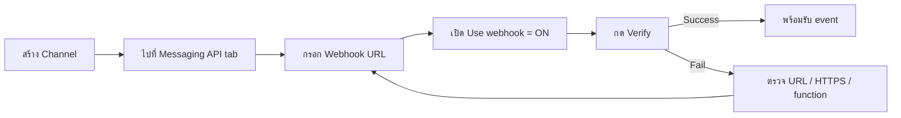

# การเปิดใช้งาน LINE Webhook

> มี Cloud Function พร้อมแล้ว เปิด ngrok ได้ public URL แล้ว — แต่ LINE ยังไม่รู้ว่าจะส่ง event ไปที่ไหน **Webhook** คือจุดนัดพบระหว่าง LINE Platform กับโค้ดของคุณ ถ้าไม่ตั้งค่าให้ถูก บอทจะเงียบสนิท ไม่ว่าลูกค้าจะพิมพ์ทักยังไง

## ทำไมต้องรู้เรื่องนี้?

LINE Webhook ช่วยให้คุณสามารถรับข้อมูลและอีเวนต์จาก LINE Platform ในแอปพลิเคชันของคุณได้ เพื่อให้ LINE Bot ของคุณสามารถตอบสนองต่อข้อความและการกระทำจากผู้ใช้

ลองนึกภาพว่า LINE Platform เป็น "ไปรษณีย์" ที่ต้องส่งจดหมาย (event) ให้คุณ — ถ้าคุณไม่บอกที่อยู่ (Webhook URL) จดหมายก็ส่งไม่ถึง หรือถ้าบอกที่อยู่แต่ไม่เปิดสวิตช์ "รับจดหมาย" (Use webhook) ไปรษณีย์ก็ไม่ส่งให้

**Event ที่จะได้รับเมื่อเปิด webhook สำเร็จ:**
- `message` — ผู้ใช้พิมพ์ข้อความ / ส่งรูป / ส่งสติกเกอร์
- `follow` / `unfollow` — มีคน add / block บอท
- `postback` — ผู้ใช้กดปุ่มใน Rich Menu / Flex Message
- `join` / `leave` — บอทถูกเชิญเข้ากลุ่มหรือออกจากกลุ่ม

## ภาพรวม

## ขั้นตอนการเปิดใช้งาน LINE Webhook

### 1. ตั้งค่า Webhook URL

1. เมื่อสร้างช่องเสร็จแล้ว ให้ไปที่ **"Channel settings"** ภายใต้ช่องที่คุณสร้างขึ้น
2. เลือกแท็บ **"Messaging API"**
3. ในส่วน **"Webhook URL"**, กรอก URL ของ Webhook ที่คุณต้องการให้ LINE ส่งข้อความไปที่นั้น
   - ตัวอย่างเช่น, `https://yourdomain.com/callback`
4. คลิก **"Update"** เพื่อบันทึกการเปลี่ยนแปลง

### 2. เปิดใช้งาน Webhook

1. ในหน้า **"Messaging API"**, ไปที่ส่วน **"Webhook settings"**
2. เปิดการใช้งาน Webhook โดยการเปลี่ยน **"Use webhook"** เป็น **"Enabled"**
3. คลิก **"Verify"** เพื่อตรวจสอบ URL ของ Webhook ว่าสามารถเข้าถึงได้จากอินเทอร์เน็ตและตอบสนองตามข้อกำหนด

### 3. ตั้งค่าและทดสอบ Webhook

1. ตรวจสอบว่าเซิร์ฟเวอร์ของคุณสามารถรับและตอบสนองต่อการร้องขอ Webhook จาก LINE ได้อย่างถูกต้อง
2. ใช้ LINE Bot SDK หรือไลบรารีอื่น ๆ เพื่อจัดการการแจ้งเตือนจาก Webhook และตอบสนองต่อ `webhook event` ต่าง ๆ

### 4. ทดสอบการทำงาน

1. ใช้ LINE app หรือ LINE Developers Console เพื่อลองส่งข้อความไปยัง LINE Bot ของคุณ
2. ตรวจสอบว่า Webhook ของคุณได้รับข้อความและสามารถจัดการ `webhook event` ได้ตามที่ตั้งค่าไว้

## ข้อผิดพลาดที่มักเจอ

- **พลาด:** กรอก URL เป็น `http://...` แล้วกด Verify ไม่ผ่าน
  **ถูก:** LINE บังคับใช้ `https://` เท่านั้น ถ้าเป็น dev ให้ใช้ ngrok (มี HTTPS ให้ในตัว)

- **พลาด:** กรอกแค่ `https://xxxx.ngrok-free.app` โดยไม่มี path ของ function
  **ถูก:** ต้องใส่ full path เช่น `https://xxxx.ngrok-free.app/<project-id>/<region>/webhook`

- **พลาด:** เปิด Webhook URL แต่ลืมเปิด **Use webhook** ทำให้บอทเงียบสนิท
  **ถูก:** ต้องเปิดทั้งสองอย่าง — กรอก URL **และ** toggle `Use webhook` เป็น Enabled

- **พลาด:** กด Verify แล้วขึ้น error แต่ไม่รู้สาเหตุ
  **ถูก:** เปิด Web Inspector ของ ngrok (`127.0.0.1:4040`) ดู request ที่เข้ามา ส่วนใหญ่เป็นเพราะ function ตอบกลับไม่ถึง `200` หรือ timeout

- **พลาด:** เปิด **Auto-reply messages** ใน LINE Official Account ไว้ ทำให้บอทตอบข้อความอัตโนมัติของ LINE ทับกับที่เราเขียนเอง
  **ถูก:** ปิด "Auto-reply messages" และ "Greeting messages" ในหน้า LINE Official Account Manager ถ้าต้องการให้ webhook จัดการทั้งหมด

## Checklist ก่อนไปต่อ

- [ ] Firebase Emulator หรือ Cloud Function (production) รันอยู่
- [ ] ngrok รันและได้ HTTPS URL (สำหรับ local dev)
- [ ] กรอก Webhook URL ครบ path ใน LINE Developers Console
- [ ] toggle **Use webhook** เป็น Enabled
- [ ] กด **Verify** แล้วขึ้น `Success`
- [ ] ปิด Auto-reply / Greeting messages ที่ไม่ต้องการ
- [ ] ทดสอบส่งข้อความหาบอทใน LINE แล้วเห็น event ใน console log

## อ้างอิง

- [LINE Developers Console](https://developers.line.biz/console/)
- [LINE Messaging API — Receiving messages (webhook)](https://developers.line.biz/en/docs/messaging-api/receiving-messages/)
- [LINE Webhook Event Objects](https://developers.line.biz/en/reference/messaging-api/#webhook-event-objects)
