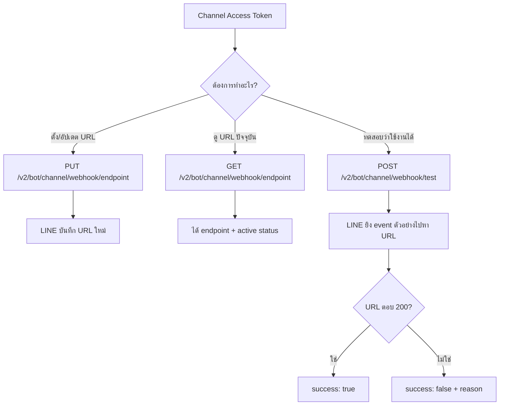

# การตั้งค่า Webhook ผ่าน API

> บางทีเราไม่อยากเข้า LINE Developers Console กดปุ่มเองทุกครั้ง — เช่น ตอน deploy อัตโนมัติผ่าน CI/CD หรือตอนสลับ environment (dev / staging / prod) ให้ชี้ webhook ไปคนละที่ **Messaging API** มี endpoint สำหรับอัปเดตและทดสอบ Webhook ได้จากโค้ด ไม่ต้องคลิกเองเลย

## ทำไมต้องรู้เรื่องนี้?

คุณสามารถตั้งค่า ทดสอบ และดึงข้อมูลเกี่ยวกับ Webhook endpoint ของช่องทาง (channel) ได้ผ่าน API ที่ LINE จัดเตรียมไว้

**ประโยชน์จริง:**
- ตั้งอัตโนมัติหลัง deploy — script หนึ่งบรรทัดใน CI สั่ง `PUT /webhook/endpoint` ก็เสร็จ
- สลับ URL ระหว่าง dev (ngrok) / staging / production ได้รวดเร็ว
- เขียน health-check: ยิง `POST /webhook/test` ทุกวันเพื่อเช็คว่า webhook ยัง alive
- debug ได้ว่า URL ที่ LINE จำไว้คือตัวไหนโดยไม่ต้องไปเปิด Console

## ภาพรวม



## Endpoints ที่ใช้ในการจัดการ Webhook

---

### Webhook settings

```sh
Endpoints
PUT  /v2/bot/channel/webhook/endpoint
GET  /v2/bot/channel/webhook/endpoint
POST /v2/bot/channel/webhook/test
```

### 1) ตั้งค่า Webhook Endpoint

```
PUT /v2/bot/channel/webhook/endpoint
```

ใช้สำหรับ:
**กำหนดหรืออัปเดต URL ของ Webhook ที่จะรับข้อความจาก LINE**

Request ตัวอย่าง:
```json
PUT /v2/bot/channel/webhook/endpoint
Content-Type: application/json
Authorization: Bearer {channel access token}

{
"endpoint": "https://your-webhook-url.com/callback"
}
```

### 2) ดูข้อมูล Webhook Endpoint ปัจจุบัน

```
GET /v2/bot/channel/webhook/endpoint
```

ใช้สำหรับ:
**ตรวจสอบว่า Webhook ปัจจุบันตั้งค่าไว้ที่ URL ใด และสถานะเป็นอย่างไร**

Request ตัวอย่าง:

```sh
GET /v2/bot/channel/webhook/endpoint
Authorization: Bearer {channel access token}
```

Response ตัวอย่าง:
```json
{
"endpoint": "https://your-webhook-url.com/callback",
"active": true
}
```

### 3) ทดสอบ Webhook Endpoint

```sh
POST /v2/bot/channel/webhook/test
```

ใช้สำหรับ:
**ตรวจสอบว่า Webhook สามารถเข้าถึงได้หรือไม่ และการตอบกลับทำงานตามคาดหรือไม่**

Request ตัวอย่าง:

```sh
POST /v2/bot/channel/webhook/test
Authorization: Bearer {channel access token}

```

Response ตัวอย่าง (ถ้าสำเร็จ):

```json
{
   "success": true
}
```

## หมายเหตุสำคัญ

- อย่าลืมเปิด Webhook ใน LINE Developers Console ด้วย
- Webhook URL ของคุณต้องรองรับ HTTPS เท่านั้น
- เมื่อทดสอบผ่าน `POST /webhook/test` LINE จะส่ง event ตัวอย่างไปยัง URL ที่ตั้งไว้

## ข้อผิดพลาดที่มักเจอ

- **พลาด:** เรียก `PUT /webhook/endpoint` สำเร็จแล้วคิดว่าเสร็จ แต่ `Use webhook` ใน Console ยังปิดอยู่
  **ถูก:** API endpoint นี้ตั้งแค่ URL เท่านั้น ยังต้องเข้า Console ไป toggle Use webhook = Enabled อยู่ดี (หรือใช้ `PUT /v2/bot/channel/webhook/endpoint` คู่กับการเปิดใน Console ครั้งแรก)

- **พลาด:** ใส่ URL เป็น `http://` หรือ IP ตรง ๆ
  **ถูก:** ต้องเป็น `https://` + โดเมนที่มี SSL ถูกต้องเท่านั้น (ngrok ก็ใช้ได้)

- **พลาด:** `POST /webhook/test` แล้วได้ `success: false` แต่ไม่รู้ว่าเพราะอะไร
  **ถูก:** อ่านฟิลด์ `reason`, `detail`, `statusCode` ใน response — ส่วนใหญ่เป็น `COULD_NOT_CONNECT` (URL ดับ) หรือ `REQUEST_TIMEOUT` (function ช้าเกิน)

- **พลาด:** ใช้ Channel Access Token ของ LIFF / Login Channel มาเรียก Messaging API
  **ถูก:** ต้องใช้ **Channel Access Token ของ Messaging API channel** เท่านั้น — หยิบมาจากหน้า Messaging API tab ใน Developers Console

- **พลาด:** ตั้ง short-lived token (v2.1) แล้วลืม refresh ทำให้ script ตั้ง webhook ทำงานพลาด
  **ถูก:** ใช้ long-lived token สำหรับ ops/CI หรือมีระบบ refresh token อัตโนมัติ

## Checklist ก่อนไปต่อ

- [ ] มี Channel Access Token ของ Messaging API channel
- [ ] ทดสอบ `GET /v2/bot/channel/webhook/endpoint` ได้ response
- [ ] สามารถ `PUT` เปลี่ยน URL ได้และ `GET` กลับมาเห็นค่าใหม่
- [ ] `POST /v2/bot/channel/webhook/test` ได้ `success: true`
- [ ] URL เป็น HTTPS และเปิด Use webhook ใน Console แล้ว

## อ้างอิง

- [LINE Messaging API Reference — Webhook settings](https://developers.line.biz/en/reference/messaging-api/#set-webhook-endpoint-url)
- [LINE Messaging API — Test webhook endpoint](https://developers.line.biz/en/reference/messaging-api/#test-webhook-endpoint)
- [Channel access tokens](https://developers.line.biz/en/docs/basics/channel-access-token/)
