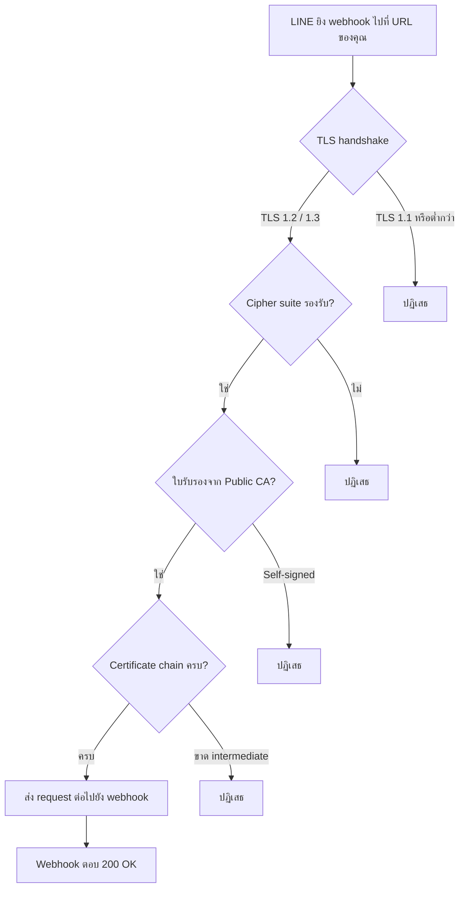

# ข้อกำหนด SSL/TLS สำหรับแหล่งที่มาของ Webhook

> กด Verify Webhook แล้วขึ้น error ทั้งที่โค้ดทำงานปกติ? ส่วนใหญ่มาจาก **SSL/TLS ไม่ผ่านเกณฑ์ของ LINE** — อาจเป็นใบรับรอง self-signed, certificate chain ไม่ครบ, หรือใช้ cipher suite เก่าเกินไป เอกสารนี้สรุปทุกข้อกำหนดที่เซิร์ฟเวอร์ของคุณต้องผ่าน ก่อน LINE จะยอมส่ง webhook event ให้

## ทำไมต้องรู้เรื่องนี้?

เมื่อเซิร์ฟเวอร์บอทได้รับเหตุการณ์ webhook จากแพลตฟอร์ม LINE การสื่อสารต้องใช้ HTTPS โดยใช้ใบรับรอง SSL/TLS ที่ออกโดยหน่วยงานรับรองสาธารณะ คุณสามารถซื้อใบรับรอง SSL หรือใช้ใบรับรองฟรี เช่น [Let's Encrypt](https://letsencrypt.org/) ได้

เซิร์ฟเวอร์บอทที่รับ webhook ต้องรองรับการสื่อสาร HTTPS ตามข้อกำหนดดังต่อไปนี้:

**สรุปสั้น ๆ สำหรับคนรีบ:**
- ใช้ TLS 1.2 หรือ TLS 1.3 เท่านั้น (TLS 1.1 และต่ำกว่า ไม่รองรับ)
- ใช้ cipher suite ที่อยู่ในกลุ่ม "ใช้งานได้" ของ TLS 1.2/1.3 (ดูตารางด้านล่าง)
- ใบรับรองต้องออกโดย **Public CA** — self-signed จะถูกปฏิเสธทันที
- ต้องติดตั้ง **intermediate certificate** ให้ครบทั้ง chain

> Cloud Functions, Vercel, Cloudflare, ngrok, Netlify มี SSL ที่ผ่านเกณฑ์อยู่แล้ว — ไม่ต้องตั้งเองถ้าใช้บริการเหล่านี้

## ภาพรวม

## ข้อกำหนดใบรับรอง SSL/TLS

- ต้องใช้ใบรับรองที่ออกโดย **หน่วยงานรับรองสาธารณะ (Public CA)** เท่านั้น
- **ไม่รองรับ** ใบรับรองแบบ Self-signed
- ต้องติดตั้ง **certificate chain ให้ครบถ้วน** (รวม intermediate certificate)

## Cipher Suites ที่รองรับ

Cipher suites ที่มีสถานะ **Deprecated** ยังคงใช้งานได้เพื่อความเข้ากันได้ แต่อาจถูกยกเลิกโดยไม่แจ้งให้ทราบล่วงหน้าในอนาคตอันใกล้ นอกจากนี้ เวอร์ชันโปรโตคอล SSL/TLS และเวอร์ชัน HTTP ที่รองรับจะแตกต่างกันไปตาม cipher suite

> **ตารางสามารถเลื่อนซ้ายขวาได้** - เลื่อนตารางไปทางขวาเพื่อดูสถานะ, เวอร์ชัน SSL/TLS และเวอร์ชัน HTTP ที่รองรับของแต่ละ cipher suite

### TLS 1.3 Cipher Suites

| IANA | OpenSSL | Hex Code | สถานะ | เวอร์ชัน SSL/TLS | เวอร์ชัน HTTP ที่รองรับ |
| --- | --- | --- | --- | --- | --- |
| TLS_AES_256_GCM_SHA384 | TLS_AES_256_GCM_SHA384 | 0x13, 0x02 | ใช้งานได้ | TLS 1.3 | HTTP/1.0, HTTP/1.1, HTTP/2 |
| TLS_CHACHA20_POLY1305_SHA256 | TLS_CHACHA20_POLY1305_SHA256 | 0x13, 0x03 | ใช้งานได้ | TLS 1.3 | HTTP/1.0, HTTP/1.1, HTTP/2 |
| TLS_AES_128_GCM_SHA256 | TLS_AES_128_GCM_SHA256 | 0x13, 0x01 | ใช้งานได้ | TLS 1.3 | HTTP/1.0, HTTP/1.1, HTTP/2 |

### TLS 1.2 Cipher Suites

| IANA | OpenSSL | Hex Code | สถานะ | เวอร์ชัน SSL/TLS | เวอร์ชัน HTTP ที่รองรับ |
| --- | --- | --- | --- | --- | --- |
| TLS_ECDHE_ECDSA_WITH_AES_128_GCM_SHA256 | ECDHE-ECDSA-AES128-GCM-SHA256 | 0xc0, 0x2b | ใช้งานได้ | TLS 1.2 | HTTP/1.0, HTTP/1.1, HTTP/2 |
| TLS_ECDHE_RSA_WITH_AES_128_GCM_SHA256 | ECDHE-RSA-AES128-GCM-SHA256 | 0xc0, 0x2f | ใช้งานได้ | TLS 1.2 | HTTP/1.0, HTTP/1.1, HTTP/2 |
| TLS_ECDHE_ECDSA_WITH_AES_256_GCM_SHA384 | ECDHE-ECDSA-AES256-GCM-SHA384 | 0xc0, 0x2c | ใช้งานได้ | TLS 1.2 | HTTP/1.0, HTTP/1.1, HTTP/2 |
| TLS_ECDHE_RSA_WITH_AES_256_GCM_SHA384 | ECDHE-RSA-AES256-GCM-SHA384 | 0xc0, 0x30 | ใช้งานได้ | TLS 1.2 | HTTP/1.0, HTTP/1.1, HTTP/2 |
| TLS_ECDHE_ECDSA_WITH_CHACHA20_POLY1305_SHA256 | ECDHE-ECDSA-CHACHA20-POLY1305 | 0xcc, 0xa9 | ใช้งานได้ | TLS 1.2 | HTTP/1.0, HTTP/1.1, HTTP/2 |
| TLS_ECDHE_RSA_WITH_CHACHA20_POLY1305_SHA256 | ECDHE-RSA-CHACHA20-POLY1305 | 0xcc, 0xa8 | ใช้งานได้ | TLS 1.2 | HTTP/1.0, HTTP/1.1, HTTP/2 |

### Cipher Suites ที่เลิกใช้แล้ว (Deprecated)

Cipher suites เหล่านี้ยังคงใช้งานได้เพื่อความเข้ากันได้ แต่ **อาจถูกยกเลิกโดยไม่แจ้งล่วงหน้า** และ **ไม่รองรับ HTTP/2**

| IANA | OpenSSL | Hex Code | สถานะ | เวอร์ชัน SSL/TLS | เวอร์ชัน HTTP ที่รองรับ |
| --- | --- | --- | --- | --- | --- |
| TLS_ECDHE_RSA_WITH_AES_128_CBC_SHA | ECDHE-RSA-AES128-SHA | 0xc0, 0x13 | Deprecated | TLS 1.2 | HTTP/1.0, HTTP/1.1 |
| TLS_ECDHE_RSA_WITH_AES_256_CBC_SHA | ECDHE-RSA-AES256-SHA | 0xc0, 0x14 | Deprecated | TLS 1.2 | HTTP/1.0, HTTP/1.1 |
| TLS_RSA_WITH_AES_128_GCM_SHA256 | AES128-GCM-SHA256 | 0x00, 0x9c | Deprecated | TLS 1.2 | HTTP/1.0, HTTP/1.1 |
| TLS_RSA_WITH_AES_128_CBC_SHA | AES128-SHA | 0x00, 0x2f | Deprecated | TLS 1.2 | HTTP/1.0, HTTP/1.1 |
| TLS_RSA_WITH_AES_256_CBC_SHA | AES256-SHA | 0x00, 0x35 | Deprecated | TLS 1.2 | HTTP/1.0, HTTP/1.1 |

## เวอร์ชันโปรโตคอล SSL/TLS ที่รองรับ

เวอร์ชันโปรโตคอลที่รองรับจะแตกต่างกันไปตาม cipher suite สามารถดูรายละเอียดเพิ่มเติมได้จากคอลัมน์ "เวอร์ชัน SSL/TLS" ในตาราง Cipher Suites ด้านบน

| เวอร์ชันโปรโตคอล | รองรับหรือไม่ |
| --- | --- |
| TLS 1.3 | ✅ |
| TLS 1.2 | ✅ |
| TLS 1.1 หรือต่ำกว่า | ❌ |

## เวอร์ชัน HTTP ที่รองรับ

เวอร์ชัน HTTP ที่รองรับจะแตกต่างกันไปตาม cipher suite สามารถดูรายละเอียดเพิ่มเติมได้จากคอลัมน์ "เวอร์ชัน HTTP ที่รองรับ" ในตาราง Cipher Suites ด้านบน

| เวอร์ชัน HTTP | รองรับหรือไม่ |
| --- | --- |
| HTTP/2 | ✅ |
| HTTP/1.1 | ✅ |
| HTTP/1.0 | ✅ |

## วิธีตรวจสอบ SSL/TLS ของ Webhook ตัวเอง

ก่อนส่งเข้า Verify ของ LINE ลองเช็คเองก่อนด้วยเครื่องมือฟรี:

- [SSL Labs Server Test](https://www.ssllabs.com/ssltest/) — ดู grade และ chain ที่ติดตั้ง
- `openssl s_client -connect your-domain.com:443 -showcerts` — เช็ค chain แบบ command line
- `curl -vI https://your-domain.com/callback` — ดู handshake และ response header

## ข้อผิดพลาดที่มักเจอ

- **พลาด:** ใช้ self-signed certificate สำหรับ dev server แล้วเอาไปต่อ LINE ตรง
  **ถูก:** ใช้ ngrok, Cloudflare Tunnel, หรือ deploy ขึ้น Firebase/Vercel ที่มี SSL ของ Public CA อยู่แล้ว

- **พลาด:** ติดตั้งแค่ certificate ของตัวเอง ลืม intermediate cert ทำให้ browser บางตัวเปิดได้แต่ LINE verify ไม่ผ่าน
  **ถูก:** ใช้ไฟล์ fullchain (Let's Encrypt เรียก `fullchain.pem`) หรือให้ reverse proxy (Nginx/Caddy) serve chain ให้ครบ

- **พลาด:** บังคับใช้ TLS 1.0/1.1 เพราะต้องรองรับ client เก่า
  **ถูก:** LINE ต้องการ TLS 1.2 ขึ้นไป ถ้าจำเป็นต้องรองรับของเก่า ให้แยก endpoint หรืออัปเกรด client

- **พลาด:** ใช้ cipher suite กลุ่ม Deprecated (RSA-based) แล้วคาดว่าจะมี HTTP/2
  **ถูก:** ถ้าต้องการ HTTP/2 ต้องเลือก cipher suite ใน TLS 1.2/1.3 กลุ่ม ECDHE หรือย้ายไป TLS 1.3

- **พลาด:** Certificate หมดอายุโดยไม่รู้ตัว แล้ว webhook หยุดทำงานกะทันหัน
  **ถูก:** ตั้ง monitoring + auto-renew (certbot / ACME) และ alert ล่วงหน้า 14 วันก่อนหมดอายุ

## Checklist ก่อนไปต่อ

- [ ] URL ของ webhook เป็น HTTPS
- [ ] ใบรับรองออกโดย Public CA (ไม่ใช่ self-signed)
- [ ] Certificate chain ติดตั้งครบ (มี intermediate)
- [ ] เซิร์ฟเวอร์รองรับ TLS 1.2 หรือ TLS 1.3
- [ ] ใช้ cipher suite ในกลุ่ม "ใช้งานได้" (ไม่ใช่ Deprecated ถ้าเลี่ยงได้)
- [ ] ทดสอบด้วย SSL Labs ได้ grade A หรือ A+
- [ ] กด Verify ใน LINE Developers Console แล้วผ่าน

## อ้างอิง

- [Let's Encrypt](https://letsencrypt.org/)
- [SSL Labs Server Test](https://www.ssllabs.com/ssltest/)
- [LINE Messaging API — SSL/TLS Requirements](https://developers.line.biz/en/docs/messaging-api/receiving-messages/#ssl-tls-requirements)
- [Mozilla SSL Configuration Generator](https://ssl-config.mozilla.org/)
