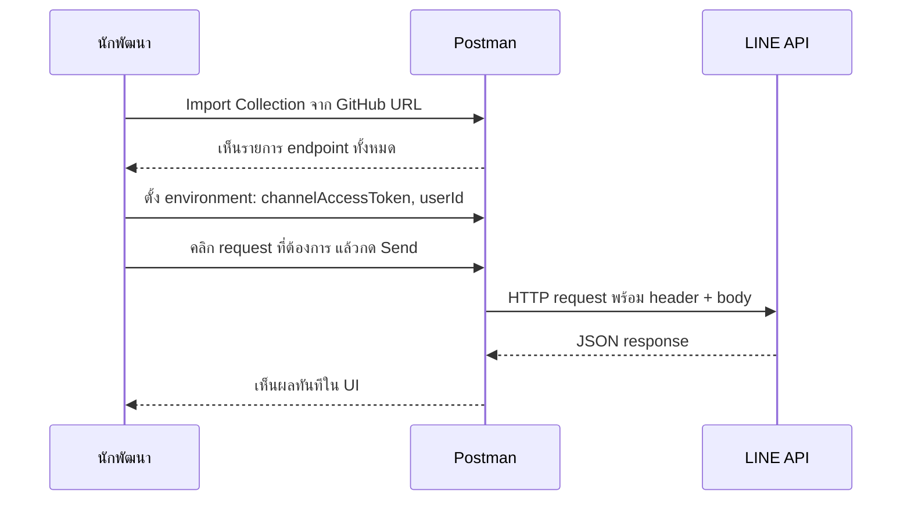

# Workshop: Postman Collection — ยิง LINE API ได้ภายใน 1 นาทีโดยไม่ต้องเขียนโค้ด

> ก่อนจะลงมือเขียน Node.js หรือ Python เพื่อเรียก LINE API คุณควรทดสอบ endpoint ให้เห็นกับตาก่อนว่า "ใส่อะไรเข้า ได้อะไรออก" — Postman Collection ที่เตรียมไว้ให้นี้ รวบรวม LINE API ที่ใช้บ่อยเกือบทั้งหมด คลิก Import ครั้งเดียว ใช้ทดสอบได้ทันที ไม่ต้อง copy-paste cURL ทีละเส้น

     

## ทำไมต้องรู้เรื่องนี้?

ลองนึกภาพว่าคุณเพิ่งซื้อบ้านใหม่ สิ่งแรกที่คุณอยากทำคือ **กดสวิตช์ทุกตัว** เพื่อดูว่าไฟติดไหม ท่อน้ำรั่วหรือเปล่า — ไม่ใช่การนั่งวาดแบบบ้านใหม่ทั้งหลัง

Postman Collection ก็เหมือน "กล่องสวิตช์" ของ LINE API — เปิด Postman ขึ้นมา คลิก Send ทีเดียว เห็น response ทันทีว่า Channel Access Token ที่ถืออยู่ใช้ได้ไหม, reply message ส่งได้จริงไหม, ดึงโปรไฟล์ผู้ใช้ได้ไหม

**ประโยชน์จริง:**
- ทดสอบ API ใหม่ได้โดยไม่ต้องเขียนโค้ด
- เช็คได้ว่า Channel Access Token ยัง valid
- Copy JSON body ไปใช้ในโค้ดโปรเจกต์จริงได้เลย
- แชร์ environment variable (token, userId) ในทีมได้สะดวก

## ภาพรวม

## ขั้นตอนการใช้งาน

### 1) อ่านบทความอธิบายก่อน (แนะนำ)

บทความนี้อธิบายที่มาและวิธีใช้ Postman Collection อย่างละเอียด — เหมาะสำหรับคนที่เพิ่งใช้ Postman ครั้งแรก

Article: 
https://medium.com/linedevth/70fc89afe2c3

### 2) Import Collection เข้า Postman

เปิด Postman แล้วคลิก **Import** → ใส่ URL ด้านล่างในช่อง "Link" → กด **Continue** → **Import**

Import URL:
https://raw.githubusercontent.com/thepnatee/line-api-collection-postman/main/CLASS%20LINE%20API%20Example.postman_collection.json

### 3) ตั้งค่า Environment Variables

Collection นี้ใช้ตัวแปรกลาง เช่น `{{channelAccessToken}}` และ `{{userId}}` — สร้าง environment ใหม่ใน Postman แล้วใส่ค่า:

| Variable | ค่าที่ใส่ |
|----------|---------|
| `channelAccessToken` | Channel Access Token จาก LINE Developers Console |
| `userId` | User ID ที่ได้จาก webhook event |
| `replyToken` | reply token (ใช้ภายใน 1 นาทีหลังรับ event) |

### 4) ลองยิง request แรก

เลือก request ตัวอย่าง เช่น **Get Profile** หรือ **Push Message** → คลิก **Send** → ดู response ที่ panel ด้านล่าง

ถ้าได้ `200 OK` แปลว่า token และการตั้งค่าถูกต้อง พร้อมเอาไปใช้ในโค้ดจริงได้แล้ว

## ข้อผิดพลาดที่มักเจอ

- **พลาด:** Import แล้วเจอ error `401 Unauthorized` ทุก request
  **ถูก:** ลืมตั้ง `channelAccessToken` ใน environment หรือเลือก environment ไม่ถูกที่มุมบนขวาของ Postman

- **พลาด:** ใช้ replyToken ที่ copy มาจากเมื่อวาน แล้วยิง reply message แล้วได้ 400
  **ถูก:** replyToken มีอายุเพียง **1 นาที** และใช้ได้ครั้งเดียว — ต้องเอามาจาก webhook event ล่าสุด

- **พลาด:** ยิง push message ไปหา userId ของคนที่ไม่ได้ add LINE OA เป็นเพื่อน
  **ถูก:** push message ส่งได้เฉพาะผู้ใช้ที่เป็นเพื่อนกับ LINE OA อยู่แล้วเท่านั้น ถ้าผู้ใช้ block หรือไม่เคย add จะได้ error

- **พลาด:** เปิด Collection ใน Postman Web แล้วยิงไม่ได้ (CORS error)
  **ถูก:** ใช้ Postman Desktop app หรือเปิด Postman Agent เสริมสำหรับ Postman Web

## Checklist ก่อนไปต่อ

- [ ] ติดตั้ง Postman Desktop แล้ว
- [ ] Import Collection จาก GitHub URL สำเร็จ
- [ ] สร้าง environment และใส่ `channelAccessToken`, `userId`
- [ ] ทดสอบยิง **Get Profile** ได้ `200 OK`
- [ ] ทดสอบ push message ไปหาตัวเองได้ (add LINE OA เป็นเพื่อนก่อน)

## อ้างอิง

- [บทความอธิบาย Postman Collection](https://medium.com/linedevth/70fc89afe2c3)
- [LINE API Collection Postman (GitHub)](https://github.com/thepnatee/line-api-collection-postman)
- [Postman Download](https://www.postman.com/downloads/)
