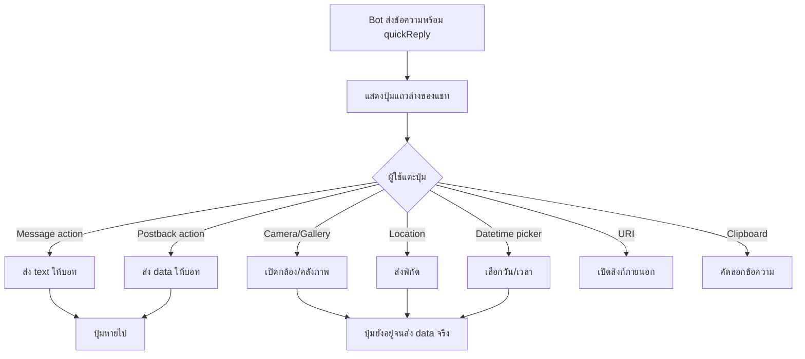

# Workshop: Quick Reply — ให้ผู้ใช้ตอบกลับด้วยการ "แตะ" แทนการพิมพ์

> คุณเคยเจอบอทที่ถามว่า "กรุณาพิมพ์ 1 เพื่อดูสินค้า / 2 เพื่อดูโปรโมชัน" ไหม? ในยุคปัจจุบันเราสามารถทำให้ดีกว่านั้นได้ — **Quick Reply** คือปุ่มแถวล่างของแชทที่ผู้ใช้แค่ "แตะ" ก็ตอบกลับได้ทันที ไม่ต้องพิมพ์อะไรเลย ทำให้ conversion rate สูงขึ้นอย่างชัดเจน

Quick reply เป็นฟีเจอร์ที่แสดงปุ่มพร้อมกับข้อความเพื่อให้ผู้ใช้ตอบกลับได้ ผู้ใช้สามารถตอบกลับ LINE Official Account ได้เพียงแค่แตะที่ปุ่มตอบกลับที่แสดงอยู่ด้านล่างของหน้าจอแชท Quick reply สามารถใช้งานได้ทั้งในแชทแบบหนึ่งต่อหนึ่ง แชทกลุ่ม และแชทหลายคนที่ LINE Official Account เป็นสมาชิก คุณสามารถตั้งค่าปุ่ม Quick reply ได้สูงสุด 13 ปุ่มสำหรับข้อความประเภทใดก็ได้

> **Note:** Quick reply รองรับเฉพาะบน LINE สำหรับ iOS และ LINE สำหรับ Android เท่านั้น

<p align="center" width="100%">
     
</p>

## ทำไมต้องรู้เรื่องนี้?

ลองคิดแบบนี้: ถ้าถามลูกค้าว่า "สนใจเมนูไหน?" แล้วต้องให้เขาพิมพ์ "ข้าวผัด" เอง — มีโอกาสพิมพ์ผิดเช่น "ข้าวพัด" "ขาวผัด" "kaw pad" ซึ่งบอทแมทช์คำไม่ได้ สุดท้ายคุยกันไม่รู้เรื่อง

Quick reply คือ "ล่าม" ที่แปลงการคลิกปุ่ม เป็นข้อความมาตรฐานให้บอทเข้าใจเสมอ — นอกจากนี้ยังเปิด camera, เลือกรูปจาก gallery, แชร์ location, หรือเปิด date picker ได้ในปุ่มเดียว

**ประโยชน์จริง:**
- ลดความผิดพลาดในการพิมพ์ของผู้ใช้
- สร้างประสบการณ์ที่เร็วและมือถือ-friendly
- นำทางผู้ใช้ผ่าน flow ที่ซับซ้อนได้ง่าย (เช่น จองคิว สั่งอาหาร)
- รวมกับ action พิเศษ เช่น `camera`, `cameraRoll`, `location`, `datetimepicker`, `clipboard`

## ภาพรวม



## ส่วนประกอบของปุ่ม Quick Reply

ส่วนประกอบของปุ่ม Quick reply ได้แก่ **Action**, **Icon** และ **Label**

### Icon

ปุ่ม Quick reply จะแสดงพร้อมไอคอน โดยสามารถกำหนดรูปไอคอนผ่าน property `imageUrl` ได้

หากไม่ได้กำหนดรูปไอคอน จะแสดงผลดังนี้:
- **Camera, Camera roll, Location action**: แสดงไอคอนเริ่มต้น (default icon) ของแต่ละ action
- **Action อื่น ๆ ที่ไม่ได้อยู่ในรายการข้างต้น**: จะไม่แสดงไอคอน (icon display will be omitted)

### Label

Label คือข้อความที่แสดงบนปุ่ม Quick reply

### Action

Action การกระทำเหล่านี้เป็นการกระทำที่สามารถใช้ได้เฉพาะกับปุ่ม Quick reply:
Ref:https://medium.com/linedevth/87c117fd4dd6

- **การเปิดกล้อง (Camera action)** — เมื่อแตะจะเปิดกล้องของเครื่องให้ผู้ใช้ถ่ายรูปแล้วส่งเข้าแชท
```json
{
  "type": "camera",
  "label": "Camera"
}
```
- **การเลือกภาพจากคลังภาพ (Camera roll action)** — เปิด gallery ให้ผู้ใช้เลือกรูปที่มีอยู่
```json{
  "type": "cameraRoll",
  "label": "Camera roll"
}
```
- **การแชร์ตำแหน่ง (Location action)** — ผู้ใช้ส่งพิกัดปัจจุบันหรือเลือกจากแผนที่
```json
{
  "type": "location",
  "label": "Location"
}
```
- **การส่งข้อมูลกลับ (Postback action)** — ส่ง `data` กลับเข้ามาใน webhook โดยไม่โชว์ข้อความในแชท (เว้นแต่จะกำหนด `displayText`) — เหมาะกับการส่ง state เช่น `action=buy&itemid=111`
```json
{
  "type": "postback",
  "label": "Buy",
  "data": "action=buy&itemid=111",
  "displayText": "Buy",
  "inputOption": "openKeyboard",
  "fillInText": "---\nName: \nPhone: \nBirthday: \n---"
}
```
- **การส่งข้อความ (Message action)** — ส่งข้อความที่กำหนดเหมือนผู้ใช้พิมพ์เอง ใช้ง่ายที่สุด
```json
{
  "type": "message",
  "label": "Yes",
  "text": "Yes"
}
```

- **การเปิดลิงก์ (URI action)** — เปิด URL ภายนอก สามารถกำหนด URL สำหรับ desktop แยกได้
```json
{
   "type":"uri",
   "label":"View details",
   "uri":"http://example.com/page/222",
   "altUri": {
      "desktop" : "http://example.com/pc/page/222"
   }
}
```
- **การเลือกวันและเวลา (Datetime picker action)** — เปิด native picker ให้ผู้ใช้เลือกวันที่/เวลา แล้วส่งค่ากลับทาง postback
```json
{
  "type": "datetimepicker",
  "label": "Select date",
  "data": "storeId=12345",
  "mode": "datetime",
  "initial": "2017-12-25t00:00",
  "max": "2018-01-24t23:59",
  "min": "2017-12-25t00:00"
}
```
- **การคัดลอกข้อความไปยังคลิปบอร์ด (Clipboard action)** — คัดลอกข้อความไว้ใน clipboard ของผู้ใช้ เช่น คัดลอกรหัสคูปอง
```json
{
  "type": "clipboard",
  "label": "Copy",
  "clipboardText": "3B48740B"
}
```

> **หมายเหตุ:** Action ที่ **ไม่สามารถ** ใช้กับปุ่ม Quick reply ได้คือ Rich menu switch action

## ปุ่ม Quick Reply หายไปเมื่อไหร่

เข้าใจ "วงจรชีวิต" ของปุ่มเป็นเรื่องสำคัญ — ถ้าไม่เข้าใจจะทำให้ flow บอทสะดุด

ปุ่ม Quick reply จะหายไปเมื่อ:
- ผู้ใช้แตะปุ่ม Quick reply ปุ่มใดปุ่มหนึ่ง (**ยกเว้น** Camera, Camera roll, Datetime picker action และ Location action ปุ่มที่ใช้ action เหล่านี้จะยังคงแสดงอยู่จนกว่าจะมีการส่งข้อมูลที่คาดหวังกลับมา)
- LINE Official Account, ผู้ใช้ หรือสมาชิกคนอื่นในห้องแชทส่งข้อความใหม่เข้ามา (หากข้อความใหม่ถูกลบ ปุ่ม Quick reply จะกลับมาแสดงอีกครั้ง)

สำหรับบาง action การแตะปุ่ม Quick reply จะไม่ได้โพสต์ตัวเลือกของผู้ใช้ลงในแชทโดยอัตโนมัติ ดังนั้นควร implement ให้คำตอบที่ส่งกลับแสดงเป็นข้อความในแชทด้วย เพื่อให้ผู้ใช้เห็นว่าตนเองได้กดปุ่มใดไป

## ตัวอย่างรวม 7 action ในข้อความเดียว

ตัวอย่างนี้จะเห็นการใช้ quickReply พร้อมกับ action หลายประเภทในข้อความเดียว — ลองนำไปวางใน Postman แล้วยิงดู

Example

````json
{
    "to": "{{userid}}",
    "messages": [
        {
            "type": "text",
            "text": "Select your favorite food category or send me your location!",
            "quickReply": {
                "items": [
                    {
                        "type": "action",
                        "imageUrl": "https://example.com/sushi.png",
                        "action": {
                            "type": "message",
                            "label": "Sushi",
                            "text": "Sushi"
                        }
                    },
                    {
                        "type": "action",
                        "imageUrl": "https://example.com/sushi.png",
                        "action": {
                            "type": "postback",
                            "label": "postback",
                            "data": "action=buy&itemid=111",
                            "text": "Buy"
                        }
                    },
                    {
                        "type": "action",
                        "action": {
                            "type": "camera",
                            "label": "Camera"
                        }
                    },
                    {
                        "type": "action",
                        "action": {
                            "type": "cameraRoll",
                            "label": "cameraRoll"
                        }
                    },
                    {
                        "type": "action",
                        "action": {
                            "type": "location",
                            "label": "Send location"
                        }
                    },
                    {
                        "type": "action",
                        "action": {
                            "type": "uri",
                            "label": "Phone order",
                            "uri": "tel:00000000"
                        }
                    },
                    {
                        "type": "action",
                        "action": {
                            "type": "uri",
                            "label": "Recommend to friends",
                            "uri": "https://line.me/R/nv/recommendOA/@linedevelopers"
                        }
                    }
                ]
            }
        }
    ]
}
````

## ข้อผิดพลาดที่มักเจอ

- **พลาด:** ใส่ปุ่มเกิน 13 ปุ่ม แล้ว API ตีกลับ 400
  **ถูก:** quickReply รองรับสูงสุด **13 items** เท่านั้น ถ้ามีเยอะกว่านั้นให้แบ่งเป็นหลายข้อความ หรือใช้ Flex carousel แทน

- **พลาด:** ทดสอบบน LINE Desktop แล้วไม่เห็นปุ่ม Quick reply โผล่ขึ้นมา
  **ถูก:** quickReply แสดงผลเฉพาะ **iOS และ Android** เท่านั้น บน Desktop/Mac จะไม่แสดง — ให้ทดสอบบนมือถือทุกครั้ง

- **พลาด:** ใช้ `postback` แล้วไม่ใส่ `displayText` ทำให้ผู้ใช้ไม่เห็นว่าตัวเองแตะอะไรไป
  **ถูก:** เพิ่ม `displayText` เสมอเพื่อให้ผู้ใช้เห็นข้อความยืนยันในแชท หรือส่ง reply message ย้อนกลับไปแสดงผลที่ผู้ใช้เลือก

- **พลาด:** วาง `imageUrl` เป็น HTTP ปกติ แล้วไอคอนไม่แสดง
  **ถูก:** ต้องเป็น **HTTPS** เท่านั้น และรูปต้องเป็น PNG/JPEG ขนาดเล็ก (แนะนำ 24x24px หรือ 48x48px)

- **พลาด:** คาดหวังว่าหลังจากผู้ใช้แตะ `camera` แล้วปุ่มอื่นจะหายไปด้วย
  **ถูก:** ปุ่ม camera/cameraRoll/location/datetimepicker จะ**ยังอยู่** จนกว่าผู้ใช้จะส่ง data จริง เพราะถือว่ายังไม่ตอบกลับ

- **พลาด:** ใช้ rich menu switch action ใน quickReply แล้ว API return error
  **ถูก:** rich menu switch action ใช้ได้เฉพาะใน rich menu ไม่รองรับใน quickReply

## Checklist ก่อนไปต่อ

- [ ] รู้จัก action ทั้ง 8 แบบของ quickReply (camera, cameraRoll, location, postback, message, uri, datetimepicker, clipboard)
- [ ] เข้าใจว่าจำกัดสูงสุด 13 ปุ่มต่อข้อความ
- [ ] ทดสอบจริงบน LINE iOS/Android (ไม่ใช่ Desktop)
- [ ] เตรียม `imageUrl` เป็น HTTPS
- [ ] ใช้ `displayText` กับ postback เพื่อให้ผู้ใช้เห็นว่าตัวเองเลือกอะไร
- [ ] เข้าใจเงื่อนไขที่ปุ่มจะหายไป / ยังแสดงต่อ

## อ้างอิง

- [Quick Reply Reference](https://developers.line.biz/en/reference/messaging-api/#quick-reply)
- [Actions บน Messaging API](https://developers.line.biz/en/docs/messaging-api/actions/)
- [LINE Dev TH — บทความอธิบาย Quick Reply](https://medium.com/linedevth/87c117fd4dd6)
