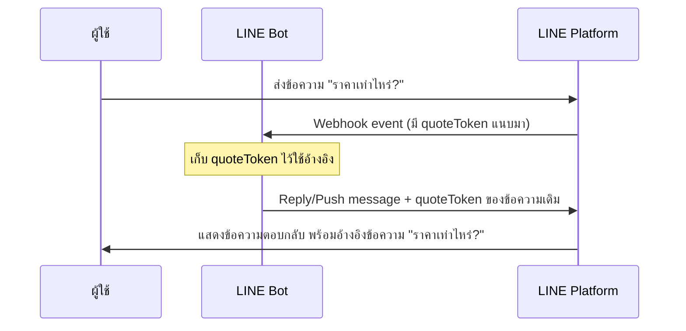

# Workshop: Quote Token — ตอบแชทแบบ "อ้างอิง" ข้อความเก่า

> ในแชทกลุ่มที่คุยกันหลายคน ถ้าคุณเพียงพิมพ์ "ได้ครับ" ขึ้นมา คนอื่นอาจสับสนว่าตอบใคร — **Quote Token** คือกลไกที่ทำให้บอทตอบกลับพร้อม "เครื่องหมายอ้างอิง" ชี้ไปยังข้อความเก่าได้ชัดเจน เหมือนฟีเจอร์ reply ที่ผู้ใช้ใช้ทั่วไปในแอป LINE

<p align="center" width="100%">
     
</p>

## ทำไมต้องรู้เรื่องนี้?

ลองนึกภาพแชทกลุ่มลูกค้าที่ทุกคนพิมพ์คำถามเข้ามาพร้อมกัน — ลูกค้า A ถาม "ราคาเท่าไหร่ครับ?", ลูกค้า B ถาม "ส่งได้ภายในวันนี้ไหม?" ถ้าบอทตอบเพียง "1,250 บาท" ไม่มีใครรู้ว่าตอบใคร

Quote Token เปรียบเสมือน "ลูกศร" ที่ผูกคำตอบของบอทเข้ากับคำถามเดิม ทำให้การสนทนาไหลลื่นขึ้น แถมยังใช้ในแชทแบบหนึ่งต่อหนึ่งเพื่อเน้นย้ำได้ด้วย เช่น ตอบข้อความเมื่อวานที่ลูกค้าทวงไว้

**ประโยชน์จริง:**
- แชทกลุ่ม/multi-person ที่บอทต้องตอบหลายคนพร้อมกัน
- ย้อนอ้างอิงข้อความสำคัญในการสนทนายาว ๆ
- ทำ FAQ bot ที่ quote คำถามเดิมเวลาตอบ
- ใช้กับ Reply และ Push message ได้ทั้งคู่

## ภาพรวม



## การส่งข้อความแบบอ้างอิงข้อความที่ผ่านมา

วันนี้นักพัฒนาสามารถที่จะส่งข้อความโดยการอ้างอิงข้อความที่ผ่านมาจาก LINE Official Account หรือข้อความจากผู้ใช้ด้วยการ Reply หรือ Push ได้แล้ว

<p align="center" width="100%">
     
</p>


กรณีที่ต้องการอ้างอิงข้อความ นักพัฒนาจะต้องระบุ quoteToken ของข้อความที่จะอ้างอิงไปในโครงสร้าง JSON กับข้อความที่จะส่งเข้าไปได้

<p align="center" width="100%">
     
</p>


หมายเหตุ: ข้อความที่จะส่งแบบอ้างอิงจะสามารถส่งได้เฉพาะ Text และ Sticker เท่านั้น และกรณีที่ใช้ quoteToken ของข้อความที่ถูกลบไปแล้ว ในหน้าแชทจะแสดงเป็นลักษณะตามรูปด้านล่างนี้

<p align="center" width="100%">
     
</p>


## การรับข้อความที่อ้างอิงด้วย Webhook
<p align="center" width="100%">
     
</p>

กรณีที่ผู้ใช้มีการส่งข้อความโดยอ้างอิงข้อความที่ผ่านมา ตัว Payload ใน Webhook event จะมีการแนบ quotedMessageId เข้ามา ซึ่งเราก็สามารถตรวจสอบข้อความที่อ้างอิงจาก object ตัวนี้ได้


<p align="center" width="100%">
     
</p>


## รู้จัก quoteToken และวิธีการได้มันมา

quoteToken คือ token ที่เป็น string ยาวโดยมีลักษณะประมาณตัวอย่างนี้


```
IStG5h1Tz7bsH6xinEQtKQ9IdtcN5wLE15-LwtIDCEYAqDkV741O-XkOhZo1GYxw2UCURKnpHujpZuZaBaeQZVOVpKiaEeAz1Ye3-3ZYbPQVjuXZ4x8ZpISG7WhJDCE8o-hhHh8uMBRyp3b0L_Cxlg
```


โดยการส่งข้อความที่อ้างอิงข้อความอื่น จะจำเป็นต้องใช้ quoteToken ในการอ้างอิง ซึ่งเราสามารถใช้ quoteToken กับ one-on-one และ group chat ได้ นอกจากนี้ตัว quoteToken จะไม่มีวันหมดอายุ และ`***สามารถใช้ซ้ำได้อีกด้วย***`

เทียบง่าย ๆ: ถ้า replyToken คือ "ตั๋วหนังรอบเดียวใช้แล้วทิ้งภายใน 1 นาที" — quoteToken ก็คือ "ตั๋วถาวร" ที่จะเก็บไว้ใช้เมื่อไหร่ก็ได้ และใช้ซ้ำได้

### สำหรับการได้มาของ quoteToken จะมีด้วยกัน 2 ทาง

**1. จาก Webhook** โดย quoteToken จะแนบมากับ Message event เฉพาะข้อความประเภท Text, Sticker, Image, และ Video

<p align="center" width="100%">
     
</p>


**2. จาก Response ของการส่งข้อความ** ประเภท Text, Sticker, Image, Video, Template message, และ Flex message ด้วยการ Reply หรือการ Push

<p align="center" width="100%">
     
</p>

หมายเหตุ: กรณีอ้างอิง Template message หรือ Flex message ในหน้าแชทจะเห็นการอ้างอิงกับข้อความที่อยู่ใน ***altText*** แทน

## ข้อผิดพลาดที่มักเจอ

- **พลาด:** สร้าง Flex Message อ้างอิงด้วย quoteToken แต่พอแสดงในแชทกลับอ้างอิงแค่ข้อความ altText
  **ถูก:** สำหรับ Template/Flex — LINE ไม่สามารถ quote content ทั้งหมดได้ จึงใช้ `altText` แทน ควรออกแบบ `altText` ให้สื่อความหมายครบ

- **พลาด:** พยายามอ้างอิงข้อความประเภท Location หรือ Audio แล้ว error
  **ถูก:** ข้อความที่ **ส่งแบบ quote** รองรับเฉพาะ **Text และ Sticker** เท่านั้น (แม้ quoteToken จะได้มาจาก image/video ก็ตาม)

- **พลาด:** เก็บ quoteToken ไว้ในฐานข้อมูลข้ามวัน แล้วผู้ใช้ลบข้อความเดิมไปแล้ว ทำให้แสดง "ข้อความถูกลบ"
  **ถูก:** แม้ quoteToken ไม่หมดอายุ แต่ถ้าต้นฉบับถูกลบ UI จะแสดงเป็น "Message unavailable" — ไม่ใช่ bug แต่เป็นพฤติกรรมปกติ

- **พลาด:** สับสนระหว่าง `replyToken` (ใน reply API) กับ `quoteToken`
  **ถูก:** สองตัวต่างกัน: `replyToken` ใช้ **ครั้งเดียว ภายใน 1 นาที** สำหรับเรียก `/v2/bot/message/reply` ส่วน `quoteToken` ใช้เพื่อ **อ้างอิง** ข้อความในเนื้อหา message

- **พลาด:** Webhook event ของข้อความ sticker ไม่มี `quotedMessageId` แม้ผู้ใช้จะ reply จริง
  **ถูก:** ตรวจสอบ properties ให้ครบ — `quotedMessageId` จะแนบมาเฉพาะเมื่อผู้ใช้ใช้ฟีเจอร์ reply ของ LINE เท่านั้น ถ้าส่งข้อความเฉย ๆ จะไม่มี

## Checklist ก่อนไปต่อ

- [ ] เข้าใจความต่างระหว่าง quoteToken กับ replyToken
- [ ] รู้ว่า quoteToken ได้มาจาก 2 ทาง (webhook event และ response ของการส่งข้อความ)
- [ ] รู้ว่าข้อความที่ส่งแบบ quote ได้เฉพาะ Text และ Sticker
- [ ] รู้ว่า Template/Flex ที่ถูก quote จะแสดง altText แทน
- [ ] รู้ว่า quoteToken ใช้ซ้ำได้ ไม่มีวันหมดอายุ
- [ ] วางแผน handle กรณีข้อความต้นฉบับถูกลบไปแล้ว

## อ้างอิง

- [Quote Messages (LINE Developers Blog)](https://developers.line.biz/en/news/2023/09/13/quote-message/)
- [Messaging API Reference — quoteToken](https://developers.line.biz/en/reference/messaging-api/#text-message)
- [Webhook Event Objects](https://developers.line.biz/en/reference/messaging-api/#message-event)
