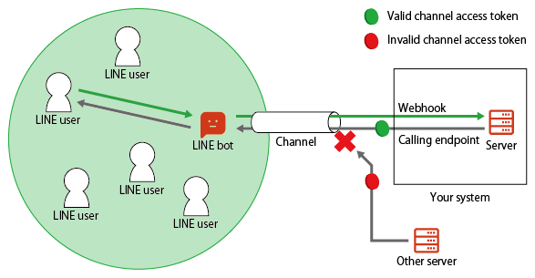
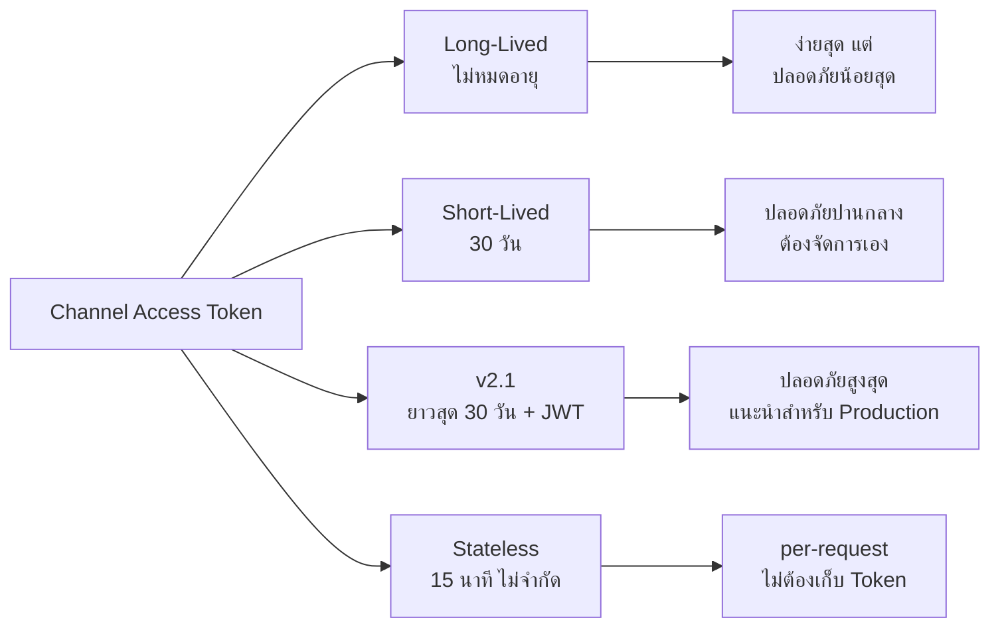
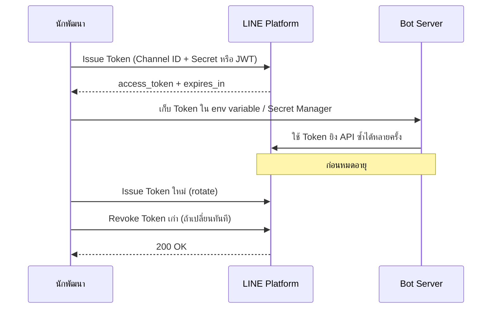

# Workshop: Channel Access Token — กุญแจเข้าห้อง LINE API

> ทุกครั้งที่บอทของคุณยิง request ไป `api.line.me` สิ่งแรกที่ LINE ตรวจคือ header `Authorization: Bearer {token}` — **token ตัวนี้แหละคือ Channel Access Token** ถ้าไม่มีหรือหมดอายุ จะได้ `401 Unauthorized` ทันที บทนี้จะสรุป Channel Access Token ทั้ง 4 ประเภท พร้อมบอกว่าควรใช้แบบไหนในสถานการณ์ไหน

Channel Access Token คือคีย์ที่ใช้ในการยืนยันการเข้าถึงฟีเจอร์ต่างๆ ของ LINE Platform โดยสำคัญสำหรับการใช้งาน API เช่น Messaging API

<p align="center" width="100%">
     
</p>

## ทำไมต้องใช้ Channel Access Token

ลองเทียบกับการเข้าห้องทำงาน ถ้าคุณต้องแสดง ID และ Password ทุกครั้งที่เข้าห้อง คงไม่สะดวก — จึงออก **"คีย์การ์ด"** ให้ใช้แทน Channel Access Token ก็คือคีย์การ์ดของ LINE Platform

ในบางระบบ การยืนยันตัวตนจะใช้ ID และ Password แต่เนื่องจากการใช้งาน Channel จะเกิดขึ้นหลายครั้งในระหว่างการให้บริการ การกรอก ID และ Password ทุกครั้งจึงไม่สะดวก Channel Access Token ช่วยให้นักพัฒนาสามารถใช้งาน Channel ได้โดยไม่ต้องกรอก ID และ Password ซ้ำทุกครั้ง

> **สำคัญ: ให้ Revoke Channel Access Token ที่สงสัยว่ารั่วไหลทันที**
> Channel Access Token ใช้เพื่อยืนยันสิทธิ์การเข้าถึง Channel หากรั่วไหลออกไป บุคคลที่สามอาจนำไปใช้งานได้โดยไม่ได้รับอนุญาต

## ภาพรวม: เปรียบเทียบ Token ทั้ง 4 ประเภท



## ประเภทของ Channel Access Tokens

Channel Access Token มี 4 ประเภท แต่ละประเภทมีอายุการใช้งานและจำนวนที่ออกได้ต่อ Channel แตกต่างกัน

| ประเภท | อายุการใช้งาน | จำนวนที่ออกได้ต่อ Channel |
| --- | --- | --- |
| Channel Access Token v2.1 (User-Specified Expiration) | สูงสุด 30 วัน | 30 |
| Stateless Channel Access Token | 15 นาที | ไม่จำกัด |
| Short-Lived Channel Access Token | 30 วัน | 30 |
| Long-Lived Channel Access Token | ไม่มีวันหมดอายุ | 1 |

> **หมายเหตุ:** จำนวน Token ที่ออกได้จะนับแยกตามประเภท ดังนั้นแม้ออก Channel Access Token v2.1 ไปแล้ว 30 ตัว ก็ยังสามารถออก Short-Lived ได้อีก 30 ตัว และ Token ที่หมดอายุแล้วจะไม่ถูกนับรวม

> **Token สามารถใช้ซ้ำได้ภายในช่วงอายุการใช้งาน**
> Channel Access Token ตัวเดิมสามารถใช้ซ้ำได้หลายครั้งภายในช่วงอายุการใช้งาน สำหรับ v2.1 และ Short-Lived ไม่ควร Issue Token ใหม่ทุกครั้งที่ใช้งาน เพราะหากมีการ Issue จำนวนมากในเวลาสั้นๆ อาจถูกจำกัดการ Issue ชั่วคราวได้ แต่สำหรับ **Stateless Channel Access Token ถูกออกแบบมาให้ Issue ใหม่ทุกครั้งที่ใช้งาน (per-request)**

นอกจากนี้ ประเภทของ Channel Access Token ที่ใช้ได้จะแตกต่างกันไปตามผลิตภัณฑ์และฟีเจอร์ ตัวอย่างเช่น Long-Lived Channel Access Token ใช้ได้เฉพาะกับ Messaging API Channel เท่านั้น

## วงจรชีวิตของ Token (Issue → ใช้งาน → Rotate/Revoke)




### Long-lived Channel Access Token
Channel Access Token ประเภทนี้คือ Long-lived ไม่มีวันหมดอายุ (อายุยืนยาว)
- ข้อดี: Issue ง่าย maintain ง่าย
- ข้อเสีย: ความปลอดภัยน้อย เพราะกรณีที่หลุดไป Hacker สามารถนำไปใช้กับ API ต่างๆเช่น Broadcast ข้อความได้แบบยาวๆไปเลย

1. การ Issue
การ Issue ตัว Channel Access Token ประเภทนี้ ก็แสนง่ายเพียงกดปุ่ม Issue ที่อยู่ใน Messaging API Channel เท่านั้น

<p align="center" width="100%">
     
</p>


2. การ Revoke
ในกรณีที่นักพัฒนาไม่แน่ใจหรือแน่ใจก็ตาม ว่าตัว Token ได้ Leak ออกไป นักพัฒนาก็สามารถ Revoke ตัว Token ประเภทนี้ได้ 2 วิธีด้วยกัน

- วิธีที่ 1 กด Reissue ในหน้า Messaging API Channel
วิธีนี้จะทำการออกตัว Token ตัวใหม่พร้อมกับการยกเลิกตัวเก่า โดยนักพัฒนาสามารถกำหนดช่วงเวลาที่จะให้ Token ตัวเก่ามีชีวิตอยู่ต่อไปได้ตั้งแต่ 0–24 ช.ม ซึ่ง 0 ก็หมายถึงให้ Revoke ทันที (จากการทดลองคือจะหมดอายุภายใน 5 นาที)

<p align="center" width="100%">
     
</p>
 
- วิธีที่ 2 Revoke ผ่าน API
วิธีนี้เป็นวิธี Revoke ตัว Token แบบทันทีทันใด โดยนักพัฒนาจะต้องสร้าง Request เพื่อไป Revoke ผ่าน API ตามรายละเอียดด้านล่างนี้

```curl 
Endpoint https://api.line.me/v2/oauth/revoke
Method POST
Headers
  Content-type: application/x-www-form-urlencoded
Body
  access_token: Channel Access Token

```
 3. การ Verify
กรณีที่นักพัฒนาต้องการตรวจสอบหรือยืนยันสถานะของตัว Channel Access Token ว่ามัน valid หรือ invalid ก็สามารถทำได้ผ่าน API โดยให้สร้าง Request เพื่อไป Verify ตามรายละเอียดด้านล่างนี้
```curl
Endpoint https://api.line.me/v2/oauth/verify
Method POST
Headers
  Content-type: application/x-www-form-urlencoded
Body
  access_token: Channel Access Token
```
โดยกรณีที่ Request สำเร็จ เราจะได้ HTTP Status Code 200 กลับมาพร้อมกับ JSON object ที่บอกระยะเวลาที่เหลือของ Token ตัวนั้นๆ เช่น
```json
{
  "client_id": "1350031035",
  "expires_in": 3138007490,
  "scope": "P CM"
}
```

### Short-lived Channel Access Token
ด้วยชื่อของ Channel Access Token ประเภทนี้คือ Short-lived คุณสมบัติพิเศษของตัวมันคือ อายุที่สั้นลง(เพียง 30 วัน) โดยที่ 1 Channel จะสามารถ Issue ตัว Token ได้เรื่อยๆสูงสุด 30 Tokens โดยหาก Issue เกินกว่า 30 ระบบจะ Revoke ตัว Token ที่เก่าที่สุดออกตามลำดับ

- ข้อดี: ปลอดภัยปานกลาง ด้วยอายุ 30 วันของ Token แต่ละตัว
- ข้อเสีย: กรณีที่หลุดไป Hacker สามารถนำไปใช้กับ API ต่างๆเช่น Broadcast ข้อความได้สูงสุด 30 วัน และการจัดการ Token ประเภทนี้ค่อนข้างยุ่งยาก เนื่องจากต้องมีเงื่อนไขในการตรวจสอบสถานะ และการจัดเก็บตัว Token

1. การ Issue
การ Issue ตัว Channel Access Token ประเภทนี้ จะต้องทำผ่าน API โดยนักพัฒนาจะต้องสร้าง Request ตามรายละเอียดด้านล่างนี้
```curl
Endpoint https://api.line.me/v2/oauth/accessToken
Method POST
Headers
  Content-type: application/x-www-form-urlencoded
Body
  grant_type: client_credentials
  client_id: Channel ID
  client_secret: Channel Secret
```
โดยกรณีที่ Request สำเร็จ เราจะได้ HTTP Status Code 200 กลับมาพร้อมกับ JSON object ที่มีตัว Channel Access Token และระยะเวลาที่เหลือของ Token ตัวนั้น เช่น
```json
{
  "access_token": "W1TeHCgfH2Liwa.....",
  "expires_in": 2592000,
  "token_type": "Bearer"
}
```
2. การ Revoke
ในกรณีที่นักพัฒนาไม่แน่ใจหรือแน่ใจก็ตาม ว่าตัว Token ได้ Leak ออกไป นักพัฒนาก็สามารถ Revoke ตัว Token ประเภทนี้ผ่านการ Request API ตามรายละเอียดดังนี้
```curl
Endpoint https://api.line.me/v2/oauth/revoke
Method POST
Headers
  Content-type: application/x-www-form-urlencoded
Body
  access_token: Channel Access Token
```
3. การ Verify
กรณีที่นักพัฒนาต้องการตรวจสอบหรือยืนยันสถานะของตัว Channel Access Token ว่ามัน valid หรือ invalid ก็สามารถทำได้ผ่าน API โดยให้สร้าง Request เพื่อไป Verify ตามรายละเอียดด้านล่างนี้
```curl
Endpoint https://api.line.me/v2/oauth/verify
Method POST
Headers
  Content-type: application/x-www-form-urlencoded
Body
  access_token: Channel Access Token
```
โดยกรณีที่ Request สำเร็จ เราจะได้ HTTP Status Code 200 กลับมาพร้อมกับ JSON object ที่บอกระยะเวลาที่เหลือของ Token ตัวนั้นๆ เช่น
```json
{
  "client_id": "1350031035",
  "expires_in": 3138007490,
  "scope": "P CM"
}
```

### Channel Access Token v2.1

<p align="center" width="100%">
     
</p>
Channel Access Token ที่ให้นักพัฒนาสามารถ กำหนดอายุของตัว Token ได้เองสูงสุด 30 วัน โดยที่ 1 Channel จะสามารถ Issue ตัว Token ได้เรื่อยๆสูงสุด 30 Tokens

- ข้อดี: ปลอดภัยสูงสุด ด้วยอายุที่กำหนดให้สั้นตามต้องการได้ และใช้ JWT ที่เวลาจำกัด 30 นาที แทนที่ Channel Secret ในการ Issue ตัว Token แต่ละครั้ง
- ข้อเสีย: ขั้นตอนในการ Issue และการบริหารจัดการค่อนข้างซับซ้อน


1. การ Issue
การ Issue ตัว Channel Access Token ประเภทนี้ จะต้องทำผ่าน API โดยนักพัฒนาจะต้องสร้าง Request ตามรายละเอียดด้านล่างนี้
```curl
Endpoint https://api.line.me/oauth2/v2.1/token
Method POST
Headers
  Content-type: application/x-www-form-urlencoded
Body
  grant_type: client_credentials
  client_assertion_type: urn:ietf:params:oauth:client-assertion-type:jwt-bearer
  client_assertion: JWT ที่ sign ด้วย Assertion Signing Key
```
โดยกรณีที่ Request สำเร็จ เราจะได้ HTTP Status Code 200 กลับมาพร้อมกับ JSON object ที่มีตัว Channel Access Token และระยะเวลาที่เหลือของ Token ตัวนั้น เช่น
```json
{
  "access_token": "eyJhbGciOiJIUz.....",
  "token_type": "Bearer",
  "expires_in": 2592000,
  "key_id": "sDTOzw5wIfxxxxPEzcmeQA"
}
```
2. การ Revoke
ในกรณีที่นักพัฒนาไม่แน่ใจหรือแน่ใจก็ตาม ว่าตัว Token ได้ Leak ออกไป นักพัฒนาก็สามารถ Revoke ตัว Token ประเภทนี้ผ่านการ Request API ตามรายละเอียดดังนี้
```curl
Endpoint https://api.line.me/oauth2/v2.1/revoke
Method POST
Headers
  Content-type: application/x-www-form-urlencoded
Body
  access_token: Channel Access Token
  client_id: Channel ID
  client_secret: Channel Secret
```
3. การ Verify
กรณีที่นักพัฒนาต้องการตรวจสอบหรือยืนยันสถานะของตัว Channel Access Token ว่ามัน valid หรือ invalid ก็สามารถทำได้ผ่าน API โดยให้สร้าง Request เพื่อไป Verify ตามรายละเอียดด้านล่างนี้
```curl
Endpoint https://api.line.me/oauth2/v2.1/verify
Method GET
Query param
  access_token: Channel Access Token
```
โดยกรณีที่ Request สำเร็จ เราจะได้ HTTP Status Code 200 กลับมาพร้อมกับ JSON object ที่บอกระยะเวลาที่เหลือของ Token ตัวนั้นๆ เช่น
```json
{
  "client_id": "1573163733",
  "expires_in": 2591659,
  "scope": "profile chat_message.write"
}
```

4. การดึง Channel Access Token ที่ยัง Valid ทั้งหมด
สำหรับ Channel Access Token v2.1 จะมี API พิเศษเสริมมาอีกเส้น คือเราสามารถดึง Token ที่ยัง Valid ทั้งหมดออกมาดูได้ด้วย โดยให้สร้าง Request ตามรายละเอียดด้านล่างนี้
```curl
Endpoint https://api.line.me/oauth2/v2.1/tokens/kid
Method POST
Headers
  Content-type: application/x-www-form-urlencoded
Query Params
  client_assertion_type: urn:ietf:params:oauth:client-assertion-type:jwt-bearer
  client_assertion: JWT ที่ sign ด้วย Assertion Signing Key
```
โดยกรณีที่ Request สำเร็จ เราจะได้ HTTP Status Code 200 กลับมาพร้อมกับ JSON object ที่บรรจุ Token ที่ยัง Valid ไว้ เช่น

```json
{
  "kids": [
    "U_gdnFYKTWRxxxxDVZexGg",
    "sDTOzw5wIfWxxxxzcmeQA",
    "G82YP96jhHwyKSxxxx7IFA"
  ]
}
```


### Stateless Channel Access Token
Channel Access Token ประเภทล่าสุดที่มี อายุที่สั้น(เพียง 15 นาที) โดยที่ 1 Channel จะสามารถ Issue ตัว Token ได้เรื่อยๆไม่จำกัด **และไม่สามารถ Revoke ได้** เนื่องจากถูกออกแบบมาให้ใช้งานแบบครั้งต่อครั้ง (per-request) โดยไม่จำเป็นต้องจัดเก็บ Token

- ข้อดี: ปลอดภัยสูง ด้วยอายุเพียง 15 นาทีของ Token แต่ละตัว ทำให้ลดปัญหา Replay Attack ในกรณีที่ Token หลุดไปได้เยอะ แถมไม่ต้องมีกระบวนการจัดเก็บ เพราะเราสามารถ Issue ได้ไม่จำกัด
- ข้อเสีย: จะต้องมีการ Issue บ่อยครั้ง ทำให้อาจมี Latency ได้
1. การ Issue
การ Issue ตัว Channel Access Token ประเภทนี้ จะต้องทำผ่าน API โดยนักพัฒนาจะต้องสร้าง Request ตามรายละเอียดด้านล่างนี้
```curl
Endpoint https://api.line.me/oauth2/v3/token
Method POST
Headers
  Content-type: application/x-www-form-urlencoded

// ตัว Request body ที่จะส่งไปสามารถเลือกได้ 2 วิธี

// 1. จาก Channel ID และ Channel Secret (แบบพื้นฐาน)
Body
  grant_type: client_credentials
  client_id: Channel ID
  client_secret: Channel Secret

// 2. จาก JWT Assertion (แบบขั้นสูง)
Body
  grant_type: client_credentials
  client_assertion_type: URL-encoded ของ urn:ietf:params:oauth:client-assertion-type:jwt-bearer
  client_assertion: JWT ที่ generate จากฝั่ง client และ sign ด้วย private key
```

โดยกรณีที่ Request สำเร็จ ไม่ว่าจะใช้การส่ง Request body ด้วยวิธีการใด เราจะได้ HTTP Status Code 200 กลับมาพร้อมกับ JSON object ที่มีตัว Channel Access Token และระยะเวลาที่เหลือของ Token ตัวนั้น เช่น
```json
{
  "access_token": "W1TeHCgfH2Liwa.....",
  "expires_in": 900,
  "token_type": "Bearer"
}
```
2. การ Revoke และ Verify
เนื่องจาก Stateless Channel Access Token เป็น Token ที่มีอายุสั้นเพียง 15 นาที สามารถ Issue ได้แบบไม่จำกัด และไม่จำเป็นต้องมีการจัดเก็บ ดังนั้นจึงมีความปลอดภัยค่อนข้างสูง สามารถใช้งานครั้งต่อครั้งได้เลย ทำให้ไม่ต้องมีการ Revoke เกิดขึ้น

---

## แนวทางการบริหารจัดการ Channel Access Token

Channel Access Token ควรถูก Issue แยกตามทีมพัฒนาหรือกลุ่มผู้ใช้งาน ตัวอย่างเช่น ทีมพัฒนา A และทีมพัฒนา B ควรใช้ Token คนละตัว เพื่อที่หาก Token ของทีม A ถูกสงสัยว่ารั่วไหล การ Revoke จะไม่กระทบกับทีม B

นอกจากนี้ แนะนำให้แต่ละทีมหรือกลุ่มผู้ใช้งาน Issue Token ไว้อย่างน้อย 2 ตัว เพื่อให้บริการทำงานได้อย่างต่อเนื่อง (ในกรณีที่ต้อง Revoke ตัวหนึ่ง ยังมีอีกตัวใช้งานได้)

## Security Best Practices

1. **Revoke Token ที่สงสัยว่ารั่วไหลทันที** - หาก Channel Access Token รั่วไหล บุคคลที่สามอาจนำไปใช้งานได้ เช่น ในกรณีของ Messaging API สามารถใช้ฟีเจอร์ Broadcast Message ส่งข้อความไปยังเพื่อนทุกคนของ LINE Official Account ได้ ซึ่งอาจทำให้มีการส่งข้อความที่เป็นอันตรายไปยังผู้ใช้ทั้งหมด
2. **ไม่ควร Issue Token ใหม่ทุกครั้งที่ใช้งาน** (ยกเว้น Stateless) - สำหรับ v2.1 และ Short-Lived Token ควรใช้ Token เดิมซ้ำภายในช่วงอายุการใช้งาน หาก Issue จำนวนมากในเวลาสั้นๆ อาจถูกระบบจำกัดการ Issue ชั่วคราว
3. **ตั้งระบบ Auto-Renewal** - แนะนำให้ตั้งระบบ Issue Token ใหม่อัตโนมัติก่อนที่ Token เดิมจะหมดอายุ เพื่อป้องกันการหยุดชะงักของบริการ
4. **ใช้ Stateless Token สำหรับ Per-Request** - หากต้องการใช้งานแบบครั้งต่อครั้งและไม่ต้องการจัดเก็บ Token ให้ใช้ Stateless Channel Access Token
5. **ใช้ v2.1 กับ JWT เพื่อความปลอดภัยสูงสุด** - Channel Access Token v2.1 ใช้ JWT ที่มีอายุจำกัด 30 นาทีแทน Channel Secret ในการ Issue ทำให้ปลอดภัยกว่าการใช้ Channel Secret โดยตรง
6. **แยก Token ตามทีมพัฒนา** - Issue Token แยกตามทีมหรือกลุ่มผู้ใช้งาน เพื่อลดผลกระทบเมื่อต้อง Revoke

## ข้อผิดพลาดที่มักเจอ

- **พลาด:** commit Long-lived Token ลง GitHub repo public แล้วถูก bot สแกนเจอ
  **ถูก:** Revoke ทันทีผ่าน `/v2/oauth/revoke` แล้ว reissue ใหม่ — เก็บ token ใน `.env` (gitignore) หรือ Secret Manager (Firebase, AWS, Vercel)

- **พลาด:** ตั้ง cron ยิง Issue Short-Lived Token ทุก 1 นาที แล้วโดน rate limit
  **ถูก:** Issue ล่วงหน้าก่อนหมดอายุ 1-2 วัน ไม่ใช่ทุกครั้งที่ใช้ — และเก็บ Token ไว้ใช้ซ้ำ หากต้องการ per-request จริง ๆ ให้ใช้ **Stateless Token** แทน

- **พลาด:** ออก Short-Lived Token เกิน 30 ตัวแล้วสงสัยว่าทำไม Token เก่าใช้ไม่ได้แล้ว
  **ถูก:** Short-Lived และ v2.1 จำกัดที่ 30 ตัว/channel — ถ้า Issue เกิน ระบบจะ Revoke ตัวเก่าที่สุดออกอัตโนมัติ

- **พลาด:** ใช้ v2.1 Token แล้ว JWT sign ด้วย Channel Secret (ผิด)
  **ถูก:** v2.1 ต้อง sign ด้วย **Assertion Signing Key** (ซึ่งเป็น public/private key pair แยกต่างหาก) ไม่ใช่ Channel Secret

- **พลาด:** ลืมว่า Stateless Token **ไม่สามารถ Revoke** ได้ แล้วพยายาม revoke
  **ถูก:** Stateless มีอายุแค่ 15 นาทีจึงไม่ต้อง revoke — ถ้ากังวลเรื่อง leakage ให้ใช้ short TTL และลด scope ของ key ที่ใช้ sign

- **พลาด:** ใช้ Token เดียวทั้งทีม 10 คน พอคนหนึ่งลาออกต้อง rotate ต้อง down ทั้งระบบ
  **ถูก:** ออก Token แยกตามทีม/บุคคล/environment (dev/staging/prod) ตั้งแต่แรก ใช้ v2.1 เพราะ issue ได้หลายตัว

## Checklist ก่อนไปต่อ

- [ ] เข้าใจความต่างของ Token ทั้ง 4 ประเภท และใช้แบบไหนดีใน use case ของตัวเอง
- [ ] Token เก็บใน env variable / Secret Manager ไม่เคย commit
- [ ] มี 2 tokens สำรอง (primary + backup)
- [ ] ตั้งระบบ auto-rotate ก่อนหมดอายุ (cron/scheduler)
- [ ] มีระบบ monitor ว่า token ใกล้หมดอายุ
- [ ] ออก Token แยกตาม environment (dev/prod) และ/หรือทีม

## อ้างอิง

- [Channel Access Token Overview](https://developers.line.biz/en/docs/messaging-api/channel-access-tokens/)
- [Issue Channel Access Token v2.1](https://developers.line.biz/en/reference/messaging-api/#issue-channel-access-token-v2-1)
- [Stateless Channel Access Token](https://developers.line.biz/en/reference/messaging-api/#issue-stateless-channel-access-token)
- [JWT Assertion Guide](https://developers.line.biz/en/docs/messaging-api/generate-json-web-token/)


````
(async () => {
  // 1) ใส่ Channel ID ของคุณ
  const CHANNEL_ID = "YOUR_CHANNEL_ID";

  // 2) kid ที่ได้จาก LINE Developers Console
  const KID = "df6b20cd-3207-4f39-9e3d-237fc34bface";

  // 3) private JWK ของคุณ
  const PRIVATE_JWK = {
    alg: "RS256",
    d: "PUT_YOUR_d_HERE",
    dp: "PUT_YOUR_dp_HERE",
    dq: "PUT_YOUR_dq_HERE",
    e: "AQAB",
    ext: true,
    key_ops: ["sign"],
    kty: "RSA",
    n: "PUT_YOUR_n_HERE",
    p: "PUT_YOUR_p_HERE",
    q: "PUT_YOUR_q_HERE",
    qi: "PUT_YOUR_qi_HERE"
  };

  const enc = new TextEncoder();

  function toBase64UrlFromBytes(bytes) {
    let binary = "";
    for (const b of bytes) binary += String.fromCharCode(b);
    return btoa(binary)
      .replace(/\+/g, "-")
      .replace(/\//g, "_")
      .replace(/=+$/g, "");
  }

  function toBase64UrlFromString(str) {
    return toBase64UrlFromBytes(enc.encode(str));
  }

  // JWT header
  const header = {
    alg: "RS256",
    typ: "JWT",
    kid: KID
  };

  // JWT payload
  const now = Math.floor(Date.now() / 1000);
  const payload = {
    iss: CHANNEL_ID,
    sub: CHANNEL_ID,
    aud: "https://api.line.me/",
    exp: now + 60 * 30,     // ไม่เกิน 30 นาที
    token_exp: 60 * 60 * 24 // อายุ access token ตัวอย่าง 1 วัน
  };

  const encodedHeader = toBase64UrlFromString(JSON.stringify(header));
  const encodedPayload = toBase64UrlFromString(JSON.stringify(payload));
  const signingInput = `${encodedHeader}.${encodedPayload}`;

  // import private key
  const privateKey = await crypto.subtle.importKey(
    "jwk",
    PRIVATE_JWK,
    {
      name: "RSASSA-PKCS1-v1_5",
      hash: "SHA-256"
    },
    false,
    ["sign"]
  );

  // sign JWT
  const signature = await crypto.subtle.sign(
    "RSASSA-PKCS1-v1_5",
    privateKey,
    enc.encode(signingInput)
  );

  const jwt = `${signingInput}.${toBase64UrlFromBytes(new Uint8Array(signature))}`;
  console.log("JWT =", jwt);

  // issue channel access token v2.1
  const body = new URLSearchParams({
    grant_type: "client_credentials",
    client_assertion_type: "urn:ietf:params:oauth:client-assertion-type:jwt-bearer",
    client_assertion: jwt
  });

  const res = await fetch("https://api.line.me/oauth2/v2.1/token", {
    method: "POST",
    headers: {
      "Content-Type": "application/x-www-form-urlencoded"
    },
    body
  });

  const text = await res.text();
  console.log("status =", res.status);
  console.log("response =", text);

  try {
    const json = JSON.parse(text);
    console.log("access_token =", json.access_token);
    console.log("key_id =", json.key_id);
  } catch (_) {}
})();
````
