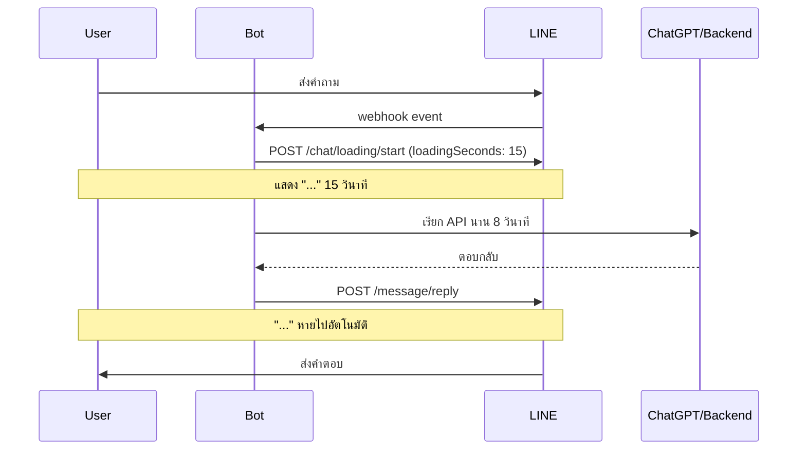

# Workshop: Loading Animation — บอกผู้ใช้ว่าบอท "กำลังคิด" อยู่

> เวลาบอทเรียก ChatGPT หรือทำงานหนักนาน 5-10 วินาที ผู้ใช้มักไม่รู้ว่า "บอทค้างหรือเปล่า" แล้วส่งข้อความซ้ำ — Loading Animation คือจุด "..." แบบที่เพื่อนพิมพ์อยู่ ทำให้ผู้ใช้รู้ว่าบอทกำลังประมวลผล รอได้

<p align="center" width="100%">
    
</p>

## ทำไมต้องรู้เรื่องนี้?

ลองนึกภาพคุณส่งข้อความหาเพื่อน แล้วเห็น "..." ขึ้นมา — คุณก็จะรอใช่มั้ย? เพราะรู้ว่าเขากำลังพิมพ์อยู่ แต่ถ้าเงียบหายไป 10 วินาที คุณคงเริ่มสงสัยว่าเพื่อนเห็นข้อความหรือยัง

บอทก็เหมือนกัน — ถ้าผู้ใช้ส่งคำถามแล้วต้องรอ 10 วินาทีให้บอทไปเรียก LLM แล้วตอบกลับ ผู้ใช้อาจ:
- ส่งข้อความซ้ำ คิดว่าบอทไม่ได้รับ (เปลือง quota)
- กดปุ่มอื่น ทำให้ flow พัง
- ปิดแชทไปเลย คิดว่าบอทพัง

Loading Animation API จะช่วย "บอก" ผู้ใช้ว่าบอทกำลังคิดอยู่ ซึ่งเป็น **UX ฟรี** ที่ไม่นับ quota

## ภาพรวม



## เงื่อนไขการแสดงผล

### Loading Animation จะแสดงเมื่อ
- อยู่ในห้องแชทแบบ **one-on-one** (ระหว่างผู้ใช้กับบอทเท่านั้น)
- ผู้ใช้กำลัง **เปิดหน้าแชท** ของบอทอยู่ ณ ขณะที่ request

### Loading Animation จะหายไปเมื่อ
- บอทส่งข้อความใหม่เข้ามา (auto-dismiss)
- ผู้ใช้ออกจากหน้าแชท
- ครบเวลาที่กำหนดใน `loadingSeconds`

### หมายเหตุสำคัญ
- ถ้าผู้ใช้ไม่เปิดแชทอยู่ตอนยิง API → **ไม่มี notification** และจะ **ไม่แสดงย้อนหลัง** เมื่อผู้ใช้กลับมาเปิด
- ใช้งานได้ใน **groups/rooms ไม่ได้** — เฉพาะ 1-on-1

## Spec ของ API

| รายการ | ค่า |
|-------|-----|
| Endpoint | `https://api.line.me/v2/bot/chat/loading/start` |
| Method | `POST` |
| `chatId` | userId ของผู้ใช้ |
| `loadingSeconds` (optional) | 5, 10, 15, 20, 25, 30, 35, 40, 45, 50, 55, หรือ 60 (default = 20) |
| Rate limit | 100 requests/วินาที |
| ค่าใช้จ่าย | **ฟรี** ไม่นับ quota |

### ตัวอย่าง Request

```sh
curl -v -X POST https://api.line.me/v2/bot/chat/loading/start \
  -H 'Content-Type: application/json' \
  -H 'Authorization: Bearer {channel access token}' \
  -d '{
    "chatId": "U4af4980629...",
    "loadingSeconds": 5
  }'
```

### ตัวอย่าง Code (Node.js wrapper)

```javascript
async function showLoading(userId, seconds = 15) {
  // fire-and-forget — ไม่ต้อง await ก็ได้ เพื่อไม่ให้บล็อกงานหลัก
  return fetch('https://api.line.me/v2/bot/chat/loading/start', {
    method: 'POST',
    headers: {
      'Content-Type': 'application/json',
      'Authorization': `Bearer ${process.env.LINE_CHANNEL_ACCESS_TOKEN}`
    },
    body: JSON.stringify({ chatId: userId, loadingSeconds: seconds })
  }).catch(err => console.warn('Loading animation failed:', err));
}

// ใช้งาน — ห่อรอบงานหนัก
async function handleQuestion(event) {
  const userId = event.source.userId;
  showLoading(userId, 15);  // แสดงทันที ไม่ต้องรอ

  const answer = await callOpenAI(event.message.text);  // ใช้เวลาประมาณ 8 วินาที

  await replyMessage(event.replyToken, [
    { type: 'text', text: answer }
  ]);
  // เมื่อข้อความถูกส่ง Loading Animation จะหายไปเอง
}
```

## รุ่น LINE ที่รองรับ

| Platform | เวอร์ชันขั้นต่ำ |
|----------|---------------|
| LINE iOS | 13.16.0 |
| LINE Android | 13.16.0 |
| LINE Desktop (PC/Mac) | 9.1.2 |

## ข้อผิดพลาดที่มักเจอ

- **พลาด:** เรียก loading แล้ว `await` ทำให้บอทช้าลง 200-500ms ทุกครั้ง
  **ถูก:** ใช้ **fire-and-forget** — ยิง API ทิ้งไว้ ไม่ต้อง await ผลลัพธ์ (ดู code ตัวอย่างด้านบน)

- **พลาด:** ตั้ง `loadingSeconds: 60` แล้วงานเสร็จใน 3 วินาที — แต่ Loading ค้างอยู่
  **ถูก:** Loading หายอัตโนมัติเมื่อบอทส่งข้อความใหม่ ไม่ต้องเลือกเวลาเป๊ะ — ตั้งให้ **มากกว่า** เวลาที่คาดว่าจะใช้เล็กน้อย

- **พลาด:** ใช้ใน group/room — request สำเร็จ status 202 แต่ผู้ใช้ไม่เห็นอะไร
  **ถูก:** ฟีเจอร์นี้ใช้ได้เฉพาะ **1-on-1** เท่านั้น เช็ค `event.source.type === 'user'` ก่อนเรียก

- **พลาด:** ผู้ใช้ Android เห็น 202 แต่ไม่เห็น Loading
  **ถูก:** ให้ผู้ใช้ **kill app แล้วเปิดใหม่** — เป็นบั๊กที่ LINE ฝั่ง Android เคยมี ตรวจเวอร์ชันให้เป็น ≥ 13.16.0

- **พลาด:** ส่ง `loadingSeconds: 7` (ค่าที่ไม่อยู่ในลิสต์) ทำให้ได้ 400 Bad Request
  **ถูก:** ใช้เฉพาะ **5, 10, 15, 20, 25, 30, 35, 40, 45, 50, 55, 60** เท่านั้น — เพิ่มลดทีละ 5

- **พลาด:** ยิง API ซ้ำ ๆ ระหว่างที่ Loading เดิมยังแสดงอยู่ คิดว่าจะ "ต่อเวลา"
  **ถูก:** จริง ๆ มันจะ **ใช้เวลาของ request ล่าสุด** เป็นจุดสิ้นสุด — ใช้ได้แต่ไม่จำเป็นถ้างานเสร็จไว

## Checklist ก่อนไปต่อ

- [ ] ใช้ Loading Animation เฉพาะใน 1-on-1 (ไม่ใช้ใน group/room)
- [ ] เรียกแบบ fire-and-forget ไม่ block งานหลัก
- [ ] ตั้ง `loadingSeconds` มากกว่าเวลาที่คาดว่าใช้
- [ ] เช็ค LINE version ขั้นต่ำของผู้ใช้ Android (13.16.0)
- [ ] อย่าลืมว่ามันหายเองเมื่อบอทตอบ — ไม่ต้อง stop API

## อ้างอิง

- [Display a loading animation — LINE Developers](https://developers.line.biz/en/docs/messaging-api/use-loading-indicator/)
- [API Reference: chat/loading/start](https://developers.line.biz/en/reference/messaging-api/#display-a-loading-indicator)
