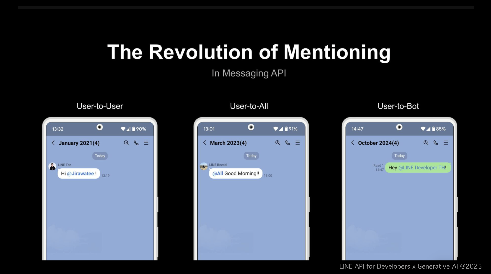
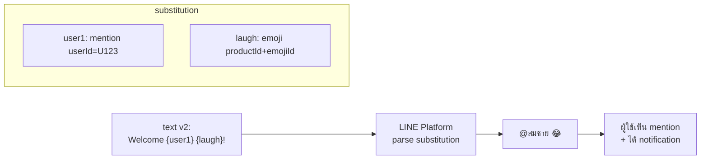

# Workshop: Message Mention (Text v2) — แท็กผู้ใช้ในกรุ๊ปด้วยข้อความบอท

> ในกรุ๊ปแชท LINE ถ้าบอทพิมพ์ "คุณสมชาย โปรดเช็คงาน" — สมชายไม่รู้หรอก เพราะไม่มีการแจ้งเตือน แต่ถ้าใช้ **Mention (text v2)** บอทจะ **@สมชาย** จริง ๆ เด้ง notification ให้เลย ไม่ต้องโทรถาม

<p align="center">
    
</p>

## ทำไมต้องรู้เรื่องนี้?

ในกรุ๊ปงาน บอทมักต้องแจ้งคนเฉพาะคน เช่น "เคสนี้ขอ @แอดมิน เช็คให้หน่อย" หรือ "@ทุกคน ประชุม 14:00 น." — ถ้าใช้ text ธรรมดา ผู้ใช้ที่ไม่ได้เปิดแชทตอนนั้นจะไม่รู้เลย

**Text Message v2** เป็นรูปแบบใหม่ที่ออกแบบมาให้ใช้ได้กับ:
- **Mention** — แท็กผู้ใช้คนใดคนหนึ่ง หรือ `@all` ทั้งกรุ๊ป
- **LINE Emoji** — ใส่อีโมจิ LINE (สมาชิกเสียเงินซื้อ) ได้ง่ายกว่า v1

ใช้ template syntax ` {key} ` แทนตำแหน่งที่จะถูกแทนที่ — คล้ายๆ template literal ใน JS

> **หมายเหตุ:** ข้อความแบบเดิม (text v1) ยังใช้ได้ แต่ฟีเจอร์ใหม่ในอนาคต LINE อาจเพิ่มเฉพาะ v2 — โปรเจ็กต์ใหม่ควรเริ่มจาก v2 เลย

## ภาพรวม



## โครงสร้าง Text Message v2

ใช้ syntax `{key}` ในข้อความ แล้วระบุ `substitution` map บอก LINE ว่าแต่ละ key คือ mention หรือ emoji

```json
{
  "type": "textV2",
  "text": "Welcome, {user1}! {laugh}\n{everyone} There is a newcomer!",
  "substitution": {
    "user1": {
      "type": "mention",
      "mentionee": {
        "type": "user",
        "userId": "U49585cd0d5..."
      }
    },
    "laugh": {
      "type": "emoji",
      "productId": "5a8555cfe6256cc92ea23c2a",
      "emojiId": "002"
    },
    "everyone": {
      "type": "mention",
      "mentionee": {
        "type": "all"
      }
    }
  }
}
```

### ประเภทใน substitution

| `type` | ใช้ทำอะไร | ฟิลด์เพิ่มเติม |
|--------|-----------|--------------|
| `mention` (specific user) | แท็กคนเดียว | `mentionee.type: "user"` + `userId` |
| `mention` (all) | แท็กทั้งกรุ๊ป | `mentionee.type: "all"` |
| `emoji` | ใส่ LINE emoji | `productId` + `emojiId` (ดู [LINE emoji list](https://developers.line.biz/en/docs/messaging-api/emoji-list/)) |

## ตัวอย่างใช้จริง: บอทแจ้งงานในกรุ๊ป

```javascript
async function notifyAssignee(groupId, assigneeUserId, taskTitle) {
  await fetch('https://api.line.me/v2/bot/message/push', {
    method: 'POST',
    headers: {
      'Content-Type': 'application/json',
      'Authorization': `Bearer ${process.env.LINE_CHANNEL_ACCESS_TOKEN}`
    },
    body: JSON.stringify({
      to: groupId,
      messages: [{
        type: 'textV2',
        text: '{user} มีงานใหม่ "{title}" รอดำเนินการ',
        substitution: {
          user: {
            type: 'mention',
            mentionee: { type: 'user', userId: assigneeUserId }
          },
          title: {
            type: 'mention',  // ⚠ จะ error — substitution ไม่ใช่ mention/emoji อย่างเดียว
            mentionee: { type: 'user', userId: 'placeholder' }
          }
        }
      }]
    })
  });
}
```

แก้ — ใช้ string ปกติสำหรับข้อมูลที่ไม่ใช่ mention/emoji:

```javascript
const text = `{user} มีงานใหม่ "${taskTitle}" รอดำเนินการ`;  // taskTitle = ตัวแปรปกติ
```

## ข้อจำกัดสำคัญ (สำคัญมาก!)

| รายการ | เงื่อนไข |
|--------|---------|
| Method ที่ใช้ได้ | **Reply / Push เท่านั้น** (ไม่รองรับ multicast/broadcast/narrowcast) |
| Chat type | ต้องเป็น **group** หรือ **multi-person chat** เท่านั้น |
| Bot ต้องอยู่ในกรุ๊ป | **ใช่** — บอทต้องเป็นสมาชิกของกรุ๊ปนั้น |
| ผู้ที่ถูก mention | ต้องเป็น **สมาชิกในกรุ๊ปเดียวกัน** เท่านั้น |
| ต้องการ scope | บอทต้องมี permission `chat_message.write` (ปกติมี by default) |

## ข้อผิดพลาดที่มักเจอ

- **พลาด:** ใช้ mention ในแชท 1-on-1 (`source.type === 'user'`) แล้ว LINE return 400
  **ถูก:** mention ใช้ได้เฉพาะ **group** หรือ **room** — เช็ค `event.source.type` ก่อนส่ง

- **พลาด:** mention `userId` ของคนที่ไม่ได้อยู่ในกรุ๊ป
  **ถูก:** ผู้ใช้ที่ถูก mention ต้อง **อยู่ในกรุ๊ปเดียวกับบอท** เท่านั้น

- **พลาด:** ส่ง textV2 ผ่าน `multicast` หรือ `broadcast` แล้ว return 400
  **ถูก:** mention ใช้ได้เฉพาะ **reply** กับ **push** เท่านั้น (ไม่ทำงานกับ multicast/broadcast/narrowcast)

- **พลาด:** Key ใน `text` ไม่ตรงกับใน `substitution` (พิมพ์ผิด `{user1}` แต่ key เป็น `user_1`)
  **ถูก:** key ต้อง **match กันทุกตัว** — ระบบจะแสดงข้อความเป็น `{user1}` ตรง ๆ ถ้า key ไม่เจอ

- **พลาด:** ใช้ `type: "textV2"` แต่ใส่ `mentionees` array แบบ v1 (เก่า)
  **ถูก:** v2 ใช้ `substitution` object — ไม่ใช่ `mentionees` array

- **พลาด:** ลืมว่าบอทต้องอยู่ในกรุ๊ปก่อนถึงจะ mention ได้
  **ถูก:** เชิญบอทเข้ากรุ๊ปก่อน → wait `join` event → ค่อยเริ่มส่ง mention

## Checklist ก่อนไปต่อ

- [ ] ใช้ `type: "textV2"` (ไม่ใช่ `text`)
- [ ] กำหนด key ใน `text` ตรงกับใน `substitution`
- [ ] เช็ค `source.type` เป็น `group` หรือ `room` ก่อนส่ง
- [ ] ผู้ใช้ที่ถูก mention อยู่ในกรุ๊ปจริง ๆ
- [ ] ใช้เฉพาะ Reply / Push (ไม่ multicast/broadcast)
- [ ] ทดสอบกับ LINE emoji อย่างน้อย 1 อันให้แน่ใจว่า productId/emojiId ถูก

## อ้างอิง

- [Text message (v2) — Messaging API Reference](https://developers.line.biz/en/reference/messaging-api/#text-message-v2)
- [LINE Emoji List](https://developers.line.biz/en/docs/messaging-api/emoji-list/)
- [Mentions in messages](https://developers.line.biz/en/docs/messaging-api/mention-users-in-messages/)
