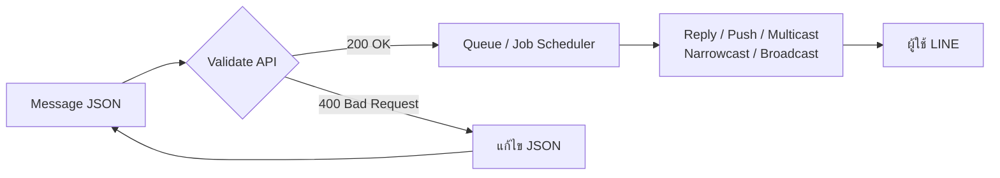
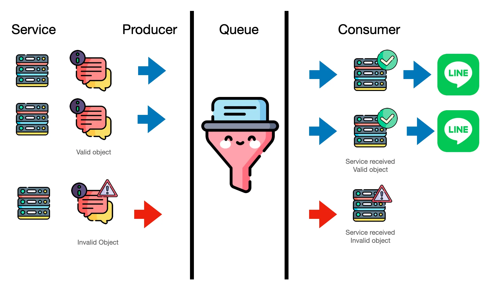

# Workshop: Validate Message Object API — ตรวจโครงสร้างข้อความก่อนส่งจริง

> เคยไหมที่ส่ง Flex Message ออกไปเป็นพันๆ คน แล้วมารู้ทีหลังว่ามี typo ใน JSON ทำให้บอทส่งไม่สำเร็จ เสียทั้งโควตาและเสียหน้าลูกค้า — LINE มี **Validate Message Object API** ที่ให้เราส่ง "ข้อความไปลองตรวจก่อน" ได้ฟรี ไม่หัก quota ไม่ส่งจริง แต่บอกได้เลยว่า JSON ถูกต้องไหม เหมาะกับระบบที่ส่งข้อความจำนวนมากแบบ enterprise

<p align="center" width="100%">
    
</p>

อ้างอิงบทความต้นฉบับ: https://medium.com/linedevth/909c59fc25c9

## ทำไมต้องรู้เรื่องนี้?

ลองนึกภาพองค์กรใหญ่ที่ส่งข้อความผ่าน LINE OA วันละหลายแสนข้อความ โดยมีระบบ Queue (เช่น RabbitMQ, Cloud Tasks, SQS) ช่วยจัดคิว และใช้ Cloud Service เช่น AWS Lambda หรือ Cloud Functions เป็นคนยิง API ไปหา LINE

ถ้าโครงสร้างข้อความ (message object) ผิดแม้แต่ตัวเดียว — เช่น Flex Message มี property ที่ไม่ถูกต้อง, สี hex code พิมพ์ผิด, หรือ URL รูปภาพเป็น http แทนที่จะเป็น https — ทุกคิวที่อยู่ใน queue จะ **fail ทั้งหมด** สิ่งที่เกิดขึ้นตามมา:

- ค่าใช้จ่ายฝั่ง Cloud Service พุ่งสูง (retry + logging + dead-letter queue)
- ลูกค้าไม่ได้รับข้อความตามแผน แคมเปญพัง
- ทีม DevOps ต้องมานั่งดีบักโดยที่ผู้ส่งก็โดนนับ quota ไปแล้ว

Validate Message Object API ช่วยให้เรา "ซ้อมยิง" ได้ก่อน — ถ้าโครงสร้างผิดจะบอกทันที ไม่ต้องยิง production จริง และที่สำคัญ **ไม่หัก message quota**

## ภาพรวม



หลักการคือ: ก่อนเอา message object ของจริงเข้า queue ให้ยิงผ่าน validate endpoint ที่สอดคล้องกับวิธีการส่ง (reply/push/multicast/narrowcast/broadcast) — ถ้าผ่าน จึงค่อยเข้า queue แล้วไปส่งจริง

## Validate Message Object API ครอบคลุมอะไรบ้าง?

Validate Message Object API เป็น endpoint ที่ LINE เปิดให้นักพัฒนา **ทดสอบความถูกต้องของรูปแบบโครงสร้างข้อความ** ก่อนที่จะส่งจริงผ่านวิธีการส่งต่างๆ โดยรองรับครบทุกช่องทาง ได้แก่ Reply, Push, Multicast, Narrowcast และ Broadcast

| วิธีการส่ง | Validate Endpoint | Reference |
|-----------|------------------|-----------|
| Reply message | `POST /v2/bot/message/validate/reply` | [Validate reply](https://developers.line.biz/en/reference/messaging-api/#validate-message-objects-of-reply-message) |
| Push message | `POST /v2/bot/message/validate/push` | [Validate push](https://developers.line.biz/en/reference/messaging-api/#validate-message-objects-of-push-message) |
| Multicast message | `POST /v2/bot/message/validate/multicast` | [Validate multicast](https://developers.line.biz/en/reference/messaging-api/#validate-message-objects-of-multicast-message) |
| Narrowcast message | `POST /v2/bot/message/validate/narrowcast` | [Validate narrowcast](https://developers.line.biz/en/reference/messaging-api/#validate-message-objects-of-narrowcast-message) |
| Broadcast message | `POST /v2/bot/message/validate/broadcast` | [Validate broadcast](https://developers.line.biz/en/reference/messaging-api/#validate-message-objects-of-broadcast-message) |

## ทำไมสำคัญกับองค์กรที่ส่งข้อความจำนวนมาก

ถ้าองค์กรหรือบริษัทใหญ่ๆ ที่มีการ Deliver Message จำนวนมาก และมีการนำเทคโนโลยี Queue มาช่วยจัดการ สิ่งที่เกิดขึ้น มันจะเป็นอภิมหาความอลหม่านหลายอย่าง — ที่แน่ๆ ถ้าใช้ Cloud Service ประเภท pay-as-you-go ค่าใช้จ่ายน้ำตาร่วงแน่ เพราะ:

- ทุก message ที่ส่งพัง = คอมพิวเตอร์ทำงานเปล่าๆ (compute cost)
- Retry policy อาจยิงซ้ำ 3-5 ครั้ง ทวีคูณค่าใช้จ่าย
- Log และ error tracking พอง
- ต้องมีคนเฝ้า dead-letter queue คอยย้อนดูข้อความที่ fail

<p align="center" width="100%">
    
</p>

การตรวจสอบด้วย Validate API ก่อน "ส่งเข้าคิว" เป็น pattern ที่แนะนำ — ช่วยให้ทั้งทีมและกระเป๋าเงินสบายใจขึ้น

## ตัวอย่างการใช้งาน

```bash
curl -v -X POST https://api.line.me/v2/bot/message/validate/push \
-H 'Content-Type: application/json' \
-H 'Authorization: Bearer {channel access token}' \
-d '{
    "messages":[
        {
            "type":"text",
            "text":"Hello, world"
        }
    ]
}'
```

- ถ้า JSON ถูกต้อง ได้ `200 OK` พร้อม body ว่างเปล่า `{}`
- ถ้าผิด ได้ `400 Bad Request` พร้อม `message` และ `details` ระบุ path ที่ผิดใน JSON

## ข้อผิดพลาดที่มักเจอ

- **พลาด:** ใช้ endpoint validate ผิดประเภท เช่น ส่ง broadcast object ไป validate/push
  **ถูก:** ใช้ endpoint ให้ตรงกับ method ที่จะส่งจริง เพราะ payload แต่ละแบบมี required fields ต่างกัน (push ต้องมี `to`, reply ต้องมี `replyToken` เป็นต้น)

- **พลาด:** คิดว่า validate ผ่านแล้วต้องส่งถึงผู้ใช้แน่นอน 100%
  **ถูก:** API นี้ตรวจแค่ **โครงสร้าง JSON** ไม่ได้ตรวจว่า user ID จริงมีอยู่ไหม, quota เหลือไหม หรือ URL รูปที่ใส่ใน Flex Message ยังใช้งานได้ไหม

- **พลาด:** ไม่ใช้ Validate API เลย ส่งตรง production พอพังค่อย debug
  **ถูก:** ทำ CI step ที่ยิง validate กับ template ทุกอันก่อน merge — หรือยิงก่อนเข้า queue ทุกครั้งใน runtime

- **พลาด:** เข้าใจว่า Validate API จะหัก quota
  **ถูก:** Validate API **ไม่นับในโควตาข้อความรายเดือน** — ยิงได้ไม่จำกัด (ภายใต้ rate limit ปกติของ API)

## Checklist ก่อนไปต่อ

- [ ] เข้าใจว่า Validate API มี 5 endpoints แยกตามวิธีการส่ง (reply/push/multicast/narrowcast/broadcast)
- [ ] เพิ่ม validate step ในระบบ queue ก่อนยิง production
- [ ] ทดสอบ Flex Message JSON ผ่าน Validate API ก่อนนำไปใช้จริง
- [ ] เข้าใจว่า Validate ผ่าน ≠ ส่งสำเร็จ (ยังต้องเช็ค user ID, quota, URL)
- [ ] รวมการ validate เป็นส่วนหนึ่งของ CI/CD เมื่ออัปเดต template

## อ้างอิง

- [Validate message objects (Messaging API Reference)](https://developers.line.biz/en/reference/messaging-api/#validate-message-objects-of-reply-message)
- [LINE Dev TH — บทความต้นฉบับ](https://medium.com/linedevth/909c59fc25c9)
- [Messaging API Overview](https://developers.line.biz/en/docs/messaging-api/)
