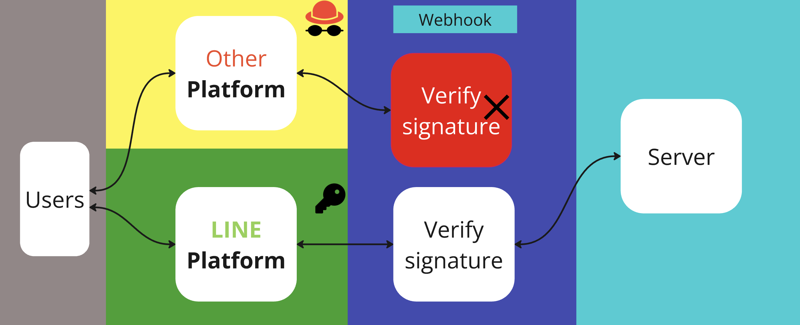

# Verify signature

<p align="center" width="100%">
     
</p>


เมื่อเซิร์ฟเวอร์ของบอทของได้รับคำขอ (request) จาก LINE ให้ ตรวจสอบว่าเป็นคำขอที่มาจาก LINE Platform จริงหรือไม่
เพื่อความปลอดภัย บอทของควร ตรวจสอบลายเซ็น (signature) ที่อยู่ใน header x-line-signature

> **แนะนำให้ตรวจสอบลายเซ็นของ webhook เสมอ**
>
> การตรวจสอบลายเซ็นของ webhook เป็นมาตรการด้านความปลอดภัยที่สำคัญ ตามแนวทางการพัฒนา [Messaging API development guidelines](https://developers.line.biz/en/docs/messaging-api/development-guidelines/#verify-webhook-signature)

> **LINE Platform ไม่เปิดเผย IP address**
>
> IP address ของ LINE Platform ที่ส่ง webhook ไม่ได้ถูกเปิดเผย ดังนั้นควรรักษาความปลอดภัยโดยการตรวจสอบลายเซ็น แทนการควบคุมด้วย IP address

## ทำไมต้องตรวจสอบลายเซ็น (Signature Verification)

การตรวจสอบลายเซ็นหมายความว่า ทั้งผู้ส่ง webhook (LINE Platform) และผู้รับ (เซิร์ฟเวอร์บอทของนักพัฒนา) ทำการคำนวณโดยใช้ hash key เดียวกัน แล้วตรวจสอบความถูกต้องของ webhook โดยเปรียบเทียบว่าลายเซ็นที่ได้ตรงกันหรือไม่

หากไม่ตรวจสอบลายเซ็น อาจเกิดปัญหาดังนี้:
- คำขอที่เซิร์ฟเวอร์บอทได้รับอาจถูกส่งมาจากแหล่งอื่นที่ไม่ใช่ LINE Platform (คำขอปลอม)
- webhook ที่ได้รับอาจถูกดัดแปลงระหว่างทางโดยบุคคลที่สาม (man-in-the-middle attack)

## สิ่งที่ต้องเตรียมสำหรับการตรวจสอบลายเซ็น

### รับ Channel Secret

เปิดแท็บ **Basic settings** ของ channel ใน [LINE Developers Console](https://developers.line.biz/console/) แล้วคัดลอก channel secret (ต้องมีสิทธิ์ Admin)

Channel secret เป็น private key ที่มีเฉพาะ LINE Platform และนักพัฒนาเท่านั้นที่รู้ ใช้เป็น hash key สำหรับการตรวจสอบลายเซ็น ควรเก็บรักษาอย่างปลอดภัยบนเซิร์ฟเวอร์บอท

#### การออก Channel Secret ใหม่

หากสงสัยว่า channel secret ถูกเปิดเผย สามารถออกใหม่ได้โดยคลิก **Issue** ในแท็บ **Basic Settings** ใน LINE Developers Console (ต้องมีสิทธิ์ Admin)

> **ข้อควรระวัง:** การออก channel secret ใหม่จะทำให้ channel secret เดิมใช้งานไม่ได้ทันที ก่อนออกใหม่ควรตรวจสอบผลกระทบต่อบริการที่ใช้ channel secret เดิมอยู่

## ขั้นตอนการทำงานของ Signature Verification

### 1. LINE Platform ส่ง webhook ไปยังเซิร์ฟเวอร์บอท

LINE Platform สร้างลายเซ็นเมื่อส่ง webhook ดังนี้:
1. สร้างลายเซ็นด้วย HMAC-SHA256 โดยใช้ webhook event เป็นข้อมูลนำเข้า และ channel secret เป็น hash key
2. ใส่ลายเซ็นที่สร้างขึ้นลงใน header `x-line-signature`
3. ส่ง webhook event และลายเซ็น (`x-line-signature`) ไปยังเซิร์ฟเวอร์บอท

### 2. เซิร์ฟเวอร์บอทรับ webhook

เซิร์ฟเวอร์บอทรับ webhook จาก LINE Platform

> **ห้ามแก้ไขข้อมูลก่อนตรวจสอบลายเซ็น**
>
> อย่าแก้ไขลายเซ็น (`x-line-signature`) ใน request header หรือ request body string ก่อนทำการตรวจสอบ หากมีการแก้ไข (เช่น string substitution, deserialization, escaping) ก่อนตรวจสอบลายเซ็น จะทำให้แยกแยะไม่ได้ว่าเป็นคำขอที่ถูกดัดแปลงโดยบุคคลที่สามหรือไม่ และการตรวจสอบลายเซ็นจะล้มเหลว

### 3. ตรวจสอบลายเซ็นบนเซิร์ฟเวอร์บอท

วิธีตรวจสอบลายเซ็น:
1. คำนวณค่า digest จาก request body

    - ใช้ อัลกอริธึม HMAC-SHA256
    - ใช้ channel secret (จาก LINE Developer Console) เป็น secret key

2. ตรวจสอบว่า digest ที่เข้ารหัสแบบ Base64 นั้นตรงกับลายเซ็นที่อยู่ใน header x-line-signature หรือไม่

    - ถ้าตรง → ข้อมูลนี้มาจาก LINE Platform และไม่ถูกดัดแปลงระหว่างทาง
    - ถ้าไม่ตรง → อาจถูกปลอมแปลง หรือไม่ได้ส่งมาจาก LINE

3. ถ้าลายเซ็นตรงกัน ให้ดำเนินการตาม webhook event ที่ได้รับ

4. ถ้าลายเซ็นไม่ตรงหรือไม่มีลายเซ็นใน request header ให้ไม่ประมวลผล webhook event และจบการทำงานด้วย error

## ตัวอย่างการตรวจสอบลายเซ็นด้วย openssl

สามารถทดสอบขั้นตอนการตรวจสอบลายเซ็นด้วยคำสั่ง `openssl` ได้ดังนี้:

1. ตัวอย่าง Webhook request body ที่ส่งมายังเซิร์ฟเวอร์บอท
   ```json
   {"destination":"U8e742f61d673b39c7fff3cecb7536ef0","events":[]}
   ```
2. ลายเซ็น (`x-line-signature`) ที่แนบมากับ webhook
   ```
   GhRKmvmHys4Pi8DxkF4+EayaH0OqtJtaZxgTD9fMDLs=
   ```
3. Channel secret ของ channel นั้น
   ```
   8c570fa6dd201bb328f1c1eac23a96d8
   ```
4. คำสั่งสำหรับตรวจสอบลายเซ็นบนเซิร์ฟเวอร์บอท
   ```sh
   echo -n '{"destination":"U8e742f61d673b39c7fff3cecb7536ef0","events":[]}' | openssl dgst -sha256 -hmac '8c570fa6dd201bb328f1c1eac23a96d8' -binary | openssl base64
   ```
5. ลายเซ็นที่สร้างขึ้นจากเซิร์ฟเวอร์บอท
   ```
   GhRKmvmHys4Pi8DxkF4+EayaH0OqtJtaZxgTD9fMDLs=
   ```

เนื่องจากลายเซ็นที่ได้รับจาก LINE Platform (ข้อ 2) ตรงกับลายเซ็นที่สร้างขึ้นจากเซิร์ฟเวอร์บอท (ข้อ 5) จึงยืนยันได้ว่า webhook ที่ได้รับมาจาก LINE Platform และไม่ถูกดัดแปลง

## ตัวอย่างโค้ด

### TypeScript / Node.js

```typescript
import crypto from "crypto";


export function validateLineSignature(rawBody: Buffer | string, signature: string): boolean {
  const hmac = crypto.createHmac("sha256", process.env.LINE_MESSAGING_CHANNEL_SECRET!);
  hmac.update(rawBody);
  const expectedSignature = hmac.digest("base64");

  return expectedSignature === signature;
}
```

> **หมายเหตุ:** ในการพัฒนาจริงสามารถใช้ [LINE Messaging API SDK](https://developers.line.biz/en/docs/messaging-api/line-bot-sdk/) เพื่อตรวจสอบลายเซ็นได้อย่างสะดวก ดูตัวอย่างการ implement ในแต่ละภาษาได้ที่ [Signature validation](https://developers.line.biz/en/reference/messaging-api/#signature-validation) ใน Messaging API Reference

## สาเหตุที่พบบ่อยที่ทำให้การตรวจสอบลายเซ็นล้มเหลว

หากลายเซ็นไม่ตรงกันแม้ว่า webhook จะถูกส่งมาจาก LINE Platform อาจเกิดจากข้อผิดพลาดในวิธีการตรวจสอบลายเซ็นบนเซิร์ฟเวอร์บอท สาเหตุที่พบบ่อยมีดังนี้:

### Webhook ถูกเปลี่ยนแปลงก่อนถึงเซิร์ฟเวอร์บอท
ตรวจสอบว่าไม่มี proxy หรือ load balancer แก้ไข request header หรือ body ก่อนที่ webhook จะถึงเซิร์ฟเวอร์บอท

### Parse หรือ Deserialize webhook ก่อนตรวจสอบ
หาก parse หรือ deserialize string ใน request body แปลงเป็น object หรือ array ก่อนตรวจสอบลายเซ็น การตรวจสอบจะล้มเหลว เช่น การ deserialize อาจเปลี่ยน double quotes เป็น single quotes หรือเพิ่ม space

```python
# ตัวอย่างที่ผิด - deserialize ก่อนตรวจสอบ
decoded_data = json.loads('{"destination":"U8e742f61d673b39c7fff3cecb7536ef0","events":[]}')
print(decoded_data)
# ผลลัพธ์: {'destination': 'U8e742f61d673b39c7fff3cecb7536ef0', 'events': []}
# double quotes เปลี่ยนเป็น single quotes และมี space เพิ่ม
```

### จัดรูปแบบ JSON ของ request body ก่อนตรวจสอบ
การจัดรูปแบบ (format/prettify) JSON ก่อนตรวจสอบจะทำให้ล้มเหลว ต้องใช้ string ดิบตามที่ได้รับมา

### ใช้ algorithm อื่นที่ไม่ใช่ HMAC-SHA256
ตรวจสอบว่าไม่ได้ใช้ algorithm อื่นโดยไม่ตั้งใจ เช่น HMAC-SHA1

### ใช้ channel secret ของ channel อื่น
Channel secret แต่ละ channel จะแตกต่างกัน ตรวจสอบว่าใช้ channel secret ที่ถูกต้องตรงกับ `destination` ใน webhook

### นักพัฒนาคนอื่นออก channel secret ใหม่
เมื่อออก channel secret ใหม่ ค่าเดิมจะใช้ไม่ได้ทันที หากการตรวจสอบที่เคยใช้งานได้กลับล้มเหลว อาจเป็นเพราะนักพัฒนาที่มีสิทธิ์ Admin คนอื่นได้ออก channel secret ใหม่

### ตีความ escape characters
Request body อาจมี escape characters เช่น backslash (`\`) หรือ newline (`\n`) ต้องไม่ตีความ escape characters แต่ใช้ string ตามที่ได้รับมา

```sh
# ใช้ single quotes เพื่อไม่ให้ shell ตีความ escape characters
echo -n '{"destination":"U8e742f61d673b39c7fff3cecb7536ef0","events":[]}' | openssl dgst -sha256 -hmac '8c570fa6dd201bb328f1c1eac23a96d8' -binary | openssl base64
```

```python
# ใน Python ใช้ raw string literals (r"...") เพื่อจัดการ escape characters
body = r'{"destination":"U8e742f61d673b39c7fff3cecb7536ef0","events":[{"type":"message","text":"hello\ntest1\ntest2"}]}'
```

### Character encoding ไม่ใช่ UTF-8
Webhook จาก LINE Platform ส่งมาในรูปแบบ UTF-8 encoding (`Content-Type: application/json; charset=utf-8`) หากประมวลผลด้วย encoding อื่น อาจทำให้ line break code เปลี่ยนจาก LF (`\n`) เป็น CRLF (`\r\n`) หรือ emoji และอักขระพิเศษถูกตีความผิด ส่งผลให้การตรวจสอบลายเซ็นล้มเหลว