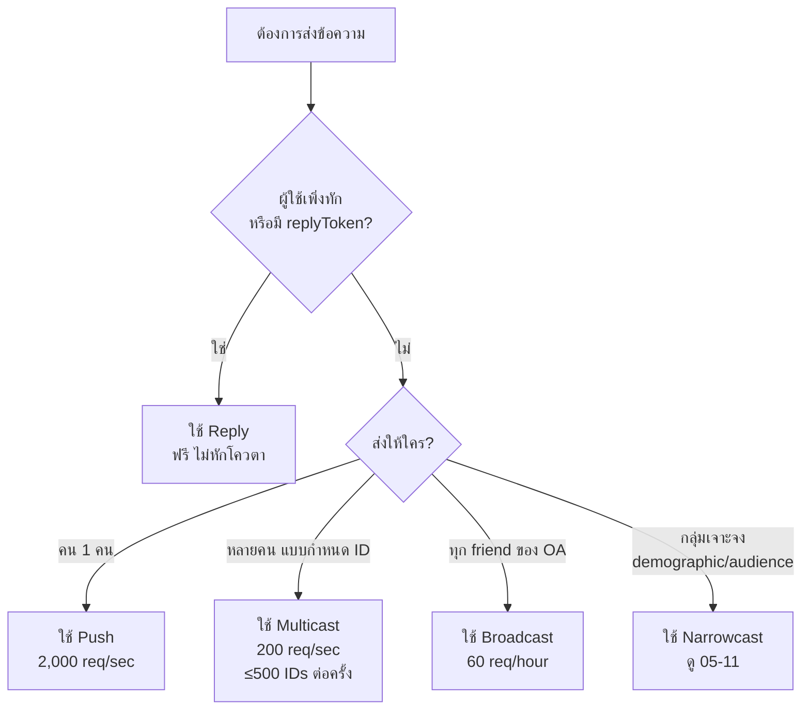

# Workshop: Sending Message — Reply, Push, Multicast, Broadcast ใช้ตัวไหนดี?

> ถ้าลูกค้าทักมาถามราคา บอทควรตอบทันที (Reply) — ถ้าพรุ่งนี้มีโปรโมชันเฉพาะลูกค้า VIP 100 คน ใช้ Multicast — ถ้าปกป้องยอดของลูกค้ารายคน ใช้ Push — ถ้ามีแคมเปญ "Black Friday" ทุกคนใน OA ใช้ Broadcast การเลือกวิธีส่งข้อความให้ถูกต้องคือกุญแจสำคัญของการ "ประหยัดโควตา" และ "ไม่โดน block"

## ทำไมต้องรู้เรื่องนี้?

LINE Messaging API มีวิธีส่งข้อความหลายแบบ แต่ละแบบมี **ข้อดี ข้อจำกัด และ Rate Limit** ที่แตกต่างกัน:

- ใช้ Reply → ฟรี ไม่นับ quota แต่ต้องตอบภายใน 30 วินาทีและใช้ replyToken ได้ครั้งเดียว
- ใช้ Push → ส่งได้ตลอดเวลา แต่**หัก quota** และถ้าส่งเกินโควตา จะไม่ส่งเลย
- ใช้ Multicast → ส่งให้หลายคนได้ในครั้งเดียว ประหยัด API call แต่ยังหัก quota
- ใช้ Broadcast → ส่งให้ทุก friend ของ OA ในครั้งเดียว สะดวกแต่ rate limit ต่ำมาก (60 ครั้ง/ชั่วโมง)

ถ้าเลือกผิด ไม่แค่เปลืองโควตา แต่ผู้ใช้อาจถูก spam ข้อความซ้ำจน unfollow

## ภาพรวม: เลือกวิธีส่งข้อความ



สรุปตารางเปรียบเทียบ:

| วิธีส่ง | ใช้เมื่อไหร่ | Rate Limit | นับ Quota |
|--------|-----------|-----------|-----------|
| **Reply** | ผู้ใช้พึ่งทัก (มี `replyToken`) | — | ไม่นับ |
| **Push** | ส่งหา 1 คน ตามเวลาที่ต้องการ | 2,000 req/sec | นับ |
| **Multicast** | ส่งหาหลายคนที่รู้ userId | 200 req/sec, 500 IDs/req | นับ (ต่อผู้รับ) |
| **Broadcast** | ส่งหาทุก friend ของ OA | 60 req/hour | นับ (ต่อผู้รับ) |
| **Narrowcast** | ส่งหากลุ่มเจาะจง (เพศ อายุ พื้นที่ audience) | ดูเอกสาร narrowcast | นับ (ต่อผู้รับ) |

## Endpoints ทั้งหมดที่ควรรู้

You can send a message and obtain information about the sent message.

```bash
Endpoints
POST /v2/bot/message/reply
POST /v2/bot/message/push
POST /v2/bot/message/multicast
POST /v2/bot/message/narrowcast
GET  /v2/bot/message/progress/narrowcast
POST /v2/bot/message/broadcast
POST /v2/bot/chat/loading/start
GET  /v2/bot/message/quota
GET  /v2/bot/message/quota/consumption
GET  /v2/bot/message/delivery/reply
GET  /v2/bot/message/delivery/push
GET  /v2/bot/message/delivery/multicast
GET  /v2/bot/message/delivery/broadcast
POST /v2/bot/message/validate/reply
POST /v2/bot/message/validate/push
POST /v2/bot/message/validate/multicast
POST /v2/bot/message/validate/narrowcast
POST /v2/bot/message/validate/broadcast
```

จัดกลุ่มตามหน้าที่:

- **ส่งข้อความ** — `reply`, `push`, `multicast`, `narrowcast`, `broadcast`
- **โหลดดิ้ง indicator** — `chat/loading/start` (ทำให้ผู้ใช้เห็น "…กำลังพิมพ์")
- **ตรวจ quota** — `quota`, `quota/consumption`
- **ตรวจสถานะการส่ง** — `delivery/*` และ `progress/narrowcast`
- **Validate ก่อนส่งจริง** — `validate/*` (อ่านเพิ่มในบท 05-08)

## Send Broadcast Message — ส่งหาทุก friend

Rate limit: **60 requests per hour**

```Shell
curl -v -X POST https://api.line.me/v2/bot/message/broadcast \
-H 'Content-Type: application/json' \
-H 'Authorization: Bearer {channel access token}' \
-H 'X-Line-Retry-Key: {UUID}' \
-d '{
    "messages":[
        {
            "type":"text",
            "text":"Hello, world1"
        },
        {
            "type":"text",
            "text":"Hello, world2"
        }
    ]
}'
```

**เหมาะสำหรับ:** ประกาศทั่วไป เช่น เปิดสาขาใหม่, โปรโมชัน Black Friday ที่ส่งให้ทุกคนเหมือนกัน
**ข้อควรระวัง:** Rate limit ต่ำมาก — อย่ายิงซ้ำๆ ด้วย loop เพราะจะโดน 429 Too Many Requests ทันที

## Send Multicast Message — ส่งหาหลายคนที่รู้ userId

Rate limit: **200 requests per second** (และต่อ request สูงสุด 500 userId)

```Shell
curl -v -X POST https://api.line.me/v2/bot/message/multicast \
-H 'Content-Type: application/json' \
-H 'Authorization: Bearer {channel access token}' \
-H 'X-Line-Retry-Key: {UUID}' \
-d '{
    "to": ["U4af4980629...","U0c229f96c4..."],
    "messages":[
        {
            "type":"text",
            "text":"Hello, world1"
        },
        {
            "type":"text",
            "text":"Hello, world2"
        }
    ]
}'
```

**เหมาะสำหรับ:** ส่งข้อความเดียวกันให้กลุ่มผู้ใช้ที่รู้ userId เช่น แจ้งลูกค้า VIP, notify members ของ group/event ที่จัดเก็บ userId ในฐานข้อมูล
**ข้อได้เปรียบ:** ประหยัด API call — 500 คนยิงครั้งเดียว แทนที่จะยิง push 500 ครั้ง

## Send Push Message — ส่งหาคนเดียว

Rate limit: **2,000 requests per second**

```Shell
curl -v -X POST https://api.line.me/v2/bot/message/push \
-H 'Content-Type: application/json' \
-H 'Authorization: Bearer {channel access token}' \
-H 'X-Line-Retry-Key: {UUID}' \
-d '{
    "to": "U4af4980629...",
    "messages":[
        {
            "type":"text",
            "text":"Hello, world1"
        },
        {
            "type":"text",
            "text":"Hello, world2"
        }
    ]
}'
```

**เหมาะสำหรับ:** แจ้งเตือนเฉพาะบุคคล เช่น "คำสั่งซื้อของคุณถูกส่งแล้ว", "ใบเสร็จเดือนนี้", OTP
**ข้อควรระวัง:** ถึงแม้ rate limit จะสูง (2,000 req/sec) แต่ยัง**หัก quota รายเดือน** — ถ้ามีผู้ใช้เยอะต้องระวังโควตาหมด

## X-Line-Retry-Key คืออะไร?

สังเกตว่าทุก endpoint มี header `X-Line-Retry-Key: {UUID}` — นี่คือกลไก **idempotency** ของ LINE:

- ใส่ UUID เฉพาะในแต่ละ request
- ถ้า network fail แล้ว retry ส่งซ้ำด้วย UUID เดิม LINE จะรู้ว่าเป็น request เดียวกัน ไม่ส่งข้อความซ้ำ
- UUID จะ expire ภายใน 1 ชั่วโมง

แนะนำให้ใช้เสมอในระบบ production เพื่อกัน "ผู้ใช้ได้รับข้อความซ้ำ 2 รอบ" ตอนที่ network กระตุก

## ข้อผิดพลาดที่มักเจอ

- **พลาด:** ใช้ Push ส่งข้อความให้ทุกคนใน OA โดยการ loop userId
  **ถูก:** ใช้ Broadcast (หรือ Multicast ถ้าเป็น subset) — ประหยัด API call และเร็วกว่ามาก

- **พลาด:** ส่ง Broadcast ซ้ำๆ ทุก 1 นาที แล้วโดน 429 Too Many Requests
  **ถูก:** Broadcast จำกัด 60 ครั้ง/ชั่วโมง — ใส่ throttling หรือใช้ Multicast หากต้องการความถี่มากกว่านั้น

- **พลาด:** ใช้ Reply แบบผ่านไปแล้ว 5 นาทีค่อยตอบ
  **ถูก:** `replyToken` มีอายุสั้นมาก (ไม่เกิน 30 วินาทีสำหรับ text, 1 นาทีสำหรับ media) — ถ้าเกินต้องใช้ Push

- **พลาด:** ใช้ `replyToken` ซ้ำมากกว่า 1 ครั้ง
  **ถูก:** `replyToken` ใช้ได้ครั้งเดียว — ถ้าต้องส่งข้อความเพิ่มทีหลังต้อง Push

- **พลาด:** ไม่ใส่ `X-Line-Retry-Key` แล้วตอน network กระตุก ลูกค้าได้ข้อความซ้ำ 2-3 รอบ
  **ถูก:** generate UUID ต่อ request แล้วใส่ใน header เสมอ

- **พลาด:** ส่ง Multicast ใส่ 600 userId ใน 1 request
  **ถูก:** แบ่งเป็น batch ละ 500 userId — เกินจะได้ 400 Bad Request

## Checklist ก่อนไปต่อ

- [ ] เข้าใจความแตกต่างของ Reply / Push / Multicast / Broadcast
- [ ] รู้ว่าเมื่อไหร่ควรใช้แต่ละวิธี (ดู decision flowchart ด้านบน)
- [ ] ตั้ง `X-Line-Retry-Key` ในทุก request ของ production
- [ ] ระวัง rate limit ของแต่ละ endpoint (Broadcast 60/hr เป็นตัวบีบที่สุด)
- [ ] monitor quota รายเดือนด้วย `/v2/bot/message/quota/consumption`
- [ ] ใช้ Validate API (บท 05-08) ก่อนส่งในระบบ production

## อ้างอิง

- [Messaging API — Reply message](https://developers.line.biz/en/reference/messaging-api/#send-reply-message)
- [Messaging API — Push message](https://developers.line.biz/en/reference/messaging-api/#send-push-message)
- [Messaging API — Multicast message](https://developers.line.biz/en/reference/messaging-api/#send-multicast-message)
- [Messaging API — Broadcast message](https://developers.line.biz/en/reference/messaging-api/#send-broadcast-message)
- [Rate limits](https://developers.line.biz/en/reference/messaging-api/#rate-limits)
