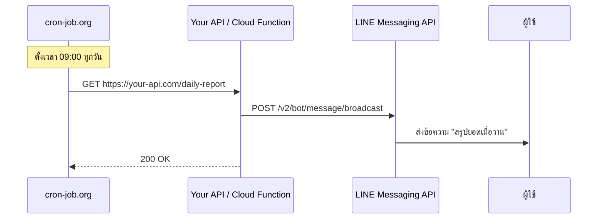

# Workshop: Cron Job — ตั้งเวลาให้บอทส่งข้อความเอง

> อยากให้บอทส่ง "สรุปยอดขายตอนสิ้นวัน" ทุก 20:00 น. หรือส่ง "เตือนประชุมตอนเช้า" ทุก 9:00 น. — คุณไม่จำเป็นต้องนั่งกดปุ่มเอง และไม่ต้องเปิดเซิร์ฟเวอร์ของตัวเองตลอด 24 ชั่วโมง **Cron Job** คือตัวช่วยที่จะ "ยิง URL" ตามเวลาที่คุณกำหนด ให้บอทของคุณทำงานเองอัตโนมัติ

<p align="center" width="100%">
    
</p>

## ทำไมต้องรู้เรื่องนี้?

ลองนึกภาพว่า LINE Messaging API เปรียบเสมือน "คนส่งของ" ที่รอรับคำสั่งจากคุณแล้วเดินไปส่ง — ปัญหาคือ **คนส่งของไม่รู้ว่าเวลาไหนควรส่งเอง** คุณต้องเป็นคนบอกทุกครั้ง

Cron Job คือ "นาฬิกาปลุก" ที่จะกดกริ่งเรียกคนส่งของให้ตามเวลา โดยไม่ต้องใช้เซิร์ฟเวอร์ของคุณเองเป็นตัวตั้งเวลา แค่มี URL ปลายทาง (API endpoint หรือ Cloud Function) เว็บ cron-job.org จะยิง HTTP request ไปหาให้ตามตารางที่ตั้งไว้

**ประโยชน์จริง:**
- ส่ง Push Message / Broadcast ตามเวลานัด
- เรียก API เพื่อ refresh Channel Access Token (v2) ทุก 29 วัน
- เช็คสถานะ/สำรองข้อมูลอัตโนมัติ
- ใช้แทน Firebase Scheduler ได้ฟรี (ไม่ต้องอัปเป็น Blaze plan)

## ภาพรวม



## ขั้นตอนการใช้งาน

### 1) สมัครสมาชิก

ไปที่ [cron-job.org](https://cron-job.org) คลิก **Sign Up** กรอกอีเมล + รหัสผ่าน แล้วยืนยันผ่านอีเมลที่ได้รับ

### 2) เข้าสู่ระบบ แล้วไปที่หน้า Cronjobs

คลิกปุ่ม **Create Cronjob** เพื่อเริ่มสร้างงานใหม่

### 3) กรอกรายละเอียด

| ช่อง | ค่าที่ใส่ | ตัวอย่าง |
|------|---------|---------|
| **Title** | ชื่อเรียกงาน (ตั้งเพื่อให้ตัวเองจำได้) | Daily Sales Report |
| **URL** | endpoint ที่อยากให้ยิง | `https://asia-southeast1-myapp.cloudfunctions.net/dailyReport` |
| **Request Method** | GET หรือ POST (ส่วนใหญ่ใช้ POST สำหรับ LINE API) | POST |
| **Schedule** | ตารางเวลา (ดูตัวอย่างด้านล่าง) | ทุกวัน 09:00 |
| **Time Zone** | ตั้งเป็น **Asia/Bangkok** เสมอ | Asia/Bangkok |
| **Authentication** | ถ้า endpoint ต้องการ Auth header | Bearer / Basic |

### 4) ตัวอย่างตาราง Schedule ที่ใช้บ่อย

| ต้องการให้ทำงาน | การตั้งค่า |
|----------------|-----------|
| ทุกวัน 09:00 | Hours: 9, Minutes: 0, Days: every day |
| ทุกชั่วโมง (เวลา x:00) | Hours: every hour, Minutes: 0 |
| ทุก 5 นาที | Minutes: every 5 |
| ทุกวันจันทร์-ศุกร์ 18:00 | Hours: 18, Days: 1-5 (Mon-Fri) |
| ทุก 29 วัน (refresh token v2.1) | Days of month: เลือกวันเดียว |

### 5) ทดสอบด้วย "Run Now"

ก่อนจะรอให้ cron ทำงานตามเวลา ให้กดปุ่ม **Run now** เพื่อยิง request ทันที จะได้รู้ว่า URL ตอบกลับถูกต้องหรือไม่

### 6) ตรวจสอบประวัติการทำงาน

หน้า **History** จะแสดง:
- Status code ที่ได้รับ (200, 500, timeout ฯลฯ)
- Response body (ดูผลที่ฝั่งเราตอบกลับ)
- Response time

ถ้ามี error ติดต่อกันหลายครั้ง ระบบจะส่งอีเมลแจ้งเตือนอัตโนมัติ

## ตัวอย่าง: สร้าง Cloud Function ให้ cron ยิง

```javascript
// functions/index.js (Firebase Cloud Functions)
const functions = require('firebase-functions');
const axios = require('axios');

exports.dailyReport = functions.https.onRequest(async (req, res) => {
  // ตรวจสอบ secret (กันคนอื่นยิง)
  if (req.query.key !== process.env.CRON_SECRET) {
    return res.status(401).send('Unauthorized');
  }

  try {
    await axios.post(
      'https://api.line.me/v2/bot/message/broadcast',
      {
        messages: [{ type: 'text', text: 'สรุปยอดเมื่อวาน: 125,000 บาท' }]
      },
      {
        headers: {
          Authorization: `Bearer ${process.env.LINE_CHANNEL_ACCESS_TOKEN}`,
          'Content-Type': 'application/json'
        }
      }
    );
    res.status(200).send('OK');
  } catch (err) {
    console.error(err);
    res.status(500).send('Failed');
  }
});
```

แล้วใน cron-job.org ใส่ URL เป็น:
```
https://asia-southeast1-myapp.cloudfunctions.net/dailyReport?key=SUPER_SECRET
```

## ข้อผิดพลาดที่มักเจอ

- **พลาด:** ตั้ง Time Zone เป็น UTC แล้ว cron ทำงานคลาดเคลื่อน 7 ชั่วโมง
  **ถูก:** เปลี่ยนเป็น **Asia/Bangkok** ใน setting ของแต่ละ job

- **พลาด:** เปิด URL ทิ้งไว้ให้ใครก็ยิงได้ ทำให้โดน spam หรือโดนส่งข้อความซ้ำ
  **ถูก:** เพิ่ม query key หรือ Authorization header เพื่อยืนยันว่ายิงมาจาก cron-job.org จริง

- **พลาด:** Response ใช้เวลานานเกิน 30 วินาที cron-job.org นับว่า timeout
  **ถูก:** ตอบกลับ `200 OK` ก่อนแล้วค่อยทำงานเบื้องหลัง (fire-and-forget) หรือใช้ Pub/Sub

- **พลาด:** ใช้ free tier ของ cron-job.org ยิงทุก 1 นาที หวังทำงานแบบ real-time
  **ถูก:** free tier มีข้อจำกัด ช่วงเวลาสั้นสุดคือ 1 นาที และมี fair-use policy — ถ้าต้องการละเอียดกว่านั้นใช้ Firebase Scheduler / Cloud Scheduler

- **พลาด:** ลืม handle error ในฝั่ง Cloud Function ทำให้ไม่รู้ว่าล้มเหลว
  **ถูก:** log error ลง Firebase Logs ทุกครั้ง และตั้ง notification ใน cron-job.org ให้ส่งเมลเมื่อ fail ติดกัน 3 ครั้ง

## Checklist ก่อนไปต่อ

- [ ] สมัครและยืนยันอีเมล cron-job.org แล้ว
- [ ] สร้าง endpoint (Cloud Function / API route) ที่พร้อมรับ request
- [ ] endpoint มีระบบยืนยัน (secret key / auth header)
- [ ] ตั้ง Time Zone เป็น Asia/Bangkok
- [ ] ทดสอบด้วย **Run now** แล้วเห็น `200 OK` ใน History
- [ ] ตั้ง notification ให้เตือนเมื่อ cron fail

## อ้างอิง

- [cron-job.org](https://cron-job.org)
- [Cron expression syntax (crontab guru)](https://crontab.guru)
- [Firebase Cloud Functions — Scheduled Functions](https://firebase.google.com/docs/functions/schedule-functions)
- [LINE Messaging API Reference](https://developers.line.biz/en/reference/messaging-api/)
