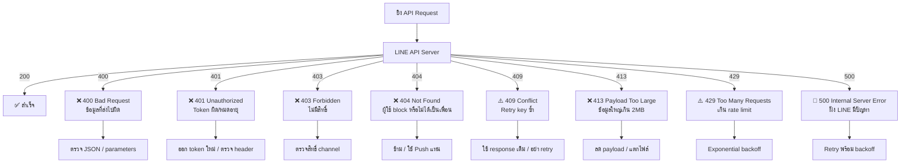
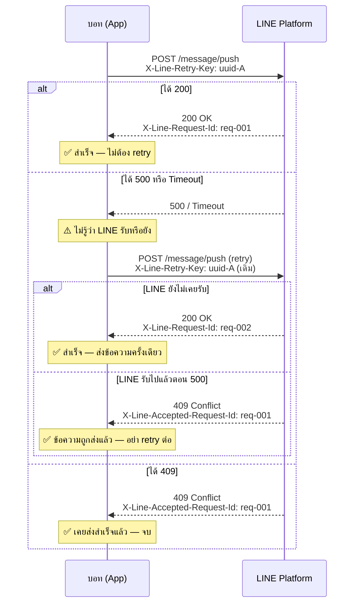

# Workshop: LINE API Error Codes — อ่าน error แล้วแก้ได้ทันที

> บอทตอบไม่ได้ ยิง API แล้วได้ 401 ทั้งๆ ที่ copy token มาจาก Console เอง — รู้สึกคุ้นไหม? LINE API คืน HTTP status code มาตรฐาน พร้อม JSON body ที่บอกสาเหตุ บทนี้รวบรวม error ทุกตัวไว้ในที่เดียว พร้อมวิธีแก้และ link ไปบทที่เกี่ยวข้อง

## ทำไมต้องรู้เรื่องนี้?

เวลา debug ถ้าไม่รู้ว่า `404` ของ LINE แปลว่าอะไร จะเสียเวลาไล่ดู log วนเวียน ทั้งที่จริงแค่ผู้ใช้ block บอทอยู่ — เข้าใจ error code ก็แก้ปัญหาได้ใน 1 นาที

เปรียบเหมือนป้ายสัญญาณจราจร: ถ้าไม่รู้ว่าป้ายหมายความว่าอะไร ก็ขับรถไม่ถูก

## ภาพรวม



## เนื้อหาหลัก

### ส่วนที่ 1 — HTTP Status Codes

| Code | ชื่อ | สาเหตุหลัก | วิธีแก้เบื้องต้น |
|------|------|------------|-----------------|
| `200` | OK | — | สำเร็จ |
| `400` | Bad Request | ค่า parameter ผิด, JSON ผิด format, ค่าเกินขีดจำกัด | ตรวจ request body กับ LINE docs |
| `401` | Unauthorized | Channel Access Token หาย, หมดอายุ, หรือ format header ผิด | ตรวจ `Authorization: Bearer {token}` และออก token ใหม่ |
| `403` | Forbidden | Channel ไม่มีสิทธิ์ใช้ feature นั้น หรือแผนไม่รองรับ | ตรวจ channel type และแผน LINE OA |
| `404` | Not Found | ผู้ใช้ block บอท, ยังไม่ add เป็นเพื่อน, userId ไม่ถูกต้อง | handle gracefully — อย่า crash, ข้ามไป |
| `409` | Conflict | ส่ง retry key เดิมซ้ำ และ LINE เคยรับ request นั้นแล้ว | ใช้ response เดิมจาก `X-Line-Accepted-Request-Id` |
| `413` | Payload Too Large | ข้อมูลเกิน 2MB | ลดขนาด payload หรือแตกเป็นหลาย request |
| `429` | Too Many Requests | เกิน rate limit หรือเกิน monthly message quota | Exponential backoff + ตรวจ quota ก่อนส่ง |
| `500` | Internal Server Error | ปัญหาฝั่ง LINE (ชั่วคราว) | Retry พร้อม backoff — ไม่ใช่ bug ในโค้ดของเรา |

### ส่วนที่ 2 — รูปแบบ Error Response

LINE จะคืน JSON body ทุกครั้งที่เกิด error:

```json
{
  "message": "คำอธิบาย error หลัก",
  "details": [
    {
      "message": "รายละเอียด error ย่อย",
      "property": "ชื่อ field หรือ parameter ที่มีปัญหา"
    }
  ]
}
```

และทุก response จะมี header:
- `X-Line-Request-Id` — ID ของ request นี้ (ใช้ติดต่อ LINE Support)
- `X-Line-Accepted-Request-Id` — ID ของ request ก่อนหน้า เมื่อใช้ retry key เดียวกัน

### ส่วนที่ 3 — Common Errors แยกตาม API

#### Messaging API

| สถานการณ์ | Error | สาเหตุ | วิธีแก้ | บทอ้างอิง |
|-----------|-------|--------|---------|-----------|
| ยิง Reply แล้วได้ error | `400` | replyToken หมดอายุ (เกิน 20 นาที) หรือใช้ไปแล้ว | ใช้ Push แทน | [05-10](05-10.sending-message.md) |
| ส่ง Multicast แล้วได้ error | `400` | userId เกิน 500 ต่อ request | แบ่ง batch ละ 500 | [05-10](05-10.sending-message.md) |
| ส่ง Quick Reply แล้วได้ error | `400` | ปุ่มเกิน 13 ปุ่ม | ลดปุ่มให้ไม่เกิน 13 | [05-03](05-03.messages-quick-replies.md) |
| ส่ง Broadcast บ่อยๆ แล้วหยุด | `429` | เกิน 60 req/ชั่วโมง | throttle + exponential backoff | [05-10](05-10.sending-message.md) |
| Get profile แล้วไม่เจอ user | `404` | ผู้ใช้ block หรือยังไม่ add | handle gracefully อย่า crash | [05-10](05-10.sending-message.md) |
| Validate message แล้วผิด | `400` | JSON structure ไม่ถูกต้อง | ดู `details[].property` ใน response | [05-08](05-08.validate-message-object-api.md) |

#### Channel Access Token

| สถานการณ์ | Error | สาเหตุ | วิธีแก้ | บทอ้างอิง |
|-----------|-------|--------|---------|-----------|
| ยิง API ทุกตัวได้ 401 | `401` | Token หาย, ผิด, หรือหมดอายุ | ตรวจ header `Authorization: Bearer {token}` | [05-05](05-05.channel-access-token.md) |
| Token ใหม่แต่ยังได้ 401 | `401` | ใส่ token ผิดช่อง หรือมี whitespace | trim token ก่อนใช้ | [05-05](05-05.channel-access-token.md) |

#### Rich Menu

| สถานการณ์ | Error | สาเหตุ | วิธีแก้ | บทอ้างอิง |
|-----------|-------|--------|---------|-----------|
| อัปโหลดภาพแล้วได้ error | `400` | ภาพเกินสเปก (width > 2500px หรือ aspect ratio ผิด) | ใช้ JPEG/PNG, width 800–2500px, height ≥ 250px, ratio ≥ 1.45, ไม่เกิน 1MB | [08-01](08-01.rich-menu-overview.md) |

#### Loading Animation

| สถานการณ์ | Error | สาเหตุ | วิธีแก้ | บทอ้างอิง |
|-----------|-------|--------|---------|-----------|
| ส่ง `loadingSeconds` แล้วได้ error | `400` | ใส่ค่าที่ไม่อยู่ในลิสต์ที่ LINE กำหนด | ดูค่าที่รับได้จาก LINE docs | [05-06](05-06.loading-animation.md) |

#### LIFF

| สถานการณ์ | Error | สาเหตุ | วิธีแก้ | บทอ้างอิง |
|-----------|-------|--------|---------|-----------|
| LIFF ยิง API แล้วได้ 401 | `401` | Port visibility ไม่ได้ตั้งเป็น Public (Codespaces/dev tunnel) | ตั้ง Port Visibility → Public | [09-02](09-02.liff-starter-vue.md) |
| `shareTargetPicker` ส่ง sticker แล้ว error | `400` | sticker ไม่รองรับใน shareTargetPicker | ใช้ text/flex message แทน | [09-06](09-06.liff-sending-message.md) |

### ส่วนที่ 4 — Retry Key (`X-Line-Retry-Key`)

**ปัญหาที่แก้:** เมื่อยิง API แล้วได้ 500 หรือ timeout — เราไม่รู้ว่า LINE รับ request ไปแล้วหรือยัง ถ้า retry ไปอีกครั้งอาจทำให้ผู้รับได้ข้อความซ้ำ

**วิธีแก้:** ส่ง UUID เดิมใน header `X-Line-Retry-Key` ทุกครั้ง LINE จะ execute request แค่ครั้งเดียว ถ้า retry มาซ้ำจะได้ `409` กลับ

#### Flow การใช้งาน



#### API ที่รองรับ Retry Key

| API | Endpoint |
|-----|----------|
| Push Message | `POST /v2/bot/message/push` |
| Multicast Message | `POST /v2/bot/message/multicast` |
| Narrowcast Message | `POST /v2/bot/message/narrowcast` |
| Broadcast Message | `POST /v2/bot/message/broadcast` |

> **หมายเหตุ:** ถ้าใส่ `X-Line-Retry-Key` กับ API อื่นนอกลิสต์นี้ จะได้ `400` ทันที

#### ตัวอย่างโค้ด

```typescript
import { v4 as uuidv4 } from 'uuid'

async function pushMessageSafe(userId: string, message: object) {
  const retryKey = uuidv4()  // สร้างครั้งเดียวต่อ "งาน" นี้

  for (let attempt = 0; attempt < 3; attempt++) {
    try {
      const res = await fetch('https://api.line.me/v2/bot/message/push', {
        method: 'POST',
        headers: {
          'Authorization': `Bearer ${process.env.LINE_CHANNEL_ACCESS_TOKEN}`,
          'Content-Type': 'application/json',
          'X-Line-Retry-Key': retryKey,  // ส่ง key เดิมทุก attempt
        },
        body: JSON.stringify({ to: userId, messages: [message] }),
      })

      if (res.ok) return await res.json()  // ✅ สำเร็จ

      if (res.status === 409) {
        // LINE รับ request นี้ไปแล้ว — ถือว่าสำเร็จ
        const accepted = res.headers.get('x-line-accepted-request-id')
        console.log(`Already accepted: ${accepted}`)
        return
      }

      if (res.status < 500) throw new Error(`Non-retryable: ${res.status}`)

      // 5xx — backoff แล้วลองใหม่
      await new Promise(r => setTimeout(r, Math.pow(2, attempt) * 1000))

    } catch (err) {
      if (attempt === 2) throw err
    }
  }
}
```

#### ข้อควรรู้

| ข้อ | รายละเอียด |
|-----|-----------|
| อายุ retry key | **24 ชั่วโมง** นับจาก request แรก |
| retry ด้วย content ต่างกัน | ห้าม — ต้องส่ง body เดิมทุกครั้ง ไม่เช่นนั้น retry อาจไม่ทำงานตามคาด |
| ไม่ได้รับประกัน delivery | ถ้าผู้ใช้ block บอทหลัง LINE รับ request — ข้อความไม่ถึง แต่ retry key ใช้ไม่ได้แล้ว |
| นับ quota | retry แต่ละครั้งนับเป็น 1 API request — retry บ่อยอาจโดน rate limit |

### ส่วนที่ 5 — Retry Strategy (ภาพรวม)

ไม่ควร retry ทุก error — แต่ละ status ต้องการการจัดการต่างกัน:

```typescript
type LineErrorAction = 'retry' | 'ignore' | 'fix-code' | 'invalidate-token'

function classifyLineError(status: number): LineErrorAction {
  if (status === 429) return 'retry'           // rate limit — backoff แล้วลองใหม่
  if (status >= 500) return 'retry'            // server error ชั่วคราว — backoff
  if (status === 401) return 'invalidate-token' // token หมดอายุ — ออกใหม่
  if (status === 404) return 'ignore'          // user block / ไม่มี — ข้ามไป
  if (status === 409) return 'ignore'          // duplicate — ใช้ response เดิม
  return 'fix-code'                            // 400/403/413 — bug ในโค้ด ต้องแก้
}
```

**Exponential Backoff สำหรับ 429 และ 5xx:**

```typescript
async function callWithRetry(fn: () => Promise<void>, maxRetries = 3) {
  for (let attempt = 0; attempt < maxRetries; attempt++) {
    try {
      return await fn()
    } catch (err: any) {
      const status = err.response?.status
      if (status !== 429 && status < 500) throw err  // ไม่ retry 4xx อื่น
      if (attempt === maxRetries - 1) throw err
      const delay = Math.pow(2, attempt) * 1000 + Math.random() * 500
      await new Promise(resolve => setTimeout(resolve, delay))
    }
  }
}
```

## ข้อผิดพลาดที่มักเจอ

- **พลาด:** เห็น 404 แล้วคิดว่า endpoint ผิด
  **ถูก:** LINE ใช้ 404 แปลว่า "ผู้ใช้ block บอท หรือยังไม่ add เป็นเพื่อน" — ไม่ใช่ API ผิด handle gracefully แล้วข้ามไป

- **พลาด:** เห็น 401 แล้ว reissue token ทุกครั้งที่ยิง request
  **ถูก:** ออก token ครั้งเดียวแล้ว reuse ตลอด validity period — reissue บ่อยอาจโดน rate limit ของ token endpoint

- **พลาด:** เห็น 429 แล้ว retry ทันทีวนซ้ำ
  **ถูก:** ใช้ exponential backoff พร้อม jitter — retry ทันทีซ้ำๆ จะยิ่งโดน 429 ต่อเนื่อง

- **พลาด:** เห็น 500 แล้วคิดว่าโค้ดพัง แก้โค้ดวนหลายชั่วโมง
  **ถูก:** 500 มาจากฝั่ง LINE เอง — ตรวจสอบ [LINE Status Page](https://status.line.biz/) และรอสักครู่แล้วลองใหม่

- **พลาด:** ไม่ได้ log `X-Line-Request-Id` เวลาเกิด error
  **ถูก:** เก็บ header นี้ไว้ทุกครั้ง — ถ้าต้องติดต่อ LINE Support จะต้องใช้ค่านี้

## Checklist ก่อนไปต่อ

- [ ] เข้าใจความแตกต่างระหว่าง 400 (โค้ดผิด) กับ 404 (user block)
- [ ] ใช้ `classifyLineError` หรือ logic คล้ายกันเพื่อแยกว่า error ไหน retry ได้
- [ ] Log `X-Line-Request-Id` ทุก request ที่ error
- [ ] ไม่ retry 400, 403, 409 — แก้โค้ดหรือ handle logic แทน
- [ ] Implement exponential backoff สำหรับ 429 และ 5xx

## อ้างอิง

- [LINE API Reference — Status Codes](https://developers.line.biz/en/reference/messaging-api/#status-codes)
- [LINE Status Page](https://status.line.biz/)
- [05-05 Channel Access Token](05-05.channel-access-token.md)
- [05-08 Validate Message Object API](05-08.validate-message-object-api.md)
- [05-10 Sending Messages](05-10.sending-message.md)
