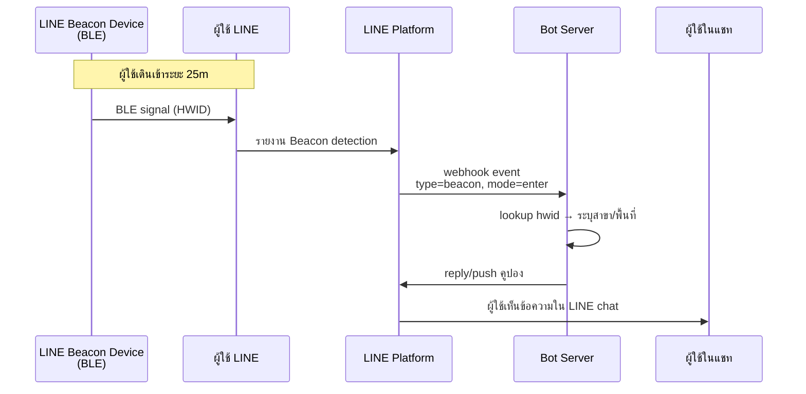

# Workshop: LINE Beacon — ส่งข้อความให้ผู้ใช้ "อัตโนมัติเมื่อเดินผ่าน"

> ลูกค้าเดินเข้าร้านของคุณ → มือถือสั่นเตือน "ยินดีต้อนรับ! รับคูปอง 50 บาทเมื่อสั่งวันนี้" — ทำได้โดยไม่ต้องให้ลูกค้าทำอะไรเลย แค่เปิด Bluetooth ไว้ และเป็นเพื่อนกับ LINE OA ของคุณ นี่คือพลังของ **LINE Beacon**

<p align="center" width="100%">
    
</p>

> **หมายเหตุ:** LINE Beacon ใช้งานได้ในประเทศ **ญี่ปุ่น ไต้หวัน และไทย** เท่านั้น
>
> **แนะนำ:** ใช้ LINE เวอร์ชันล่าสุดเพื่อให้ Beacon ทำงานได้เต็มประสิทธิภาพ

## ทำไมต้องรู้เรื่องนี้?

ลองนึกถึง "เซ็นเซอร์ประตูร้าน" ที่กริ่งทุกครั้งคนเข้า — Beacon คือสิ่งเดียวกัน แต่แทนที่จะกริ่ง มันส่ง **webhook event** เข้าระบบของคุณ พร้อม `userId` และ `hwid` (รหัสอุปกรณ์)

แล้วบอทคุณจะทำอะไรก็ได้:
- ส่งคูปองอัตโนมัติเมื่อเข้าร้าน
- เช็คอิน/เช็คเอาท์งานวิ่ง Walk Rally
- ส่งคำอธิบายผลงานศิลปะที่ลูกค้ายืนใกล้ในนิทรรศการ
- บันทึกเวลาเข้า-ออกออฟฟิศ (HR system)

**ความเจ๋งคือ** — ผู้ใช้ไม่ต้องแตะอะไรเลย แค่เดินเข้ามาในระยะ ~25 เมตร และมีเงื่อนไขเปิด Bluetooth + Use LINE Beacon

## ภาพรวม



## DEVIO Beacon คืออะไร?

DEVIO Beacon คืออุปกรณ์ Bluetooth Low Energy (BLE) ที่รองรับ LINE Beacon — ผูกกับ LINE OA เพื่อส่งสัญญาณถึงสมาร์ทโฟนของผู้ใช้ LINE และดึงข้อมูลเข้าระบบ Bot ของคุณได้อัตโนมัติ

### คุณสมบัติของ DEVIO Beacon

- ชิป Nordic nRF52840 ประสิทธิภาพสูง
- Bluetooth 5.2 ประหยัดพลังงาน — แบตเตอรี่ CR-2450 จำนวน 3 ก้อน ใช้ได้นาน **18 เดือน**
- ระยะสัญญาณรอบทิศ **สูงสุด 25 เมตร**
- เชื่อมต่อกับ LINE OA เพื่อรับ Webhook event โดยตรง
- ขนาดกะทัดรัด **4.98 x 12.9 x 2.93 ซม.**

## อุปกรณ์ Beacon ที่รองรับ

LINE Beacon ใช้กับ BLE 2 ประเภท:

| ประเภท | รายละเอียด |
|--------|-----------|
| **อุปกรณ์ที่รองรับ LINE Beacon โดยตรง** | จำกัดเฉพาะประเทศที่กำหนด — ญี่ปุ่น: [link](https://beacon.theshop.jp/items/6617930) / ไทย: [link](https://linedevth.line.me/th/tech-partner?filterTech=Beacon) เช่น DEVIO Beacon |
| **อุปกรณ์ BLE + LINE Simple Beacon spec** | มาตรฐานเปิดของ LINE — ใช้กับ BLE generic ได้ เหมาะสำหรับนักพัฒนาที่อยาก DIY [GitHub](https://github.com/line/line-simple-beacon) |

## ขั้นตอนการใช้งาน

### Step 1: ผูก Beacon กับ LINE OA

1. เข้า [LINE Beacon Manager](https://manager.line.biz/beacon/register)
2. เลือก LINE OA ที่ต้องการ
3. กรอกรหัส `HWID` (10 หลัก) และ `Passcode` (12 หลัก) จากหลังอุปกรณ์
4. ถ้าสำเร็จจะเห็น "Link successful!"
5. หากต้องการใช้ DIY beacon ออก **LINE Simple Beacon hardware ID** จากหน้าเดียวกัน

> **กฎสำคัญ**
> - 1 LINE OA ผูกได้ **หลาย** Beacon
> - 1 Beacon ผูกได้ **เพียง 1 LINE OA** — ถ้าจะย้ายต้อง Unlink ก่อน

### Step 2: เปิดใช้งานฝั่งผู้ใช้

ผู้ใช้ต้องเข้าเงื่อนไขครบทุกข้อถึงจะรับ Beacon event ได้:
- เปิด **Bluetooth** บนสมาร์ทโฟน
- เปิด **Settings > Privacy > Use LINE Beacon** ในแอป LINE
- **เพิ่ม LINE OA เป็นเพื่อน** เรียบร้อยแล้ว

### Step 3: ทดสอบ

1. เปิด Bluetooth บนมือถือ
2. เปิด Use LINE Beacon ใน LINE app settings
3. นำมือถือเข้าใกล้ Beacon
4. เช็ค Bot server log ว่าได้รับ webhook event

## ตัวอย่าง Webhook Event

```json
{
  "destination": "xxxxxxxxxx",
  "events": [
    {
      "replyToken": "nHuyWiB7yP5Zw52FIkcQobQuGDXCTA",
      "type": "beacon",
      "mode": "active",
      "timestamp": 1462629479859,
      "source": {
        "type": "user",
        "userId": "U4af4980629..."
      },
      "webhookEventId": "01FZ74A0TDDPYRVKNK77XKC3ZR",
      "deliveryContext": {
        "isRedelivery": false
      },
      "beacon": {
        "hwid": "d41d8cd98f",
        "type": "enter"
      }
    }
  ]
}
```

### คำอธิบายฟิลด์สำคัญ

| ฟิลด์ | ความหมาย |
|-------|---------|
| `type` | "beacon" — ระบุว่าเป็น Beacon Event |
| `mode` | "active" หรือ "standby" — โหมดการทำงานของ channel |
| `beacon.hwid` | hardware ID เฉพาะของ Beacon ตัวนั้น (ใช้ระบุสาขา/พื้นที่) |
| `beacon.type` | "enter" / "banner" / "stay" |
| `replyToken` | ใช้ตอบกลับผู้ใช้ (1 นาที / single use) |
| `source.userId` | LINE User ID ของผู้ใช้ |
| `webhookEventId` | unique id (ใช้ idempotency) |

## ตัวอย่างโค้ด (Express + line-bot-sdk)

```typescript
import express from 'express';
import { Client, middleware, WebhookEvent } from '@line/bot-sdk';

const config = {
  channelAccessToken: process.env.LINE_CHANNEL_ACCESS_TOKEN!,
  channelSecret: process.env.LINE_CHANNEL_SECRET!,
};

const client = new Client(config);
const app = express();

// Map hwid → ชื่อสาขา (ถ้าผูกหลาย Beacon)
const BEACON_LOCATIONS: Record<string, string> = {
  'd41d8cd98f': 'สาขาสยาม',
  'a1b2c3d4e5': 'สาขาเอกมัย',
};

app.post('/webhook', middleware(config), async (req, res) => {
  const events: WebhookEvent[] = req.body.events;
  await Promise.all(events.map(handleEvent));
  res.sendStatus(200);
});

async function handleEvent(event: WebhookEvent): Promise<void> {
  if (event.type !== 'beacon' || !event.replyToken) return;

  const beaconEvent = event as any;
  const userId = beaconEvent.source.userId;
  const hwid = beaconEvent.beacon.hwid;
  const beaconType = beaconEvent.beacon.type;
  const location = BEACON_LOCATIONS[hwid] ?? 'พื้นที่ที่ไม่รู้จัก';

  if (beaconType === 'enter') {
    await client.replyMessage(event.replyToken, {
      type: 'text',
      text: `ยินดีต้อนรับสู่${location}! รับคูปอง 50 บาทเมื่อสั่งวันนี้`,
    });
  }
}

const PORT = process.env.PORT || 3000;
app.listen(PORT, () => {
  console.log(`LINE Beacon bot is running on port ${PORT}`);
});
```

## Beacon Banner (เฉพาะ Corporate)

Beacon Banner คือแบนเนอร์ที่ปรากฏบนหน้าจอ **Chats** ของผู้ใช้เมื่อเดินเข้าระยะสัญญาณ

**การทำงาน**
- ผู้ใช้แตะแบนเนอร์ → ถ้ายังไม่เป็นเพื่อน LINE OA จะเพิ่มเพื่อนได้ทันที
- เปิดหน้าเว็บที่กำหนดโดย LINE OA
- ส่งข้อความจาก LINE OA ณ จุดที่แตะได้

> **หมายเหตุ:** Beacon Banner ใช้ได้เฉพาะ **Corporate users** เท่านั้น ติดต่อตัวแทน LINE หรือ [LINE for Business](https://www.linebiz.com/jp-en/)


## Use Case ที่นิยม

| Use Case | รายละเอียด |
|----------|-----------|
| ร้านค้าส่งโปรโมชัน | คูปองอัตโนมัติเมื่อลูกค้าเดินผ่าน |
| Walk Rally / Stamp Rally | เช็คอินด้วย Beacon ตามจุด |
| นิทรรศการ | ส่งเนื้อหาประกอบผลงานศิลปะตามจุดที่ยืน |
| HR / Office | บันทึกเวลาเข้า-ออกออฟฟิศอัตโนมัติ |

## ข้อควรรู้

- ใช้ **LINE OA Verified** หรือ **Premium** เพื่อเปิดใช้ `banner` event
- ใช้ `stay` event ต้องได้รับรองเป็น **LINE Certified Provider**
- DEVIO Beacon ทำงานทั้ง **foreground** และ **background mode**

## ข้อผิดพลาดที่มักเจอ

- **พลาด:** ผู้ใช้ไม่ได้รับ event ทั้งที่เดินผ่าน Beacon
  **ถูก:** เช็คทีละข้อ — Bluetooth เปิด? Use LINE Beacon เปิดใน Settings > Privacy? เป็นเพื่อน LINE OA แล้ว? อยู่ในประเทศที่รองรับ?

- **พลาด:** ใช้ `stay` event แต่ยังไม่ได้สมัคร LINE Certified Provider
  **ถูก:** `enter` ใช้ได้ทันที แต่ `stay` ต้องเป็น Certified Provider — ใช้ `enter` + ตรวจสอบเอง interval ก่อนถ้ายังไม่ certified

- **พลาด:** ส่งข้อความ replyMessage ทุก `enter` event ทำให้ผู้ใช้สแปม
  **ถูก:** เก็บใน DB ว่าผู้ใช้คนนี้เพิ่งได้รับข้อความใน Beacon นี้ภายในกี่นาที — debounce / cooldown 5-30 นาที

- **พลาด:** ไม่ map `hwid` กับสาขา/พื้นที่จริง — เลยตอบข้อความเหมือนกันทุก beacon
  **ถูก:** เก็บ `hwid → location` ใน DB หรือ config แล้ว personalize ข้อความตามสาขา

- **พลาด:** ลืมว่า Beacon ทำงานเฉพาะ **3 ประเทศ** (JP/TW/TH) แล้วลูกค้าต่างชาติไม่ได้ event
  **ถูก:** Geo-fence ผ่าน hwid + ภาษาผู้ใช้ ถ้าจะ targeting อย่างอื่นใช้ Narrowcast แทน

- **พลาด:** Beacon ใช้แล้วแต่ไม่ตอบ webhook event เพราะ flag `webhook redelivery` ไม่เปิด แล้ว server มี downtime
  **ถูก:** เปิด redelivery ใน Console + เช็ค `deliveryContext.isRedelivery` ก่อน process (idempotency ด้วย `webhookEventId`)

## Checklist ก่อนไปต่อ

- [ ] Beacon ผูกกับ LINE OA ใน Beacon Manager แล้ว
- [ ] Bot รองรับ `event.type === 'beacon'` และ map `hwid` → location
- [ ] มี cooldown/debounce ป้องกันสแปมข้อความ
- [ ] เช็คว่าผู้ใช้เปิด Bluetooth + Use LINE Beacon
- [ ] ถ้าจะใช้ `stay` event — สมัคร LINE Certified Provider
- [ ] ถ้าจะใช้ `banner` event — LINE OA เป็น Verified/Premium

## อ้างอิง

- [LINE Beacon — Developers Documentation](https://developers.line.biz/en/docs/messaging-api/using-beacons/)
- [LINE Beacon Manager](https://manager.line.biz/beacon/register)
- [LINE Simple Beacon (GitHub)](https://github.com/line/line-simple-beacon)
- [LINE Tech Partners (Thailand)](https://linedevth.line.me/th/tech-partner?filterTech=Beacon)
