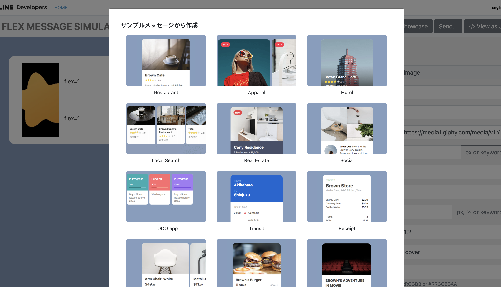

# Flex Message

<p align="center" width="100%">
     
</p>


LINE Flex Message เป็นฟีเจอร์ที่ทรงพลังของ LINE Messaging API ที่ช่วยให้ผู้พัฒนาสามารถสร้างข้อความที่มีการจัดเรียงองค์ประกอบต่าง ๆ ได้อย่างยืดหยุ่นและสวยงาม เพื่อส่งไปยังผู้ใช้ผ่านทาง LINE Flex Message ช่วยให้สามารถนำเสนอข้อมูลในรูปแบบที่น่าสนใจและมีการโต้ตอบได้ง่ายขึ้น เช่น การสร้างการ์ดที่มีรูปภาพ ข้อความ ปุ่มกด หรือรายการสินค้าแบบหลายรายการในหน้าจอเดียวกัน

### ความสัมพันธ์กับ CSS Flexbox

Flex Message ออกแบบมาโดยยึดตามข้อกำหนดของ [CSS Flexible Box (CSS Flexbox)](https://www.w3.org/TR/css-flexbox-1/) โดย flex container และ flex items ใน CSS Flexbox จะสอดคล้องกับ **Box component** และ **Component** ต่าง ๆ ใน Flex Message ตามลำดับ ดังนั้นผู้ที่มีความรู้ด้าน CSS Flexbox จะสามารถเข้าใจการจัดวาง layout ของ Flex Message ได้ง่าย

ความสัมพันธ์ของ property `flex` ใน Flex Message กับ CSS Flexbox:

**ใน Horizontal Box:**

| ค่า `flex` ของ child component | CSS Flexbox ที่สอดคล้อง |
| :-: | --- |
| `0` | `flex: 0 0 auto;` |
| มากกว่า `0` | `flex: X 0 0;` (โดย X คือค่า `flex` ของ child component) |

**ใน Vertical Box:**

| ค่า `flex` ของ child component | CSS Flexbox ที่สอดคล้อง |
| :-: | --- |
| `0` | `flex: 0 0 auto;` |
| มากกว่า `0` | `flex: X 0 auto;` (โดย X คือค่า `flex` ของ child component) |

### ทิศทางข้อความ (Text Direction)

Flex Message รองรับการกำหนดทิศทางข้อความได้ทั้งแบบซ้ายไปขวา (LTR - Left-to-Right) และขวาไปซ้าย (RTL - Right-to-Left) โดยใช้ property `direction` ใน Bubble container ซึ่งเหมาะสำหรับภาษาที่มีทิศทางการเขียนแตกต่างกัน

### ข้อจำกัดในการแสดงผล

Flex Message เดียวกันอาจแสดงผลแตกต่างกันได้ ขึ้นอยู่กับสภาพแวดล้อมของอุปกรณ์ผู้รับ โดยปัจจัยที่มีผลต่อการแสดงผล ได้แก่:
- **ระบบปฏิบัติการ (OS)** ของอุปกรณ์ (iOS, Android, macOS, Windows)
- **เวอร์ชันของ LINE** ที่ใช้งาน
- **ความละเอียดหน้าจอ (Device Resolution)** ของอุปกรณ์
- **การตั้งค่าภาษา (Language Settings)** ของอุปกรณ์
- **ฟอนต์ (Font)** ที่ใช้งานบนอุปกรณ์

ดังนั้นผู้พัฒนาควรทดสอบ Flex Message บนหลายอุปกรณ์และหลายแพลตฟอร์มก่อนนำไปใช้งานจริง

### สภาพแวดล้อมที่รองรับ (Operating Environment)

Flex Message รองรับใน LINE ทุกเวอร์ชัน แต่บางฟีเจอร์จะไม่รองรับในทุกเวอร์ชัน ดังตาราง:

| ฟีเจอร์ | LINE for iOS / LINE for Android | LINE for PC (macOS, Windows) |
| --- | :-: | :-: |
| property `maxWidth` ของ Box | 11.22.0 ขึ้นไป | 7.7.0 ขึ้นไป |
| property `maxHeight` ของ Box | 11.22.0 ขึ้นไป | 7.7.0 ขึ้นไป |
| property `lineSpacing` ของ Text | 11.22.0 ขึ้นไป | 7.7.0 ขึ้นไป |
| Video component *1 | 11.22.0 ขึ้นไป | 7.7.0 ขึ้นไป |
| ค่า `deca` และ `hecto` ใน property `size` ของ Bubble *2 | 13.6.0 ขึ้นไป | 7.17.0 ขึ้นไป |
| property `scaling` ของ Button, Text และ Icon *3 | 13.6.0 ขึ้นไป | 7.17.0 ขึ้นไป |

\*1 เพื่อให้ Video component แสดงผลได้อย่างถูกต้องบนเวอร์ชันที่ไม่รองรับ ให้ระบุ property `altContent` ซึ่งจะแสดงรูปภาพแทนวิดีโอ

\*2 หากเวอร์ชัน LINE ต่ำกว่าที่รองรับ `deca` และ `hecto` ขนาดของ Bubble จะถูกแสดงเป็น `kilo` แทน

\*3 property `scaling` ช่วยให้สามารถปรับขนาดฟอนต์และไอคอนตามการตั้งค่าขนาดฟอนต์ของแอป LINE ได้โดยอัตโนมัติ เพื่อรองรับการเข้าถึง (accessibility)


## Simulator ก่อนจะเริ่มเรียนให้เปิด [Link](https://developers.line.biz/flex-simulator/) นี้
สามารถไปทดลองสร้าง Flex Message กับ LINE Bot Designer ได้ ซึ่งเครื่องมือตัวนี้จะช่วยให้เราสร้าง Prototype ได้แบบง่ายดาย แบบโค้ดก็ไม่ต้องเขียนเอง โดยมีตัวอย่างเริ่มต้นมาให้ 12 แบบด้วยกัน 

https://developers.line.biz/flex-simulator/

<p align="center" width="100%">
     
</p>


## โครงสร้างของ LINE Flex Message

การพัฒนาก็คล้ายๆกับ message ประเภทอื่นๆ คือเป็นการสร้างข้อความขึ้นมาในรูปแบบ JSON โดย type ที่เราจะส่งเข้าไปที่ Messaging API จะเป็น Format ลักษณะดังนี้

```json
{
    "type": "flex",
    "altText": "This is a Flex message",
    "contents": {
        ...
    }
}
```

โครงสร้างภายในของ Flex Message จะประกอบไปด้วย 3 ชั้น
#### 1. Container
- **Container**: เป็นโครงสร้างหลักที่ครอบคลุมองค์ประกอบทั้งหมดใน Flex Message
- **ชนิดของ Container**: ประกอบไปด้วย 
      - **bubble**:  เป็นประเภทของ Container ที่ใช้แสดงข้อมูลในรูปแบบกล่องเดียว โดยขนาด JSON อยู่ที่ `30 KB`
      - **Carousel**: เป็นประเภทของ Container ที่สามารถแสดงหลาย ๆ Bubble ในรูปแบบสไลด์ได้ ซึ่งช่วยให้สามารถนำเสนอข้อมูลหลายชิ้นในหน้าจอเดียวกัน โดยขนาด JSON อยู่ที่ `50 KB` และแสดงได้สูงสุด `12 bubbles`
      
<p align="center" width="100%">
     
</p>


Bubble Size
- size: giga, mega(default), kilo, hecto, deca, micro, nano

> **หมายเหตุ**: ค่า `deca` และ `hecto` รองรับตั้งแต่:
> - LINE for iOS/Android: **13.6.0** ขึ้นไป
> - LINE for macOS/Windows: **7.17.0** ขึ้นไป
>
> หากผู้ใช้ใช้ LINE เวอร์ชันที่ต่ำกว่า ขนาด Bubble จะถูกแสดงเป็น `kilo` แทนโดยอัตโนมัติ

<p align="center" width="100%">
     
</p>


#### 2. Block
- **Block**:  ประกอบด้วยส่วนต่าง ๆ ที่ช่วยในการแสดงข้อมูลหรือเนื้อหาภายใน Bubble โดย Bubble หนึ่ง ๆ สามารถประกอบด้วย Blocks หลายแบบเพื่อสร้างข้อความที่ต้องการ
- **ชนิดของ Block**: ประกอบไปด้วย
     - **Header**: ส่วนหัวของ Bubble ที่มักใช้สำหรับแสดงชื่อหรือหัวข้อสำคัญ เป็นจุดเริ่มต้นของการสื่อสารข้อมูลที่ต้องการเน้น
     - **Hero**: ส่วนที่สามารถแสดงภาพหลักหรือวิดีโอที่มีความโดดเด่น โดยส่วนนี้มักใช้สำหรับดึงดูดความสนใจจากผู้ใช้งาน
     - **Body**: ส่วนกลางของ Bubble ที่ใช้สำหรับแสดงเนื้อหาหลัก เช่น ข้อความ รายละเอียดสินค้า หรือข้อมูลอื่น ๆ ที่ต้องการสื่อสารให้ผู้ใช้รับทราบ
     - **Footer**: ส่วนล่างของ Bubble ที่สามารถใส่ปุ่มหรือข้อมูลเพิ่มเติม เช่น ปุ่มสำหรับกดเพื่อดูรายละเอียดเพิ่มเติม หรือลิงก์ไปยังเว็บไซต์
     - **Styles**: การกำหนดสไตล์ของ Bubble รวมถึงสีและการออกแบบต่าง ๆ เพื่อให้ข้อความมีความสวยงามและเหมาะสมกับแบรนด์หรือธีมที่ต้องการ

<p align="center" width="100%">
     
</p>

```json
{
  "type": "bubble",
  "header": {
    "type": "box",
    "layout": "vertical",
    "contents": [
      {
        "type": "text",
        "text": "header"
      }
    ]
  },
  "hero": {
    "type": "image",
    "url": "https://www.linefriends.com/img/img_sec.jpg",
    "size": "full",
    "aspectRatio": "2:1"
  },
  "body": {
    "type": "box",
    "layout": "vertical",
    "contents": [
      {
        "type": "text",
        "text": "body"
      },
	  {
        "type": "text",
        "text": "body"
      }
    ]
  },
  "footer": {
    "type": "box",
    "layout": "vertical",
    "contents": [
      {
        "type": "text",
        "text": "footer"
      }
    ]
  }
}
```

#### 3. Component
- **Component**: องค์ประกอบย่อยที่ใช้ในการสร้างเนื้อหาภายใน Bubble
- **ชนิดของ Component**: ประกอบไปด้วย `box`, `text`, `image`, `video`, `button`, `icon`, `span`, `separator` และ `filler` (deprecated) ที่สามารถใช้จัดเรียงและแสดงผลข้อมูลใน Bubble ได้

**Component ที่สามารถใช้ได้ในแต่ละประเภท Box:**

| Component | Baseline Box | Horizontal Box / Vertical Box |
| --- | :-: | :-: |
| Box | ไม่ได้ | ได้ |
| Button | ไม่ได้ | ได้ |
| Image | ไม่ได้ | ได้ |
| Icon | ได้ | ไม่ได้ |
| Text | ได้ | ได้ |
| Span (ใช้เป็น child ของ Text ได้) | ไม่ได้ | ไม่ได้ |
| Separator | ไม่ได้ | ได้ |
| Filler (deprecated) | ได้ | ได้ |

<p align="center" width="100%">
     
</p>


##### Button

- type: button
- action: (postback, message, uri และ datetime picker)
- flex: ค่าน้ำหนักในการแบ่งสัดส่วนสำหรับ component ทั้งแนวตั้งและแนวนอนภายใน box โดยค่า default ในแนวตั้งคือ 0 และค่า default ในแนวนอนคือ 1

<p align="center" width="100%">
     
</p>


- margin: (none, xs, sm, md, lg, xl, xxl) ระยะห่างระหว่างปุ่มที่ระบุและ component ก่อนหน้า แต่จะไม่มีผลถ้าปุ่มที่ระบุเป็น component ตัวแรกใน box
- height: (sm ,md) ส่วนสูงของปุ่ม โดยค่า default คือ md
- color: สีของ background ในกรณีเลือก style เป็น primary หรือ secondary และ สีของ text ในกรณีเลือก style เป็น link
- gravity: (top, center, bottom) การเรียงตัวของปุ่มในแนวตั้ง โดยค่า default เป็น top แต่จะไม่ส่งผลในกรณีที่เลือก layout ใน box เป็น baseline
- style: (primary, secondary, link) การแสดงผลปุ่มแบบ สีเข้ม, สีอ่อน และ text ลิงค์ ตามลำดับ โดยค่า default คือ text ลิงค์

```json
{
  "type": "bubble",
  "body": {
    "type": "box",
    "layout": "vertical",
    "spacing": "md",
    "contents": [
      {
        "type": "button",
        "style": "primary",
        "action": {
          "type": "uri",
          "label": "Primary style button",
          "uri": "https://developers.line.me"
        }
      },
      {
        "type": "button",
        "style": "secondary",
        "action": {
          "type": "uri",
          "label": "Secondary style button",
          "uri": "https://developers.line.me"
        }
      },
      {
        "type": "button",
        "style": "link",
        "action": {
          "type": "uri",
          "label": "Link style button",
          "uri": "https://developers.line.me"
        }
      }
    ]
  }
}
```
<p align="center" width="100%">
     
</p>


##### Icon

- type: icon
- url: ใช้ HTTPS, นามสกุล JPG หรือ PNG, resolution ไม่เกิน 240x240 px และขนาดไม่เกิน 1MB
- margin: (none, xs, sm, md, lg, xl, xxl) ระยะห่างระหว่าง icon ที่ระบุและ component ก่อนหน้า ในแนวนอน แต่จะไม่มีผลถ้า icon ที่ระบุ เป็น component ตัวแรกใน box
- size: (xxs, xs, sm, md, lg, xl, xxl, 3xl, 4xl, 5xl) ขนาดของ icon โดยค่า default คือ md
- aspectRatio: อัตราส่วนพื้นที่ของความกว้างและความสูง width:height ซึ่งสามารถกำหนดได้ตั้งแต่ 1–1000000 โดยมีเงื่อนไขว่า height ต้องใหญ่ไม่เกิน 3 เท่าของ width โดยค่า default เป็น 1:


```json
{
  "type": "bubble",
  "body": {
    "type": "box",
    "layout": "vertical",
    "spacing": "md",
    "contents": [
      {
        "type": "box",
        "layout": "baseline",
        "margin": "md",
        "contents": [
          {
            "type": "icon",
            "size": "sm",
            "url": "https://scdn.line-apps.com/n/channel_devcenter/img/fx/review_gold_star_28.png"
          },
          {
            "type": "icon",
            "size": "sm",
            "url": "https://scdn.line-apps.com/n/channel_devcenter/img/fx/review_gray_star_28.png"
          },
          {
            "type": "text",
            "text": "1:1",
            "margin": "md"
          }
        ]
      },
      {
        "type": "box",
        "layout": "baseline",
        "margin": "md",
        "contents": [
          {
            "type": "icon",
            "aspectRatio": "2:1",
            "size": "sm",
            "url": "https://scdn.line-apps.com/n/channel_devcenter/img/fx/review_gold_star_28.png"
          },
          {
            "type": "icon",
            "aspectRatio": "2:1",
            "size": "sm",
            "url": "https://scdn.line-apps.com/n/channel_devcenter/img/fx/review_gray_star_28.png"
          },
          {
            "type": "text",
            "text": "2:1"
          }
        ]
      },
      {
        "type": "box",
        "layout": "baseline",
        "margin": "md",
        "contents": [
          {
            "type": "icon",
            "size": "sm",
            "aspectRatio": "3:1",
            "url": "https://scdn.line-apps.com/n/channel_devcenter/img/fx/review_gold_star_28.png"
          },
          {
            "type": "icon",
            "size": "sm",
            "aspectRatio": "3:1",
            "url": "https://scdn.line-apps.com/n/channel_devcenter/img/fx/review_gray_star_28.png"
          },
          {
            "type": "text",
            "text": "3:1"
          }
        ]
      }
    ]
  }
}
```
<p align="center" width="100%">
     
</p>

##### Image

- type: image
- url: ใช้ HTTPS, นามสกุล JPG หรือ PNG, resolution ไม่เกิน 1024x1024 px และขนาดไม่เกิน 1MB
- flex: ค่าน้ำหนักในการแบ่งสัดส่วนสำหรับ component ทั้งแนวตั้งและแนวนอนภายใน box - โดยค่า default ในแนวตั้งคือ 0 และค่า default ในแนวนอนคือ 1
- margin: (none, xs, sm, md, lg, xl, xxl) ระยะห่างระหว่างรูปที่ระบุและ component - ก่อนหน้า แต่จะไม่มีผลถ้ารูปที่ระบุเป็น component ตัวแรกใน box
- align: (start, center, end) การเรียงตัวของรูปในแนวนอน โดยค่า default เป็น center
- gravity: (top, center, bottom) การเรียงตัวของรูปในแนวตั้ง โดยค่า default เป็น top แต่จะไม่ส่งผลในกรณีที่เลือก layout ใน box เป็น baseline
- size: (xxs, xs, sm, md, lg, xl, xxl, 3xl, 4xl, 5xl, full) ขนาดของรูปโดยค่า default คือ md
- aspectRatio: อัตราส่วนพื้นที่ของความกว้างและความสูง width:height ซึ่งสามารถกำหนดได้ตั้งแต่ 1–1000000 โดยมีเงื่อนไขว่า height ต้องใหญ่ไม่เกิน 3 เท่าของ width โดยค่า default เป็น 1:1
- aspectMode: (cover, fit) รูปแบบการแสดงผลของรูป โดยค่า default เป็น fit
- backgroundColor: สีที่เป็น hexadecimal เช่น #cc0000
- action: (postback, message, uri และ datetime picker)

```json 
{
  "type": "bubble",
  "body": {
    "type": "box",
    "layout": "horizontal",
    "contents": [
      {
        "type": "image",
        "url": "https://www.linefriends.com/content/banner/201804/3b5364c97c2d4a26988f85acdc78514e.jpg",
        "size": "full",
        "aspectRatio": "16:9",
        "aspectMode": "cover"
      }
    ]
  }
}
```

<p align="center" width="100%">
     
</p>


สามารถทำให้ภาพเคลื่อนไหวได้ด้วย Animation

`animated` `Boolean` `Optional`
ข้อควรรู้สำคัญ
- ไม่สามารถใช้ไฟล์ GIF ในการแสดงภาพเคลื่อนไหวบน Flex Message ได้
- เราต้องเปลี่ยนไปใช้ไฟล์ APNG แทน
- ไฟล์ APNG ต้องมีขนาดไม่เกิน 300KB
- ภาพเคลื่อนไหวจะทำงานก็ต่อเมื่อผู้ใช้งานไม่ได้ disable เมนู Auto-play GIFs

```json 
{
  "type": "bubble",
  "body": {
    "type": "box",
    "layout": "horizontal",
    "contents": [
      {
        "type": "image",
        "url": "https://media1.giphy.com/media/v1.Y2lkPTc5MGI3NjExZWYzeDN4MnZjbXB4Z2JrdDFoc2ZhdzBrdmZqa3pwa3Ria2VxZmNydSZlcD12MV9pbnRlcm5hbF9naWZfYnlfaWQmY3Q9Zw/H8x6QpoDQsFPgYcJgA/giphy.webp",
        "size": "full",
        "animated": true
      }
    ]
  }
}
```

<p align="center" width="100%">
     
</p>

##### Video Component

> **หมายเหตุ**: Video component รองรับตั้งแต่ LINE for iOS/Android เวอร์ชัน 11.22.0 ขึ้นไป และ LINE for PC เวอร์ชัน 7.7.0 ขึ้นไป สำหรับเวอร์ชันที่ต่ำกว่า ระบบจะแสดง `altContent` แทน

- Property ภายใน Video Component
- type: `video (required)`
- url: URL ของไฟล์วิดีโอที่รองรับ HTTPS(TLS 1.2 หรือใหม่กว่า) และมีนามสกุลเป็น mp4 - โดยขนาดของไฟล์จะต้องไม่เกิน 200MB (required)
- previewUrl: URL ของภาพพรีวิวที่รองรับ HTTPS(TLS 1.2 หรือใหม่กว่า) และมีนามสกุลเป็น JPEG, JPG หรือ PNG - โดยขนาดของไฟล์จะต้องไม่เกิน 1MB (required)
- altContent: เป็น property ที่สามารถบรรจุ Box หรือ Image component ลงไป ซึ่งจะใช้แสดงผลในกรณีที่ LINE ของผู้ใช้เป็นเวอร์ชันที่ไม่รองรับการแสดงวิดีโอ **(required)** - ควรระบุเสมอเพื่อให้ผู้ใช้ที่ใช้ LINE เวอร์ชันเก่ายังคงเห็นเนื้อหาที่เหมาะสม (เช่น รูปภาพ) แทนวิดีโอ
- aspectRatio: อัตราส่วนพื้นที่การแสดงผลวิดีโอ width:height โดยมีเงื่อนไขว่า height จะต้องใหญ่ไม่เกิน 3 - เท่าของ width และมีค่า default เป็น 1:1
- action: ลิงก์ที่จะแสดง กรณีที่กดดูวิดีโอแบบเต็มหน้าจอ หรือในกรณีที่ดูวิดีโอจบ ซึ่งจะรองรับ Action - ที่เป็นแบบ URI เท่านั้น

```json
{
  "type": "bubble",
  "hero": {
    "type": "video",
    "url": "https://mokmoon.com/videos/Brown.mp4",
    "previewUrl": "https://scdn.line-apps.com/n/channel_devcenter/img/fx/01_1_cafe.png",
    "altContent": {
      "type": "image",
      "size": "full",
      "aspectRatio": "20:13",
      "aspectMode": "cover",
      "url": "https://scdn.line-apps.com/n/channel_devcenter/img/fx/01_1_cafe.png"
    },
    "action": {
      "type": "uri",
      "label": "คลิกเลย",
      "uri": "https://line.me/"
    },
    "aspectRatio": "16:9"
  }
}
```
<p align="center" width="100%">
     
</p>

###### เงื่อนไขการใช้งาน
- Video component จะต้องอยู่ภายใน `Hero block` เท่านั้น
- ขนาดของ Bubble ที่รองรับการแสดงผล video component จะมี 3 ขนาด ได้แก่ `kilo`, `mega` และ`giga`
- Video component ไม่สามารถใช้กับ `Carousel container` ได้
- หมายเหตุ: ค่าของ aspectRatio และ ratio ของภาพใน previewUrl ควรเป็นแบบเดียวกัน - เพื่อการแสดงผลที่งดงาม


<p align="center" width="100%">
     
</p>


##### Text

- type: text
- text: ข้อความ
- flex: ค่าน้ำหนักในการแบ่งสัดส่วนสำหรับ component ทั้งแนวตั้งและแนวนอนภายใน box - โดยค่า default ในแนวตั้งคือ 0 และค่า default ในแนวนอนคือ 1
- margin: (none, xs, sm, md, lg, xl, xxl) ระยะห่างระหว่างข้อความที่ระบุและ component - ก่อนหน้า แต่จะไม่มีผลถ้าข้อความที่ระบุเป็น component ตัวแรกใน box
- size: (xxs, xs, sm, md, lg, xl, xxl, 3xl, 4xl, 5xl) ขนาดของข้อความโดยค่า default - คือ md
- align: (start, center, end) การเรียงตัวของข้อความในแนวนอน โดยค่า default เป็น start
- gravity: (top, center, bottom) การเรียงตัวของข้อความในแนวตั้ง โดยค่า default เป็น - top แต่จะไม่ส่งผลในกรณีที่เลือก layout ใน box เป็น baseline
- wrap: (true, false) - การตัดคำขึ้นบรรทัดใหม่กรณีที่พื้นที่การแสดงผลข้อความในบรรทัดนั้นเต็ม โดยค่า - default คือ false หากเต็มจะแสดงข้อความส่วนที่เกินเป็น …(จุด จุด จุด)
- maxLines: จำนวนบรรทัดสูงสุดที่สามารถแสดงข้อความ โดยค่า default คือ 0 - เป็นการแสดงข้อความแบบไม่จำกัดบรรทัด ซึ่งเราสามารถระบุตัวเลขบรรทัดตามต้องการได้ - แต่หากข้อความเกินบรรทัดที่เราระบุ ส่วนที่เกินจะแสดงเป็น … (จุด จุด จุด)
- weight: (regular, bold) ความหนาของข้อความ โดยค่า default คือ regular
- color: สีของข้อความ
- action: (postback, message, uri และ datetime picker)

```json
{
  "type": "bubble",
  "body": {
    "type": "box",
    "layout": "vertical",
    "contents": [
      {
        "type": "text",
        "text": "Closing the distance",
        "weight": "bold"
      },
      {
        "type": "text",
        "text": "Closing the distance",
        "size": "lg",
        "align": "center",
        "color": "#00ff00"
      },
      {
        "type": "text",
        "text": "Closing the distance",
        "size": "xl",
        "align": "end",
        "color": "#0000ff"
      }
    ]
  }
}
```

<p align="center" width="100%">
     
</p>


##### Span
- type: span
- Span เป็น component ที่ใช้แสดงข้อความหลายสไตล์ภายใน Text component เดียวกัน โดยสามารถกำหนด สี, ขนาด, น้ำหนัก และการตกแต่ง (decoration) ของแต่ละส่วนของข้อความได้
- text: ข้อความที่ต้องการแสดง
- color: สีของข้อความ
- size: (xxs, xs, sm, md, lg, xl, xxl, 3xl, 4xl, 5xl) ขนาดของข้อความ
- weight: (regular, bold) ความหนาของข้อความ
- decoration: (none, underline, line-through) การตกแต่งข้อความ
- Span จะต้องอยู่ใน property `contents` ของ Text component

```json
{
  "type": "text",
  "text": "hello, world",
  "contents": [
    {
      "type": "span",
      "text": "Hello, world!",
      "decoration": "line-through"
    },
    {
      "type": "span",
      "text": "\nClosing",
      "color": "#ff0000",
      "size": "sm",
      "weight": "bold"
    },
    {
      "type": "span",
      "text": " the ",
      "size": "lg",
      "color": "#00ff00",
      "decoration": "underline",
      "weight": "bold"
    },
    {
      "type": "span",
      "text": "distance",
      "color": "#0000ff",
      "weight": "bold",
      "size": "xxl"
    }
  ],
  "wrap": true,
  "align": "center"
}
```

###### Box

- type: box
- layout: (vertical, horizontal, baseline) เป็นทิศทางการเรียงลำดับของ component ภายใน ทั้ง vertical และ - horizontal คงไม่ต้องอธิบายละเนอะ แต่สำหรับ baseline จะคล้าย horizontal - เพียงแต่การเรียงลำดับจะเหมือนมีเส้นที่ทุก component ต้องมายึดไว้ ตามรูปด้านล่าง- 

- contents: เป็นที่บรรจุ array ของ component โดยถ้า layout เป็น vertical หรือ horizontal ภายในสามารถบรรจุ - box, button, filler, image, separator และ text ได้ แต่หาก layout เป็น baseline จะสามารถบรรจุ filler, icon - และ text ได้เท่านั้น
- flex: ค่าน้ำหนักในการแบ่งสัดส่วนสำหรับ component ทั้งแนวตั้งและแนวนอนโดยค่า default ในแนวตั้งคือ 0 และค่า - default ในแนวนอนคือ 1
- spacing: (none, xs, sm, md, lg, xl, xxl) ช่องว่างระหว่าง component ภายใน box และตัว box โดยค่า default คือ - none
- margin: (none, xs, sm, md, lg, xl, xxl) ระยะห่างระหว่าง box ที่ระบุและ component ก่อนหน้า แต่จะไม่มีผลถ้า - box ที่ระบุ เป็น component ตัวแรกใน parent box
- action: (postback, message, uri และ datetime picker)

```json
{
  "type": "bubble",
  "body": {
    "type": "box",
    "layout": "horizontal",
    "contents": [
      {
        "type": "box",
        "layout": "vertical",
        "contents": [
          {
            "type": "image",
            "url": "https://media1.giphy.com/media/v1.Y2lkPTc5MGI3NjExZWYzeDN4MnZjbXB4Z2JrdDFoc2ZhdzBrdmZqa3pwa3Ria2VxZmNydSZlcD12MV9pbnRlcm5hbF9naWZfYnlfaWQmY3Q9Zw/H8x6QpoDQsFPgYcJgA/giphy.webp",
            "aspectRatio": "1:2",
            "aspectMode": "cover"
          }
        ]
      },
      {
        "type": "box",
        "layout": "vertical",
        "contents": [
          {
            "type": "text",
            "text": "flex=1",
            "flex": 1,
            "gravity": "center"
          },
          {
            "type": "separator"
          },
          {
            "type": "text",
            "text": "flex=1",
            "flex": 1,
            "gravity": "center"
          }
        ]
      }
    ]
  }
}
```

###### Separator เป็นเส้นคั่นระหว่าง component ได้ทั้งแนวตั้งและแนวนอน

- type: separator
- margin: (none, xs, sm, md, lg, xl, xxl) ระยะห่างระหว่างเส้นที่ระบุและ component ก่อนหน้า แต่จะไม่มีผลถ้า separator ที่ระบุ เป็น component ตัวแรกใน box
- color: สีที่เป็น hexadecimal เช่น #cc0000

```json
{
  "type": "bubble",
  "body": {
    "type": "box",
    "layout": "vertical",
    "spacing": "md",
    "contents": [
      {
        "type": "box",
        "layout": "horizontal",
        "spacing": "md",
        "contents": [
          {
            "type": "text",
            "text": "orange"
          },
          {
            "type": "separator"
          },
          {
            "type": "text",
            "text": "apple"
          }
        ]
      },
      {
        "type": "separator"
      },
      {
        "type": "box",
        "layout": "horizontal",
        "spacing": "md",
        "contents": [
          {
            "type": "text",
            "text": "grape"
          },
          {
            "type": "separator"
          },
          {
            "type": "text",
            "text": "lemon"
          }
        ]
      }
    ]
  }
}
```

<p align="center" width="100%">
     
</p>


##### Spacer เป็นช่องว่างที่คั่นส่วนบนสุดของ box และ component ตัวแรก หรือ ส่วนล่างสุดของ box และ component ตัวสุดท้าย

- type: spacer
- size: (xs, sm, md, lg, xl,xxl) ขนาดของช่องว่าง โดยค่า default คือ md
```json 
{
  "type": "bubble",
  "hero": {
    "type": "image",
    "url": "https://scdn.line-apps.com/n/channel_devcenter/img/fx/01_2_restaurant.png",
    "size": "full",
    "aspectRatio": "20:13",
    "aspectMode": "cover"
  },
  "footer": {
    "type": "box",
    "layout": "vertical",
    "contents": [
      {
        "type": "spacer",
        "size": "xxl"
      },
      {
        "type": "button",
        "style": "primary",
        "color": "#905c44",
        "action": {
          "type": "uri",
          "label": "Add to Cart",
          "uri": "https://linecorp.com"
        }
      },
      {
        "type": "spacer",
        "size": "xxl"
      }
    ]
  }
}
```
<p align="center" width="100%">
     
</p>


###### Shrink-to-Fit
การแสดงผลข้อความใน Flex Message ทั้งแบบที่เป็น Text หรือ Button component ในกรณีที่ข้อความมีความยาวมากกว่าความกว้างของตัว component สิ่งที่จะเกิดขึ้นก็คือ ข้อความส่วนที่เกินจะถูกซ่อนแล้วแสดงผลเป็น …(จุด จุด จุด)

- adjustMode: shrink-to-fit

```json 
{
  "type": "button",
  "action": {
    "type": "uri",
    "label": "Buy a coffee to your friends anywhere",
    "uri": "http://line.me"
  },
  "style": "primary",
  "adjustMode": "shrink-to-fit"
}
```
<p align="center" width="100%">
     
</p>


###### Scaling (ปรับขนาดตามการตั้งค่าฟอนต์)

หากกำหนด property `scaling` เป็น `true` ใน Button, Text หรือ Icon component ระบบจะปรับขนาดฟอนต์และไอคอนโดยอัตโนมัติตามการตั้งค่าขนาดฟอนต์ของแอป LINE ทำให้รองรับการเข้าถึง (accessibility) ได้ดียิ่งขึ้น

> **หมายเหตุ**: property `scaling` รองรับตั้งแต่ LINE for iOS/Android เวอร์ชัน 13.6.0 ขึ้นไป และ LINE for PC เวอร์ชัน 7.17.0 ขึ้นไป

```json
{
  "type": "text",
  "text": "hello, world",
  "size": "30px",
  "scaling": true
}
```

###### Gradient Background

- type: linearGradient (Required)
- angle: 0deg — 360deg องศาสำหรับจุดเริ่มต้นของการไล่เฉดสี ซึ่งสามารถกำหนดเป็นทศนิยมได้ เช่น - 88.8deg (Required)
- startColor: รหัสสีจุดเริ่มแบบ hex color 6 หรือ 8 ตัวก็ได้ (Required)
- endColor: รหัสสีจุดสิ้นสุดแบบ hex color 6 หรือ 8 ตัวก็ได้ (Required)
- centerColor: รหัสสีตรงกลางแบบ hex color 6 หรือ 8 ตัวก็ได้
- centerPosition: 0 — 100% ของตำแหน่งที่จะเริ่มไล่เฉดสีของ centerColor ใน Box นั้นๆ - ซึ่งสามารถกำหนดเป็นทศนิยมได้ เช่น 88.8%

```json
{
  "type": "box",
  "layout": "vertical",
  "contents": [],
  "background": {
    "type": "linearGradient",
    "angle": "0deg",
    "startColor": "#ff4d79",
    "centerColor": "#ff0000",
    "endColor": "#ffdb2c",
    "centerPosition": "50%"
  },
  "height": "200px"
}
```
<p align="center" width="100%">
     
</p>