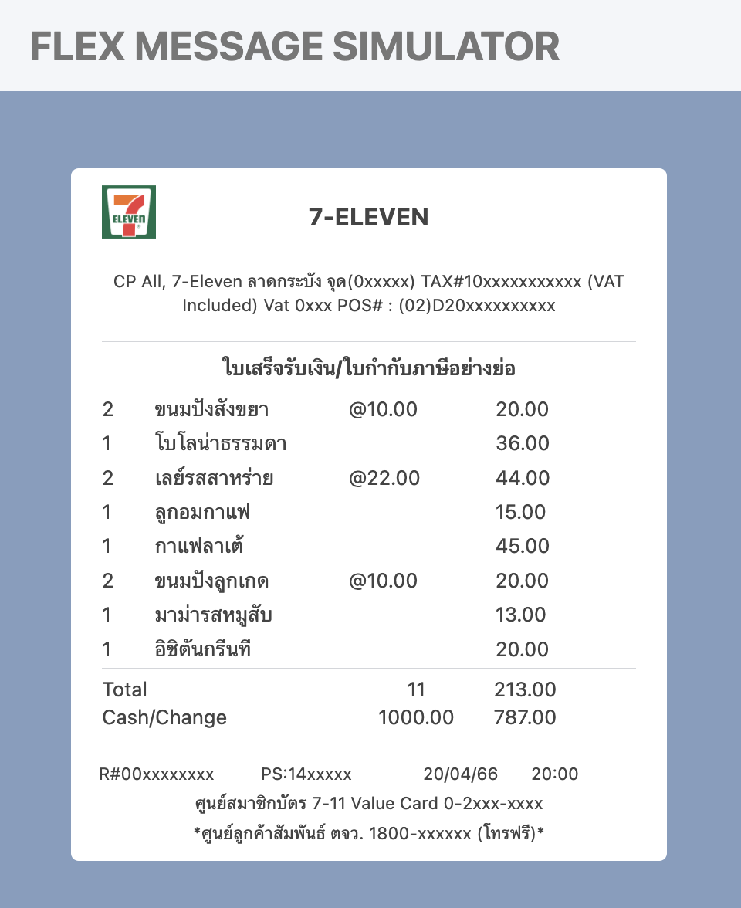
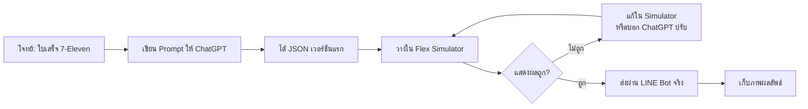

# Workshop: สร้าง LINE Flex Message ใบเสร็จร้าน 7-Eleven

> พอเราเข้าใจโครงสร้าง Flex Message แล้ว ลองมาทำของจริงกันบ้าง — โจทย์คือสร้าง "ใบเสร็จ 7-Eleven" ที่ดูเหมือนของจริง มีโลโก้ร้าน รายการสินค้า ยอดรวม และ QR สำหรับสะสมแต้ม งานนี้เราจะใช้ **ChatGPT เป็นคู่คิด** ให้ช่วยออกแบบ JSON ก่อน แล้วจับมาปรับใน Flex Message Simulator

     

Source 
- image https://seeklogo.com/images/1/7-eleven-logo-D2E5421D84-seeklogo.com.png

## ทำไมต้องรู้เรื่องนี้?

ในงานจริง เรามักไม่ได้นั่งเขียน Flex Message จาก 0 — เสียเวลาและลืมง่าย **ChatGPT** (หรือ LLM อื่น ๆ) เก่งเรื่องสร้าง JSON ตามคำสั่ง แต่เวลามันสร้างให้ก็มักมี bug เล็ก ๆ เช่น ใช้ property ที่ LINE ไม่รองรับ, ใส่ size เป็น number ที่ไม่ถูก format, หรือไม่มี `altText`

Workshop นี้จะฝึกให้คุณ:
- เขียน prompt ที่ชัดเจนให้ ChatGPT สร้าง Flex Message ได้ตรงใจ
- เอา JSON ที่ได้ไปทดสอบใน Flex Simulator เพื่อหา bug
- ปรับแต่ง JSON ให้ตรงกับ use case ของคุณ

## ภาพรวมขั้นตอน

## แนวทาง

1. ใช้ ChatGPT เพื่อออกแบบและเขียนโค้ด JSON สำหรับ Flex Message
2. ทดสอบ Flex Message ใน LINE Developer Console หรือใน LINE Bot ของคุณ
3. ตรวจสอบว่าข้อมูลทุกส่วนถูกต้องและสามารถแสดงผลได้อย่างถูกต้อง

### ตัวอย่าง Prompt ที่ใช้ได้

> "ช่วยสร้าง LINE Flex Message JSON เป็นใบเสร็จร้าน 7-Eleven ประกอบด้วย: logo ด้านบน, เลขใบเสร็จ, รายการสินค้า 5 ชิ้นพร้อมราคา, subtotal, VAT 7%, total, และ footer บอกวันที่ ขอใช้ bubble size giga และมี altText"

## สิ่งที่ต้องส่ง

- โค้ด JSON ของ Flex Message
- ภาพตัวอย่างที่ได้จากการทดสอบใน LINE Developer Console หรือใน LINE Bot

## ข้อผิดพลาดที่มักเจอ

- **พลาด:** ChatGPT สร้าง JSON มาแต่ลืม wrap ด้วย `{ "type": "flex", "altText": "...", "contents": {...} }` ทำให้ส่งผ่าน Messaging API ไม่ได้
  **ถูก:** เช็คให้ครบ — Flex Message สมบูรณ์ต้องมี type, altText และ contents

- **พลาด:** ใช้ URL รูปโลโก้จาก seeklogo ตรง ๆ แล้ว LINE โหลดไม่ขึ้น เพราะเว็บต้นทางบล็อก hotlink
  **ถูก:** ดาวน์โหลดรูปแล้วอัปโหลดใหม่ที่ Firebase Storage หรือ imgbb ก่อนนำ URL มาใช้

- **พลาด:** วาง JSON ใน Flex Simulator แล้วกด Preview ไม่ขึ้น เพราะมี trailing comma หรือ comment `//`
  **ถูก:** JSON ห้ามมี comment และห้ามมี comma ท้าย element สุดท้าย

## Checklist

- [ ] เขียน prompt ให้ ChatGPT แล้วได้ JSON กลับมา
- [ ] ทดสอบ JSON ใน [Flex Simulator](https://developers.line.biz/flex-simulator/) แล้วแสดงผลถูก
- [ ] ส่งจริงผ่าน LINE Bot และจับภาพหน้าจอ
- [ ] เก็บทั้ง JSON และรูปส่งให้ครบ

---

# Homework: สร้าง LINE Flex Message แก้ไขปัญหาภาษาไทยให้เห็นครบทุกองค์ประกอบ

> ภาษาไทยกับ Flex Message มีเรื่องชวนปวดหัว — ตัว "ำ", "ู", "่", "้" มักลอย/ชนกัน, บรรทัดตัดไม่สวย, ขนาดฟอนต์เล็กเกิน หรือเกินขอบ bubble
> การบ้านนี้ให้คุณออกแบบ Flex Message ที่ข้อความภาษาไทยแสดงได้ครบทุกองค์ประกอบ สวยงามทั้งบน iOS และ Android

     

## ข้อผิดพลาดที่มักเจอ (ภาษาไทย)

- **พลาด:** ใช้ `size: xs` หรือ `xxs` กับข้อความไทย ทำให้ตัวอักษรอ่านยาก สระลอย
  **ถูก:** ใช้ `sm` ขึ้นไปสำหรับข้อความไทย และเปิด `wrap: true` เสมอ

- **พลาด:** ลืมใส่ `wrap: true` ใน text component ทำให้ข้อความยาวโดนตัดด้วย …
  **ถูก:** ข้อความเกิน 1 บรรทัดให้ใส่ `"wrap": true` เพื่อให้ตัดคำลงบรรทัดใหม่

- **พลาด:** ใช้ฟอนต์สีอ่อนเกินไปบน background ขาว (เช่น `#cccccc`) ทำให้มองไม่เห็นบน iOS dark mode
  **ถูก:** เลือกสี contrast พอเห็นทั้ง light/dark mode

## Checklist (Homework)

- [ ] Flex Message มีข้อความภาษาไทยครบในทุกส่วน (header, body, footer)
- [ ] มี `wrap: true` ในทุก text ที่ยาวเกิน 1 บรรทัด
- [ ] ทดสอบบนมือถือจริง (iOS หรือ Android) ไม่ใช่แค่ใน Simulator
- [ ] ส่งทั้ง JSON + screenshot จากมือถือจริง

## อ้างอิง

- [LINE Flex Message Simulator](https://developers.line.biz/flex-simulator/)
- [LINE Flex Message Reference](https://developers.line.biz/en/reference/messaging-api/#flex-message)
- [Flex Message Element Documentation](https://developers.line.biz/en/docs/messaging-api/flex-message-elements/)
