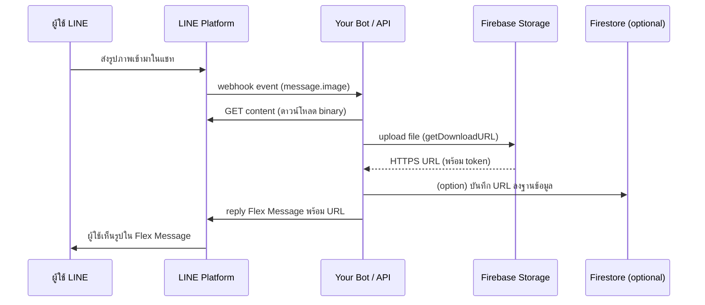

# Firebase Storage — คลังเก็บไฟล์บนคลาวด์สำหรับบอทของคุณ

> บอท LINE รับรูปจากผู้ใช้แล้วจะเอาไปเก็บที่ไหน? ส่งรูปกลับไปต้องมี URL แบบ HTTPS แล้วจะเอาจากไหน? **Firebase Storage** คือคำตอบ — มันคือ "ตู้เซฟไฟล์บนคลาวด์" ของ Google ที่ให้คุณอัปโหลด/ดาวน์โหลด/แชร์ลิงก์ไฟล์ได้อย่างง่ายดาย ใช้ได้ทันทีกับ LINE Bot, LIFF, MINI App และอื่น ๆ

     

Firebase Storage เป็นบริการจัดเก็บไฟล์บนคลาวด์ที่พัฒนาโดย Google ภายใต้แพลตฟอร์ม Firebase ซึ่งช่วยให้นักพัฒนาสามารถจัดเก็บและจัดการไฟล์ต่างๆ เช่น รูปภาพ วิดีโอ ไฟล์เสียง และเอกสารได้อย่างสะดวกและปลอดภัย

## ทำไมต้องรู้เรื่องนี้?

LINE Messaging API มีข้อจำกัดสำคัญข้อหนึ่ง — **รูปภาพ/วิดีโอที่ส่งออกไปให้ผู้ใช้ ต้องมี URL แบบ HTTPS เท่านั้น** ไม่สามารถแนบไฟล์เข้าไปตรง ๆ ได้ ถ้าคุณสร้าง Flex Message หรือ Image Message คุณต้องมี "ที่เก็บไฟล์" ที่พร้อมแจก URL สาธารณะ

Firebase Storage แก้ปัญหานี้ได้ครบ:
- มี Free Tier 5 GB ใช้งานฟรี ไม่ต้องกรอกบัตรเครดิต (ถ้าอยู่ในโหมด Spark Plan)
- ให้ URL แบบ HTTPS พร้อม token อัตโนมัติ ใช้แนบใน Flex Message ได้ทันที
- รวมกับ Firebase Authentication, Firestore และ Cloud Functions ได้แบบไร้รอยต่อ
- ตั้ง Security Rules ละเอียดระดับไฟล์ได้ ใครเห็นอะไรได้บ้างก็คุมได้

## ภาพรวม: Flow การทำงานกับ Firebase Storage

## คุณสมบัติหลัก

- **การอัปโหลดและดาวน์โหลดไฟล์:** Firebase Storage รองรับการอัปโหลดและดาวน์โหลดไฟล์ได้โดยตรงจากclient หรือ Server ผ่าน SDK หรือ API
- **การจัดเก็บข้อมูลที่ปลอดภัย:** ใช้ Firebase Security Rules ในการกำหนดสิทธิ์การเข้าถึงไฟล์ เพื่อให้แน่ใจว่าไฟล์ของคุณจะถูกเข้าถึงได้เฉพาะผู้ใช้ที่ได้รับอนุญาตเท่านั้น
- **การทำงานร่วมกับ Firebase Authentication:** สามารถจัดการสิทธิ์การเข้าถึงไฟล์ตามผู้ใช้ที่ล็อกอินในระบบได้อย่างง่ายดาย
- **การจัดการไฟล์ขนาดใหญ่:** รองรับการแบ่งไฟล์เป็นชิ้นๆ เพื่อให้การอัปโหลดไฟล์ขนาดใหญ่ทำได้อย่างราบรื่น
- **การผนวกเข้ากับบริการอื่นๆ ใน Firebase:** ทำงานร่วมกับ Firebase Realtime Database, Firestore, และ Cloud Functions ได้อย่างไร้รอยต่อ

## ตารางราคา

| **รายการ**                            | **Free Tier**                           | **ระดับราคา (Standard Pricing)**                                 |
|----------------------------------------|-----------------------------------------|-----------------------------------------------------------------|
| **พื้นที่จัดเก็บข้อมูล**              | 5 GB ฟรี                                | $0.026 ต่อ GB ต่อเดือน (สำหรับพื้นที่ US)                     |
|                                          |                                         | $0.020 ต่อ GB ต่อเดือน (สำหรับพื้นที่อื่นๆ เช่น Asia, Europe) |
| **ดาวน์โหลดข้อมูล**                    | 1 GB ฟรี                                | $0.12 ต่อ GB (สำหรับพื้นที่ US)                                |
|                                          |                                         | $0.11 ต่อ GB (สำหรับพื้นที่ Asia)                              |
|                                          |                                         | $0.10 ต่อ GB (สำหรับพื้นที่ Europe)                            |
| **ดาวน์โหลดข้อมูล (ออกไปยัง Google)** | ฟรี                                     | ฟรี                                                             |
| **อัปโหลดข้อมูล**                      | ฟรี                                     | ฟรี                                                             |

### หมายเหตุ:
- **Free Tier:** ส่วนที่สามารถใช้งานได้ฟรีสำหรับผู้ใช้ที่อยู่ในขอบเขตที่กำหนด
- **ระดับราคา (Standard Pricing):** ราคาจะแตกต่างกันไปตามพื้นที่ที่เลือกใช้บริการ
- ข้อมูลอาจมีการเปลี่ยนแปลงได้ กรุณาตรวจสอบราคาล่าสุดที่ [Firebase Pricing](https://firebase.google.com/pricing)

> **Tips:** ถ้าเราแค่เก็บรูปไม่กี่ MB เพื่อส่งใน LINE Bot ปกติจะไม่เกิน Free Tier 5 GB ง่าย ๆ — ใช้ฟรีได้นาน ๆ เลย

## เริ่มต้นใช้งาน

1. ลงทะเบียนบัญชี Firebase ที่ [Firebase Console](https://console.firebase.google.com/)
2. สร้างโปรเจกต์ใหม่และเพิ่ม Firebase Storage
3. ตั้งค่ากฎความปลอดภัยและเริ่มอัปโหลดไฟล์ของคุณ

## ข้อผิดพลาดที่มักเจอ

- **พลาด:** อัปโหลดไฟล์แล้ว copy URL จาก Firebase Console มาใช้ตรง ๆ แต่พอแปะใน Flex Message กลับโหลดไม่ขึ้น
  **ถูก:** ต้องใช้ **Download URL** ที่มี `?alt=media&token=...` ต่อท้าย ไม่ใช่ gs:// path หรือ URL จากหน้า console ตรง ๆ

- **พลาด:** ใช้ Security Rules เป็น `allow read, write: if true;` แล้วปล่อยขึ้น production ทำให้ใครก็อัปโหลด/แก้ไขไฟล์ของเราได้
  **ถูก:** เปิดให้ `read` เฉพาะที่จำเป็น และปิด `write` ให้อนุญาตเฉพาะ server-side (ผ่าน Admin SDK) หรือผ่าน Firebase Authentication

- **พลาด:** อัปโหลดรูปขนาด 5MB+ ขึ้นไป แล้ว LINE ไม่แสดงใน Flex Message
  **ถูก:** LINE จำกัดรูปสำหรับ Image/Icon component ไว้ไม่เกิน 1MB และความละเอียด 1024x1024 px — ต้องย่อรูปก่อนอัปโหลด (ใช้ `sharp` หรือ `imagemagick` บน Cloud Functions)

- **พลาด:** ลืมเปิด Billing แล้วใช้ Cloud Functions เรียก Storage ภายนอก Google network ทำให้โดนบล็อก
  **ถูก:** Firebase Storage ใช้งานได้ใน Spark (ฟรี) plan ปกติ — แต่ถ้าจะใช้ Cloud Functions ร่วมด้วยในระดับที่มี outbound ต้องอัปเป็น Blaze plan

- **พลาด:** ไฟล์ที่อัปโหลดชื่อซ้ำกัน ทำให้ไฟล์เก่าโดนเขียนทับโดยไม่รู้ตัว
  **ถูก:** ตั้งชื่อไฟล์ด้วย UUID หรือ timestamp เช่น `uploads/${userId}/${Date.now()}.jpg` เพื่อกันชนกัน

## Checklist ก่อนไปต่อ

- [ ] สมัครและสร้างโปรเจกต์ Firebase แล้ว
- [ ] เปิดใช้งาน Firebase Storage ในโปรเจกต์
- [ ] ทดสอบอัปโหลดไฟล์จาก Firebase Console เพื่อดู Download URL
- [ ] ตั้ง Security Rules ให้เหมาะสม (ไม่ปล่อยเปิดหมด)
- [ ] ทดลองแปะ URL ที่ได้ใน Flex Message แล้วเห็นรูปจริง

## อ้างอิง

- [Firebase Storage — Official Docs](https://firebase.google.com/docs/storage)
- [Firebase Pricing](https://firebase.google.com/pricing)
- [Firebase Security Rules for Cloud Storage](https://firebase.google.com/docs/storage/security)
- [LINE Messaging API — Sending images](https://developers.line.biz/en/reference/messaging-api/#image-message)
