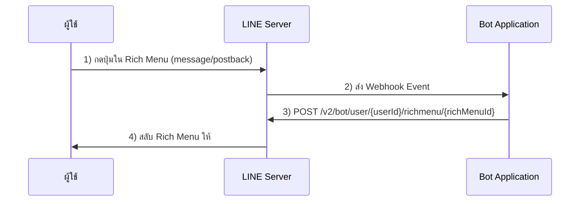
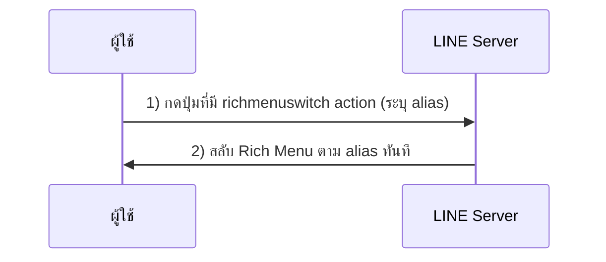
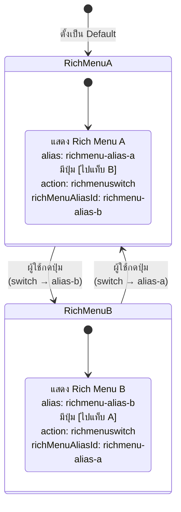
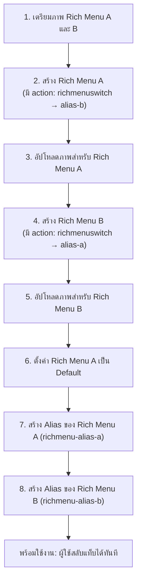

# Workshop: Rich Menu Switch Action — สลับแท็บเมนูได้ใน "คลิกเดียว" ไม่ต้องพึ่ง Webhook

> เคยใช้แอปแชทแบบ LINE OA ที่มี "แท็บเมนู" ให้สลับไปมาไหม? เช่น แท็บ "สินค้า" กับ "โปรโมชัน" — สมัยก่อนทุกครั้งที่ผู้ใช้กดสลับแท็บ บอทของคุณต้องเขียน Webhook รับ event แล้วยิง API กลับไปสลับเมนูให้ผู้ใช้ ช้าและสิ้นเปลืองโควต้า ปัจจุบัน LINE เปิดฟีเจอร์ **Richmenu Switch Action** ที่ให้ LINE server จัดการสลับเมนูเองใน 2 request เท่านั้น

## ทำไมต้องรู้เรื่องนี้?

ถ้าคุณกำลังทำ Rich Menu หลายหน้าให้ลูกค้าเลือก — เช่น หน้าเมนูหลัก + หน้าสมาชิก หรือหน้าสินค้า + หน้าโปรโมชัน — การใช้วิธีเดิมทำให้:

- ต้องเขียน Webhook และโค้ดฝั่งเซิร์ฟเวอร์รับ event
- เสียเวลา round-trip 4 requests ต่อการสลับ 1 ครั้ง
- ถ้าเซิร์ฟเวอร์ล่ม เมนูสลับไม่ได้เลย

**Richmenu Switch Action** ย้ายภาระทั้งหมดมาที่ฝั่ง LINE server → ไม่ต้องพึ่ง Webhook, ทำงานได้แม้บอทไม่มี backend และลด request ลงครึ่งหนึ่ง

## ภาพรวม: เทียบวิธีเดิม vs Switch Action

### วิธีเดิม (4 Requests, ต้องพึ่ง Bot Backend)

     

1. ผู้ใช้กด Rich Menu เพื่อส่งคำขอผ่านข้อความ หรือ Postback action จากห้องแชทไปที่ LINE server
2. LINE server จะส่ง Webhook event ต่อไปยัง Bot application ของเรา
3. Bot appliation จะประมวลผลว่า Webhook event ดังกล่าวต้องการสลับ Rich Menu เป็นแบบใด และจะส่งคำขอเปลี่ยนกลับไปยัง LINE server
4. LINE server จะทำการเปลี่ยน Rich Menu ให้ผู้ใช้คนที่ร้องขอ

`เราต้องใช้ request ทั้งหมด 4 ครั้ง`

## รู้จัก `Richmenu Switch Action` 
เป็นฟีเจอร์หนึ่งของ LINE Official Account ที่ช่วยให้ผู้ใช้งานสามารถสลับระหว่าง Rich Menus ต่างๆ ได้โดยการกดปุ่มภายใน Rich Menu หนึ่ง โดยปุ่มนั้นจะมีการตั้งค่าการกระทำให้เปลี่ยนไปใช้ Rich Menu อื่นได้

     

### วิธีใหม่ (2 Requests, ไม่ต้อง Backend)

1. ผู้ใช้กด Rich Menu เพื่อส่งคำขอไปที่ LINE server
2. LINE server รับคำขอและสลับ Rich Menu ให้ผู้ใช้คนที่ร้องขอ

`เหลือเพียง 2 request ระหว่าง Client กับ LINE server เท่านั้น`

### State Machine: การสลับ Rich Menu A กับ B ด้วย Alias

----

# Workshop Rich Menu Switch Action

ขั้นตอนการทำ Rich Menu แบบสลับแท็บ A ↔ B ทั้งหมด 8 ขั้นตอน (+ วิธีลบถ้าเลิกใช้งาน) ให้ทำเรียงตามลำดับเพื่อไม่ให้สับสน:

1. เตรียมภาพสำหรับ Rich Menus: สร้างภาพสำหรับ Rich Menu A และ B
2. สร้าง Rich Menu A: กำหนดการกระทำ เช่น การสลับไปยัง Rich Menu B
3. อัปโหลดภาพสำหรับ Rich Menu A
4. สร้าง Rich Menu B: กำหนดการกระทำที่คล้ายกับ Rich Menu A แต่เปลี่ยนเป็นการสลับไปยัง Rich Menu A
5. อัปโหลดภาพสำหรับ Rich Menu B

6. ตั้งค่า Rich Menu A เป็นค่าเริ่มต้น

7. สร้าง Alias สำหรับ Rich Menu A
8. สร้าง Alias สำหรับ Rich Menu B

9. ##### หยุดการแสดงเมนู Rich Menu 
หากต้องการหยุดการแสดงเมนู Rich Menu ให้ใช้ Messaging API เพื่อถอนการแสดงเมนู Rich ตามลำดับนี้:
    - Clear the default menu setting of the rich menu. [Link](https://developers.line.biz/en/reference/messaging-api/#clear-default-rich-menu)
    - Delete the rich menu aliases. [Link](https://developers.line.biz/en/reference/messaging-api/#delete-rich-menu-alias)
    - Delete the rich menu.[link](https://developers.line.biz/en/reference/messaging-api/#delete-rich-menu)

## ข้อผิดพลาดที่มักเจอ

- **พลาด:** สร้าง Rich Menu A แล้วใส่ `richMenuAliasId` เป็น ID ของ Rich Menu B ตรง ๆ
  **ถูก:** ต้องใส่ **alias name** (เช่น `richmenu-alias-b`) ไม่ใช่ rich menu ID — นั่นคือเหตุผลที่ต้องสร้าง alias หลังสร้าง rich menu ครบ

- **พลาด:** สร้าง alias ก่อนที่ rich menu จะอัปโหลดภาพเสร็จ ทำให้เมนูแสดงเป็นช่องว่างเปล่า
  **ถูก:** ลำดับที่ถูกต้องคือ **สร้าง rich menu → upload image → (สุดท้าย) สร้าง alias**

- **พลาด:** ตั้งทั้ง A และ B เป็น Default พร้อมกัน
  **ถูก:** ตั้ง Default ตัวเดียว (ส่วนใหญ่คือ A) — ตัว B จะถูกเข้าถึงผ่าน switch action เท่านั้น

- **พลาด:** ลบ Rich Menu ทิ้งโดยไม่ได้ลบ alias และ clear default ก่อน
  **ถูก:** ทำตามลำดับ **Clear default → Delete alias → Delete rich menu** เพื่อไม่ให้ผู้ใช้เห็นเมนูเก่าค้าง

- **พลาด:** คาดว่าผู้ใช้เดิมจะเห็นเมนูใหม่ทันทีหลังอัปเดต
  **ถูก:** Default rich menu ที่ตั้งค่าผ่าน Messaging API อาจใช้เวลาสูงสุด 1 นาที และต้องให้ผู้ใช้เปิดแชทใหม่

## Checklist ก่อนไปต่อ

- [ ] เตรียมภาพ Rich Menu A และ B ตามสเปก (800-2500 px, aspect ratio อย่างน้อย 1.45)
- [ ] สร้าง Rich Menu A พร้อม action `richmenuswitch` ชี้ไป alias ของ B
- [ ] อัปโหลดภาพ A ผ่าน `POST /v2/bot/richmenu/{richMenuId}/content`
- [ ] สร้าง Rich Menu B พร้อม action `richmenuswitch` ชี้ไป alias ของ A
- [ ] อัปโหลดภาพ B
- [ ] ตั้ง Rich Menu A เป็น Default ด้วย `POST /v2/bot/user/all/richmenu/{richMenuId}`
- [ ] สร้าง alias `richmenu-alias-a` และ `richmenu-alias-b`
- [ ] ทดสอบบนมือถือจริง: กดแท็บไปมาได้ใน 1 คลิก ไม่ต้องรอ server

## อ้างอิง

- [Switch between tabs on rich menus](https://developers.line.biz/en/docs/messaging-api/switch-rich-menus/)
- [Richmenu switch action](https://developers.line.biz/en/reference/messaging-api/#richmenu-switch-action)
- [Rich menu alias](https://developers.line.biz/en/reference/messaging-api/#rich-menu-alias)
- [Create rich menu alias](https://developers.line.biz/en/reference/messaging-api/#create-rich-menu-alias)
- [Clear default rich menu](https://developers.line.biz/en/reference/messaging-api/#clear-default-rich-menu)
- [Delete rich menu alias](https://developers.line.biz/en/reference/messaging-api/#delete-rich-menu-alias)
- [Delete rich menu](https://developers.line.biz/en/reference/messaging-api/#delete-rich-menu)
