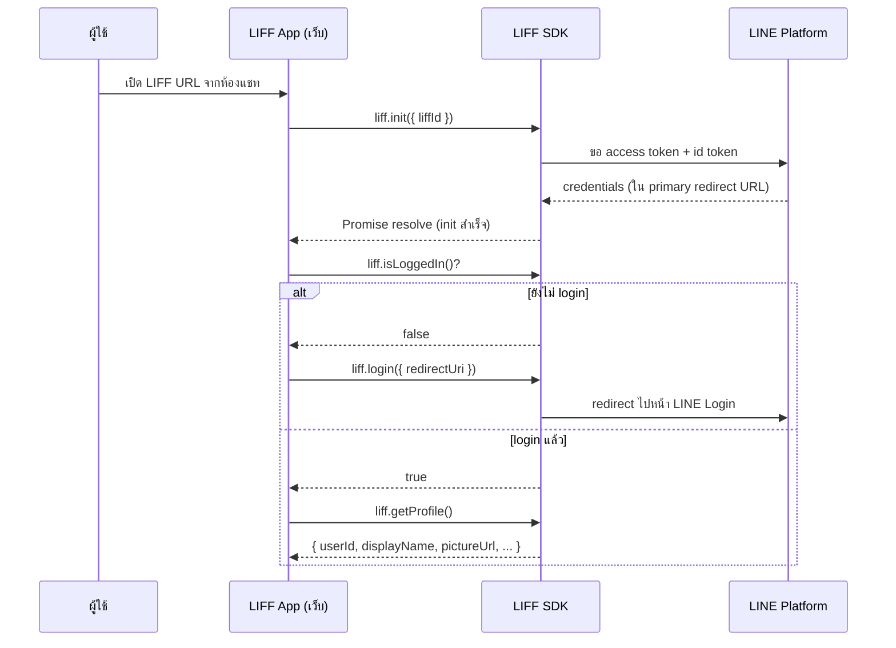
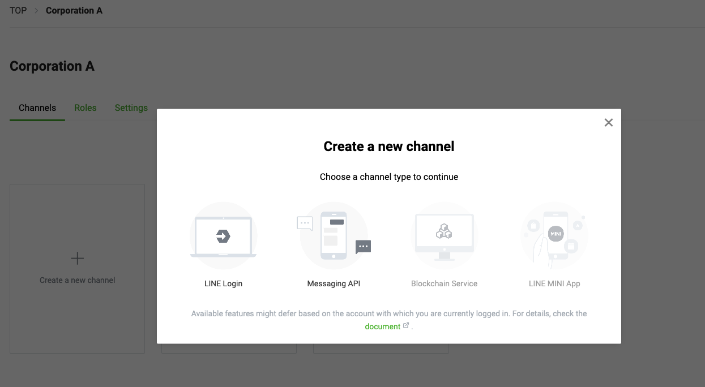
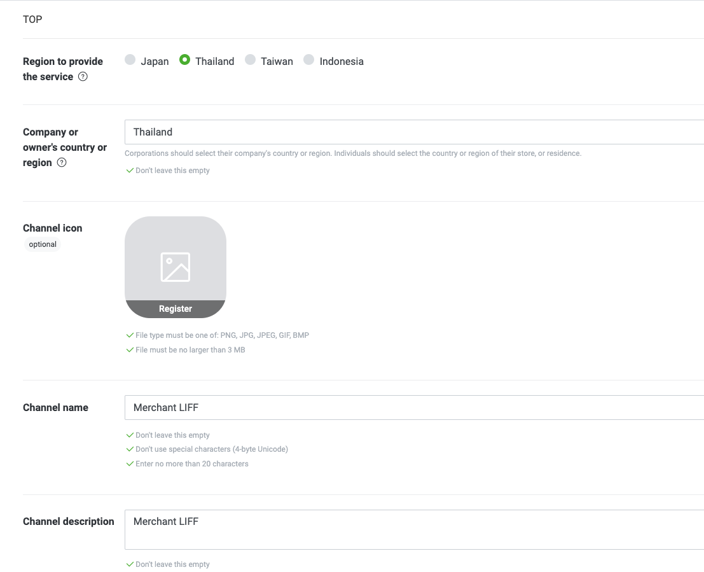
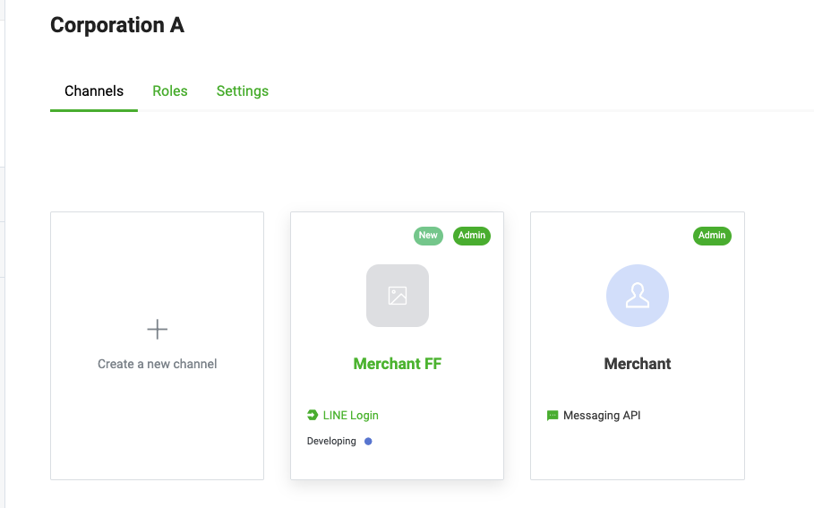
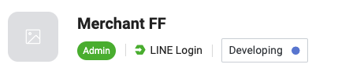
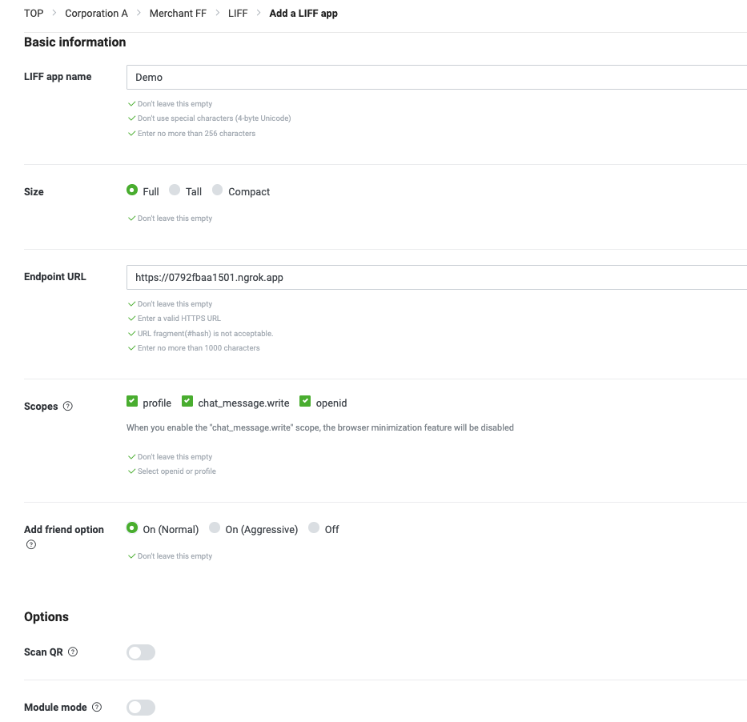
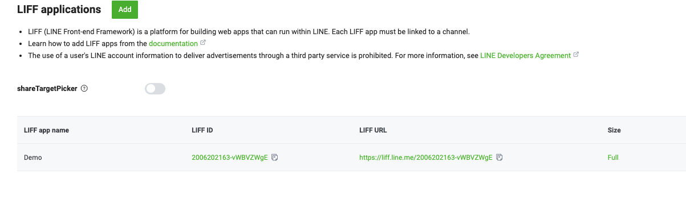

# Workshop: LINE Front-end Framework (LIFF) — เปลี่ยนห้องแชทให้กลายเป็นเว็บแอป

> LINE Chatbot เก่งเรื่องการส่งข้อความ แต่พอต้องทำฟอร์มลงทะเบียนยาว ๆ, โชว์แคตตาล็อกสินค้า, หรือให้ผู้ใช้คลิก-ลาก-เลือกสี — แชทบอทล้วน ๆ ทำไม่ไหว **LIFF** คือตัวช่วยที่ยัด "เว็บเต็มรูปแบบ" เข้าไปในห้องแชท LINE ให้คุณสร้าง UI อะไรก็ได้ แถมยังรู้ทันทีว่าใครคือผู้ใช้ โดยไม่ต้องทำระบบ Login เอง

## ทำไมต้องรู้เรื่องนี้?

ลองนึกภาพว่า Chatbot คือ "พนักงานหน้าร้าน" ที่พูดคุยกับลูกค้าได้เก่งมาก — แต่พอลูกค้าอยากดูแคตตาล็อก 100 รายการ หรือกรอกฟอร์มสมัครสมาชิกที่มี 15 ช่อง พนักงานคนนี้ก็เริ่มสื่อสารไม่ไหว

LIFF คือ "โชว์รูมจริง" ที่เปิดอยู่ข้าง ๆ พนักงานคนนั้น พาลูกค้าเข้าไปกรอกฟอร์ม ดูรูป เลือกของ ได้เหมือนเว็บไซต์ปกติ แต่มีข้อดีคือ:
- **รู้ว่าเป็นใคร** — ดึง userId, displayName, pictureUrl, email ได้ทันที โดยไม่ต้อง Login ใหม่
- **ส่งข้อความกลับห้องแชทได้** — ในนามของผู้ใช้ (เช่น Flex, Imagemap)
- **ใช้ได้ทั้งใน LINE และ External Browser** — มาพร้อม LINE Login พร้อมใช้ทันที

**ประโยชน์จริง:**
- สร้างฟอร์มลงทะเบียน / OTP Validation
- ทำ Product Catalog โชว์สินค้าในห้องแชท
- ทำ Front-end จัดเต็ม (React / Vue / Next.js) แล้วผูกกับ LINE User โดยไม่ต้องเขียน Auth เอง

<p align="center" width="100%">
     
</p>

## ภาพรวม: ตั้งแต่ init ถึงได้ข้อมูลผู้ใช้



## ขนาดหน้าจอของ LIFF (View Size)

LIFF มีขนาดหน้าจอให้เลือก 3 แบบ ควรเลือกให้เหมาะกับงาน

| ขนาด | ความสูง | เหมาะกับ |
| --- | --- | --- |
| **Compact** | 50% ของหน้าแชท | Simple Form, OTP Validation, Quick Action |
| **Tall** | 75% | Product Catalog, Form หลายฟิลด์ |
| **Full** | 100% (เต็มจอ) | Single Page App เต็มรูปแบบ |

<p align="center" width="100%">
     
</p>

## สร้าง Channel สำหรับ LIFF

Channel คือ subset ของ Provider โดยมี 2 รูปแบบหลักคือ **LINE Login** และ **Messaging API** — สำหรับ LIFF เราจะเลือก **LINE Login channel**

### 1) เลือกประเภท LINE Login

<p align="center" width="100%">
     
</p>

### 2) กรอกรายละเอียด Channel

<p align="center" width="100%">
     
</p>

### 3) ยืนยันและสร้าง

<p align="center" width="100%">
     
</p>

### 4) เพิ่ม LIFF app ใน Channel

หลังจากมี Provider และ Channel แล้ว เข้าไปที่ Channel ที่สร้างไว้ → tab **LIFF** → กด **Add**

### 5) ตั้งสิทธิ์การใช้งาน

สิทธิ์เริ่มต้นคือ `Developing` (ใช้ได้เฉพาะ Admin ของ Channel) — ถ้าต้องการให้ผู้ใช้ทั่วไปเข้าถึงได้ ให้เปลี่ยนเป็น `Published`

<p align="center" width="100%">
     
</p>

### 6) ระบุรายละเอียด LIFF app

- **LIFF app name**: ชื่อของ LIFF (ผู้ใช้ไม่เห็น)
- **Size**: ขนาดในการแสดงผล (Full = 100%, Tall = 75%, Compact = 50%)
- **Endpoint URL**: URL ที่รองรับ HTTPS (เช่น URL StackBlitz หรือ Vercel)
- **Scopes**: สิทธิ์การเข้าถึงข้อมูล (เบื้องต้นให้เลือก `profile`)
- **Linked LINE OA**: ผูก OA เพื่อชวนผู้ใช้กด Follow (ตอนนี้เลือก Off ไปก่อน)
- **Scan QR**: ขอสิทธิ์เปิด QR Code Reader (ยังไม่ต้องเปิดในบทนี้)

<p align="center" width="100%">
     
</p>

เมื่อกด Add เสร็จเรียบร้อย จะได้ **LIFF URL** มาใช้งาน

<p align="center" width="100%">
     
</p>

---

## ข้อจำกัดเรื่อง OpenChat

LIFF app ยังไม่รองรับ OpenChat อย่างเป็นทางการ — ฟังก์ชันบางอย่างจะไม่ทำงาน เช่น `liff.getProfile()` จะดึงโปรไฟล์ไม่ได้ในกรณีส่วนใหญ่

---

## สภาพแวดล้อมที่แนะนำ (Recommended Operating Environment)

### เมื่อเปิด LIFF app ใน LIFF browser

| รายการ | สภาพแวดล้อมที่แนะนำ | สภาพแวดล้อมขั้นต่ำ |
| --- | --- | --- |
| iOS | เวอร์ชันล่าสุด (ใช้ [WKWebView](https://developer.apple.com/documentation/webkit/wkwebview)) | ตามสเปคระบบที่แนะนำของ LINE |
| Android | เวอร์ชันล่าสุด (ใช้ [Android WebView](https://developer.android.com/reference/android/webkit/WebView)) | ตามสเปคระบบที่แนะนำของ LINE |
| LINE | เวอร์ชันล่าสุด | ตามสเปคระบบที่แนะนำของ LINE |

> แนะนำให้ใช้ OS และ LINE เวอร์ชันล่าสุดเสมอ แม้ในเวอร์ชันที่สูงกว่าขั้นต่ำ บางฟีเจอร์อาจไม่ทำงานหรือหน้าจออาจแสดงผลไม่ถูกต้อง

### เมื่อเปิด LIFF app ใน External Browser

LIFF app รองรับเบราว์เซอร์เวอร์ชันล่าสุดต่อไปนี้:

- Microsoft Edge
- Google Chrome
- Firefox
- Safari

---

## Action Button

LIFF app ที่ตั้งค่าขนาดเป็น `Full` จะแสดง Action Button ที่ header โดยอัตโนมัติ

> หากต้องการซ่อน Action Button ให้เปิดใช้งาน **Module mode** ของ LIFF app ใน LINE Developers Console

เมื่อผู้ใช้แตะ Action Button จะแสดง **Multi-tab view** (LINE เวอร์ชัน 15.12.0 ขึ้นไป) หรือแสดง options (LINE เวอร์ชันก่อนหน้า 15.12.0)

---

## Multi-tab View

Multi-tab view จะแสดงตัวเลือกสำหรับ LIFF app ที่ใช้งานอยู่และบริการที่เพิ่งใช้ล่าสุด

### Options ที่แสดงใน Multi-tab view

| รายการ | รายละเอียด |
| --- | --- |
| **Refresh** | โหลดหน้าปัจจุบันใหม่ |
| **Share** | แชร์ permanent link ของหน้าปัจจุบันผ่านข้อความ LINE |
| **Minimize browser** | ย่อ LIFF browser |
| **Permission setting** | เปิดหน้าตั้งค่าสิทธิ์การเข้าถึง (กล้อง, ไมโครโฟน) สำหรับ LINE 14.6.0 ขึ้นไป |

### Recently used services

แสดง LIFF app ที่ผู้ใช้เคยเปิด เรียงลำดับจากล่าสุด สูงสุด 50 รายการ

เงื่อนไขการแสดง:
- LINE app เวอร์ชัน 15.12.0 ขึ้นไป
- ขนาดหน้าจอ LIFF app ตั้งค่าเป็น `Full`
- Module mode ของ LIFF app ปิดอยู่

> **หมายเหตุ:** หาก LIFF app ถูก reload จาก recently used services จะไม่สามารถใช้ `liff.sendMessages()` ได้ ต้องเปิด LIFF app ใหม่จาก LIFF URL ในห้องแชทแทน

---

## Module Mode

Module mode เป็นการตั้งค่าใน LINE Developers Console ที่มีผลดังนี้:
- ซ่อน Action Button ที่ header ของ LIFF app ขนาด Full
- ทำให้ LIFF app ไม่แสดงใน recently used services ของ Multi-tab view

---

## สิ่งสำคัญเกี่ยวกับ liff.init()

### 4 ข้อควรระวังในการ initialize LIFF app

#### 1. ต้องเรียก liff.init() ที่ Endpoint URL หรือ URL ระดับต่ำกว่า

`liff.init()` จะทำงานได้เฉพาะ URL ที่ตรงกับ Endpoint URL หรือ URL ที่อยู่ในระดับต่ำกว่าเท่านั้น

| URL ที่เรียก `liff.init()` | ทำงานได้? |
| --- | --- |
| `https://example.com/` (Endpoint URL คือ `https://example.com/path1/`) | ไม่ได้ |
| `https://example.com/path1/` | ได้ |
| `https://example.com/path1/language/` | ได้ |
| `https://example.com/path2/` | ไม่ได้ |

#### 2. ต้องเรียก liff.init() ทั้งที่ Primary และ Secondary Redirect URL

`liff.init()` จะทำการ initialize โดยอ้างอิงจากข้อมูลเช่น `liff.state` และ `access_token=xxx` ที่ถูกเพิ่มเข้ามาใน primary redirect URL หากต้องการให้ LIFF app ทำงานได้อย่างถูกต้อง ให้เรียก `liff.init()` ทั้งที่ primary redirect URL และ secondary redirect URL

#### 3. ต้องเปลี่ยน URL หลังจาก liff.init() เสร็จสิ้น

ให้ทำการเปลี่ยน URL หลังจาก Promise ที่คืนจาก `liff.init()` ถูก resolve แล้วเท่านั้น

```javascript
liff
  .init({ liffId: "1234567890-AbcdEfgh" })
  .then(() => {
    // เปลี่ยน URL หลังจาก init สำเร็จ
    window.location.replace(location.href + "/entry/");
  });
```

หากเปลี่ยน URL ก่อนที่ Promise จะ resolve (เช่น ใช้ `window.location`, `history.pushState()`, หรือ redirect ด้วย status code 301/302) LIFF app อาจเปิดไม่ถูกต้อง

#### 4. ระวังเรื่อง Primary Redirect URL

`access_token=xxx` ที่ถูกเพิ่มเข้ามาใน primary redirect URL เป็นข้อมูลลับของผู้ใช้ ห้ามส่ง primary redirect URL ไปยัง logging tool ภายนอก เช่น Google Analytics

```javascript
liff
  .init({ liffId: "1234567890-AbcdEfgh" })
  .then(() => {
    // ส่ง page view หลัง init เสร็จ เพื่อไม่ให้ credential รั่วไหล
    ga("send", "pageview");
  });
```

> ตั้งแต่ LIFF v2.11.0 ขึ้นไป credential information จะถูกลบออกจาก URL เมื่อ `liff.init()` resolve

---

## ฟังก์ชันที่ใช้ได้ก่อนการ initialize

property และ method ต่อไปนี้สามารถเรียกใช้ได้แม้ยังไม่ได้เรียก `liff.init()`:

- `liff.ready` - Promise ที่ resolve เมื่อ init สำเร็จ
- `liff.getOS()` - ดู OS ที่ผู้ใช้ใช้งาน
- `liff.getAppLanguage()` - ดูภาษาของแอป
- `liff.getVersion()` - ดูเวอร์ชันของ LIFF SDK
- `liff.getLineVersion()` - ดูเวอร์ชันของ LINE app
- `liff.isInClient()` - ตรวจสอบว่าเปิดใน LINE app หรือไม่
- `liff.closeWindow()` - ปิดหน้าต่าง LIFF (ต้องใช้ LIFF SDK v2.4.0 ขึ้นไป)
- `liff.use()` - ใช้ LIFF plugin
- `liff.i18n.setLang()` - ตั้งค่าภาษา

> สามารถใช้ฟังก์ชันเหล่านี้เพื่อดูสภาพแวดล้อมก่อน initialize หรือปิด LIFF app เมื่อ initialization ล้มเหลว

---

## LiffError Object และ Error Codes

เมื่อเกิดข้อผิดพลาดใน LIFF SDK จะคืนค่าเป็น LiffError object ที่มีโครงสร้างดังนี้:

```json
{
  "code": "INIT_FAILED",
  "message": "Failed to init LIFF SDK"
}
```

### คุณสมบัติของ LiffError

| คุณสมบัติ | ชนิดข้อมูล | รายละเอียด |
| --- | --- | --- |
| `code` | String | รหัสข้อผิดพลาด |
| `message` | String | ข้อความอธิบายข้อผิดพลาด (ไม่ได้แนบมาเสมอ) |
| `cause` | Unknown | สาเหตุของข้อผิดพลาด (ไม่ได้แนบมาเสมอ) |

> **หมายเหตุ:** เมื่อระบุข้อผิดพลาด ให้ใช้ทั้ง error code และ error message ร่วมกัน เพราะ error message อาจเปลี่ยนแปลงได้โดยไม่แจ้งล่วงหน้า

### ตาราง Error Codes

| Error Code | รายละเอียด |
| --- | --- |
| `400` | มีปัญหากับ request ให้ตรวจสอบ request parameters และรูปแบบ JSON |
| `401` | ตรวจสอบว่า authorization header ถูกต้อง |
| `403` | ไม่มีสิทธิ์ใช้งาน API ให้ตรวจสอบว่าบัญชีหรือแพลนมีสิทธิ์ใช้งาน |
| `429` | เกิน rate limit สำหรับ request |
| `500` | ข้อผิดพลาดชั่วคราวบน API server |
| `INIT_FAILED` | ไม่สามารถ initialize LIFF SDK ได้ |
| `INVALID_ARGUMENT` | ระบุ argument ที่ไม่ถูกต้อง |
| `UNAUTHORIZED` | ผู้ใช้ไม่ได้ authorize / เรียก server API โดยไม่มี access token / เรียก share target picker ก่อน login |
| `FORBIDDEN` | ไม่มีสิทธิ์ที่จำเป็น หรือพยายามใช้ฟีเจอร์ในสภาพแวดล้อมที่ไม่รองรับ |
| `INVALID_CONFIG` | การตั้งค่าไม่ถูกต้อง เช่น ไม่ได้ระบุ liffId หรือ URL ไม่ตรงกับ Endpoint URL |
| `INVALID_ID_TOKEN` | ไม่สามารถยืนยัน ID token ได้ |
| `EXCEPTION_IN_SUBWINDOW` | มีปัญหากับ subwindow เช่น target picker ถูกเปิดทิ้งไว้นานเกิน 10 นาที |
| `UNKNOWN` | ข้อผิดพลาดที่ไม่ทราบสาเหตุ |

## ข้อผิดพลาดที่มักเจอ

- **พลาด:** สร้าง Messaging API channel แทน LINE Login channel — ไม่มี tab LIFF ให้กด Add
  **ถูก:** LIFF ต้องอยู่บน **LINE Login channel** เท่านั้น (เพิ่ม Link LINE OA ทีหลังได้)

- **พลาด:** ตั้ง Endpoint URL เป็น `https://example.com/path1/` แล้วเรียก `liff.init()` ที่ `https://example.com/` — init ไม่ผ่าน
  **ถูก:** `liff.init()` จะทำงานได้เฉพาะ URL ที่เท่ากับหรือต่ำกว่า Endpoint URL เท่านั้น

- **พลาด:** เปลี่ยน URL ด้วย `window.location` ก่อน Promise ของ `liff.init()` resolve — LIFF เปิดแล้ว error
  **ถูก:** รอ `.then()` ของ `liff.init()` ก่อนค่อย `window.location.replace(...)`

- **พลาด:** ส่ง primary redirect URL ทั้งก้อนเข้า Google Analytics — ทำให้ `access_token` รั่วไหล
  **ถูก:** เรียก `ga('send', 'pageview')` หลัง `liff.init()` เสร็จแล้วเท่านั้น (v2.11.0 ขึ้นไป credential จะถูกลบออกอัตโนมัติ)

- **พลาด:** สิทธิ์ Channel ยังเป็น `Developing` แล้วให้ลูกค้าทดสอบ — ลูกค้าเปิดไม่ได้
  **ถูก:** เปลี่ยนเป็น `Published` เมื่อพร้อมเปิดใช้งานจริง

- **พลาด:** ใช้ `liff.ready` แล้ว Promise ค้าง pending ตลอด — debug ไม่เจอ
  **ถูก:** `liff.ready` จะไม่ reject เมื่อ init ล้มเหลว ให้ `.catch()` ที่ `liff.init()` แทน

## Checklist ก่อนไปต่อ

- [ ] สร้าง Provider และ **LINE Login channel** แล้ว
- [ ] เพิ่ม LIFF app ใน Channel (tab LIFF → Add)
- [ ] ตั้ง Endpoint URL เป็น HTTPS ที่ถูกต้อง
- [ ] เลือก Scope อย่างน้อย `profile` (และ `openid`, `email` ถ้าต้องใช้อีเมล)
- [ ] เข้าใจ 4 ข้อควรระวังของ `liff.init()`
- [ ] ทดสอบเปิด LIFF URL ในห้องแชท แล้วเห็น "LIFF init succeeded"

## อ้างอิง

- [LIFF Documentation](https://developers.line.biz/en/docs/liff/)
- [LIFF API Reference](https://developers.line.biz/en/reference/liff/)
- [LIFF Playground](https://liff-playground.netlify.app/) — เล่นกับทุกฟังก์ชันของ LIFF แบบไม่ต้องเขียนโค้ด
- [LINE Developers Console](https://developers.line.biz/console)
