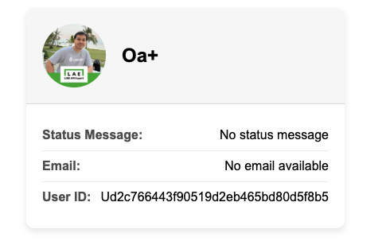
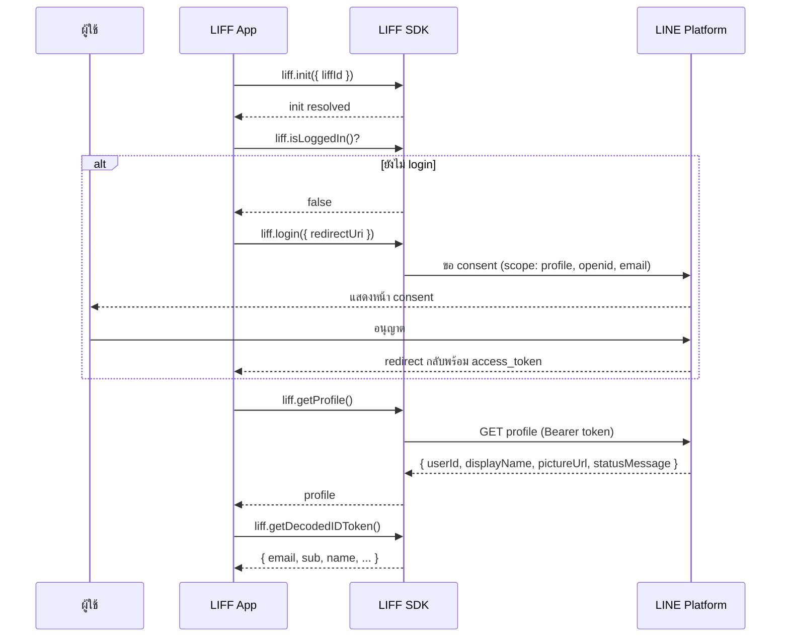
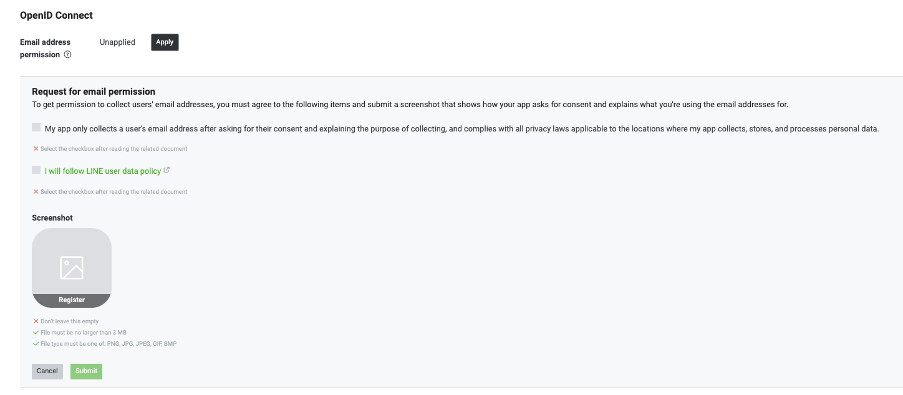
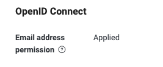
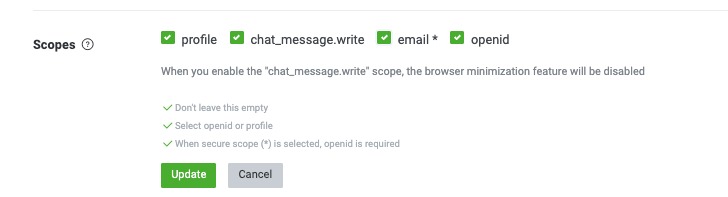
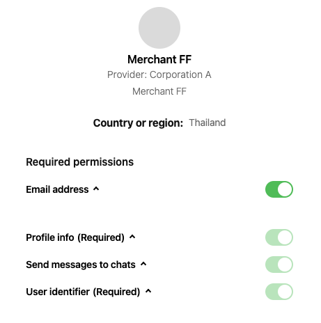
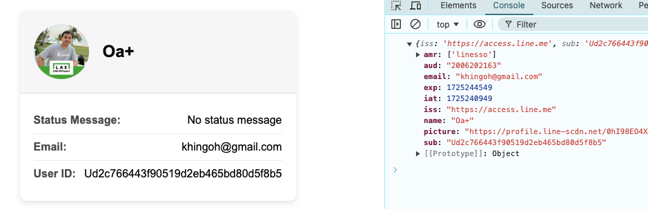

# Workshop: LIFF Get Profile — ดึงข้อมูลผู้ใช้โดยไม่ต้องทำ Login เอง

> ปกติถ้าจะทำเว็บแล้วรู้ว่า "ผู้ใช้เป็นใคร" ต้องมีระบบ Register / Login / จัดการรหัสผ่าน / verify email เอง — เหนื่อยมาก แต่ LIFF ให้ของพวกนี้ฟรี ๆ เพียงเรียก `liff.getProfile()` ก็ได้ userId, displayName, รูปโปรไฟล์, สถานะ ครบ และถ้าเปิด OpenID Connect + scope `email` ก็ได้ email ของผู้ใช้ LINE ด้วย

<p align="center" width="100%">
     
</p>

## ทำไมต้องรู้เรื่องนี้?

นึกถึงเวลาเราสั่งของออนไลน์ใน LINE Shopping — ไม่เคยต้องกรอก username / password เลย ระบบรู้ว่าเราเป็นใคร จากไหน เพราะเชื่อมต่อกับ LINE Login โดยตรง

`liff.getProfile()` คือ "บัตรประชาชน LINE" ของผู้ใช้ที่ถูกยื่นให้เราโดยอัตโนมัติหลังจาก login สำเร็จ — ใช้ทำได้ตั้งแต่บันทึกสมาชิก, จับคู่ข้อมูลในฐานข้อมูล, ส่ง push message ไปหา userId, แสดงชื่อ/รูปผู้ใช้ในหน้าเว็บ

**ประโยชน์จริง:**
- สร้างระบบสมาชิกโดยใช้ userId เป็น primary key (ไม่ต้องจัดการ password)
- ดึง email ผู้ใช้เพื่อส่ง receipt, แคมเปญ
- แสดง displayName / pictureUrl เพื่อทักทายผู้ใช้ (เช่น "สวัสดีคุณ Thep")

## ภาพรวม: ลำดับการดึงโปรไฟล์และ consent



## ตัวอย่างโค้ดการดึงข้อมูลโปรไฟล์ผู้ใช้

````javascript
<template>
    <div class="profile-card" v-if="profile">
      <div class="profile-header">
        
        <h2 class="profile-name">{{ profile.displayName }}</h2>
      </div>
      <div class="profile-body">
        <div class="profile-item">
          <span class="label">Status Message:</span>
          <span>{{ profile.statusMessage || 'No status message' }}</span>
        </div>
        <div class="profile-item">
          <span class="label">Email:</span>
          <span>{{ email || 'No email available' }}</span>
        </div>
        <div class="profile-item">
          <span class="label">User ID:</span>
          <span>{{ profile.userId }}</span>
        </div>
      </div>
    </div>

</template>

<script>
import liff from "@line/liff";
import axios from 'axios';
export default {
  beforeCreate() {
    liff
      .init({
        liffId: import.meta.env.VITE_LIFF_ID
      })
      .then(() => {
        this.message = "LIFF init succeeded.";
      })
      .catch((e) => {
        this.message = "LIFF init failed.";
        this.error = `${e}`;
      });
  },
  data() {
    return {
      profile: null,
      email: "",
      message: "",
      error: ""
    };
  },
  async mounted() {
    await this.checkLiffLogin()
  },
  methods: {
    async checkLiffLogin() {
      await liff.ready.then(async () => {
        if (!liff.isLoggedIn()) {
          liff.login({ redirectUri: window.location })
        } else {

          const profile = await liff.getProfile();
          this.profile = profile;

        }
      })
    },
  },
};
</script>

<style scoped>

#app {
  font-family: Avenir, Helvetica, Arial, sans-serif;
  -webkit-font-smoothing: antialiased;
  -moz-osx-font-smoothing: grayscale;
  text-align: center;
  color: #2c3e50;
  margin-top: 60px;
}

.profile-card {
  max-width: 400px;
  margin: 20px auto;
  background-color: #ffffff;
  border-radius: 10px;
  box-shadow: 0 4px 8px rgba(0, 0, 0, 0.1);
  overflow: hidden;
  font-family: 'Arial', sans-serif;
}

.profile-header {
  display: flex;
  align-items: center;
  padding: 20px;
  background-color: #f7f7f7;
  border-bottom: 1px solid #ddd;
}

.profile-pic {
  border-radius: 50%;
  width: 80px;
  height: 80px;
  margin-right: 20px;
}

.profile-name {
  font-size: 24px;
  margin: 0;
}

.profile-body {
  padding: 20px;
}

.profile-item {
  display: flex;
  justify-content: space-between;
  padding: 10px 0;
  border-bottom: 1px solid #eee;
}

.profile-item:last-child {
  border-bottom: none;
}

.label {
  font-weight: bold;
  color: #555;
}

@media (max-width: 600px) {
  .profile-card {
    padding: 10px;
  }

  .profile-header {
    flex-direction: column;
    align-items: center;
    text-align: center;
  }

  .profile-pic {
    margin: 0 0 10px 0;
  }

  .profile-name {
    font-size: 20px;
  }
}
</style>
````


---

## LIFF SDK Properties

### liff.id

`liff.id` เป็น property ที่เก็บค่า LIFF app ID (ชนิด `String`) ที่ถูกส่งเข้าไปใน `liff.init()`

- ค่าของ `liff.id` จะเป็น `null` จนกว่าจะเรียก `liff.init()`
- สามารถใช้ `liff.id` เพื่ออ้างอิง LIFF app ID ได้หลังจาก init สำเร็จ

```javascript
const liffId = "my-liff-id";
liff.init({ liffId });

// liff.id จะมีค่าเท่ากับ liffId ที่ส่งเข้าไป
console.log(liff.id); // "my-liff-id"
```

---

## อธิบายฟังก์ชันที่ใช้ในโค้ดตัวอย่าง

### 1. liff.init()
หลักการทำงาน: liff.init() เป็นฟังก์ชันที่ใช้สำหรับการเริ่มต้นใช้งาน LIFF (LINE Front-end Framework) โดยจะทำการเชื่อมต่อกับ LIFF ID ที่กำหนดไว้และตรวจสอบว่ามีการตั้งค่าและอุปกรณ์พร้อมใช้งานหรือไม่

รายละเอียด:

- ฟังก์ชันนี้ต้องถูกเรียกใช้ก่อนที่คุณจะสามารถใช้งานฟังก์ชันอื่นๆ ของ LIFF ได้
- ต้องระบุ liffId ซึ่งเป็นรหัสเฉพาะของแอป LIFF ของคุณในการเรียกใช้ liff.init()
- ฟังก์ชันนี้จะคืนค่าเป็น Promise ซึ่งคุณสามารถรอให้การเริ่มต้นเสร็จสิ้นก่อนดำเนินการต่อในโค้ดของคุณ
- LIFF SDK จะดึง access token และ ID token ของผู้ใช้จาก LINE Platform เมื่อเรียก `liff.init()`
- LIFF app ต้องถูก initialize ทุกครั้งที่เปิดหน้าใหม่ แม้จะเป็นการ transition ภายใน LIFF app เดียวกัน

Syntax:
```javascript
liff.init(config, successCallback, errorCallback);
```

Parameters:
| Parameter | ชนิด | จำเป็น | รายละเอียด |
| --- | --- | --- | --- |
| `config.liffId` | String | ใช่ | LIFF app ID |
| `config.withLoginOnExternalBrowser` | Boolean | ไม่ | กำหนดว่าจะ auto login เมื่อเปิดใน external browser หรือไม่ (ค่าเริ่มต้น: `false`) |
| `successCallback` | Function | ไม่ | callback เมื่อ init สำเร็จ |
| `errorCallback` | Function | ไม่ | callback เมื่อ init ล้มเหลว |

ตัวอย่าง:

```javascript
await liff.init({ liffId: "YOUR_LIFF_ID" });
```
### 2. liff.ready
หลักการทำงาน: liff.ready เป็น property ที่เก็บ Promise object ซึ่งจะถูก resolve เมื่อเรียก `liff.init()` ครั้งแรกสำเร็จหลังจากเริ่มต้น LIFF app

รายละเอียด:

- liff.ready เป็น Promise ที่สามารถใช้ในการตรวจสอบสถานะว่าการเริ่มต้น LIFF สำเร็จหรือไม่
- คุณสามารถใช้ liff.ready ร่วมกับ await หรือ then เพื่อทำการกระทำบางอย่างหลังจากที่ LIFF พร้อมใช้งาน
- **สามารถใช้ได้ก่อนการ initialize:** `liff.ready` ใช้ได้แม้ยังไม่ได้เรียก `liff.init()` ทำให้สามารถเตรียม handler ไว้ก่อนได้
- **ข้อควรระวัง:** หาก `liff.init()` ล้มเหลว `liff.ready` จะไม่ถูก reject และจะไม่คืนค่า LiffError object กล่าวคือ Promise จะค้างอยู่ในสถานะ pending ตลอดไป

ตัวอย่าง:

```javascript
// เตรียม handler ไว้ก่อนเรียก liff.init()
liff.ready.then(() => {
    console.log("LIFF is ready");
});

// จากนั้นค่อยเรียก init
liff.init({ liffId: "YOUR_LIFF_ID" });
```
### 3. liff.isLoggedIn()
หลักการทำงาน: liff.isLoggedIn() เป็นฟังก์ชันที่ใช้ในการตรวจสอบว่าผู้ใช้ได้เข้าสู่ระบบผ่าน LIFF แล้วหรือไม่

รายละเอียด:

- ฟังก์ชันนี้จะคืนค่าเป็น Boolean (true หรือ false)
- ถ้าผู้ใช้ได้เข้าสู่ระบบแล้ว จะคืนค่า true ถ้ายังไม่ได้เข้าสู่ระบบจะคืนค่า false
- ใช้ร่วมกับ liff.login() เพื่อบังคับให้ผู้ใช้เข้าสู่ระบบถ้ายังไม่ได้ทำการเข้าสู่ระบบ

ตัวอย่าง:

```javascript
if (!liff.isLoggedIn()) {
    liff.login();
}
```

### 4. liff.login()
หลักการทำงาน: liff.login() เป็นฟังก์ชันที่ใช้ในการเรียกกระบวนการล็อกอินผ่าน LINE เพื่อให้ผู้ใช้สามารถเข้าสู่ระบบได้

รายละเอียด:

- ฟังก์ชันนี้จะเปลี่ยนเส้นทางผู้ใช้ไปยังหน้าล็อกอินของ LINE (หรือแอป LINE บนมือถือ) และเมื่อเข้าสู่ระบบเสร็จแล้วจะนำผู้ใช้กลับมาที่แอป LIFF
- สามารถกำหนดค่า redirectUri เพื่อระบุ URL ที่ผู้ใช้จะถูกนำกลับมาหลังจากล็อกอินสำเร็จ

ตัวอย่าง:
```javascript
liff.login({
    redirectUri: window.location.href
});
```

### 5. liff.getProfile()
หลักการทำงาน: liff.getProfile() เป็นฟังก์ชันที่ใช้เพื่อดึงข้อมูลโปรไฟล์ของผู้ใช้ที่เข้าสู่ระบบอยู่

รายละเอียด:

- ฟังก์ชันนี้จะคืนค่าเป็น Promise ซึ่งจะ resolve ด้วยข้อมูลโปรไฟล์ของผู้ใช้
- ข้อมูลที่ได้รับจะรวมถึง userId, displayName, pictureUrl, และ statusMessage
- ฟังก์ชันนี้ใช้ในการแสดงข้อมูลผู้ใช้ในแอปของคุณ เช่น ชื่อผู้ใช้และรูปโปรไฟล์

ตัวอย่าง:

```javascript
const profile = await liff.getProfile();
console.log(profile.displayName);
console.log(profile.pictureUrl);
```

สรุป:
- `liff.id`: property ที่เก็บ LIFF app ID (เป็น `null` ก่อนเรียก `liff.init()`).
- `liff.init()`: เริ่มต้นใช้งาน LIFF ต้องเรียกก่อนใช้ฟังก์ชันอื่น.
- `liff.ready`: Promise ที่ resolve เมื่อ init สำเร็จ (ใช้ได้ก่อน init, ไม่ reject เมื่อ init ล้มเหลว).
- `liff.isLoggedIn()`: ตรวจสอบว่าผู้ใช้ล็อกอินอยู่หรือไม่.
- `liff.login()`: เรียกกระบวนการล็อกอินถ้าผู้ใช้ยังไม่ได้ล็อกอิน.
- `liff.getProfile()`: ดึงข้อมูลโปรไฟล์ของผู้ใช้ที่เข้าสู่ระบบ.


---
# เปิดใช้งาน Email 

<p align="center" width="100%">
     
</p>

1. ไปที่หน้า Basic Setting
2. เลื่อนลงมาด้านล่างในส่วนของ "OpenID Connect" ให้เปิดใช้งาน "Email" เพื่อให้ LIFF สามารถดึงข้อมูลอีเมลของผู้ใช้ได้.
<p align="center" width="100%">
     
</p>

3. เปิดใช้งาน Scope Email 
<p align="center" width="100%">
     
</p>

4. เมื่อคุณเปิดใช้งานการดึงข้อมูลอีเมลแล้ว คุณสามารถเพิ่มขั้นตอนในโค้ดของคุณเพื่อดึงข้อมูลอีเมลได้

````javascript
        const profile = await liff.getProfile();
        this.profile = profile;
        this.email = liff.getDecodedIDToken().email;
````

5. Clear Cache จะพบให้ toggle Email Permission
<p align="center" width="100%">
     
</p>
<p align="center" width="100%">
     
</p>

## ข้อผิดพลาดที่มักเจอ

- **พลาด:** เรียก `liff.getProfile()` ก่อนตรวจสอบ `liff.isLoggedIn()` — error `UNAUTHORIZED`
  **ถูก:** เช็ค `isLoggedIn()` ก่อนเสมอ ถ้า false ให้เรียก `liff.login({ redirectUri: window.location })`

- **พลาด:** ใช้ `liff.ready` แทน `liff.init().then(...)` แล้ว debug ไม่เจอว่า init fail
  **ถูก:** `liff.ready` จะไม่ reject เมื่อ init fail ให้ใช้ `.catch()` ที่ `liff.init()` เป็นหลัก

- **พลาด:** เปิด toggle Email ใน OpenID Connect แล้วแต่ยังไม่ได้ email — เพราะลืมเปิด scope `email` ใน LIFF app
  **ถูก:** ต้องเปิด **2 จุด** — Basic Setting (OpenID Connect → Email) และ LIFF app (Scopes → email) และให้ผู้ใช้ consent ใหม่ (Clear Cache / ถอน-ใส่สิทธิ์)

- **พลาด:** คิดว่า userId ของ LIFF เท่ากับ userId ในฝั่ง Messaging API
  **ถูก:** ทั้งสองเป็น userId เดียวกัน **เฉพาะเมื่อ LINE OA ถูก Link กับ LINE Login channel** (ดูบทที่ 09-05)

- **พลาด:** เก็บ `pictureUrl` ลงฐานข้อมูลแล้วใช้ยาว ๆ — URL เปลี่ยนเมื่อผู้ใช้เปลี่ยนรูป
  **ถูก:** เรียก `getProfile()` สด ๆ ทุกครั้งที่จะแสดงรูป หรือดึงมา cache ระยะสั้น

## Checklist ก่อนไปต่อ

- [ ] เปิด LIFF แล้วเห็น displayName + pictureUrl บนหน้าจอ
- [ ] ได้ userId ของผู้ใช้ (log ใน console)
- [ ] เปิด OpenID Connect Email ใน Basic Setting
- [ ] เปิด Scope `email` ใน LIFF app
- [ ] Clear cache / ถอน-ให้สิทธิ์ใหม่ จนเห็น email consent toggle
- [ ] ได้ค่า email จาก `liff.getDecodedIDToken().email`

## อ้างอิง

- [LIFF API Reference — getProfile](https://developers.line.biz/en/reference/liff/#get-profile)
- [LIFF API Reference — getDecodedIDToken](https://developers.line.biz/en/reference/liff/#get-decoded-id-token)
- [OpenID Connect on LINE Login](https://developers.line.biz/en/docs/line-login/integrate-line-login/#verify-id-token)
- [LIFF Playground](https://liff-playground.netlify.app/)
