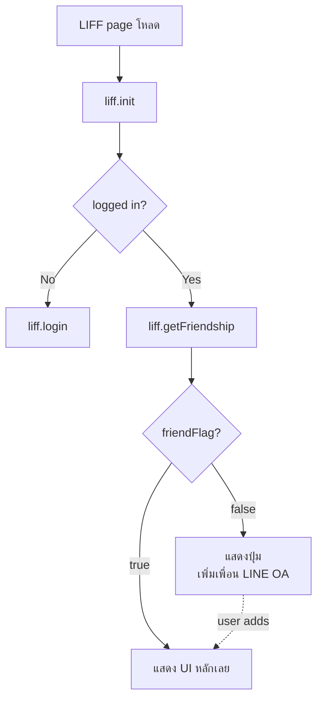
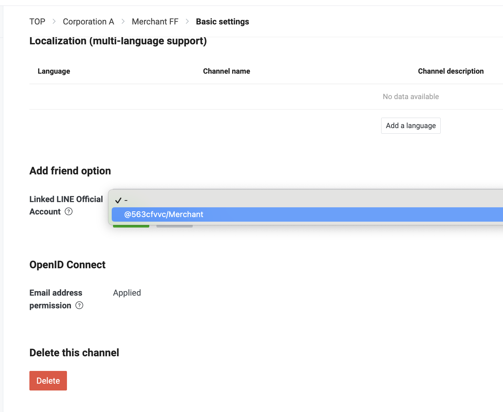
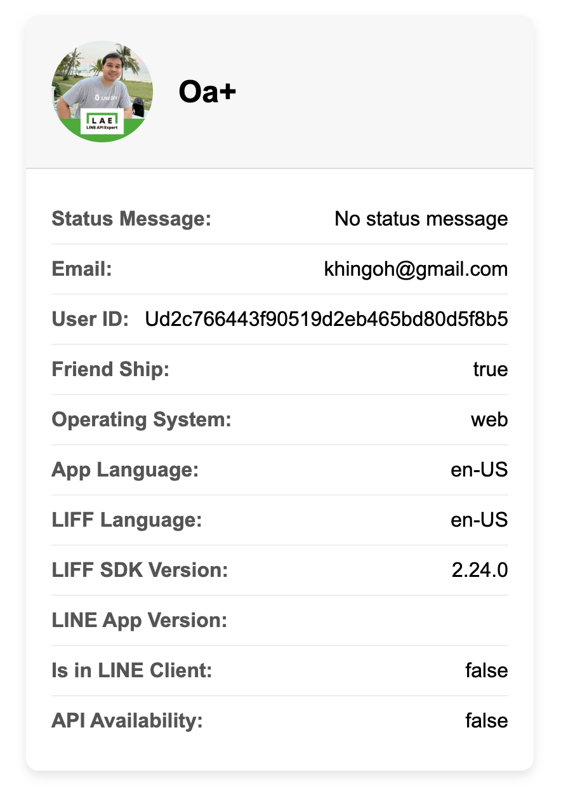

# Workshop: LIFF Get Friendship — เช็คว่าผู้ใช้เป็น "เพื่อน" กับบอทหรือยัง

> เปิด LIFF แล้วอยากเชิญผู้ใช้ "เพิ่มเพื่อน LINE OA" เพื่อให้ส่ง push message ได้ภายหลัง — แต่ถ้าเขาเป็นเพื่อนอยู่แล้วจะแสดงปุ่มก็เก้อ ใช้ `liff.getFriendship()` เช็คก่อน แล้วซ่อนปุ่มอัตโนมัติเมื่อจำเป็น

## ทำไมต้องรู้เรื่องนี้?

บอท LINE จะส่ง **Push Message** หาผู้ใช้ได้เฉพาะคนที่เป็น **เพื่อน** ของ LINE OA — ถ้าผู้ใช้แค่ใช้ LIFF แต่ยังไม่กดเพิ่มเพื่อน บอทจะส่งข้อความให้ไม่ได้

`liff.getFriendship()` เช็คได้ใน LIFF page ว่า:
- ผู้ใช้คนนี้เป็นเพื่อน LINE OA นี้แล้วหรือยัง?
- ถ้ายัง — แสดงปุ่ม "เพิ่มเพื่อน" หรือ QR code
- ถ้าเป็นแล้ว — ข้ามขั้นตอน, ไป UI หลักเลย

**ความจำเป็น**: LINE OA ต้องถูก **link** เข้ากับ LINE Login channel เดียวกับ LIFF — ไม่งั้น API นี้ใช้ไม่ได้

## ภาพรวม



## ตัวอย่าง Code (Vue.js)

### Step 1: เปิดการเชื่อมต่อ LINE OA Channel

ใน LINE Developers Console ที่ LINE Login channel → tab **Linked OA** → ผูก LINE OA เข้ากับ Login channel

<p align="center" width="100%">
    
</p>

### Step 2: Copy Code จาก LIFF starter

<p align="center" width="100%">
    
</p>

### Step 3: Component เต็ม (Vue.js)

```javascript
<template>
  <div class="profile-card" v-if="profile">
    <div class="profile-header">
      
      <h2 class="profile-name">{{ profile.displayName }}</h2>
    </div>
    <div class="profile-body">
      <div class="profile-item">
        <span class="label">Status Message:</span>
        <span>{{ profile.statusMessage || 'No status message' }}</span>
      </div>
      <div class="profile-item">
        <span class="label">Email:</span>
        <span>{{ email || 'No email available' }}</span>
      </div>
      <div class="profile-item">
        <span class="label">User ID:</span>
        <span>{{ profile.userId }}</span>
      </div>
      <div class="profile-item">
        <span class="label">Friend Ship:</span>
        <span>{{ friendShip.friendFlag }}</span>
      </div>
      <div class="profile-item">
        <span class="label">Operating System:</span>
        <span>{{ os }}</span>
      </div>
      <div class="profile-item">
        <span class="label">App Language:</span>
        <span>{{ appLanguage }}</span>
      </div>
      <div class="profile-item">
        <span class="label">LIFF Language:</span>
        <span>{{ liffLanguage }}</span>
      </div>
      <div class="profile-item">
        <span class="label">LIFF SDK Version:</span>
        <span>{{ liffVersion }}</span>
      </div>
      <div class="profile-item">
        <span class="label">LINE App Version:</span>
        <span>{{ lineVersion }}</span>
      </div>
      <div class="profile-item">
        <span class="label">Is in LINE Client:</span>
        <span>{{ isInClient }}</span>
      </div>
      <div class="profile-item">
        <span class="label">API Availability:</span>
        <span>{{ isApiAvailable }}</span>
      </div>
    </div>
  </div>
</template>

<script>
import liff from "@line/liff";
export default {
  beforeCreate() {
    liff
      .init({
        liffId: import.meta.env.VITE_LIFF_ID
      })
      .then(() => {
        this.message = "LIFF init succeeded.";
      })
      .catch((e) => {
        this.message = "LIFF init failed.";
        this.error = `${e}`;
      });
  },
  data() {
    return {
      profile: null,
      friendShip: null,
      email: null,
      os: null,
      appLanguage: null,
      liffLanguage: null,
      liffVersion: null,
      lineVersion: null,
      isInClient: null,
      isApiAvailable: null,
      message: "",
      error: ""
    };
  },
  async mounted() {
    await this.checkLiffLogin()
  },
  methods: {
    async checkLiffLogin() {
      await liff.ready.then(async () => {
        if (!liff.isLoggedIn()) {
          liff.login({ redirectUri: window.location })
        } else {
          const profile = await liff.getProfile();
          this.profile = profile;
          this.friendShip = await liff.getFriendship()

          // ดึงข้อมูลอีเมล (ต้องเปิด scope email)
          const idToken = liff.getDecodedIDToken();
          this.email = idToken.email;

          // ดึงข้อมูลต่าง ๆ ของ LIFF
          this.os = liff.getOS();
          this.appLanguage = liff.getAppLanguage();
          this.liffLanguage = liff.getLanguage();
          this.liffVersion = liff.getVersion();
          this.lineVersion = liff.getLineVersion();
          this.isInClient = liff.isInClient();
          this.isApiAvailable = liff.isApiAvailable('shareTargetPicker');
        }
      })
    },
  },
};
</script>

<style scoped>
.profile-card {
  max-width: 400px;
  margin: 20px auto;
  background-color: #ffffff;
  border-radius: 10px;
  box-shadow: 0 4px 8px rgba(0, 0, 0, 0.1);
  overflow: hidden;
  font-family: 'Arial', sans-serif;
}
.profile-header {
  display: flex;
  align-items: center;
  padding: 20px;
  background-color: #f7f7f7;
  border-bottom: 1px solid #ddd;
}
.profile-pic {
  border-radius: 50%;
  width: 80px;
  height: 80px;
  margin-right: 20px;
}
.profile-name {
  font-size: 24px;
  margin: 0;
}
.profile-body { padding: 20px; }
.profile-item {
  display: flex;
  justify-content: space-between;
  padding: 10px 0;
  border-bottom: 1px solid #eee;
}
.profile-item:last-child { border-bottom: none; }
.label { font-weight: bold; color: #555; }

@media (max-width: 600px) {
  .profile-card { padding: 10px; }
  .profile-header { flex-direction: column; align-items: center; text-align: center; }
  .profile-pic { margin: 0 0 10px 0; }
  .profile-name { font-size: 20px; }
}
</style>
```

## API Reference: `liff.getFriendship()`

Return value:
```typescript
{
  friendFlag: boolean  // true = ผู้ใช้เป็นเพื่อนกับ LINE OA แล้ว
}
```

### วัตถุประสงค์

ตรวจสอบว่าผู้ใช้คนปัจจุบันได้เพิ่ม LINE OA ที่เชื่อมโยงกับ LIFF app นี้เป็นเพื่อนแล้วหรือยัง

### Use case ที่นิยม

- **แสดงปุ่ม "เพิ่มเพื่อน LINE OA"** เฉพาะคนที่ยังไม่เป็นเพื่อน
- **ปลดล็อกฟีเจอร์** เช่น push notification, แต้มสะสม เฉพาะเพื่อน
- **เก็บสถิติ conversion** ว่ามีกี่ % ของผู้ใช้ LIFF เป็นเพื่อน OA

## เงื่อนไขสำคัญที่ต้องทำก่อนใช้

ขั้นตอนต้องทำใน LINE Developers Console:

1. ไปที่ **LINE Login channel** ที่สร้าง LIFF app
2. ใน tab **Basic settings** → ส่วน **Linked OA**
3. กดปุ่ม **Link** เลือก LINE Official Account ที่ต้องการ
4. ถ้าไม่ link → `getFriendship()` จะ throw error

**ตัวอย่างการใช้งานเชิญเพิ่มเพื่อน:**

```javascript
const { friendFlag } = await liff.getFriendship();
if (!friendFlag) {
  // แสดงปุ่ม / link เพิ่มเพื่อน
  showAddFriendButton();
} else {
  // ไป UI หลัก
  showMainUI();
}
```

ปุ่ม "เพิ่มเพื่อน" สามารถ link ไปที่:
```
https://line.me/R/ti/p/{botBasicId}
```

## ข้อผิดพลาดที่มักเจอ

- **พลาด:** เรียก `getFriendship()` แล้ว throw error "LINE OA not linked"
  **ถูก:** ไป LINE Developers Console → LINE Login channel → Basic settings → Linked OA → กด Link

- **พลาด:** ใช้ `friendFlag` แต่ลืมว่ามันคืน Promise — เช็คเป็น `if (await liff.getFriendship())` (เป็น object ที่ truthy เสมอ)
  **ถูก:** ดึง field `friendFlag` ออกก่อน — `const { friendFlag } = await liff.getFriendship()` แล้วค่อยเช็ค

- **พลาด:** เรียก `getFriendship()` ก่อน `liff.isLoggedIn()` ผ่าน — ได้ error
  **ถูก:** ต้อง login ผ่านก่อนเสมอ — ใช้ pattern: `liff.ready` → `liff.isLoggedIn()` → ถ้าไม่ใช่ login → ค่อยเรียก API

- **พลาด:** เก็บ `friendFlag` ใน state แล้วไม่ refresh — ผู้ใช้กดเพิ่มเพื่อนแล้วยังเห็นปุ่ม
  **ถูก:** เรียก `getFriendship()` ใหม่หลัง user กลับมาจากหน้าเพิ่มเพื่อน หรือใช้ `visibilitychange` event

- **พลาด:** ใช้ `getDecodedIDToken().email` แต่ได้ `null`
  **ถูก:** ต้องเปิด scope `email` ใน LINE Login channel + กด consent จาก user — ถ้าไม่เปิด scope จะไม่มี email field

## Checklist ก่อนไปต่อ

- [ ] LINE Login channel link กับ LINE OA ใน Console แล้ว
- [ ] เรียก `getFriendship()` หลัง `isLoggedIn()` ผ่าน
- [ ] อ่านค่าจาก `friendFlag` (ไม่ใช่ object ทั้งก้อน)
- [ ] มี UX สำรอง — ถ้าไม่เป็นเพื่อน แสดงปุ่ม / QR เพิ่มเพื่อน
- [ ] เปิด scope `email` ก่อน (ถ้าจะดึง email จาก ID token)

## อ้างอิง

- [liff.getFriendship() — LIFF API Reference](https://developers.line.biz/en/reference/liff/#get-friendship)
- [Linking LINE Official Account to LINE Login channel](https://developers.line.biz/en/docs/messaging-api/getting-started/#using-oa-manager)
- [LIFF Get Profile (ก่อนหน้า)](./09-03.liff-get-profile.md)
