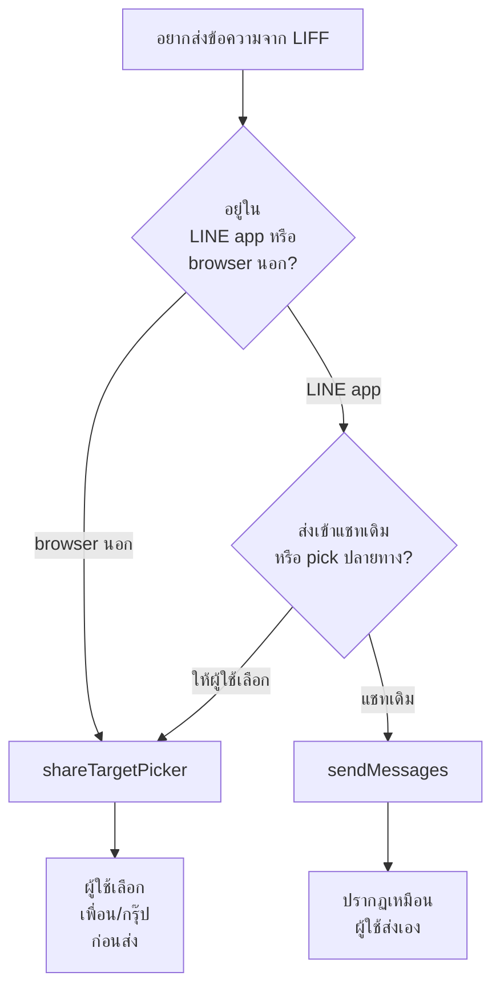
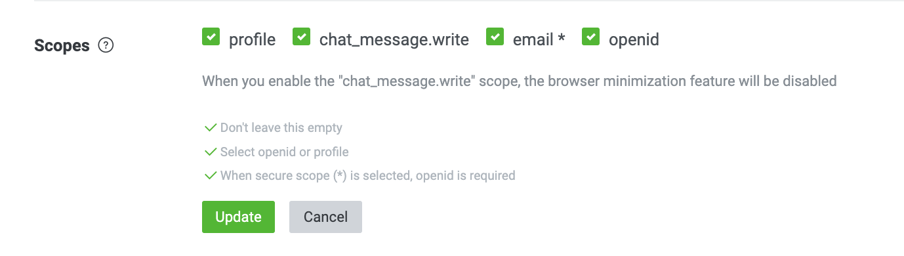
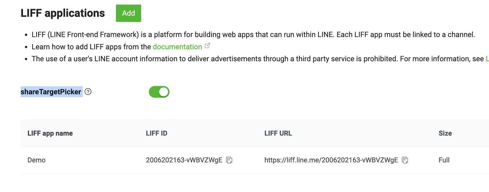

# Workshop: LIFF Sending Message — ส่งข้อความจาก LIFF กลับเข้าแชท

> ลูกค้าเปิด LIFF กรอกฟอร์มเสร็จ → คุณอยากให้ "บอทสรุปคำสั่งซื้อ" ส่งกลับมาในแชทอัตโนมัติ — มี 2 API ใน LIFF ที่ทำได้: **`sendMessages()`** ส่งเข้าแชทที่เปิด LIFF อยู่ กับ **`shareTargetPicker()`** ให้ผู้ใช้เลือกแชทปลายทางเอง — เลือกใช้ตาม use case

## ทำไมต้องรู้เรื่องนี้?

LIFF เปรียบเหมือน "หน้าเว็บที่อาศัยใน LINE" — ดี แต่ผู้ใช้ปิดหน้านี้ไปแล้วก็จบ ถ้าอยากให้บอทตามต่อใน chat (เช่น ตอบรับคำสั่ง, สร้าง order) ต้องส่งข้อความกลับเข้าแชท

มี 2 ทาง:
- **`liff.sendMessages()`** — ส่งเข้าแชทที่ผู้ใช้เปิด LIFF อยู่ (1-on-1 หรือ group ที่ LIFF ถูกเปิด) — **ข้อความจะเหมือนผู้ใช้พิมพ์เอง**
- **`liff.shareTargetPicker()`** — เปิด picker ให้ผู้ใช้เลือกเพื่อน/กรุ๊ปปลายทาง แล้วค่อยส่ง

แต่ละ API มีข้อจำกัดเยอะ — บทนี้รวบรวมเงื่อนไขและ gotchas ทั้งหมด

## ภาพรวม: เลือกใช้ตัวไหน?



## 1) `liff.sendMessages()`

<p align="center" width="100%">
    
</p>

ใช้ส่งข้อความจาก LIFF app ไปยัง LINE chat ที่ผู้ใช้เปิด LIFF app นั้นอยู่

### เงื่อนไขทั้งหมด (ครบทุกข้อถึงจะใช้งานได้)

| เงื่อนไข | รายละเอียด |
|---------|-----------|
| **Login** | ต้อง `liff.isLoggedIn()` ผ่าน — ถ้ายังไม่ login เรียก `liff.login()` ก่อน |
| **In-Client เท่านั้น** | ต้อง `liff.isInClient()` คืน `true` — ใช้ใน external browser **ไม่ได้** |
| **Scope** | ต้องเปิด `chat_message.write` ใน Console + ผู้ใช้ consent |
| **Max messages** | สูงสุด **5 ข้อความต่อครั้ง** |

### ประเภทข้อความที่ส่งได้

| Type | ข้อจำกัดพิเศษ |
|------|--------------|
| Text | ไม่รองรับ `emojis` และ `quoteToken` |
| Sticker | ไม่รองรับ `quoteToken` |
| Image | — |
| Video | ไม่รองรับ `trackingId` |
| Audio | — |
| Location | — |
| Template | ตั้ง action ได้เฉพาะ **URI action** |
| Flex Message | ตั้ง action ได้เฉพาะ **URI action** |

### Webhook behavior (สำคัญ!)

| ข้อความที่ส่ง | บอทได้รับ Webhook? |
|------------|------------------|
| text, image, video, audio, location, sticker | **ได้รับ** (image/video/audio จะมี `contentProvider.type: "external"`) |
| Template message | **ไม่ได้รับ** |
| Flex Message | **ไม่ได้รับ** |

### ข้อจำกัดเพิ่มเติม

ใช้งาน `sendMessages()` ไม่ได้ในกรณีต่อไปนี้:
- เข้าผ่าน **Keep Memo** feature
- เข้าผ่าน LIFF URL scheme ที่ redirect จากเว็บไซต์ภายนอก
- scope `chat_message.write` ถูกปิดหลัง LIFF-to-LIFF transition
- LIFF reload จาก "recently used services" ใน multi-tab view (ต้องเปิดจาก LIFF URL ในห้องแชทใหม่)

---

## 2) `liff.shareTargetPicker()`

<p align="center" width="100%">
    
</p>

ใช้เปิด picker ให้ผู้ใช้ **เลือกเพื่อน/กรุ๊ปปลายทาง** แล้วส่งข้อความ — ปรากฏเหมือนผู้ใช้ส่งเอง

### เงื่อนไข

| เงื่อนไข | รายละเอียด |
|---------|-----------|
| **Login** | ต้อง `liff.isLoggedIn()` ผ่าน |
| **Console setting** | เปิดใช้ Share Target Picker ใน LINE Developers Console |
| **Environment** | ใช้ได้ทั้ง **LINE Client** และ **External Browser** (ต่างจาก sendMessages) |
| **Multiple recipients** | กำหนด `options.isMultiple` (default: `true`) — `false` = เลือกได้คนเดียว |
| **OpenChat** | **ไม่รวม** OpenChat ใน list |

### ประเภทข้อความที่ส่งได้ (เกือบเหมือน sendMessages แต่ไม่มี Sticker)

| Type | ข้อจำกัดพิเศษ |
|------|--------------|
| Text | ไม่รองรับ `emojis` และ `quoteToken` |
| Image | — |
| Video | ไม่รองรับ `trackingId` |
| Audio | — |
| Location | — |
| Template | URI action เท่านั้น |
| Flex | URI action เท่านั้น |

### หมายเหตุ External Browser

เมื่อใช้ใน mobile external browser อาจขึ้นหน้าจอ login ด้วย email/password ก่อน (ต้องมี SSO session) — ถ้าผู้ใช้ login ผ่าน LINE app ปกติอย่างเดียวจะไม่มี SSO บน browser

### ความเป็นส่วนตัว

LINE **ไม่เก็บ** จำนวนผู้รับที่ผู้ใช้ส่งข้อความผ่าน share target picker

---

## สรุปเปรียบเทียบ

| รายการ | `sendMessages()` | `shareTargetPicker()` |
|--------|----------------|---------------------|
| ปลายทาง | แชทที่เปิด LIFF อยู่ | ผู้ใช้เลือกเพื่อน/กรุ๊ป |
| Environment | LINE Client เท่านั้น | LINE Client + External Browser |
| Scope ที่ต้อง | `chat_message.write` | (เปิดใน Console) |
| ปรากฏเป็นใคร | ผู้ใช้ส่งเอง | ผู้ใช้ส่งเอง |
| Webhook | ขึ้นกับ type | (ไม่เกี่ยว — ส่งให้ผู้รับโดยตรง) |
| Sticker | ส่งได้ | ส่งไม่ได้ |
| Max messages | 5 | 5 |

---

## ตัวอย่าง Code (Vue.js เต็ม)

```javascript
<template>
  <div class="profile-card" v-if="profile">
    <div class="profile-header">
      
      <h2 class="profile-name">{{ profile.displayName }}</h2>
    </div>
    <div class="profile-body">
      <div class="profile-item">
        <span class="label">User ID:</span>
        <span>{{ profile.userId }}</span>
      </div>
      <div class="profile-item">
        <span class="label">Friend Ship:</span>
        <span>{{ friendShip }}</span>
      </div>
      <div class="profile-item">
        <span class="label">Is in LINE Client:</span>
        <span>{{ isInClient }}</span>
      </div>
    </div>

    <div class="button-group">
      <!-- ปุ่ม sendMessages: แสดงเมื่ออยู่ใน LINE Client เท่านั้น -->
      <button v-if="isShowSendMessage" @click="sendMessage" class="btn">Send Message</button>
      <button @click="openWindowModule" class="btn">Open Window</button>
    </div>
    <div class="button-group">
      <!-- ปุ่ม share: ใช้ได้ทุกที่ -->
      <button @click="shareMessage" class="btn">Share via LINE</button>
    </div>
  </div>
</template>

<script>
import liff from "@line/liff";

export default {
  beforeCreate() {
    liff
      .init({ liffId: import.meta.env.VITE_LIFF_ID })
      .then(() => { this.message = "LIFF init succeeded."; })
      .catch((e) => {
        this.message = "LIFF init failed.";
        this.error = `${e}`;
      });
  },
  data() {
    return {
      profile: null,
      friendShip: null,
      isInClient: null,
      isApiAvailable: null,
      isShowSendMessage: false,
      message: "",
      error: ""
    };
  },
  async mounted() {
    await this.checkLiffLogin();
  },
  methods: {
    async checkLiffLogin() {
      await liff.ready.then(async () => {
        if (!liff.isLoggedIn()) {
          liff.login({ redirectUri: window.location });
        } else {
          this.profile = await liff.getProfile();
          const friendShip = await liff.getFriendship();
          this.friendShip = friendShip.friendFlag;
          this.isInClient = liff.isInClient();
          if (liff.isInClient()) this.isShowSendMessage = true;
          this.isApiAvailable = liff.isApiAvailable('shareTargetPicker');
        }
      });
    },

    async openWindowModule() {
      liff.openWindow({ url: "https://line.me", external: true });
    },

    // sendMessages: ใช้ได้ใน LINE Client เท่านั้น
    async sendMessage() {
      if (this.isInClient) {
        try {
          await liff.sendMessages([
            { type: 'text', text: 'This is a message from LIFF!' }
          ]);
          alert('Message sent!');
          await liff.closeWindow();
        } catch (error) {
          console.error('Error sending message:', error);
          alert('Failed to send message.');
        }
      }
    },

    // shareTargetPicker: ใช้ได้ทุกที่
    async shareMessage() {
      try {
        if (liff.isApiAvailable('shareTargetPicker')) {
          const options = { isMultiple: true };  // false = เลือกผู้รับได้คนเดียว
          await liff.shareTargetPicker([
            { type: 'text', text: 'Check this out!' },
            {
              type: "flex",
              altText: "Flex Message",
              contents: {
                type: "bubble",
                hero: {
                  type: "image",
                  url: this.profile.pictureUrl,
                  size: "full",
                  aspectRatio: "1:1",
                  aspectMode: "cover"
                },
                body: {
                  type: "box",
                  layout: "vertical",
                  contents: [
                    {
                      type: "text",
                      text: this.profile.displayName,
                      weight: "bold",
                      size: "xl",
                      align: "center",
                      margin: "md"
                    },
                    {
                      type: "box",
                      layout: "vertical",
                      margin: "lg",
                      spacing: "sm",
                      contents: [
                        {
                          type: "box",
                          layout: "baseline",
                          spacing: "sm",
                          contents: [
                            { type: "text", text: "User ID:", color: "#aaaaaa", size: "sm", flex: 2 },
                            { type: "text", text: this.profile.userId, wrap: true, color: "#666666", size: "sm", flex: 4 }
                          ]
                        }
                      ]
                    }
                  ]
                }
              }
            }
          ], options);
          console.log("ShareTargetPicker was launched");
        }
      } catch (error) {
        console.error('Error sharing message:', error);
        alert('Failed to share message.');
      }
    }
  }
};
</script>

<style scoped>
.profile-card {
  max-width: 400px;
  margin: 20px auto;
  background-color: #ffffff;
  border-radius: 10px;
  box-shadow: 0 4px 8px rgba(0, 0, 0, 0.1);
  overflow: hidden;
  font-family: 'Arial', sans-serif;
}
.profile-header {
  display: flex;
  align-items: center;
  padding: 20px;
  background-color: #f7f7f7;
  border-bottom: 1px solid #ddd;
}
.profile-pic { border-radius: 50%; width: 80px; height: 80px; margin-right: 20px; }
.profile-name { font-size: 24px; margin: 0; }
.profile-body { padding: 20px; }
.profile-item { display: flex; justify-content: space-between; padding: 10px 0; border-bottom: 1px solid #eee; }
.profile-item:last-child { border-bottom: none; }
.label { font-weight: bold; color: #555; }
.button-group { margin-top: 20px; display: flex; justify-content: space-between; padding: 0 20px 20px; }
.btn { padding: 10px 20px; background-color: #00c300; color: white; border: none; border-radius: 5px; cursor: pointer; }
.btn:hover { background-color: #009e00; }

@media (max-width: 600px) {
  .profile-header { flex-direction: column; align-items: center; text-align: center; }
  .profile-pic { margin: 0 0 10px 0; }
  .profile-name { font-size: 20px; }
}
</style>
```

## ข้อผิดพลาดที่มักเจอ

- **พลาด:** เรียก `sendMessages()` ใน external browser แล้ว error
  **ถูก:** เช็ค `liff.isInClient()` ก่อน — ถ้า `false` ใช้ `shareTargetPicker()` แทน

- **พลาด:** ส่ง Flex Message ผ่าน `sendMessages()` แล้ว webhook ไม่เด้ง — งงทำไมบอทไม่รู้
  **ถูก:** Flex/Template ส่งผ่าน `sendMessages()` **ไม่มี webhook** — ออกแบบใหม่: ส่งเป็น text แทน หรือยิง backend API ก่อนปิด LIFF

- **พลาด:** ใส่ postback action ใน Flex แล้วใช้กับ `sendMessages()` แต่ไม่ทำงาน
  **ถูก:** ใน LIFF อนุญาตเฉพาะ **URI action** — เปลี่ยนเป็น `uri` action ที่ link ไปยัง deep link ของบอท

- **พลาด:** ลืมเปิด scope `chat_message.write` แล้วเรียก `sendMessages()` ได้ error
  **ถูก:** Console → LINE Login channel → LIFF tab → เลือก scope `chat_message.write` + revoke session ของ user เก่า

- **พลาด:** Reload LIFF แล้ว `sendMessages()` หยุดทำงาน
  **ถูก:** หลัง reload จาก multi-tab view scope หาย — บอกผู้ใช้ให้เปิด LIFF URL ใหม่จากในแชท

- **พลาด:** ลืมว่า `shareTargetPicker` ส่ง sticker ไม่ได้ ใส่ sticker เข้าไปแล้ว 400
  **ถูก:** sticker เฉพาะ `sendMessages()` เท่านั้น — `shareTargetPicker` ใช้ได้แค่ text/image/video/audio/location/template/flex

- **พลาด:** OpenChat อยากให้ผู้ใช้ share ไป OpenChat ของชุมชนแต่เลือกไม่ได้
  **ถูก:** `shareTargetPicker` **ไม่รวม** OpenChat — ทำได้แค่ generate URL คุยใน LIFF เอง

## Checklist ก่อนไปต่อ

- [ ] เลือก API ถูก: `sendMessages` สำหรับแชทเดิม / `shareTargetPicker` สำหรับให้ผู้ใช้เลือก
- [ ] เปิด scope `chat_message.write` ก่อนใช้ `sendMessages`
- [ ] เช็ค `isInClient()` และ `isApiAvailable()` ก่อนเรียก
- [ ] ถ้าใช้ Flex/Template — ใช้ URI action เท่านั้น
- [ ] รับรู้ว่า Flex/Template ผ่าน `sendMessages` **ไม่มี webhook** กลับ
- [ ] มี try/catch รอบทุก API call เผื่อ user cancel

## หมายเหตุ

When the `chat_message.write` scope is disabled after the LIFF-to-LIFF transition. For more information, see "About the chat_message.write scope after transitioning between LIFF apps" in the LIFF documentation.

## อ้างอิง

- [liff.sendMessages() — LIFF Reference](https://developers.line.biz/en/reference/liff/#send-messages)
- [liff.shareTargetPicker() — LIFF Reference](https://developers.line.biz/en/reference/liff/#share-target-picker)
- [LIFF Scopes documentation](https://developers.line.biz/en/docs/liff/registering-liff-apps/#scopes)
