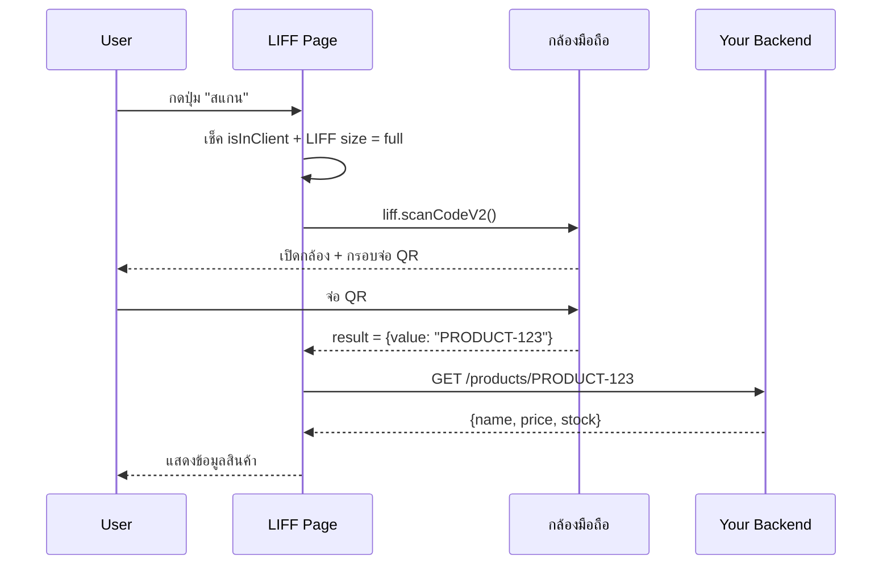

# Workshop: LIFF Scan QR Code — สแกน QR/Barcode จากกล้องในหน้า LIFF

> ลูกค้าเดินเข้าร้าน → เปิด LIFF ของคุณ → กดปุ่ม "สแกน" → จ่อกล้องที่ QR บนสินค้า → ระบบรู้ทันทีว่าคือสินค้าไหน + ดึง stock มาแสดง — `liff.scanCodeV2()` ทำให้ใช้กล้องในมือถือผู้ใช้สแกน QR/Barcode ได้โดยไม่ต้องสร้าง native app

## ทำไมต้องรู้เรื่องนี้?

แต่ก่อนการสแกน QR ต้องเขียน native app หรือใช้ JS library เช่น zxing/quagga ที่ต้องขอ permission กล้อง + ตั้ง HTTPS เอง — ยุ่งยาก

`liff.scanCodeV2()` ช่วยให้คุณ:
- เปิดกล้องสแกน QR/Barcode ในหน้า LIFF
- ได้ผลกลับเป็น string `value`
- ผู้ใช้ไม่ต้องติดตั้งแอพอะไรเพิ่ม — ใช้ใน LINE app เลย

**Use case นิยม**
- สแกน QR สินค้าเพื่อเช็คราคา/stock
- สแกน QR โต๊ะที่ร้านอาหารเพื่อเปิดเมนู
- สแกนคูปอง/ตั๋วที่ออกโดยร้านค้าอื่น
- เช็คอิน event ที่จุดต่างๆ ด้วย QR ประจำจุด

## ภาพรวม



## เงื่อนไขการใช้งาน `liff.scanCodeV2()`

| รายการ | เวอร์ชันขั้นต่ำ |
|-------|---------------|
| LIFF SDK | **v2.15.0** หรือใหม่กว่า |
| LIFF size | ต้องเป็น **Full** (compact/tall ใช้ไม่ได้) |
| LINE app | **v11.7.0** หรือใหม่กว่า |
| iOS | **14.3** หรือใหม่กว่า (เก่ากว่านี้ใช้ใน LIFF browser ไม่ได้) |
| Android | ทุก version |
| External browser | ต้องรองรับ **WebRTC** |

### ตารางความสามารถ (LIFF browser vs External browser)

| OS | Version | LIFF browser | External browser |
|----|---------|--------------|------------------|
| iOS | 11–14.2 | ใช้ไม่ได้ | ใช้ได้ * |
| iOS | 14.3 ขึ้นไป | ใช้ได้ ** | ใช้ได้ * |
| Android | ทุก version | ใช้ได้ ** | ใช้ได้ * |
| PC | ทุก version | ใช้ไม่ได้ | ใช้ได้ * |

\* External browser ต้องรองรับ WebRTC API — ตรวจสอบที่ [What Web Can Do Today](https://whatwebcando.today/) ในหัวข้อ "Real-Time Communication"

\** LIFF browser ใช้ได้เมื่อตั้ง LIFF size = **Full** เท่านั้น

## ตัวอย่างใช้งานสั้นๆ

```javascript
async function openQRCodeModule() {
  if (liff.isInClient()) {
    try {
      const result = await liff.scanCodeV2();
      // result = { value: "ข้อความใน QR" }
      console.log('Scanned:', result.value);
      alert(JSON.stringify(result));
    } catch (error) {
      console.log('error', error);
    }
  }
}
```

## ตัวอย่าง Code (Vue.js เต็ม)

```javascript
<template>
  <div class="profile-card" v-if="profile">
    <div class="profile-header">
      
      <h2 class="profile-name">{{ profile.displayName }}</h2>
    </div>
    <div class="profile-body">
      <div class="profile-item">
        <span class="label">User ID:</span>
        <span>{{ profile.userId }}</span>
      </div>
      <div class="profile-item">
        <span class="label">Is in LINE Client:</span>
        <span>{{ isInClient }}</span>
      </div>
      <div class="profile-item">
        <span class="label">API Availability:</span>
        <span>{{ isApiAvailable }}</span>
      </div>
    </div>

    <div class="button-group">
      <button v-if="isShowSendMessage" @click="sendMessage" class="btn">Send Message</button>
      <button @click="openWindowModule" class="btn">Open Window</button>
    </div>
    <div class="button-group">
      <button @click="shareMessage" class="btn">Share via LINE</button>
      <!-- ปุ่มสแกน QR — แสดงเมื่ออยู่ใน LINE Client -->
      <button v-if="isShowSendMessage" @click="openQRCodeModule" class="btn">Scan QR</button>
    </div>
  </div>
</template>

<script>
import liff from "@line/liff";

export default {
  beforeCreate() {
    liff
      .init({ liffId: import.meta.env.VITE_LIFF_ID })
      .then(() => { this.message = "LIFF init succeeded."; })
      .catch((e) => {
        this.message = "LIFF init failed.";
        this.error = `${e}`;
      });
  },
  data() {
    return {
      profile: null,
      isInClient: null,
      isApiAvailable: null,
      isShowSendMessage: false,
      message: "",
      error: ""
    };
  },
  async mounted() { await this.checkLiffLogin(); },
  methods: {
    async checkLiffLogin() {
      await liff.ready.then(async () => {
        if (!liff.isLoggedIn()) {
          liff.login({ redirectUri: window.location });
        } else {
          this.profile = await liff.getProfile();
          this.isInClient = liff.isInClient();
          if (liff.isInClient()) this.isShowSendMessage = true;
          this.isApiAvailable = liff.isApiAvailable('shareTargetPicker');
        }
      });
    },

    async openWindowModule() {
      liff.openWindow({ url: "https://line.me", external: true });
    },

    // ฟังก์ชันสแกน QR Code
    async openQRCodeModule() {
      if (this.isInClient) {
        try {
          const result = await liff.scanCodeV2();
          alert(JSON.stringify(result));
          // result.value = ข้อความที่ถูกสแกน
        } catch (error) {
          console.log('error', error);
        }
      }
    },

    async sendMessage() {
      if (this.isInClient) {
        try {
          await liff.sendMessages([
            { type: 'text', text: 'This is a message from LIFF!' }
          ]);
          alert('Message sent!');
          await liff.closeWindow();
        } catch (error) {
          console.error('Error sending message:', error);
          alert('Failed to send message.');
        }
      }
    },

    async shareMessage() {
      try {
        if (liff.isApiAvailable('shareTargetPicker')) {
          const options = { isMultiple: true };
          await liff.shareTargetPicker([
            { type: 'text', text: 'Check this out!' }
          ], options);
          console.log("ShareTargetPicker was launched");
        }
      } catch (error) {
        console.error('Error sharing message:', error);
        alert('Failed to share message.');
      }
    }
  }
};
</script>

<style scoped>
.profile-card {
  max-width: 400px;
  margin: 20px auto;
  background-color: #ffffff;
  border-radius: 10px;
  box-shadow: 0 4px 8px rgba(0, 0, 0, 0.1);
  overflow: hidden;
  font-family: 'Arial', sans-serif;
}
.profile-header {
  display: flex;
  align-items: center;
  padding: 20px;
  background-color: #f7f7f7;
  border-bottom: 1px solid #ddd;
}
.profile-pic { border-radius: 50%; width: 80px; height: 80px; margin-right: 20px; }
.profile-name { font-size: 24px; margin: 0; }
.profile-body { padding: 20px; }
.profile-item { display: flex; justify-content: space-between; padding: 10px 0; border-bottom: 1px solid #eee; }
.profile-item:last-child { border-bottom: none; }
.label { font-weight: bold; color: #555; }
.button-group { margin-top: 20px; display: flex; justify-content: space-between; padding: 0 20px 20px; }
.btn { padding: 10px 20px; background-color: #00c300; color: white; border: none; border-radius: 5px; cursor: pointer; }
.btn:hover { background-color: #009e00; }

@media (max-width: 600px) {
  .profile-header { flex-direction: column; align-items: center; text-align: center; }
  .profile-pic { margin: 0 0 10px 0; }
  .profile-name { font-size: 20px; }
}
</style>
```

## Recipe: Scan แล้ว Route ไปหน้าต่างๆ

แทนที่จะสแกนแล้วแค่แสดง alert — ใช้ผลที่สแกนมา route ผู้ใช้ไปหน้าที่ตรงกับ QR

```javascript
async function scanAndRoute() {
  if (!liff.isInClient()) {
    alert('กรุณาเปิดในแอป LINE เพื่อใช้กล้อง');
    return;
  }

  try {
    const { value } = await liff.scanCodeV2();

    // กำหนด pattern ของ QR ที่รองรับ
    if (value.startsWith('PRODUCT-')) {
      const id = value.slice('PRODUCT-'.length);
      window.location.href = `/products/${id}`;
    } else if (value.startsWith('TABLE-')) {
      const tableId = value.slice('TABLE-'.length);
      window.location.href = `/menu?table=${tableId}`;
    } else if (value.startsWith('https://')) {
      // QR เป็น URL ปกติ
      liff.openWindow({ url: value, external: false });
    } else {
      alert('QR Code นี้ไม่รองรับ');
    }
  } catch (error) {
    console.error('Scan failed:', error);
    alert('สแกนไม่สำเร็จ ลองอีกครั้ง');
  }
}
```

## ข้อผิดพลาดที่มักเจอ

- **พลาด:** เปิดสแกนใน LIFF size = `compact` หรือ `tall` แล้วได้ error
  **ถูก:** ตั้ง LIFF size เป็น **Full** ใน Console (LINE Developers → LIFF tab → Size: Full)

- **พลาด:** ใช้ใน external browser แล้วกล้องไม่เปิด
  **ถูก:** External browser ต้องรองรับ WebRTC + เป็น HTTPS — Safari mobile บาง version ไม่รองรับ ใช้ Chrome แทน

- **พลาด:** เปิดบน iOS 14.0–14.2 ใน LIFF browser แล้วใช้ไม่ได้
  **ถูก:** iOS ต้อง **14.3+** สำหรับ LIFF browser — ถ้าผู้ใช้ใช้ iOS เก่า แสดงข้อความบอกให้ update หรือเปิดใน external browser

- **พลาด:** ใช้ `liff.scanCode()` (ตัวเก่า v1) — ตอนนี้ deprecated แล้ว
  **ถูก:** ใช้ `liff.scanCodeV2()` (มี V2) ซึ่ง stable กว่าและ format result ต่างกัน

- **พลาด:** ผู้ใช้ปฏิเสธ permission กล้อง แล้วโค้ดไม่ handle error
  **ถูก:** ใช้ try/catch รอบ `scanCodeV2()` — แสดง message ที่เข้าใจง่ายเช่น "กรุณาอนุญาตการเข้าถึงกล้อง"

- **พลาด:** ใช้ผล `result` เป็น string โดยตรง — `result.toLowerCase()` error
  **ถูก:** result เป็น object `{ value: string }` — ต้อง destructure: `const { value } = await liff.scanCodeV2()`

- **พลาด:** สแกน barcode (1D) แต่ได้แค่ QR — งงทำไมไม่อ่าน
  **ถูก:** `scanCodeV2` รองรับ **QR Code, EAN-13, EAN-8, Code 128, Code 39** — ตรวจ format ของ barcode ที่ใช้งาน

- **พลาด:** ลืมตรวจ `liff.isApiAvailable('scanCodeV2')` ก่อน — บน PC error ไปเลย
  **ถูก:** เช็ค `isApiAvailable` ก่อนแสดงปุ่ม Scan — ถ้าไม่รองรับ ซ่อนปุ่มหรือบอก fallback

## Checklist ก่อนไปต่อ

- [ ] LIFF SDK ≥ 2.15.0 และ LIFF size = Full
- [ ] เช็ค `isInClient()` + `isApiAvailable('scanCodeV2')` ก่อนเรียก
- [ ] try/catch รอบ `scanCodeV2()` รองรับ user cancel/permission deny
- [ ] วาง strategy การ route หลังสแกน (URL pattern ของ QR)
- [ ] ทดสอบทั้ง iOS 14.3+, Android, External browser
- [ ] มี fallback ให้ผู้ใช้ที่ใช้ iOS เก่า

## อ้างอิง

- [liff.scanCodeV2() — LIFF API Reference](https://developers.line.biz/en/reference/liff/#scan-code-v2)
- [What Web Can Do Today](https://whatwebcando.today/)
- [LIFF browser size documentation](https://developers.line.biz/en/docs/liff/overview/#size-of-liff-browser)
