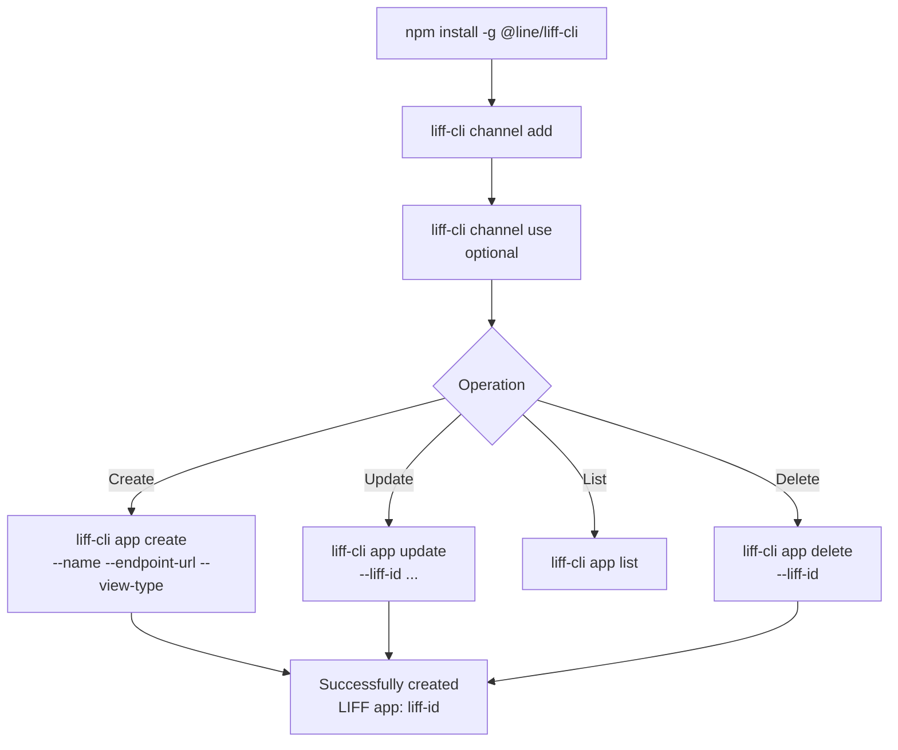

# Workshop: LIFF CLI — จัดการ LIFF App ด้วย Command Line

> สร้าง/แก้/ลบ LIFF app ทำในเว็บ Console ก็ได้ — แต่ถ้าทำหลายตัว หรืออยากใส่ใน CI/CD ตอน deploy เปลี่ยน endpoint URL อัตโนมัติ การคลิกในเว็บจะช้าและ error-prone **LIFF CLI** ช่วยทำทุกอย่างจาก Terminal scriptable ได้

<p align="center" width="100%">
    
</p>

## ทำไมต้องรู้เรื่องนี้?

LIFF app ทุกตัวมี **endpoint URL** ที่ผูกกับ LINE Login Channel — ปกติแก้ผ่านหน้าเว็บ developers.line.biz ทุกครั้ง แต่ปัญหาคือ:

- มี LIFF หลายตัว (dev, staging, prod) → ต้องสลับหน้าเว็บไปมา
- Deploy preview แต่ละ branch → endpoint URL เปลี่ยนทุกครั้ง
- ทีมหลายคน → คนนึงแก้ใน Console คนอื่นไม่รู้

**LIFF CLI** ช่วยให้:
- สร้าง/อัพเดท/ลบ LIFF จาก Terminal
- Script ใน CI/CD (GitHub Actions, Vercel) — เปลี่ยน endpoint อัตโนมัติทุก deploy
- เห็น diff ผ่าน git ว่าใครเปลี่ยนอะไร

## ภาพรวม



## Step 1: ติดตั้ง Node.js และ npm

ดาวน์โหลด Node.js ก่อน — แนะนำ **v20 หรือใหม่กว่า** จากนั้นเช็คเวอร์ชัน:

```shell
node --version    # ควรเห็น v20.x ขึ้นไป
npm --version
```

ถ้าเห็นตัวเลขเวอร์ชันโผล่มา = พร้อม

## Step 2: ติดตั้ง LIFF CLI

```shell
npm install -g @line/liff-cli
```

ติดตั้ง global เพื่อใช้คำสั่ง `liff-cli` ได้จากที่ไหนก็ได้

## Step 3: ผูก Channel กับ CLI

ก่อนใช้คำสั่งจัดการ LIFF ต้องผูก **LINE Login Channel** ก่อน — ใช้ Channel ID ที่ได้จาก Console:

```shell
liff-cli channel add 1234567890
```

CLI จะถาม Channel Secret — copy จาก Console มาวาง:

```
Channel Secret?: ********************************
# Channel 1234567890 is now added.
```

### ตั้งค่า Default Channel (optional แต่แนะนำ)

ให้ CLI จำว่า "default" Channel คือตัวไหน — จะได้ไม่ต้องใส่ `--channel-id` ทุกคำสั่ง:

```shell
liff-cli channel use 1234567890
# Channel 1234567890 is now selected.
```

## Step 4: Create LIFF App

```shell
liff-cli app create \
   --name "LIFF CLI Demo" \
   --endpoint-url https://mokmoon.com/ \
   --view-type full
# Successfully created LIFF app: 1234567890-AbcdEfgh
```

### Options

| Flag | ความหมาย | Required |
|------|---------|---------|
| `--channel-id` | Channel ID (ถ้ามี default แล้วไม่ต้องใส่) | optional |
| `--name` | ชื่อ LIFF app — **ห้ามมีคำว่า "LINE"** | required |
| `--endpoint-url` | URL ขึ้นต้นด้วย `https://` | required |
| `--view-type` | `full` / `tall` / `compact` | required |

ตรวจที่ LINE Login Channel ใน Console จะเห็น LIFF app ใหม่ปรากฏขึ้น:

<p align="center" width="100%">
    
</p>

## Step 5: Update LIFF App

แก้เฉพาะ field ที่ต้องการ — ที่ไม่ใส่จะเก็บค่าเดิม:

```shell
liff-cli app update \
   --liff-id 1234567890-Jv5mrQdE \
   --view-type tall
# Successfully updated LIFF app: 1234567890-Jv5mrQdE
```

### Options

| Flag | Required |
|------|---------|
| `--liff-id` | required |
| `--channel-id` | optional |
| `--name` | optional |
| `--endpoint-url` | optional |
| `--view-type` | optional |

<p align="center" width="100%">
    
</p>

## Step 6: List LIFF Apps

```shell
liff-cli app list
# LIFF apps:
# 1234567890-Jv5mrQdE: LIFF CLI Demo
```

## Step 7: Delete LIFF App

```shell
liff-cli app delete \
   --liff-id 1234567890-Jv5mrQdE \
   --channel-id 1234567890
# Deleting LIFF app...
# Successfully deleted LIFF app: 1234567890-Jv5mrQdE
```

## Recipe: ใช้ใน GitHub Actions / Vercel deploy

อัพเดท `endpoint-url` อัตโนมัติทุกครั้งที่ deploy preview ไปยัง Vercel:

```yaml
# .github/workflows/deploy.yml
name: Deploy & Update LIFF
on: [push]

jobs:
  deploy:
    runs-on: ubuntu-latest
    steps:
      - uses: actions/checkout@v4

      - name: Deploy to Vercel
        id: deploy
        run: |
          DEPLOY_URL=$(vercel --token=${{ secrets.VERCEL_TOKEN }} --prod)
          echo "url=$DEPLOY_URL" >> $GITHUB_OUTPUT

      - name: Install LIFF CLI
        run: npm install -g @line/liff-cli

      - name: Add LINE Channel
        run: |
          echo "${{ secrets.LINE_CHANNEL_SECRET }}" | \
            liff-cli channel add ${{ secrets.LINE_CHANNEL_ID }}

      - name: Update LIFF endpoint
        run: |
          liff-cli app update \
            --liff-id ${{ secrets.LIFF_ID }} \
            --endpoint-url ${{ steps.deploy.outputs.url }}
```

## ข้อผิดพลาดที่มักเจอ

- **พลาด:** ตั้งชื่อ LIFF ว่า "LINE Order" หรือ "My LINE App" → CLI return error
  **ถูก:** **ห้ามมีคำว่า "LINE"** ในชื่อ — ใช้ "LY Order" หรือ "Chat Order" แทน

- **พลาด:** ลืมตั้ง default channel แล้วลืมใส่ `--channel-id` ทุกครั้ง
  **ถูก:** รัน `liff-cli channel use {id}` หนึ่งครั้ง — CLI จะใช้ตัวนั้นเป็น default ตลอด

- **พลาด:** Endpoint URL เป็น `http://` (ไม่ใช่ HTTPS) → CLI reject
  **ถูก:** ใช้ `https://` เท่านั้น — ถ้า dev local ใช้ ngrok/cloudflared สร้าง HTTPS tunnel

- **พลาด:** Run จาก CI/CD แล้ว `channel add` ขึ้น prompt ถาม secret → CI ค้าง
  **ถูก:** ใช้ pipe จาก stdin — `echo $SECRET | liff-cli channel add $ID` หรือเช็คเอกสาร CLI version ใหม่ที่อาจรองรับ env var

- **พลาด:** ลบ LIFF ผิดตัวเพราะ copy LIFF ID ผิด — ลบไม่กลับ
  **ถูก:** Run `liff-cli app list` ดูทั้งหมดก่อนลบทุกครั้ง / ใช้ git tag commit ที่บอกว่า "ลบ LIFF X เมื่อ Y" สำหรับ audit

- **พลาด:** ใช้ Node.js v18 แล้ว CLI install ไม่สำเร็จ
  **ถูก:** อัพเป็น v20 ขึ้นไป — `nvm install 20 && nvm use 20` (LIFF CLI v0.2.0 ต้องการ v20+)

- **พลาด:** มี LIFF หลายตัวใน Channel → list ออกมาเยอะ ตามไม่ทัน
  **ถูก:** ตั้งชื่อ LIFF ให้มี prefix เช่น `[dev] Order Form`, `[prod] Order Form` เพื่อ filter ใน list

## Checklist ก่อนไปต่อ

- [ ] ติดตั้ง Node.js v20+ และ LIFF CLI global
- [ ] ผูก Channel ID + Secret ผ่าน `channel add`
- [ ] ตั้ง default channel ด้วย `channel use`
- [ ] ทดสอบ `app list` เห็น LIFF ที่มีอยู่
- [ ] เก็บ Channel Secret ใน Secret Manager / GitHub Secrets (ห้าม commit)
- [ ] ถ้าใช้ใน CI/CD เตรียม flow ให้ pipe secret ไม่ให้ prompt ค้าง

## อ้างอิง

- [LIFF CLI — npm](https://www.npmjs.com/package/@line/liff-cli)
- [LIFF CLI Documentation (LINE Developers)](https://developers.line.biz/en/docs/liff/liff-cli/)
- [LIFF Overview](https://developers.line.biz/en/docs/liff/overview/)
